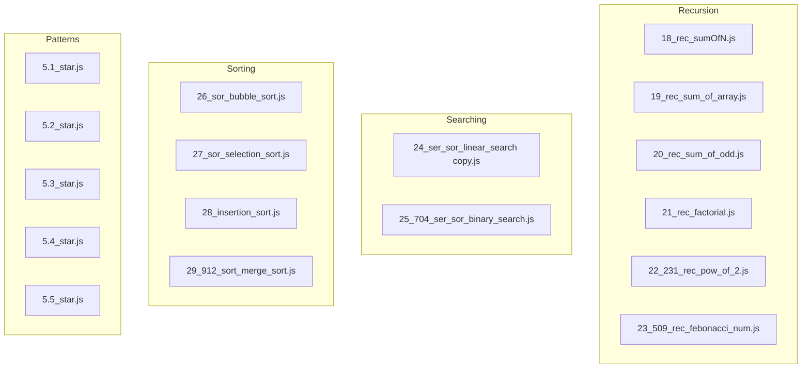
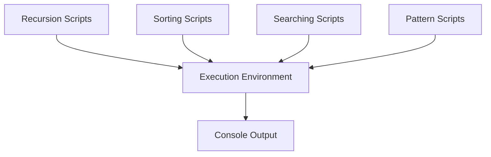
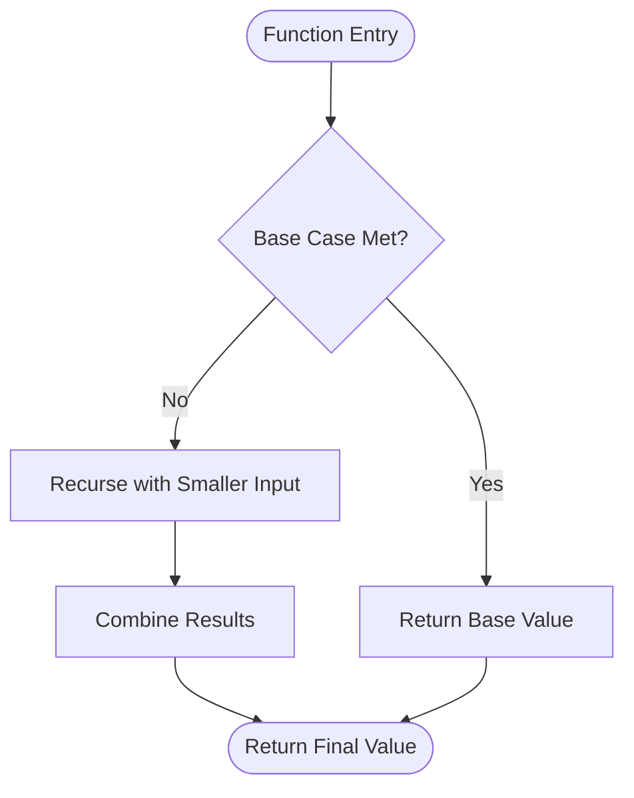
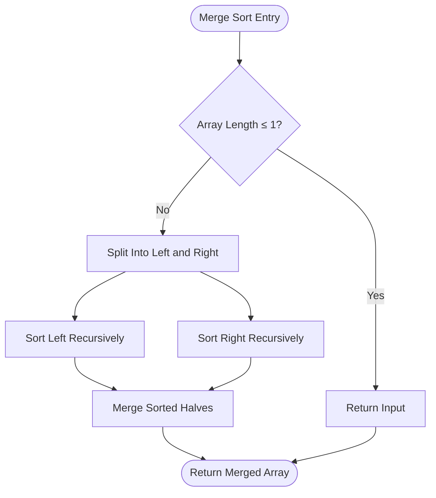
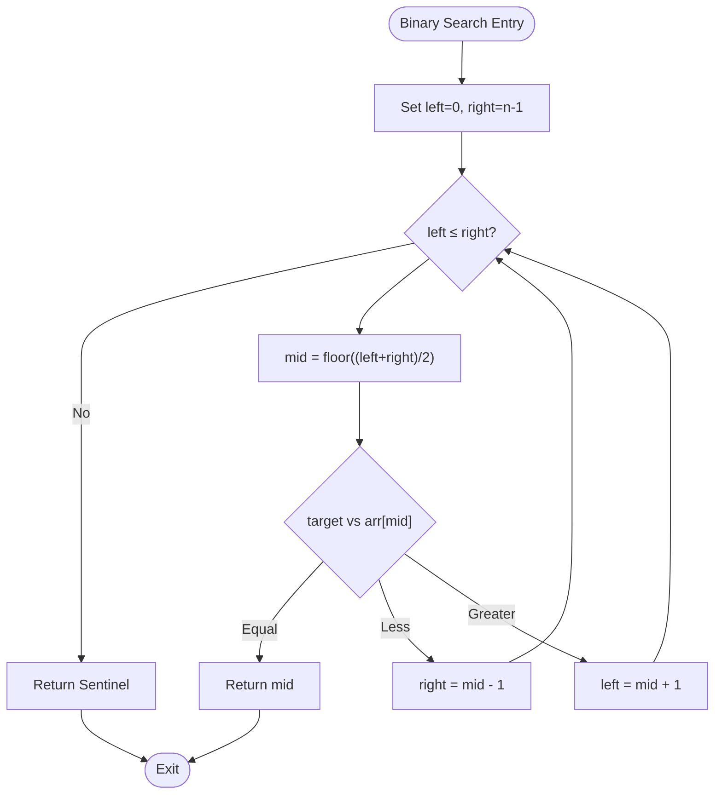
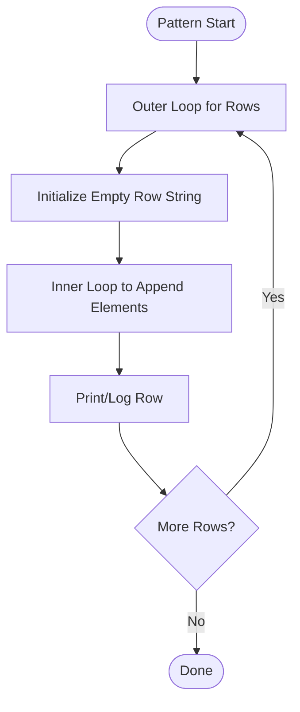
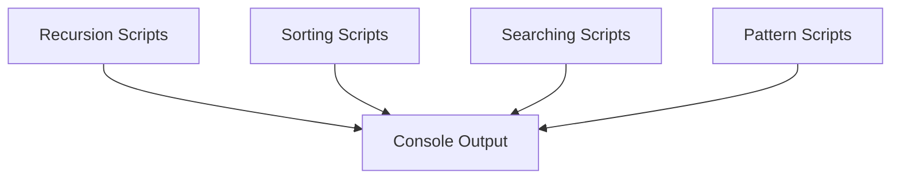

# Basic Algorithm Practice

<cite>
**Referenced Files in This Document**
- [18_rec_sumOfN.js](file://18_rec_sumOfN.js)
- [19_rec_sum_of_array.js](file://19_rec_sum_of_array.js)
- [20_rec_sum_of_odd.js](file://20_rec_sum_of_odd.js)
- [21_rec_factorial.js](file://21_rec_factorial.js)
- [22_231_rec_pow_of_2.js](file://22_231_rec_pow_of_2.js)
- [23_509_rec_febonacci_num.js](file://23_509_rec_febonacci_num.js)
- [24_ser_sor_linear_search copy.js](file://24_ser_sor_linear_search copy.js)
- [25_704_ser_sor_binary_search.js](file://25_704_ser_sor_binary_search.js)
- [26_sor_bubble_sort.js](file://26_sor_bubble_sort.js)
- [27_sor_selection_sort.js](file://27_sor_selection_sort.js)
- [28_insertion_sort.js](file://28_insertion_sort.js)
- [29_912_sort_merge_sort.js](file://29_912_sort_merge_sort.js)
- [5.1_star.js](file://5.1_star.js)
- [5.2_star.js](file://5.2_star.js)
- [5.3_star.js](file://5.3_star.js)
- [5.4_star.js](file://5.4_star.js)
- [5.5_star.js](file://5.5_star.js)
</cite>

## Table of Contents
1. [Introduction](#introduction)
2. [Project Structure](#project-structure)
3. [Core Components](#core-components)
4. [Architecture Overview](#architecture-overview)
5. [Detailed Component Analysis](#detailed-component-analysis)
6. [Dependency Analysis](#dependency-analysis)
7. [Performance Considerations](#performance-considerations)
8. [Troubleshooting Guide](#troubleshooting-guide)
9. [Conclusion](#conclusion)
10. [Appendices](#appendices)

## Introduction
This document focuses on foundational algorithm practice covering recursion, sorting, searching, and pattern recognition. It explains core concepts, step-by-step problem breakdowns, multiple solution approaches, and practical examples with debugging and optimization strategies. The goal is to build algorithmic thinking and reinforce understanding of time/space complexity trade-offs.

## Project Structure
The repository organizes practice problems by topic and technique. For this guide, we focus on:
- Recursion fundamentals: sum of N, array sums, factorials, powers of two, Fibonacci
- Sorting algorithms: bubble sort, selection sort, insertion sort, merge sort
- Searching algorithms: linear search, binary search
- Pattern recognition: star and numeric patterns

**Diagram sources**
- [18_rec_sumOfN.js](file://18_rec_sumOfN.js#L1-L17)
- [19_rec_sum_of_array.js](file://19_rec_sum_of_array.js#L1-L23)
- [20_rec_sum_of_odd.js](file://20_rec_sum_of_odd.js#L1-L32)
- [21_rec_factorial.js](file://21_rec_factorial.js#L1-L17)
- [22_231_rec_pow_of_2.js](file://22_231_rec_pow_of_2.js#L1-L20)
- [23_509_rec_febonacci_num.js](file://23_509_rec_febonacci_num.js#L1-L21)
- [24_ser_sor_linear_search copy.js](file://24_ser_sor_linear_search copy.js#L1-L21)
- [25_704_ser_sor_binary_search.js](file://25_704_ser_sor_binary_search.js#L1-L39)
- [26_sor_bubble_sort.js](file://26_sor_bubble_sort.js#L1-L56)
- [27_sor_selection_sort.js](file://27_sor_selection_sort.js#L1-L38)
- [28_insertion_sort.js](file://28_insertion_sort.js#L1-L37)
- [29_912_sort_merge_sort.js](file://29_912_sort_merge_sort.js#L1-L49)
- [5.1_star.js](file://5.1_star.js#L1-L32)
- [5.2_star.js](file://5.2_star.js#L1-L30)
- [5.3_star.js](file://5.3_star.js#L1-L29)
- [5.4_star.js](file://5.4_star.js#L1-L29)
- [5.5_star.js](file://5.5_star.js#L1-L29)

**Section sources**
- [18_rec_sumOfN.js](file://18_rec_sumOfN.js#L1-L17)
- [26_sor_bubble_sort.js](file://26_sor_bubble_sort.js#L1-L56)
- [29_912_sort_merge_sort.js](file://29_912_sort_merge_sort.js#L1-L49)

## Core Components
This section introduces the building blocks of algorithmic thinking and foundational patterns.

- Recursion fundamentals
  - Sum of N natural numbers
  - Sum of array elements
  - Sum of odd elements in array
  - Factorial calculation
  - Power of two check
  - Fibonacci sequence

- Sorting algorithms progression
  - Bubble sort (nested loops, adjacent swaps)
  - Selection sort (find-minimum per pass)
  - Insertion sort (card-sorting style)
  - Merge sort (divide-and-conquer)

- Searching algorithms
  - Linear search (sequential scan)
  - Binary search (sorted array, halving window)

- Pattern recognition
  - Square star pattern
  - Right-angled triangle
  - Number triangles (ascending, same-number rows, inverted)
  - String manipulation exercises

**Section sources**
- [18_rec_sumOfN.js](file://18_rec_sumOfN.js#L1-L17)
- [19_rec_sum_of_array.js](file://19_rec_sum_of_array.js#L1-L23)
- [20_rec_sum_of_odd.js](file://20_rec_sum_of_odd.js#L1-L32)
- [21_rec_factorial.js](file://21_rec_factorial.js#L1-L17)
- [22_231_rec_pow_of_2.js](file://22_231_rec_pow_of_2.js#L1-L20)
- [23_509_rec_febonacci_num.js](file://23_509_rec_febonacci_num.js#L1-L21)
- [24_ser_sor_linear_search copy.js](file://24_ser_sor_linear_search copy.js#L1-L21)
- [25_704_ser_sor_binary_search.js](file://25_704_ser_sor_binary_search.js#L1-L39)
- [26_sor_bubble_sort.js](file://26_sor_bubble_sort.js#L1-L56)
- [27_sor_selection_sort.js](file://27_sor_selection_sort.js#L1-L38)
- [28_insertion_sort.js](file://28_insertion_sort.js#L1-L37)
- [29_912_sort_merge_sort.js](file://29_912_sort_merge_sort.js#L1-L49)
- [5.1_star.js](file://5.1_star.js#L1-L32)
- [5.2_star.js](file://5.2_star.js#L1-L30)
- [5.3_star.js](file://5.3_star.js#L1-L29)
- [5.4_star.js](file://5.4_star.js#L1-L29)
- [5.5_star.js](file://5.5_star.js#L1-L29)

## Architecture Overview
The practice set is organized as independent scripts, each encapsulating a single algorithm or pattern. There are no cross-file dependencies; each module can be executed independently. This structure supports:
- Incremental learning by topic
- Easy testing and debugging
- Reuse of modular solutions

[No sources needed since this diagram shows conceptual workflow, not actual code structure]

## Detailed Component Analysis

### Recursion Fundamentals
This category builds intuition for recursive thinking: base cases, problem decomposition, and combining results.

- Sum of N natural numbers
  - Approach: Tail-recurse toward zero; combine current value with recursive result
  - Complexity: Time O(n), Space O(n) due to call stack
  - Debugging tip: Trace base case and decrement step
  - Optimization: Iterative loop reduces space to O(1)

- Sum of array elements
  - Approach: Start from last index; recurse to earlier indices
  - Complexity: Time O(n), Space O(n)
  - Debugging tip: Validate index bounds and base case

- Sum of odd elements in array
  - Approach: At each index, include element if odd; recurse
  - Complexity: Time O(n), Space O(n)
  - Debugging tip: Confirm modulo condition and base case

- Factorial
  - Approach: n! = n × (n−1)!
  - Complexity: Time O(n), Space O(n)
  - Edge case: Handle n = 1 appropriately

- Power of two
  - Approach: Keep dividing by 2 until reaching 1 or invalid state
  - Complexity: Time O(log n), Space O(log n)
  - Edge case: Handle n < 1 and odd numbers early

- Fibonacci
  - Approach: f(n) = f(n−1) + f(n−2)
  - Complexity: Time O(2^n), Space O(n) due to recursion depth
  - Optimization: Memoization or bottom-up DP improves to O(n) time and O(n)/O(1) space

**Diagram sources**
- [18_rec_sumOfN.js](file://18_rec_sumOfN.js#L13-L16)
- [21_rec_factorial.js](file://21_rec_factorial.js#L13-L16)
- [23_509_rec_febonacci_num.js](file://23_509_rec_febonacci_num.js#L13-L16)

**Section sources**
- [18_rec_sumOfN.js](file://18_rec_sumOfN.js#L1-L17)
- [19_rec_sum_of_array.js](file://19_rec_sum_of_array.js#L1-L23)
- [20_rec_sum_of_odd.js](file://20_rec_sum_of_odd.js#L1-L32)
- [21_rec_factorial.js](file://21_rec_factorial.js#L1-L17)
- [22_231_rec_pow_of_2.js](file://22_231_rec_pow_of_2.js#L1-L20)
- [23_509_rec_febonacci_num.js](file://23_509_rec_febonacci_num.js#L1-L21)

### Sorting Algorithms Progression
This section progresses from simple O(n^2) sorts to efficient O(n log n) merge sort.

- Bubble sort
  - Logic: Repeatedly swap adjacent out-of-order pairs; short-circuit if no swaps occur
  - Complexity: Time O(n^2), Best-case O(n) with optimization; Space O(1)
  - Use case: Educational demonstration; small or nearly sorted arrays

- Selection sort
  - Logic: Select minimum from unsorted suffix and place at front
  - Complexity: Time O(n^2), Space O(1)
  - Use case: Minimal writes scenario

- Insertion sort
  - Logic: Build sorted prefix by inserting current element at correct position
  - Complexity: Time O(n^2), Best-case O(n); Space O(1)
  - Use case: Nearly sorted data; small datasets; online setting

- Merge sort
  - Logic: Divide array into halves, recursively sort, merge sorted halves
  - Complexity: Time O(n log n), Space O(n)
  - Use case: Stable sort, reliable performance, linked-list adaptation

**Diagram sources**
- [29_912_sort_merge_sort.js](file://29_912_sort_merge_sort.js#L19-L25)
- [29_912_sort_merge_sort.js](file://29_912_sort_merge_sort.js#L27-L44)

**Section sources**
- [26_sor_bubble_sort.js](file://26_sor_bubble_sort.js#L1-L56)
- [27_sor_selection_sort.js](file://27_sor_selection_sort.js#L1-L38)
- [28_insertion_sort.js](file://28_insertion_sort.js#L1-L37)
- [29_912_sort_merge_sort.js](file://29_912_sort_merge_sort.js#L1-L49)

### Searching Algorithms
Two complementary paradigms: exhaustive scan and divide-and-conquer.

- Linear search
  - Logic: Scan from start to end; return first match index or sentinel
  - Complexity: Time O(n), Space O(1)
  - Use case: Unsorted data; minimal overhead

- Binary search
  - Logic: Maintain left/right bounds; converge on middle; adjust bounds based on comparison
  - Complexity: Time O(log n), Space O(1)
  - Prerequisite: Array must be sorted

**Diagram sources**
- [25_704_ser_sor_binary_search.js](file://25_704_ser_sor_binary_search.js#L18-L33)

**Section sources**
- [24_ser_sor_linear_search copy.js](file://24_ser_sor_linear_search copy.js#L1-L21)
- [25_704_ser_sor_binary_search.js](file://25_704_ser_sor_binary_search.js#L1-L39)

### Pattern Recognition Problems
Pattern problems reinforce iteration, conditionals, and string construction.

- Square star pattern
  - Logic: Outer loop controls rows; inner loop appends stars per row
  - Complexity: Time O(n^2), Space O(n) per row

- Right-angled triangle
  - Logic: Inner loop runs 1..(i+1) per row
  - Complexity: Time O(n^2), Space O(n)

- Number triangle (ascending)
  - Logic: Append digits 1..(i+1) per row
  - Complexity: Time O(n^2), Space O(n)

- Same number triangle
  - Logic: Repeat row-indexed number (i+1) times per row
  - Complexity: Time O(n^2), Space O(n)

- Inverted number triangle
  - Logic: Inner loop runs 0..(n−i−1)
  - Complexity: Time O(n^2), Space O(n)

**Diagram sources**
- [5.1_star.js](file://5.1_star.js#L20-L28)
- [5.2_star.js](file://5.2_star.js#L19-L27)
- [5.3_star.js](file://5.3_star.js#L18-L26)
- [5.4_star.js](file://5.4_star.js#L17-L25)
- [5.5_star.js](file://5.5_star.js#L18-L26)

**Section sources**
- [5.1_star.js](file://5.1_star.js#L1-L32)
- [5.2_star.js](file://5.2_star.js#L1-L30)
- [5.3_star.js](file://5.3_star.js#L1-L29)
- [5.4_star.js](file://5.4_star.js#L1-L29)
- [5.5_star.js](file://5.5_star.js#L1-L29)

## Dependency Analysis
Each script is self-contained with no inter-file imports. Execution is independent, enabling:
- Modular testing
- Isolated debugging
- Easy refactoring

[No sources needed since this diagram shows conceptual workflow, not actual code structure]

**Section sources**
- [18_rec_sumOfN.js](file://18_rec_sumOfN.js#L1-L17)
- [26_sor_bubble_sort.js](file://26_sor_bubble_sort.js#L1-L56)
- [29_912_sort_merge_sort.js](file://29_912_sort_merge_sort.js#L1-L49)
- [5.1_star.js](file://5.1_star.js#L1-L32)

## Performance Considerations
- Recursion
  - Favor iterative solutions for O(1) space when possible
  - For exponential recursion (e.g., naive Fibonacci), apply memoization or bottom-up DP
- Sorting
  - Prefer merge sort for guaranteed O(n log n) and stability
  - Use insertion sort for small or nearly sorted arrays
- Searching
  - Binary search requires sorted input; ensure preprocessing cost is justified
- Patterns
  - Minimize repeated string concatenation; pre-allocate buffers if needed

[No sources needed since this section provides general guidance]

## Troubleshooting Guide
- Recursion pitfalls
  - Missing base case leads to infinite recursion
  - Incorrect reduction step causes stack overflow
  - Validate input domain (e.g., n ≥ 1 for factorial)
- Sorting edge cases
  - Empty or single-element arrays
  - Already sorted or reverse-sorted inputs
  - Stability expectations (merge sort vs others)
- Searching errors
  - Binary search on unsorted arrays yields undefined results
  - Off-by-one errors in pointer updates
- Pattern printing
  - Extra spaces/newlines
  - Incorrect loop bounds causing extra rows/columns

**Section sources**
- [22_231_rec_pow_of_2.js](file://22_231_rec_pow_of_2.js#L15-L20)
- [25_704_ser_sor_binary_search.js](file://25_704_ser_sor_binary_search.js#L18-L33)
- [26_sor_bubble_sort.js](file://26_sor_bubble_sort.js#L40-L55)
- [29_912_sort_merge_sort.js](file://29_912_sort_merge_sort.js#L19-L25)

## Conclusion
This practice set establishes a strong foundation in recursion, sorting, searching, and pattern generation. By progressing from brute-force techniques to divide-and-conquer and optimizing for complexity, learners develop robust algorithmic thinking. The modular scripts facilitate experimentation, debugging, and incremental mastery.

[No sources needed since this section summarizes without analyzing specific files]

## Appendices
- Practical tips
  - Use console logs to trace recursion depth and array partitions
  - Instrument comparisons and swaps to measure algorithmic behavior
  - Profile small and large inputs to observe complexity characteristics

[No sources needed since this section provides general guidance]