# Pattern Recognition

<cite>
**Referenced Files in This Document**
- [5.1_star.js](file://5.1_star.js)
- [5.2_star.js](file://5.2_star.js)
- [5.3_star.js](file://5.3_star.js)
- [5.4_star.js](file://5.4_star.js)
- [5.5_star.js](file://5.5_star.js)
- [5.6_star.js](file://5.6_star.js)
- [5.7_star.js](file://5.7_star.js)
- [5.8_star.js](file://5.8_star.js)
- [5.9_star.js](file://5.9_star.js)
- [4_loop_in_loop.js](file://4_loop_in_loop.js)
- [44_58_strings_lenghLastWord.js](file://44_58_strings_lenghLastWord.js)
- [45_58_strings_lenghLastWord_another_approach.js](file://45_58_strings_lenghLastWord_another_approach.js)
</cite>

## Table of Contents
1. [Introduction](#introduction)
2. [Project Structure](#project-structure)
3. [Core Components](#core-components)
4. [Architecture Overview](#architecture-overview)
5. [Detailed Component Analysis](#detailed-component-analysis)
6. [Dependency Analysis](#dependency-analysis)
7. [Performance Considerations](#performance-considerations)
8. [Troubleshooting Guide](#troubleshooting-guide)
9. [Conclusion](#conclusion)
10. [Appendices](#appendices)

## Introduction
This document focuses on pattern recognition exercises centered around star pattern generation and string manipulation tasks. It progresses from simple geometric patterns to more complex configurations, emphasizing loop structures, character positioning, and algorithmic thinking. It also covers multiple strategies for computing the length of the last word in a string, highlighting trade-offs between readability and efficiency.

The materials here are designed to help learners develop algorithmic intuition by observing mathematical relationships, decomposing problems systematically, and optimizing repetitive operations. Visual debugging techniques and step-by-step construction strategies are included to support learning.

## Project Structure
The relevant files for this topic are organized by concept:
- Star pattern generators: 5.1_star.js through 5.9_star.js
- Nested loop fundamentals: 4_loop_in_loop.js
- String manipulation (last word length): 44_58_strings_lenghLastWord.js and 45_58_strings_lenghLastWord_another_approach.js

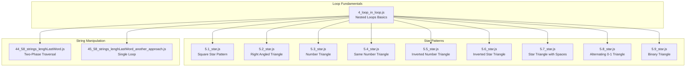

**Diagram sources**
- [5.1_star.js](file://5.1_star.js#L1-L32)
- [5.2_star.js](file://5.2_star.js#L1-L30)
- [5.3_star.js](file://5.3_star.js#L1-L29)
- [5.4_star.js](file://5.4_star.js#L1-L29)
- [5.5_star.js](file://5.5_star.js#L1-L29)
- [5.6_star.js](file://5.6_star.js#L1-L29)
- [5.7_star.js](file://5.7_star.js#L1-L34)
- [5.8_star.js](file://5.8_star.js#L1-L31)
- [5.9_star.js](file://5.9_star.js#L1-L30)
- [4_loop_in_loop.js](file://4_loop_in_loop.js#L1-L26)
- [44_58_strings_lenghLastWord.js](file://44_58_strings_lenghLastWord.js#L1-L48)
- [45_58_strings_lenghLastWord_another_approach.js](file://45_58_strings_lenghLastWord_another_approach.js#L1-L38)

**Section sources**
- [5.1_star.js](file://5.1_star.js#L1-L32)
- [5.2_star.js](file://5.2_star.js#L1-L30)
- [5.3_star.js](file://5.3_star.js#L1-L29)
- [5.4_star.js](file://5.4_star.js#L1-L29)
- [5.5_star.js](file://5.5_star.js#L1-L29)
- [5.6_star.js](file://5.6_star.js#L1-L29)
- [5.7_star.js](file://5.7_star.js#L1-L34)
- [5.8_star.js](file://5.8_star.js#L1-L31)
- [5.9_star.js](file://5.9_star.js#L1-L30)
- [4_loop_in_loop.js](file://4_loop_in_loop.js#L1-L26)
- [44_58_strings_lenghLastWord.js](file://44_58_strings_lenghLastWord.js#L1-L48)
- [45_58_strings_lenghLastWord_another_approach.js](file://45_58_strings_lenghLastWord_another_approach.js#L1-L38)

## Core Components
- Star pattern generators: Each file defines a function that prints a specific geometric pattern using nested loops. Patterns progress from uniform rows to varying counts per row, and incorporate spacing adjustments for alignment.
- Loop fundamentals: Demonstrates nested loop mechanics and how inner loops depend on outer loop indices to control repetition counts.
- String length computation: Two complementary approaches to compute the length of the last word in a string, differing in traversal strategy and loop structure.

Key learning outcomes:
- Understand how outer and inner loop bounds relate to pattern geometry.
- Learn to manage character concatenation per row and handle spacing.
- Practice two-phase traversal versus single-loop traversal for string parsing.

**Section sources**
- [5.1_star.js](file://5.1_star.js#L19-L28)
- [5.2_star.js](file://5.2_star.js#L19-L27)
- [5.3_star.js](file://5.3_star.js#L18-L26)
- [5.4_star.js](file://5.4_star.js#L17-L25)
- [5.5_star.js](file://5.5_star.js#L18-L26)
- [5.6_star.js](file://5.6_star.js#L18-L26)
- [5.7_star.js](file://5.7_star.js#L18-L31)
- [5.8_star.js](file://5.8_star.js#L18-L28)
- [5.9_star.js](file://5.9_star.js#L17-L27)
- [4_loop_in_loop.js](file://4_loop_in_loop.js#L19-L26)
- [44_58_strings_lenghLastWord.js](file://44_58_strings_lenghLastWord.js#L21-L47)
- [45_58_strings_lenghLastWord_another_approach.js](file://45_58_strings_lenghLastWord_another_approach.js#L20-L35)

## Architecture Overview
The “pattern recognition” architecture centers on:
- Control flow: Outer loop controls row progression; inner loop(s) control character counts and positions.
- Data flow: For each row, build a string by appending characters or spaces, then output the row.
- Strategy variations: Some patterns precompute counts; others toggle flags or adjust counts dynamically.

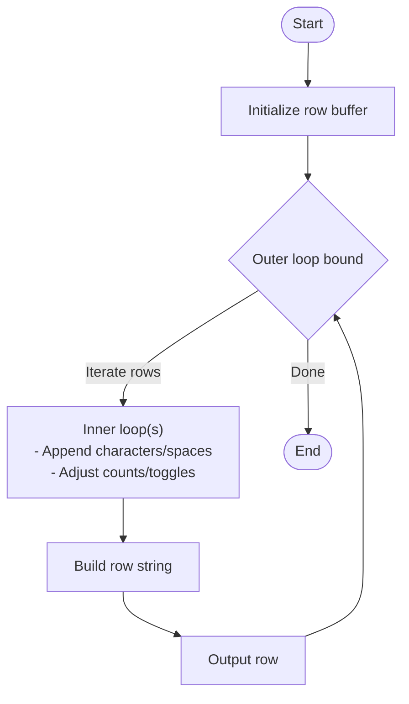

[No sources needed since this diagram shows conceptual workflow, not actual code structure]

## Detailed Component Analysis

### Star Pattern Problems (5.1_star.js through 5.9_star.js)
These files demonstrate increasing complexity in pattern construction using nested loops and strategic character placement.

#### Square Star Pattern (5.1_star.js)
- Purpose: Print an n×n grid of stars.
- Strategy: Fixed inner loop count equals outer loop index; each row is identical.
- Complexity: Time O(n^2), Space O(n) per row.

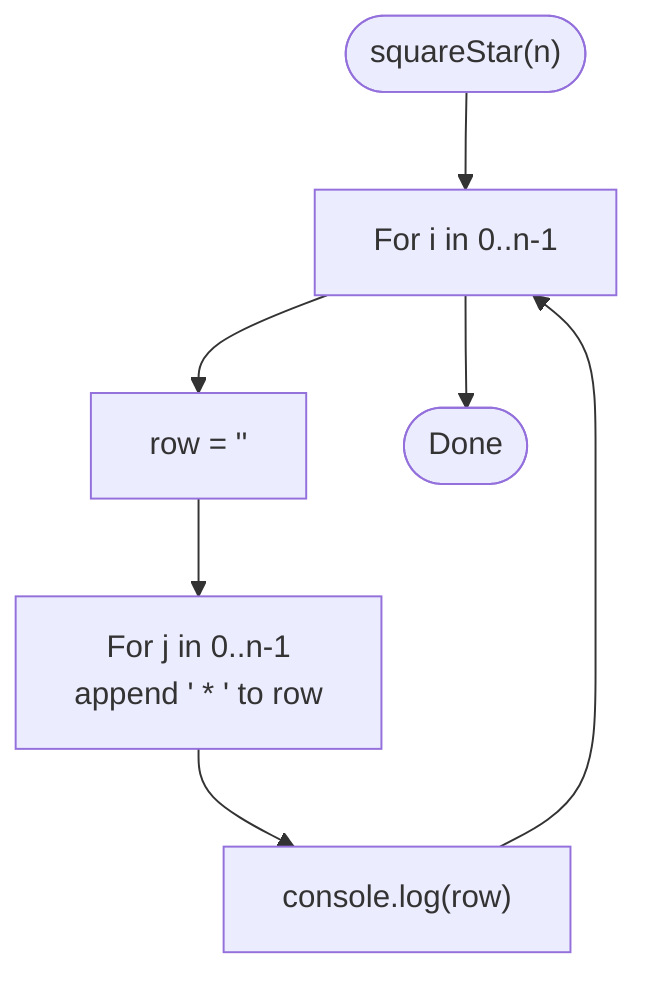

**Diagram sources**
- [5.1_star.js](file://5.1_star.js#L20-L28)

**Section sources**
- [5.1_star.js](file://5.1_star.js#L1-L32)

#### Right Angled Triangle (5.2_star.js)
- Purpose: Ascending number of stars per row.
- Strategy: Inner loop runs 0..i+1 to match row index.
- Complexity: Time O(n^2), Space O(n).

**Diagram sources**
- [5.2_star.js](file://5.2_star.js#L19-L27)

**Section sources**
- [5.2_star.js](file://5.2_star.js#L1-L30)

#### Number Triangle (5.3_star.js)
- Purpose: Row i contains consecutive digits from 1 to i+1.
- Strategy: Inner loop appends (j+1) for j in 0..i.
- Complexity: Time O(n^2), Space O(n).

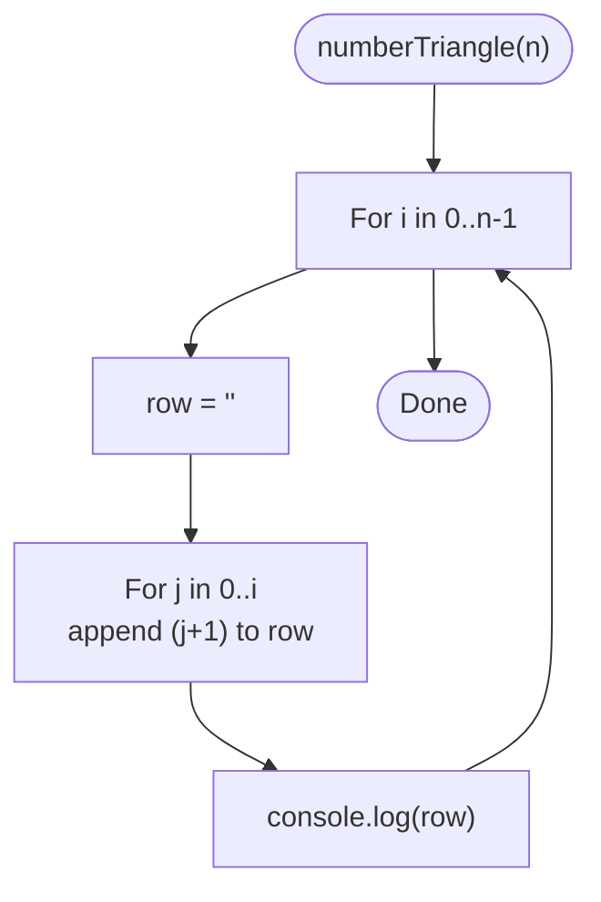

**Diagram sources**
- [5.3_star.js](file://5.3_star.js#L18-L26)

**Section sources**
- [5.3_star.js](file://5.3_star.js#L1-L29)

#### Same Number Triangle (5.4_star.js)
- Purpose: Each row i consists of the digit (i+1) repeated (i+1) times.
- Strategy: Inner loop repeats (i+1) for i+1 iterations.
- Complexity: Time O(n^2), Space O(n).

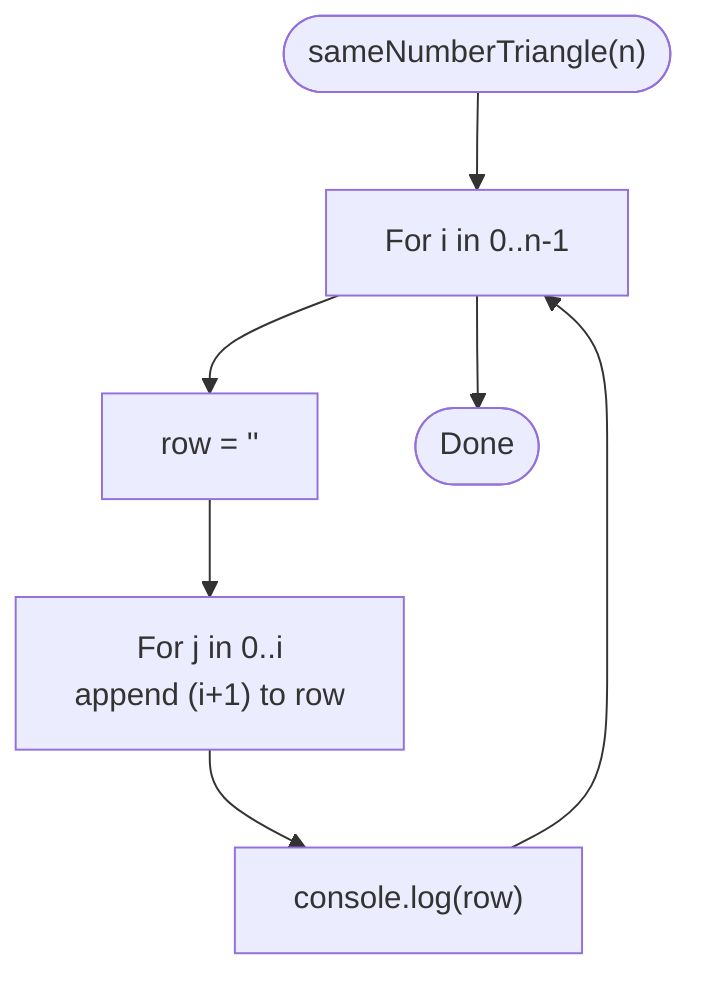

**Diagram sources**
- [5.4_star.js](file://5.4_star.js#L17-L25)

**Section sources**
- [5.4_star.js](file://5.4_star.js#L1-L29)

#### Inverted Number Triangle (5.5_star.js)
- Purpose: Rows decrease from n down to 1; each row i prints 1..(n-i).
- Strategy: Inner loop runs 0..(n-i)-1.
- Complexity: Time O(n^2), Space O(n).

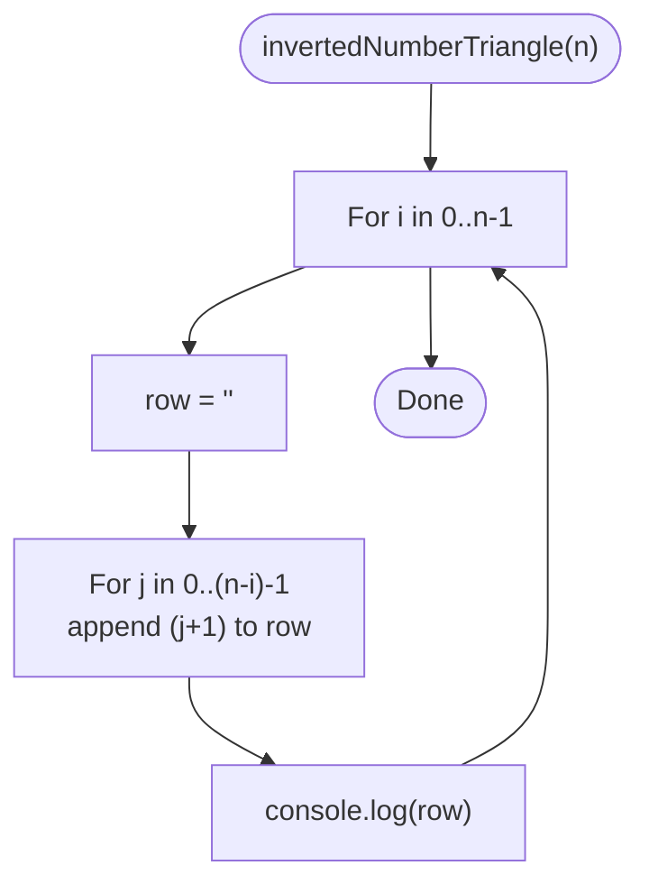

**Diagram sources**
- [5.5_star.js](file://5.5_star.js#L18-L26)

**Section sources**
- [5.5_star.js](file://5.5_star.js#L1-L29)

#### Inverted Star Triangle (5.6_star.js)
- Purpose: Descending star count per row.
- Strategy: Inner loop runs 0..(n-i)-1.
- Complexity: Time O(n^2), Space O(n).

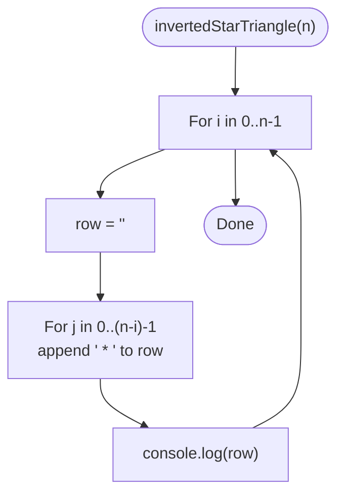

**Diagram sources**
- [5.6_star.js](file://5.6_star.js#L18-L26)

**Section sources**
- [5.6_star.js](file://5.6_star.js#L1-L29)

#### Star Triangle with Spaces (5.7_star.js)
- Purpose: Right-aligned triangle with leading spaces.
- Strategy: Prepend (n-(i+1)) spaces, then append (i+1) stars.
- Complexity: Time O(n^2), Space O(n).

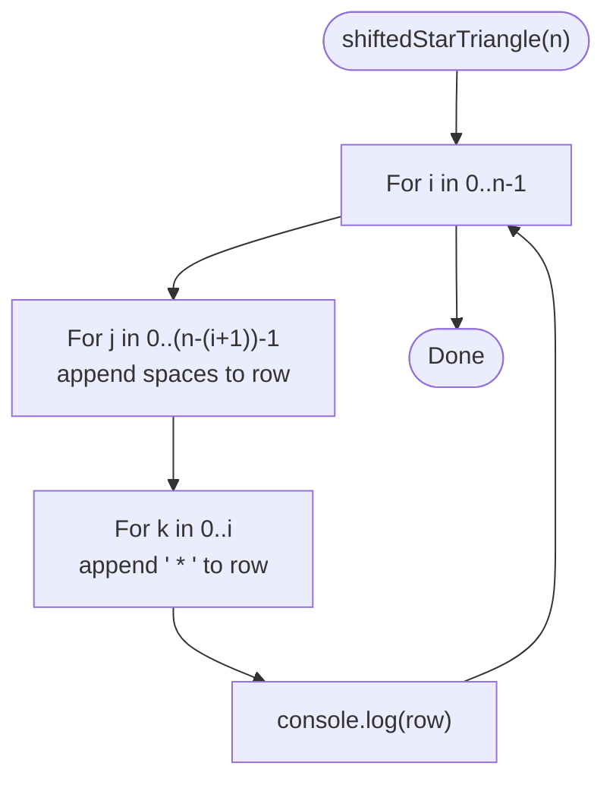

**Diagram sources**
- [5.7_star.js](file://5.7_star.js#L18-L31)

**Section sources**
- [5.7_star.js](file://5.7_star.js#L1-L34)

#### Alternating 0-1 Triangle (5.8_star.js)
- Purpose: Row i alternates 0 and 1, seeded by row parity.
- Strategy: Toggle a flag per character; seed depends on i.
- Complexity: Time O(n^2), Space O(n).

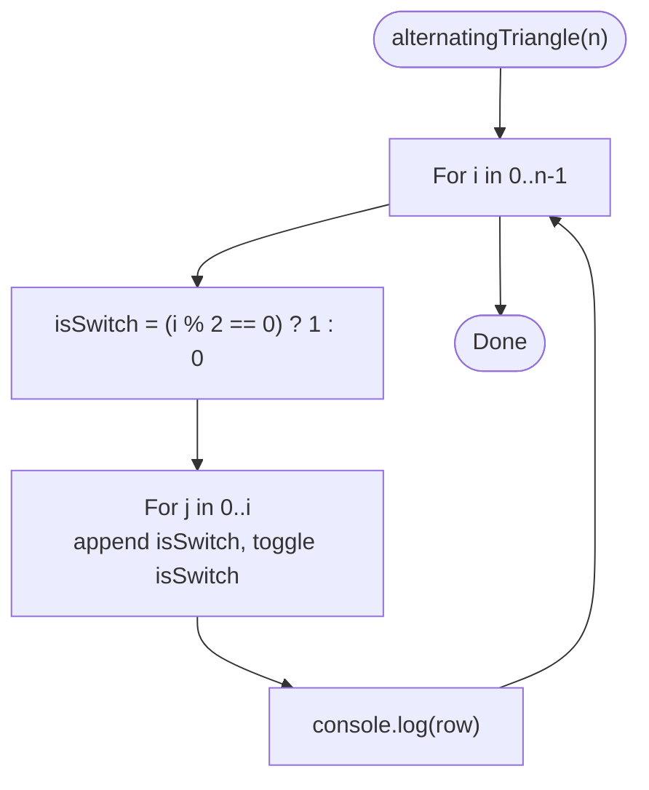

**Diagram sources**
- [5.8_star.js](file://5.8_star.js#L18-L28)

**Section sources**
- [5.8_star.js](file://5.8_star.js#L1-L31)

#### Binary Triangle (5.9_star.js)
- Purpose: Continuous 0/1 alternation across rows, seeded by a global flag.
- Strategy: Initialize a flag and toggle after each character.
- Complexity: Time O(n^2), Space O(n).

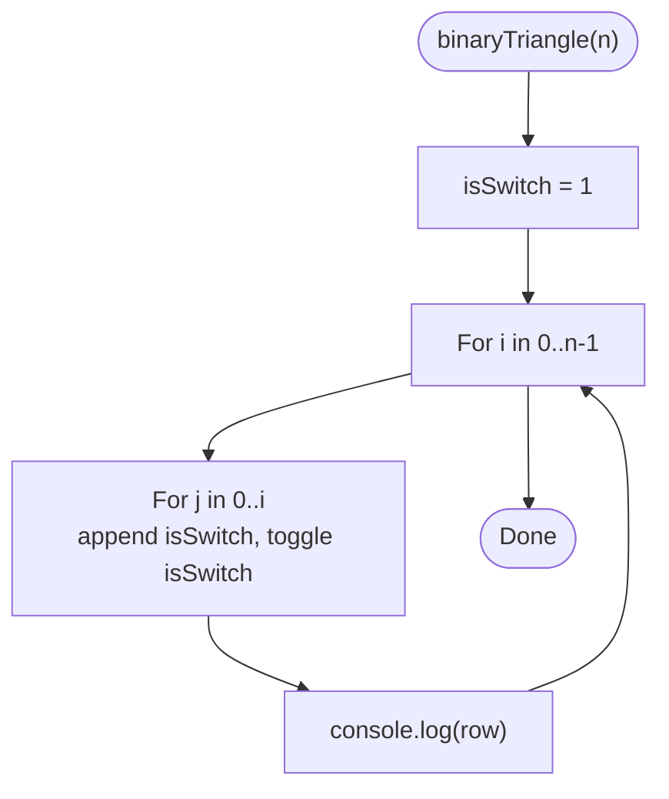

**Diagram sources**
- [5.9_star.js](file://5.9_star.js#L17-L27)

**Section sources**
- [5.9_star.js](file://5.9_star.js#L1-L30)

### String Manipulation: Length of Last Word
Two distinct strategies are presented to compute the length of the last word in a string.

#### Two-Phase Traversal (44_58_strings_lenghLastWord.js)
- Approach: First phase skips trailing spaces; second phase counts characters until a space is encountered.
- Advantages: Clear separation of concerns; easy to reason about.
- Complexity: Time O(n), Space O(1).

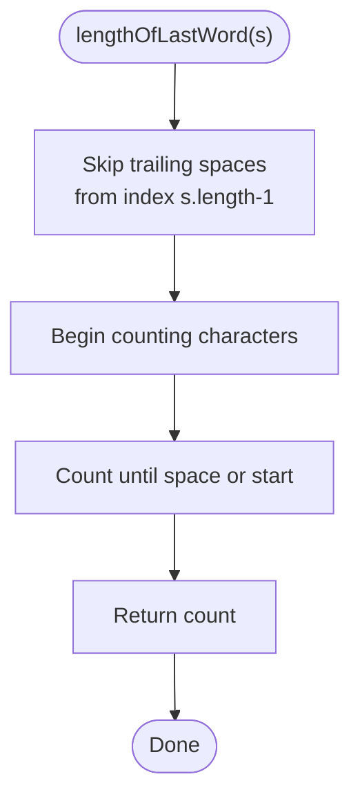

**Diagram sources**
- [44_58_strings_lenghLastWord.js](file://44_58_strings_lenghLastWord.js#L21-L47)

**Section sources**
- [44_58_strings_lenghLastWord.js](file://44_58_strings_lenghLastWord.js#L1-L48)

#### Single Loop Traversal (45_58_strings_lenghLastWord_another_approach.js)
- Approach: Traverse from the end with a single loop; increment counter when a non-space is seen; break when a space is seen after counting has started.
- Advantages: Fewer loops; concise logic.
- Complexity: Time O(n), Space O(1).

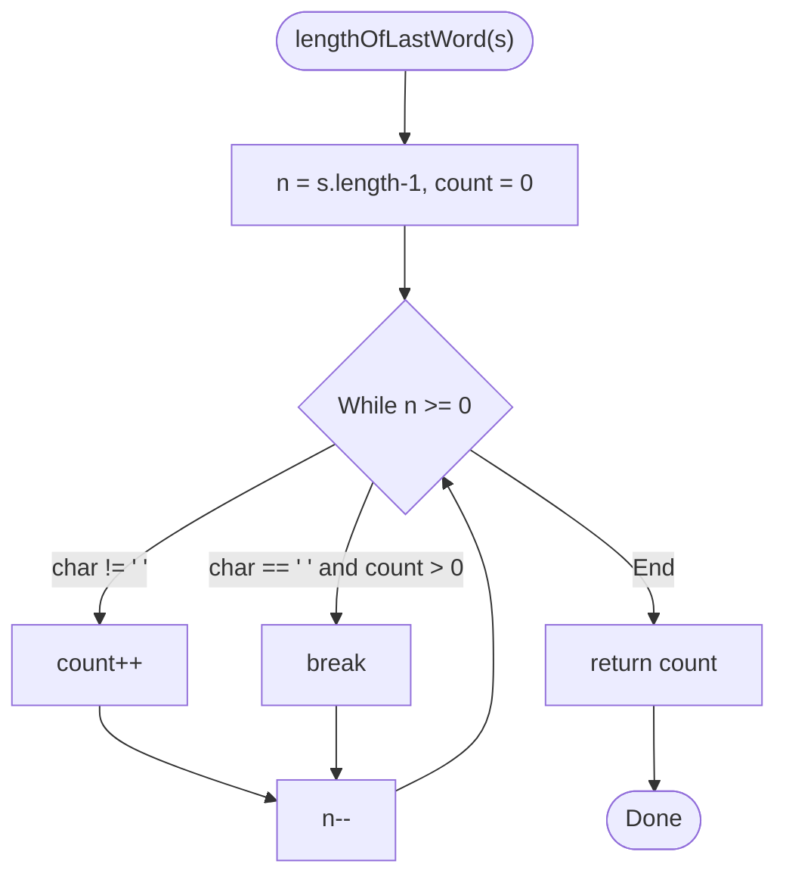

**Diagram sources**
- [45_58_strings_lenghLastWord_another_approach.js](file://45_58_strings_lenghLastWord_another_approach.js#L20-L35)

**Section sources**
- [45_58_strings_lenghLastWord_another_approach.js](file://45_58_strings_lenghLastWord_another_approach.js#L1-L38)

### Conceptual Overview
- Pattern recognition hinges on identifying how indices influence repetition counts and character placement.
- Loop decomposition: outer loop governs row progression; inner loop(s) govern per-row composition.
- String parsing benefits from either two-phase clarity or single-loop conciseness—choose based on readability needs.

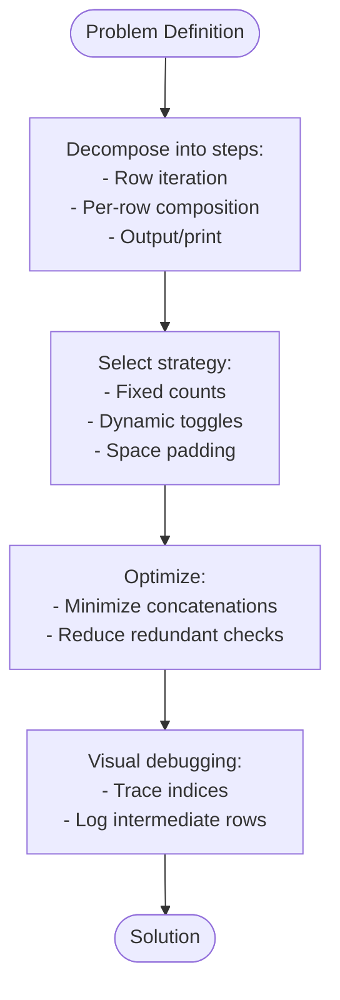

[No sources needed since this diagram shows conceptual workflow, not actual code structure]

## Dependency Analysis
- All star pattern files depend on nested loop mechanics demonstrated in 4_loop_in_loop.js.
- String manipulation solutions are independent but share the same input-output contract and rely on linear-time traversal.

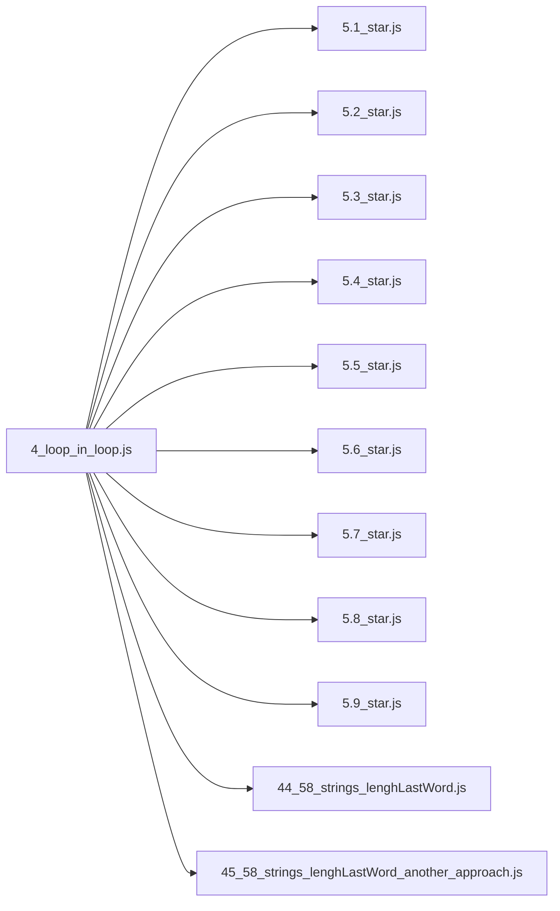

**Diagram sources**
- [4_loop_in_loop.js](file://4_loop_in_loop.js#L1-L26)
- [5.1_star.js](file://5.1_star.js#L1-L32)
- [5.2_star.js](file://5.2_star.js#L1-L30)
- [5.3_star.js](file://5.3_star.js#L1-L29)
- [5.4_star.js](file://5.4_star.js#L1-L29)
- [5.5_star.js](file://5.5_star.js#L1-L29)
- [5.6_star.js](file://5.6_star.js#L1-L29)
- [5.7_star.js](file://5.7_star.js#L1-L34)
- [5.8_star.js](file://5.8_star.js#L1-L31)
- [5.9_star.js](file://5.9_star.js#L1-L30)
- [44_58_strings_lenghLastWord.js](file://44_58_strings_lenghLastWord.js#L1-L48)
- [45_58_strings_lenghLastWord_another_approach.js](file://45_58_strings_lenghLastWord_another_approach.js#L1-L38)

**Section sources**
- [4_loop_in_loop.js](file://4_loop_in_loop.js#L1-L26)
- [5.1_star.js](file://5.1_star.js#L1-L32)
- [5.2_star.js](file://5.2_star.js#L1-L30)
- [5.3_star.js](file://5.3_star.js#L1-L29)
- [5.4_star.js](file://5.4_star.js#L1-L29)
- [5.5_star.js](file://5.5_star.js#L1-L29)
- [5.6_star.js](file://5.6_star.js#L1-L29)
- [5.7_star.js](file://5.7_star.js#L1-L34)
- [5.8_star.js](file://5.8_star.js#L1-L31)
- [5.9_star.js](file://5.9_star.js#L1-L30)
- [44_58_strings_lenghLastWord.js](file://44_58_strings_lenghLastWord.js#L1-L48)
- [45_58_strings_lenghLastWord_another_approach.js](file://45_58_strings_lenghLastWord_another_approach.js#L1-L38)

## Performance Considerations
- Time complexity: All star patterns are O(n^2) due to nested loops; string solutions are O(n).
- Space complexity: Patterns allocate O(n) per row; string solutions use O(1) extra space.
- Optimization tips:
  - Prefer precomputing inner loop bounds to avoid recomputation.
  - Minimize string concatenations inside tight loops; consider building arrays and joining once if applicable.
  - For string parsing, combine phases into a single pass to reduce overhead.

[No sources needed since this section provides general guidance]

## Troubleshooting Guide
- Visual debugging for patterns:
  - Add logs for loop indices and row buffers to confirm counts and placements.
  - Verify spacing calculations: leading spaces should be (n - (i + 1)).
- For string parsing:
  - Confirm termination conditions: ensure trailing spaces are skipped and counting stops at the first space after the last word.
  - Validate edge cases: empty strings, strings with only spaces, and single-word strings.

**Section sources**
- [5.7_star.js](file://5.7_star.js#L18-L31)
- [44_58_strings_lenghLastWord.js](file://44_58_strings_lenghLastWord.js#L27-L47)
- [45_58_strings_lenghLastWord_another_approach.js](file://45_58_strings_lenghLastWord_another_approach.js#L21-L35)

## Conclusion
Pattern recognition exercises provide a structured pathway to algorithmic thinking:
- Decompose problems into row-wise iterations and per-row compositions.
- Use indices to encode mathematical relationships (ascending, descending, toggling).
- Choose traversal strategies for strings that balance clarity and efficiency.
Through progressive complexity—from squares to triangles to toggling patterns—and multiple string parsing approaches, learners strengthen both intuition and practical skills essential for algorithm design.

[No sources needed since this section summarizes without analyzing specific files]

## Appendices
- Related foundational material: Nested loops basics reinforce understanding of iteration control and per-row construction.

**Section sources**
- [4_loop_in_loop.js](file://4_loop_in_loop.js#L1-L26)