# Recursion Fundamentals

<cite>
**Referenced Files in This Document**
- [18_rec_sumOfN.js](file://18_rec_sumOfN.js)
- [19_rec_sum_of_array.js](file://19_rec_sum_of_array.js)
- [20_rec_sum_of_odd.js](file://20_rec_sum_of_odd.js)
- [21_rec_factorial.js](file://21_rec_factorial.js)
- [22_231_rec_pow_of_2.js](file://22_231_rec_pow_of_2.js)
- [23_509_rec_febonacci_num.js](file://23_509_rec_febonacci_num.js)
- [29_912_sort_merge_sort.js](file://29_912_sort_merge_sort.js)
- [43_24_swap_nodes_in_pair_recurcive_approch.js](file://43_24_swap_nodes_in_pair_recurcive_approch.js)
- [16_maxDepth.js](file://16_maxDepth.js)
- [41_climbingStairs.js](file://41_climbingStairs.js)
</cite>

## Table of Contents
1. [Introduction](#introduction)
2. [Project Structure](#project-structure)
3. [Core Components](#core-components)
4. [Architecture Overview](#architecture-overview)
5. [Detailed Component Analysis](#detailed-component-analysis)
6. [Dependency Analysis](#dependency-analysis)
7. [Performance Considerations](#performance-considerations)
8. [Troubleshooting Guide](#troubleshooting-guide)
9. [Conclusion](#conclusion)
10. [Appendices](#appendices)

## Introduction
This document explains recursion fundamentals with clear, step-by-step reasoning and visualizations. It covers mathematical foundations (base cases, recursive relationships), call stack behavior, and memory usage. It presents multiple implementations for classic problems (sum of n, array sums, factorials, powers of two, Fibonacci) and contrasts recursive versus iterative approaches where applicable. It also includes debugging tips, common pitfalls, and optimization strategies such as memoization and tail-recursion awareness.

## Project Structure
The repository organizes recursion examples by problem topic. For this guide, we focus on standalone recursive implementations that demonstrate core patterns and their call-stack behavior.

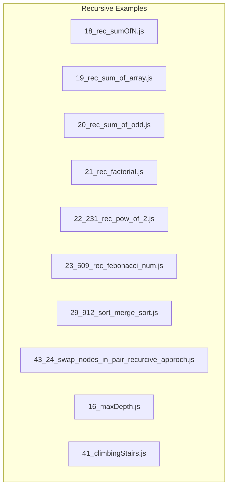

**Diagram sources**
- [18_rec_sumOfN.js](file://18_rec_sumOfN.js#L1-L17)
- [19_rec_sum_of_array.js](file://19_rec_sum_of_array.js#L1-L23)
- [20_rec_sum_of_odd.js](file://20_rec_sum_of_odd.js#L1-L32)
- [21_rec_factorial.js](file://21_rec_factorial.js#L1-L17)
- [22_231_rec_pow_of_2.js](file://22_231_rec_pow_of_2.js#L1-L20)
- [23_509_rec_febonacci_num.js](file://23_509_rec_febonacci_num.js#L1-L21)
- [29_912_sort_merge_sort.js](file://29_912_sort_merge_sort.js#L1-L49)
- [43_24_swap_nodes_in_pair_recurcive_approch.js](file://43_24_swap_nodes_in_pair_recurcive_approch.js#L1-L45)
- [16_maxDepth.js](file://16_maxDepth.js#L1-L64)
- [41_climbingStairs.js](file://41_climbingStairs.js#L1-L67)

**Section sources**
- [18_rec_sumOfN.js](file://18_rec_sumOfN.js#L1-L17)
- [19_rec_sum_of_array.js](file://19_rec_sum_of_array.js#L1-L23)
- [20_rec_sum_of_odd.js](file://20_rec_sum_of_odd.js#L1-L32)
- [21_rec_factorial.js](file://21_rec_factorial.js#L1-L17)
- [22_231_rec_pow_of_2.js](file://22_231_rec_pow_of_2.js#L1-L20)
- [23_509_rec_febonacci_num.js](file://23_509_rec_febonacci_num.js#L1-L21)
- [29_912_sort_merge_sort.js](file://29_912_sort_merge_sort.js#L1-L49)
- [43_24_swap_nodes_in_pair_recurcive_approch.js](file://43_24_swap_nodes_in_pair_recurcive_approch.js#L1-L45)
- [16_maxDepth.js](file://16_maxDepth.js#L1-L64)
- [41_climbingStairs.js](file://41_climbingStairs.js#L1-L67)

## Core Components
- Sum of N natural numbers: Demonstrates a simple countdown recursion with a single base case and a linear reduction step.
- Sum of array elements (backward traversal): Uses an index to traverse from the end toward the start, accumulating values.
- Sum of odd elements in array: Similar backward traversal with a condition to include only odd numbers.
- Factorial: Classic single-reduction recursive pattern with a base case at n=1.
- Power of two check: Divides the number by two recursively, with early termination conditions for invalid inputs.
- Fibonacci: Classic double-reduction recursion with base cases at n=0 and n=1.
- Merge Sort: Divide-and-conquer recursion splitting arrays and merging sorted halves.
- Linked List Pair Swapping (recursive): Recursively re-links pairs and returns the new head.
- Binary Tree Maximum Depth (recursive DFS): Computes depth by combining left and right subtree depths.
- Climbing Stairs (Dynamic Programming note): Highlights the Fibonacci-like recurrence and contrasts with optimized iterative DP.

**Section sources**
- [18_rec_sumOfN.js](file://18_rec_sumOfN.js#L10-L16)
- [19_rec_sum_of_array.js](file://19_rec_sum_of_array.js#L9-L19)
- [20_rec_sum_of_odd.js](file://20_rec_sum_of_odd.js#L9-L29)
- [21_rec_factorial.js](file://21_rec_factorial.js#L9-L16)
- [22_231_rec_pow_of_2.js](file://22_231_rec_pow_of_2.js#L10-L19)
- [23_509_rec_febonacci_num.js](file://23_509_rec_febonacci_num.js#L9-L16)
- [29_912_sort_merge_sort.js](file://29_912_sort_merge_sort.js#L9-L25)
- [43_24_swap_nodes_in_pair_recurcive_approch.js](file://43_24_swap_nodes_in_pair_recurcive_approch.js#L10-L39)
- [16_maxDepth.js](file://16_maxDepth.js#L12-L62)
- [41_climbingStairs.js](file://41_climbingStairs.js#L11-L62)

## Architecture Overview
The recursion examples share a common pattern:
- Define base cases to stop further recursion.
- Define a recursive relationship that reduces the problem size.
- Manage the call stack implicitly via function calls.

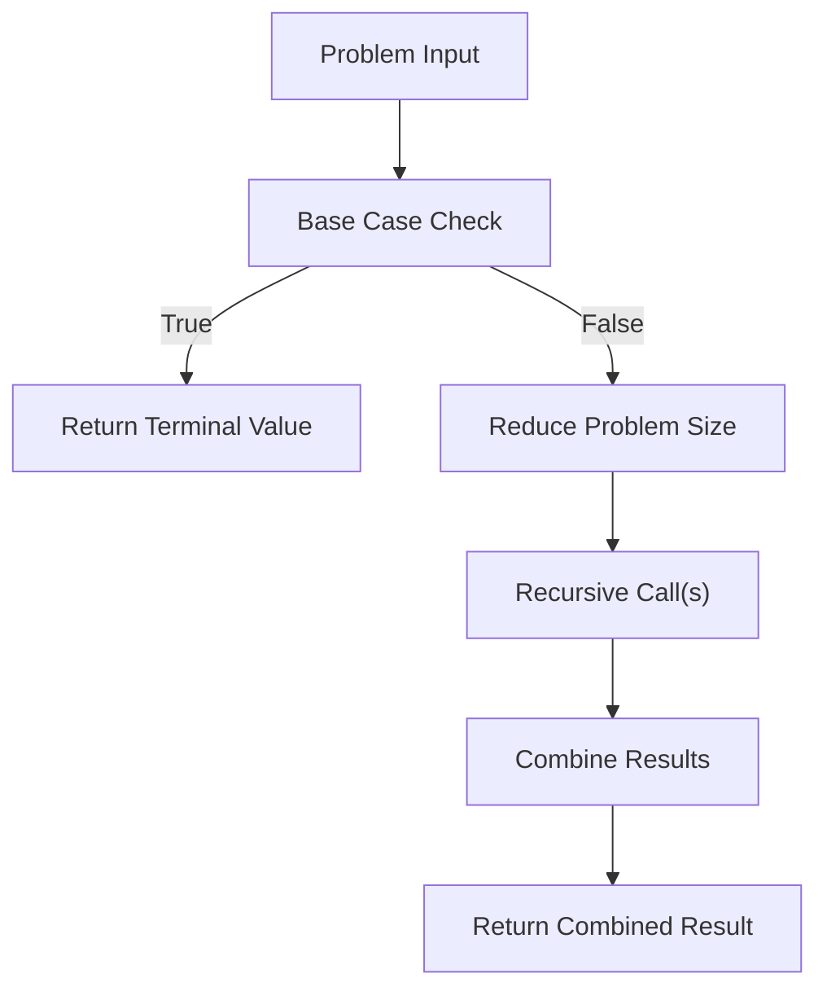

[No sources needed since this diagram shows conceptual workflow, not actual code structure]

## Detailed Component Analysis

### Sum of N Numbers
- Mathematical foundation:
  - Base case: sum(0) = 0
  - Recursive relation: sum(n) = n + sum(n-1)
- Execution flow:
  - sum(3) calls sum(2), which calls sum(1), which calls sum(0), returning 0.
  - Each returns adds its argument to the accumulated result.
- Call stack visualization:
  - Calls build up to the base case, then return values bubble up.
- Memory usage:
  - O(n) call stack depth; tail recursion is not applied here.

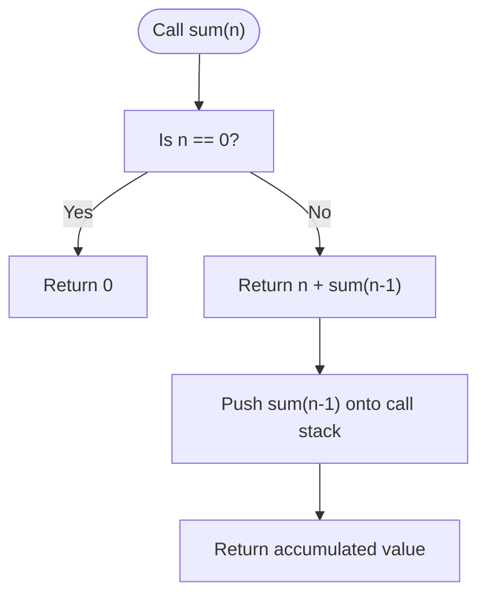

**Diagram sources**
- [18_rec_sumOfN.js](file://18_rec_sumOfN.js#L13-L16)

**Section sources**
- [18_rec_sumOfN.js](file://18_rec_sumOfN.js#L9-L16)

### Sum of Array Elements (Backward Traversal)
- Mathematical foundation:
  - Base case: when index reaches 0, return arr[0]
  - Recursive relation: sum(n) = arr[n] + sum(n-1)
- Execution flow:
  - Starts at the last index and accumulates toward index 0.
- Call stack visualization:
  - Each call depends on the next smaller index until reaching the base case.

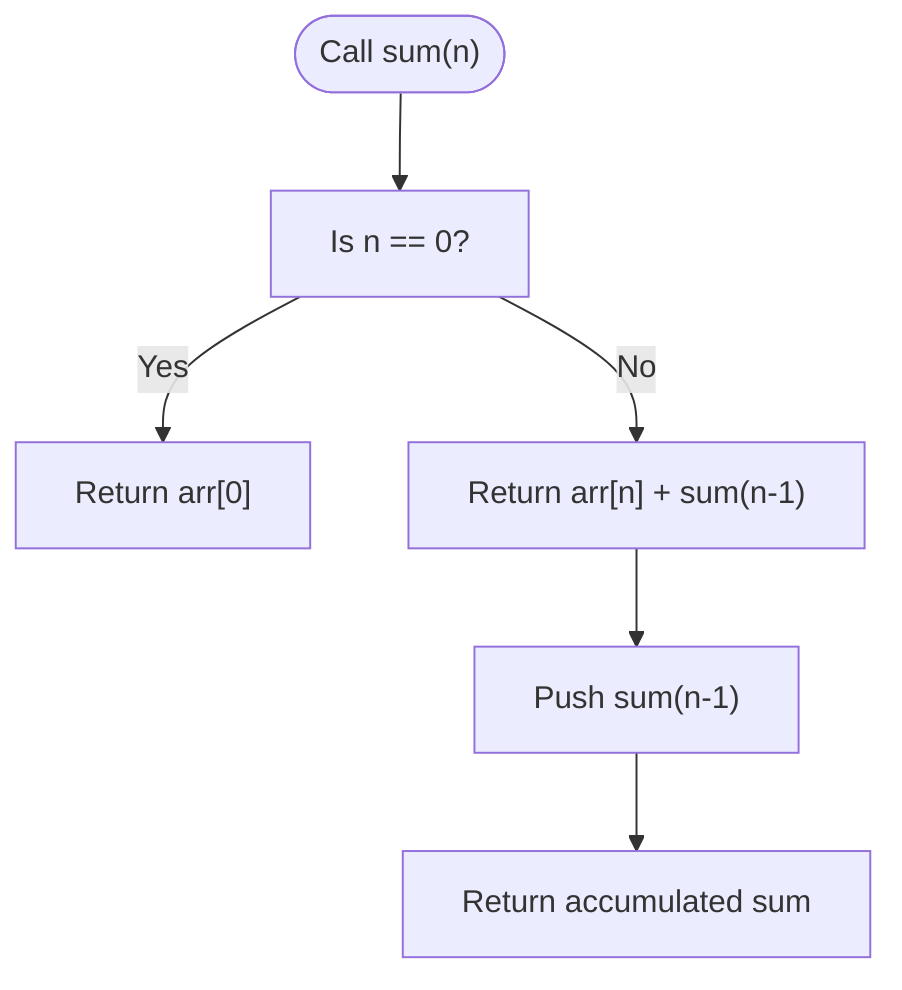

**Diagram sources**
- [19_rec_sum_of_array.js](file://19_rec_sum_of_array.js#L14-L19)

**Section sources**
- [19_rec_sum_of_array.js](file://19_rec_sum_of_array.js#L9-L19)

### Sum of Odd Elements in Array
- Mathematical foundation:
  - At each index, decide whether to include arr[n] if odd; otherwise contribute 0.
  - Base case: at index 0, include arr[0] if odd else 0.
  - Recursive relation: sum(n) = (odd test) ? arr[n] + sum(n-1) : 0 + sum(n-1)
- Execution flow:
  - Evaluates parity at each step and accumulates accordingly.

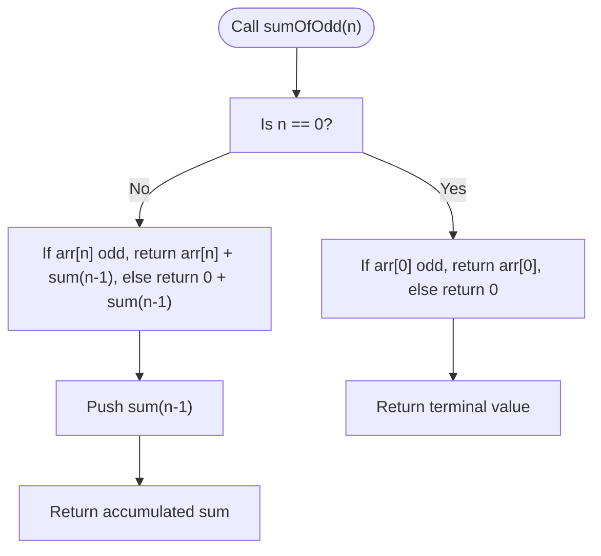

**Diagram sources**
- [20_rec_sum_of_odd.js](file://20_rec_sum_of_odd.js#L15-L29)

**Section sources**
- [20_rec_sum_of_odd.js](file://20_rec_sum_of_odd.js#L9-L29)

### Factorial
- Mathematical foundation:
  - Base case: fact(1) = 1
  - Recursive relation: fact(n) = n * fact(n-1)
- Execution flow:
  - Multiplies n by factorial of (n-1) down to the base case.

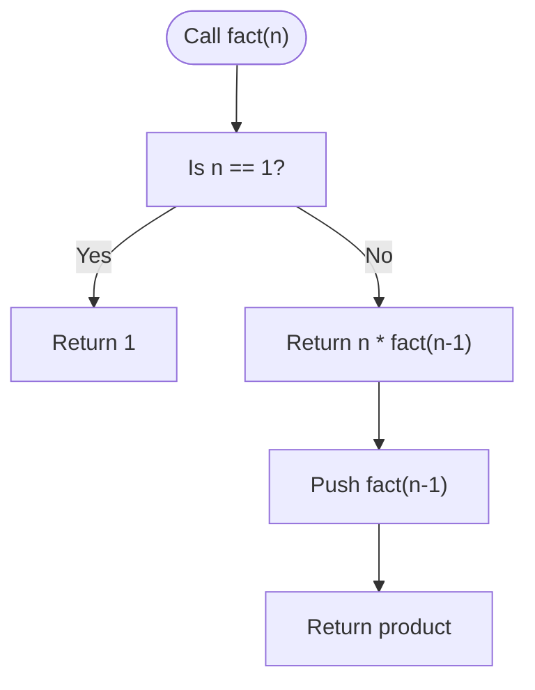

**Diagram sources**
- [21_rec_factorial.js](file://21_rec_factorial.js#L13-L16)

**Section sources**
- [21_rec_factorial.js](file://21_rec_factorial.js#L9-L16)

### Power of Two Check
- Mathematical foundation:
  - Base cases: n == 1 returns true; n < 1 or n odd returns false
  - Recursive relation: isPowerOfTwo(n) = isPowerOfTwo(n/2)
- Execution flow:
  - Continues dividing by 2 until base conditions are met.

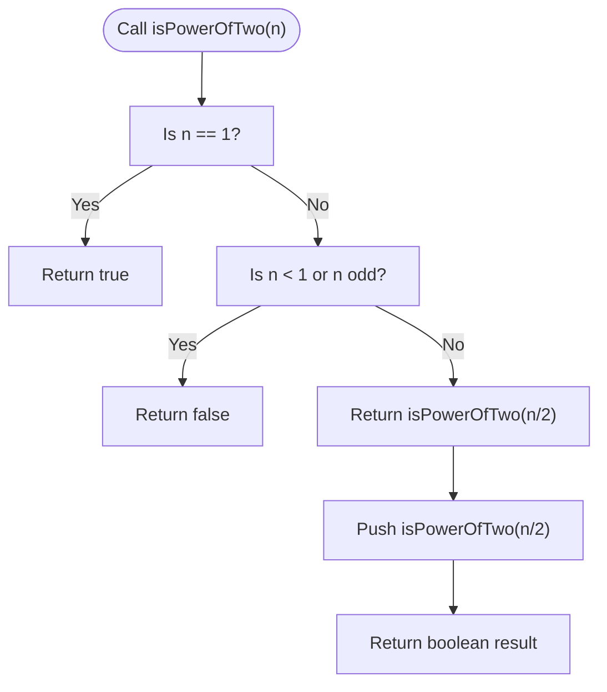

**Diagram sources**
- [22_231_rec_pow_of_2.js](file://22_231_rec_pow_of_2.js#L15-L19)

**Section sources**
- [22_231_rec_pow_of_2.js](file://22_231_rec_pow_of_2.js#L10-L19)

### Fibonacci Sequence
- Mathematical foundation:
  - Base cases: fib(0) = 0, fib(1) = 1
  - Recursive relation: fib(n) = fib(n-1) + fib(n-2)
- Execution flow:
  - Each call branches into two further calls until base cases are reached.
- Complexity note:
  - Naive recursion leads to exponential time; can be optimized with memoization or DP.

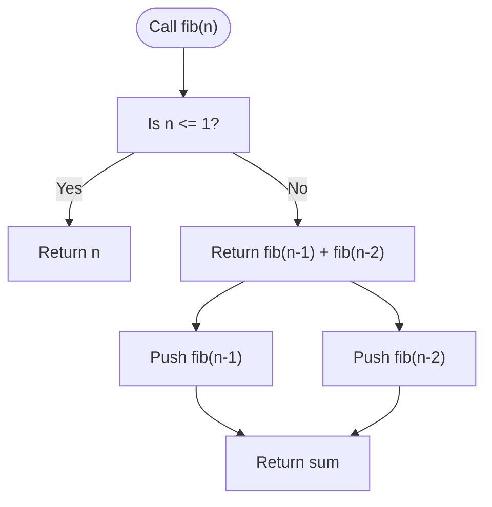

**Diagram sources**
- [23_509_rec_febonacci_num.js](file://23_509_rec_febonacci_num.js#L13-L16)

**Section sources**
- [23_509_rec_febonacci_num.js](file://23_509_rec_febonacci_num.js#L9-L16)

### Merge Sort (Divide and Conquer)
- Recursive structure:
  - Base case: arrays of length ≤ 1 are already sorted
  - Split array at midpoint and recursively sort halves
  - Merge sorted halves into a single sorted array
- Execution flow:
  - Recursively splits until single elements, then merges back in sorted order.

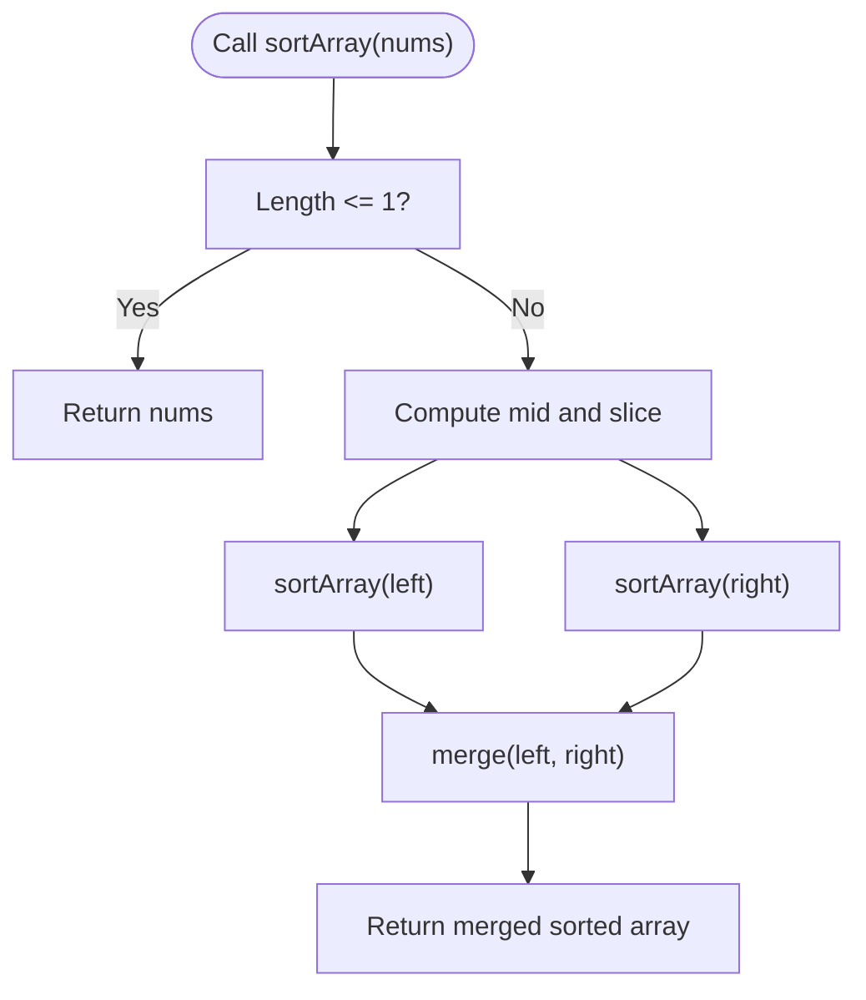

**Diagram sources**
- [29_912_sort_merge_sort.js](file://29_912_sort_merge_sort.js#L19-L25)
- [29_912_sort_merge_sort.js](file://29_912_sort_merge_sort.js#L27-L44)

**Section sources**
- [29_912_sort_merge_sort.js](file://29_912_sort_merge_sort.js#L9-L25)
- [29_912_sort_merge_sort.js](file://29_912_sort_merge_sort.js#L27-L44)

### Linked List Pair Swapping (Recursive)
- Recursive structure:
  - Base case: if head or head.next is null, return head
  - Swap current pair and link the returned new head to the rest
- Execution flow:
  - Recursively swaps subsequent pairs and relinks nodes.

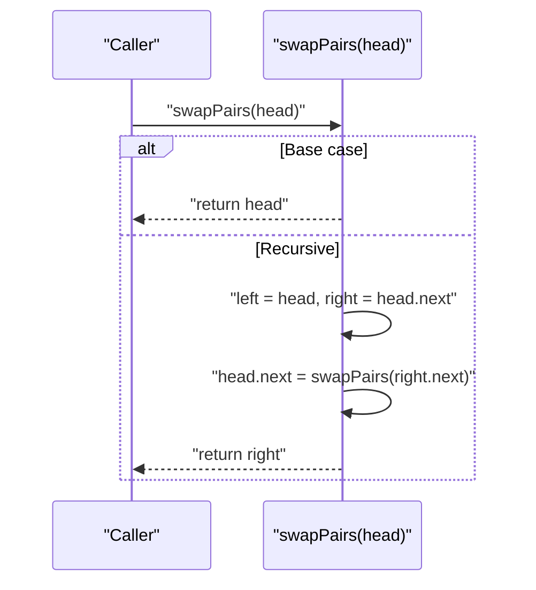

**Diagram sources**
- [43_24_swap_nodes_in_pair_recurcive_approch.js](file://43_24_swap_nodes_in_pair_recurcive_approch.js#L29-L39)

**Section sources**
- [43_24_swap_nodes_in_pair_recurcive_approch.js](file://43_24_swap_nodes_in_pair_recurcive_approch.js#L10-L39)

### Binary Tree Maximum Depth (Recursive DFS)
- Recursive structure:
  - Base case: null node contributes 0 depth
  - Recursive case: depth = 1 + max(leftDepth, rightDepth)
- Execution flow:
  - Recursively computes depths of subtrees and combines results.

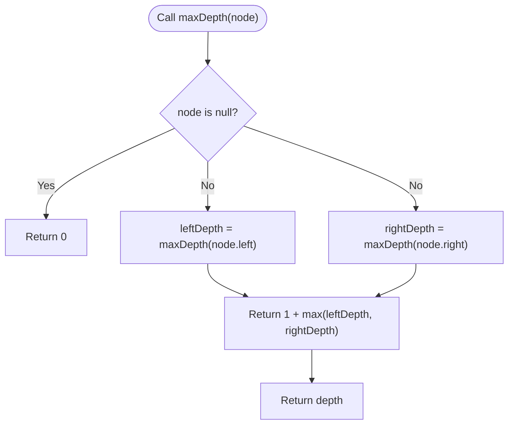

**Diagram sources**
- [16_maxDepth.js](file://16_maxDepth.js#L53-L62)

**Section sources**
- [16_maxDepth.js](file://16_maxDepth.js#L12-L62)

### Climbing Stairs (DP Insight)
- Recurrence:
  - ways(n) = ways(n-1) + ways(n-2), with base cases ways(1)=1, ways(2)=2
- Iterative DP note:
  - Optimized bottom-up with O(1) space and O(n) time
- Learning connection:
  - Demonstrates how a recursive insight can be transformed into an efficient iterative solution

**Section sources**
- [41_climbingStairs.js](file://41_climbingStairs.js#L11-L62)

## Dependency Analysis
These examples are self-contained and do not import external modules. They demonstrate independent recursive patterns that can be composed or adapted for more complex scenarios.

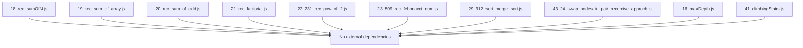

**Diagram sources**
- [18_rec_sumOfN.js](file://18_rec_sumOfN.js#L1-L17)
- [19_rec_sum_of_array.js](file://19_rec_sum_of_array.js#L1-L23)
- [20_rec_sum_of_odd.js](file://20_rec_sum_of_odd.js#L1-L32)
- [21_rec_factorial.js](file://21_rec_factorial.js#L1-L17)
- [22_231_rec_pow_of_2.js](file://22_231_rec_pow_of_2.js#L1-L20)
- [23_509_rec_febonacci_num.js](file://23_509_rec_febonacci_num.js#L1-L21)
- [29_912_sort_merge_sort.js](file://29_912_sort_merge_sort.js#L1-L49)
- [43_24_swap_nodes_in_pair_recurcive_approch.js](file://43_24_swap_nodes_in_pair_recurcive_approch.js#L1-L45)
- [16_maxDepth.js](file://16_maxDepth.js#L1-L64)
- [41_climbingStairs.js](file://41_climbingStairs.js#L1-L67)

**Section sources**
- [18_rec_sumOfN.js](file://18_rec_sumOfN.js#L1-L17)
- [19_rec_sum_of_array.js](file://19_rec_sum_of_array.js#L1-L23)
- [20_rec_sum_of_odd.js](file://20_rec_sum_of_odd.js#L1-L32)
- [21_rec_factorial.js](file://21_rec_factorial.js#L1-L17)
- [22_231_rec_pow_of_2.js](file://22_231_rec_pow_of_2.js#L1-L20)
- [23_509_rec_febonacci_num.js](file://23_509_rec_febonacci_num.js#L1-L21)
- [29_912_sort_merge_sort.js](file://29_912_sort_merge_sort.js#L1-L49)
- [43_24_swap_nodes_in_pair_recurcive_approch.js](file://43_24_swap_nodes_in_pair_recurcive_approch.js#L1-L45)
- [16_maxDepth.js](file://16_maxDepth.js#L1-L64)
- [41_climbingStairs.js](file://41_climbingStairs.js#L1-L67)

## Performance Considerations
- Tail recursion:
  - Some languages optimize tail calls; JavaScript engines vary. Patterns like accumulator-style recursion can approximate tail calls when designed carefully.
- Memoization:
  - For overlapping subproblems (e.g., naive Fibonacci), cache results to reduce exponential work.
- Stack depth:
  - Deep recursion risks stack overflow. Prefer iterative solutions or increase recursion limits cautiously.
- Divide-and-conquer:
  - Merge sort demonstrates logarithmic depth with linear merging per level, yielding O(n log n) time and O(n) auxiliary space.

[No sources needed since this section provides general guidance]

## Troubleshooting Guide
- Missing or incorrect base cases:
  - Symptoms: infinite recursion, stack overflow, incorrect results.
  - Fix: ensure base cases cover all trivial inputs and terminate the chain.
- Incorrect recursive relationships:
  - Symptoms: wrong accumulation or branching.
  - Fix: verify that each recursive call reduces the problem size and moves toward base cases.
- Off-by-one errors in indices:
  - Symptoms: accessing undefined elements or skipping valid ones.
  - Fix: validate array bounds and index transitions.
- Not handling invalid inputs:
  - Symptoms: unexpected false positives/negatives.
  - Fix: add guard clauses for edge cases (e.g., n < 1 in power-of-two checks).
- Confusing forward vs backward traversal:
  - Fix: align base case with the stopping condition (e.g., index 0 for backward traversal).

**Section sources**
- [22_231_rec_pow_of_2.js](file://22_231_rec_pow_of_2.js#L16-L17)
- [19_rec_sum_of_array.js](file://19_rec_sum_of_array.js#L14-L19)
- [20_rec_sum_of_odd.js](file://20_rec_sum_of_odd.js#L15-L29)

## Conclusion
Recursion is a powerful paradigm built on well-defined base cases and recursive relationships. These examples illustrate how to structure recursive solutions, visualize call stacks, and recognize when optimizations like memoization or iterative DP are beneficial. By progressing from simple countdown and accumulation patterns to divide-and-conquer and tree traversals, learners can build intuition for designing correct and efficient recursive algorithms.

[No sources needed since this section summarizes without analyzing specific files]

## Appendices

### Learning Progression Path
- Start with simple countdown and accumulation (sum of n, factorial)
- Extend to conditional accumulation (sum of odds)
- Introduce branching (Fibonacci) and early termination (power of two)
- Explore divide-and-conquer (merge sort)
- Apply recursion to data structures (linked list pairing, tree depth)
- Contrast with iterative DP (climbing stairs)

[No sources needed since this section provides general guidance]