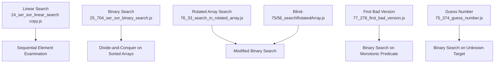
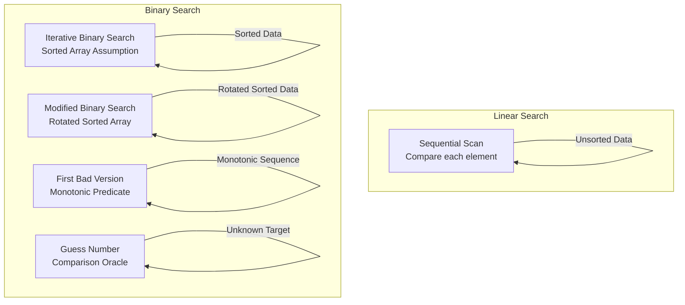
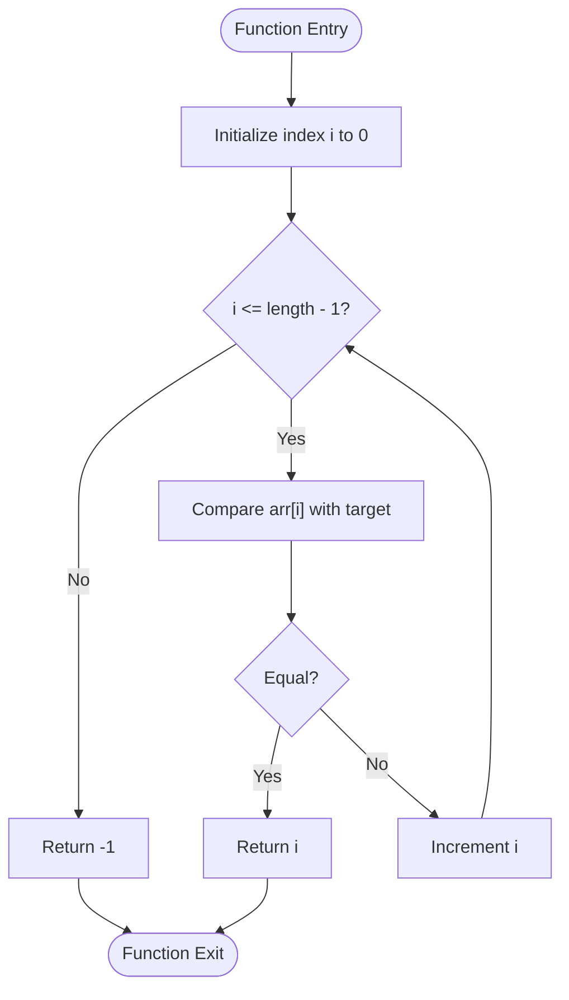
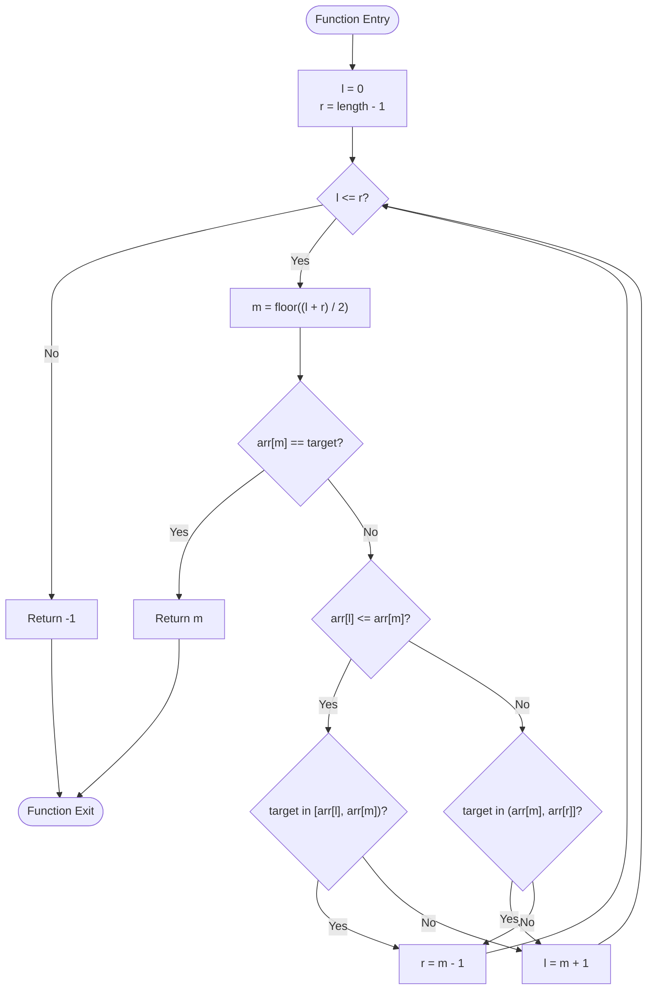
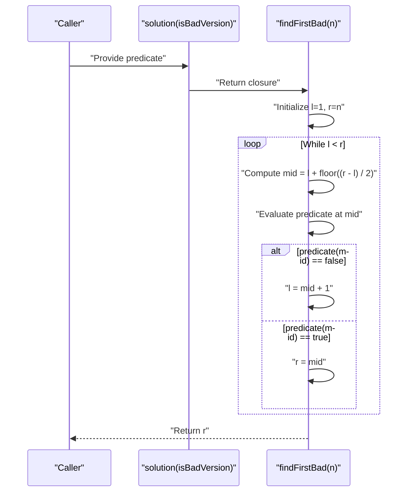
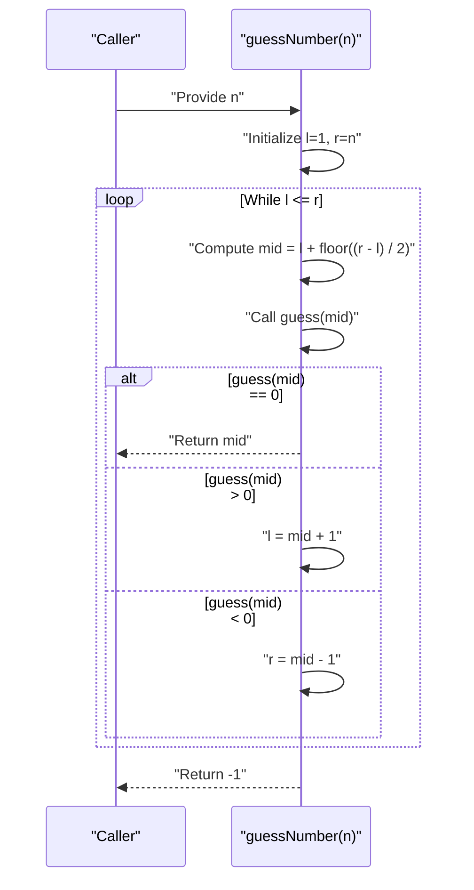
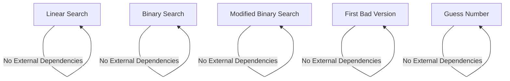

# Searching Algorithms

<cite>
**Referenced Files in This Document**
- [24_ser_sor_linear_search copy.js](file://24_ser_sor_linear_search copy.js)
- [25_704_ser_sor_binary_search.js](file://25_704_ser_sor_binary_search.js)
- [76_33_search_in_rotated_array.js](file://76_33_search_in_rotated_array.js)
- [77_278_first_bad_version.js](file://77_278_first_bad_version.js)
- [75_374_guess_number.js](file://75_374_guess_number.js)
- [Blind-75/56_searchRotatedArray.js](file://Blind-75/56_searchRotatedArray.js)
</cite>

## Table of Contents
1. [Introduction](#introduction)
2. [Project Structure](#project-structure)
3. [Core Components](#core-components)
4. [Architecture Overview](#architecture-overview)
5. [Detailed Component Analysis](#detailed-component-analysis)
6. [Dependency Analysis](#dependency-analysis)
7. [Performance Considerations](#performance-considerations)
8. [Troubleshooting Guide](#troubleshooting-guide)
9. [Conclusion](#conclusion)

## Introduction
This document provides comprehensive documentation for searching algorithms with a focus on linear search and binary search implementations. It explains the sequential element examination approach of linear search, worst-case analysis, and applicability to unsorted data. It documents binary search implementation including sorted array assumptions, divide-and-conquer approach, and logarithmic time complexity. It also covers preconditions for binary search (sorted data requirement), implementation variations (iterative vs recursive), and boundary condition handling. Finally, it compares search strategies with detailed complexity analysis, performance benchmarks, and use case recommendations, including practical examples, debugging techniques, and optimization considerations.

## Project Structure
The repository contains multiple JavaScript files demonstrating various searching algorithms. The relevant files for this documentation are:
- Linear search implementation
- Binary search implementation on sorted arrays
- Modified binary search for rotated sorted arrays
- Additional binary search applications (first bad version, guess number)



**Diagram sources**
- [24_ser_sor_linear_search copy.js](file://24_ser_sor_linear_search copy.js#L1-L21)
- [25_704_ser_sor_binary_search.js](file://25_704_ser_sor_binary_search.js#L1-L39)
- [76_33_search_in_rotated_array.js](file://76_33_search_in_rotated_array.js#L1-L71)
- [77_278_first_bad_version.js](file://77_278_first_bad_version.js#L1-L62)
- [75_374_guess_number.js](file://75_374_guess_number.js#L1-L41)
- [Blind-75/56_searchRotatedArray.js](file://Blind-75/56_searchRotatedArray.js#L1-L37)

**Section sources**
- [24_ser_sor_linear_search copy.js](file://24_ser_sor_linear_search copy.js#L1-L21)
- [25_704_ser_sor_binary_search.js](file://25_704_ser_sor_binary_search.js#L1-L39)
- [76_33_search_in_rotated_array.js](file://76_33_search_in_rotated_array.js#L1-L71)
- [77_278_first_bad_version.js](file://77_278_first_bad_version.js#L1-L62)
- [75_374_guess_number.js](file://75_374_guess_number.js#L1-L41)
- [Blind-75/56_searchRotatedArray.js](file://Blind-75/56_searchRotatedArray.js#L1-L37)

## Core Components
This section outlines the core searching algorithms implemented in the repository, focusing on linear search and binary search variants.

- Linear Search
  - Sequentially examines elements from the beginning of an array until the target is found or the end is reached.
  - Applicable to both sorted and unsorted data.
  - Worst-case time complexity O(n), best-case O(1), average-case O(n).
  - Space complexity O(1).

- Binary Search (Sorted Arrays)
  - Uses divide-and-conquer on sorted arrays by repeatedly dividing the search interval in half.
  - Assumes the input array is sorted.
  - Time complexity O(log n), space complexity O(1) for iterative implementation.

- Modified Binary Search (Rotated Sorted Arrays)
  - Handles arrays that were originally sorted but rotated at an unknown pivot.
  - At each step, determines which half is sorted and checks if the target lies within that half.
  - Time complexity O(log n), space complexity O(1).

- Additional Binary Search Applications
  - First Bad Version: Finds the first occurrence in a monotonic predicate sequence.
  - Guess Number: Locates a hidden number using a comparison oracle.

**Section sources**
- [24_ser_sor_linear_search copy.js](file://24_ser_sor_linear_search copy.js#L1-L21)
- [25_704_ser_sor_binary_search.js](file://25_704_ser_sor_binary_search.js#L1-L39)
- [76_33_search_in_rotated_array.js](file://76_33_search_in_rotated_array.js#L1-L71)
- [77_278_first_bad_version.js](file://77_278_first_bad_version.js#L1-L62)
- [75_374_guess_number.js](file://75_374_guess_number.js#L1-L41)

## Architecture Overview
The searching algorithms share a common theme: efficient element discovery with different trade-offs. The linear search algorithm performs a straightforward scan, while binary search leverages ordering to achieve logarithmic performance. Modified binary search adapts to rotated arrays by identifying sorted halves at each step.



**Diagram sources**
- [24_ser_sor_linear_search copy.js](file://24_ser_sor_linear_search copy.js#L1-L21)
- [25_704_ser_sor_binary_search.js](file://25_704_ser_sor_binary_search.js#L1-L39)
- [76_33_search_in_rotated_array.js](file://76_33_search_in_rotated_array.js#L1-L71)
- [77_278_first_bad_version.js](file://77_278_first_bad_version.js#L1-L62)
- [75_374_guess_number.js](file://75_374_guess_number.js#L1-L41)

## Detailed Component Analysis

### Linear Search Implementation
Linear search sequentially compares the target against each element in the array. It is simple, reliable, and works regardless of data order. The implementation demonstrates:
- Iteration from the first index to the end of the array.
- Immediate return upon finding the target.
- Return of a sentinel value when the target is not found.



**Diagram sources**
- [24_ser_sor_linear_search copy.js](file://24_ser_sor_linear_search copy.js#L14-L18)

**Section sources**
- [24_ser_sor_linear_search copy.js](file://24_ser_sor_linear_search copy.js#L1-L21)

### Binary Search Implementation (Sorted Arrays)
Binary search operates on sorted arrays by maintaining left and right pointers and repeatedly checking the middle element. The implementation demonstrates:
- Initialization of left and right boundaries.
- Iterative loop while the left pointer does not exceed the right pointer.
- Computation of the middle index and comparisons to adjust boundaries.
- Early return when the target is found; otherwise return a sentinel value.

```mermaid
flowchart TD
Start(["Function Entry"]) --> Init["left = 0<br/>right = length - 1"]
Init --> Loop{"left <= right?"}
Loop --> |No| NotFound["Return -1"]
Loop --> |Yes| Mid["middle = floor((left + right) / 2)"]
Mid --> Compare{"target vs arr[middle]"}
Compare --> |Equal| ReturnMid["Return middle"]
Compare --> |target < arr[middle]| MoveLeft["right = middle - 1"]
Compare --> |target > arr[middle]| MoveRight["left = middle + 1"]
MoveLeft --> Loop
MoveRight --> Loop
ReturnMid --> End(["Function Exit"])
NotFound --> End
```

**Diagram sources**
- [25_704_ser_sor_binary_search.js](file://25_704_ser_sor_binary_search.js#L18-L33)

**Section sources**
- [25_704_ser_sor_binary_search.js](file://25_704_ser_sor_binary_search.js#L1-L39)

### Modified Binary Search (Rotated Sorted Arrays)
Modified binary search handles arrays that were originally sorted but rotated at an unknown pivot. The algorithm:
- Determines which half is sorted at each step.
- Checks if the target lies within the sorted half.
- Adjusts pointers accordingly to converge toward the target.



**Diagram sources**
- [76_33_search_in_rotated_array.js](file://76_33_search_in_rotated_array.js#L25-L55)
- [Blind-75/56_searchRotatedArray.js](file://Blind-75/56_searchRotatedArray.js#L11-L29)

**Section sources**
- [76_33_search_in_rotated_array.js](file://76_33_search_in_rotated_array.js#L1-L71)
- [Blind-75/56_searchRotatedArray.js](file://Blind-75/56_searchRotatedArray.js#L1-L37)

### Additional Binary Search Applications

#### First Bad Version
This variant applies binary search to a monotonic predicate sequence where all elements after the first bad version are also bad. The algorithm:
- Uses a closed interval [l, r].
- Computes mid and evaluates the predicate.
- Adjusts boundaries based on the predicate result.



**Diagram sources**
- [77_278_first_bad_version.js](file://77_278_first_bad_version.js#L35-L53)

**Section sources**
- [77_278_first_bad_version.js](file://77_278_first_bad_version.js#L1-L62)

#### Guess Number
This variant uses binary search with a comparison oracle to locate a hidden number within a known range. The algorithm:
- Maintains a closed interval [l, r].
- Queries the oracle at mid and adjusts boundaries accordingly.



**Diagram sources**
- [75_374_guess_number.js](file://75_374_guess_number.js#L23-L40)

**Section sources**
- [75_374_guess_number.js](file://75_374_guess_number.js#L1-L41)

## Dependency Analysis
The searching algorithms are self-contained implementations with minimal external dependencies. They rely on basic arithmetic operations and array indexing. There are no cross-file dependencies among the searched algorithms in this repository snapshot.



**Diagram sources**
- [24_ser_sor_linear_search copy.js](file://24_ser_sor_linear_search copy.js#L1-L21)
- [25_704_ser_sor_binary_search.js](file://25_704_ser_sor_binary_search.js#L1-L39)
- [76_33_search_in_rotated_array.js](file://76_33_search_in_rotated_array.js#L1-L71)
- [77_278_first_bad_version.js](file://77_278_first_bad_version.js#L1-L62)
- [75_374_guess_number.js](file://75_374_guess_number.js#L1-L41)

**Section sources**
- [24_ser_sor_linear_search copy.js](file://24_ser_sor_linear_search copy.js#L1-L21)
- [25_704_ser_sor_binary_search.js](file://25_704_ser_sor_binary_search.js#L1-L39)
- [76_33_search_in_rotated_array.js](file://76_33_search_in_rotated_array.js#L1-L71)
- [77_278_first_bad_version.js](file://77_278_first_bad_version.js#L1-L62)
- [75_374_guess_number.js](file://75_374_guess_number.js#L1-L41)

## Performance Considerations
- Linear Search
  - Time complexity: O(n) in all cases.
  - Space complexity: O(1).
  - Best for small datasets or when data is unsorted and simplicity is preferred.

- Binary Search (Sorted Arrays)
  - Time complexity: O(log n).
  - Space complexity: O(1) for iterative implementation.
  - Requires sorted data; otherwise incorrect results.

- Modified Binary Search (Rotated Sorted Arrays)
  - Time complexity: O(log n).
  - Space complexity: O(1).
  - Handles rotated arrays by determining sorted halves at each step.

- Additional Applications
  - First Bad Version: O(log n) time, O(1) space.
  - Guess Number: O(log n) time, O(1) space.

Practical recommendations:
- Use linear search for very small arrays or when data is unsorted.
- Prefer binary search for large sorted datasets.
- Use modified binary search for rotated sorted arrays.
- Apply binary search to monotonic predicates (first bad version) and comparison-oracle scenarios (guess number).

[No sources needed since this section provides general guidance]

## Troubleshooting Guide
Common issues and debugging techniques:
- Boundary Conditions
  - Ensure loop termination conditions match the chosen interval type (e.g., left <= right vs left < right).
  - Verify middle index calculation to prevent overflow and off-by-one errors.

- Sorted Data Requirement
  - Confirm input arrays are sorted before applying binary search.
  - For rotated arrays, verify the rotation detection logic and sorted-half identification.

- Return Values
  - Distinguish between returning the index of the found element versus a sentinel value for not found.
  - Ensure consistent return semantics across different implementations.

- Predicate Evaluation
  - For monotonic predicates, confirm the predicate correctly identifies the transition point.
  - Validate the direction of boundary adjustments based on predicate outcomes.

**Section sources**
- [25_704_ser_sor_binary_search.js](file://25_704_ser_sor_binary_search.js#L18-L33)
- [76_33_search_in_rotated_array.js](file://76_33_search_in_rotated_array.js#L25-L55)
- [77_278_first_bad_version.js](file://77_278_first_bad_version.js#L40-L53)
- [75_374_guess_number.js](file://75_374_guess_number.js#L23-L40)

## Conclusion
This documentation outlined linear search and binary search implementations, highlighting their differences in assumptions, performance characteristics, and applicability. Linear search offers simplicity and universality, while binary search achieves logarithmic performance under sorted-data assumptions. Modified binary search extends capabilities to rotated sorted arrays, and additional applications demonstrate binary search’s versatility in monotonic predicate and comparison-oracle contexts. By understanding boundary conditions, sorted-data requirements, and return-value semantics, developers can select and implement the most suitable search strategy for their use cases.