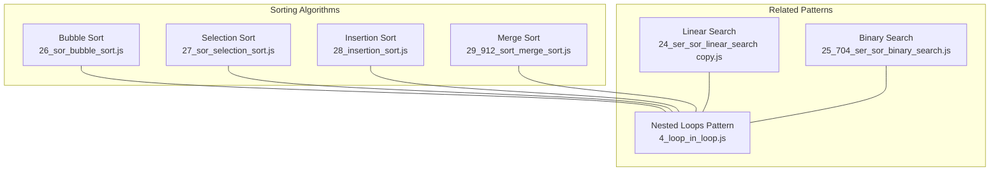
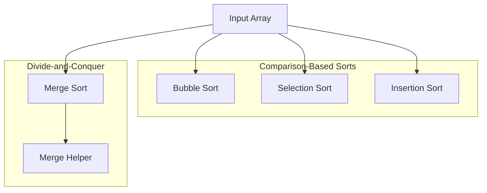
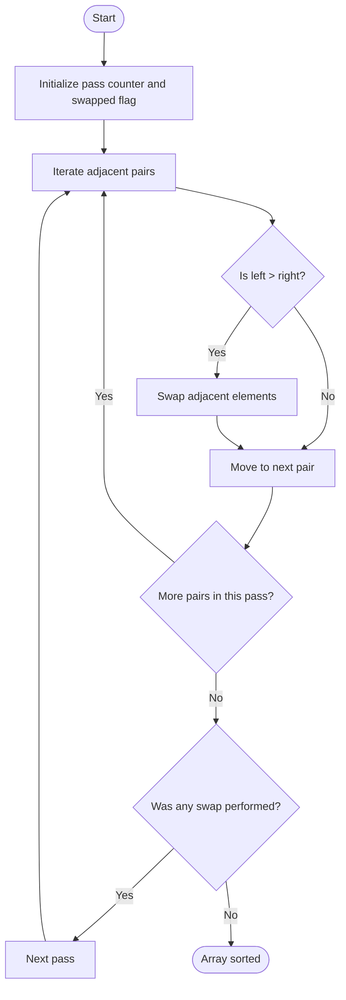
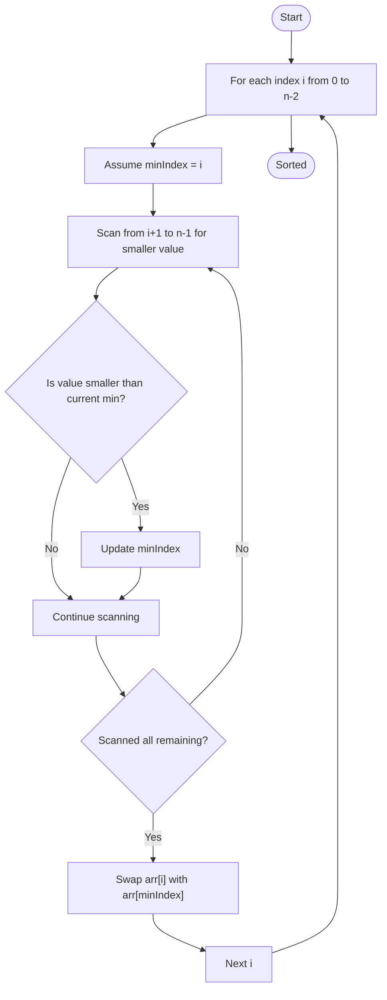
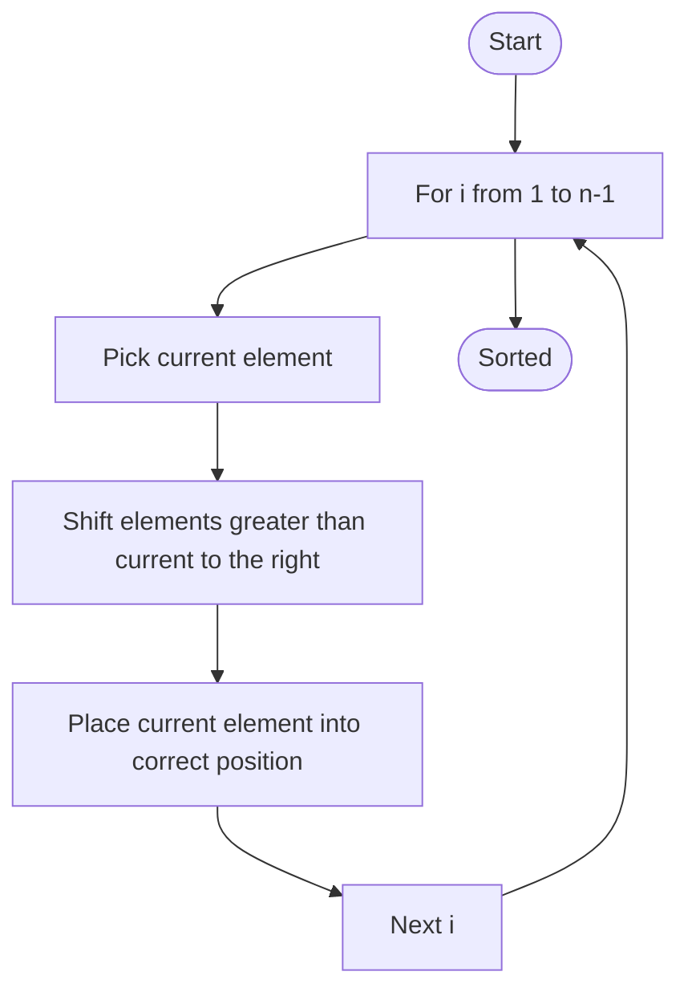
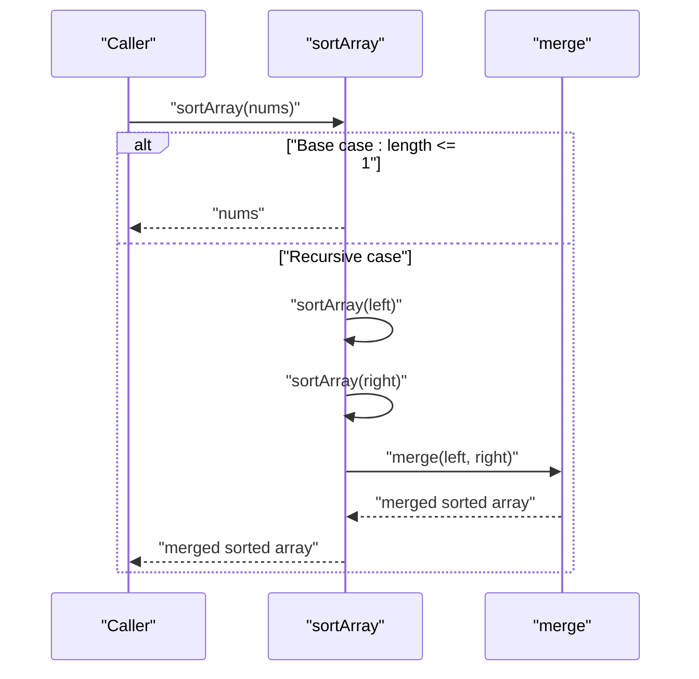
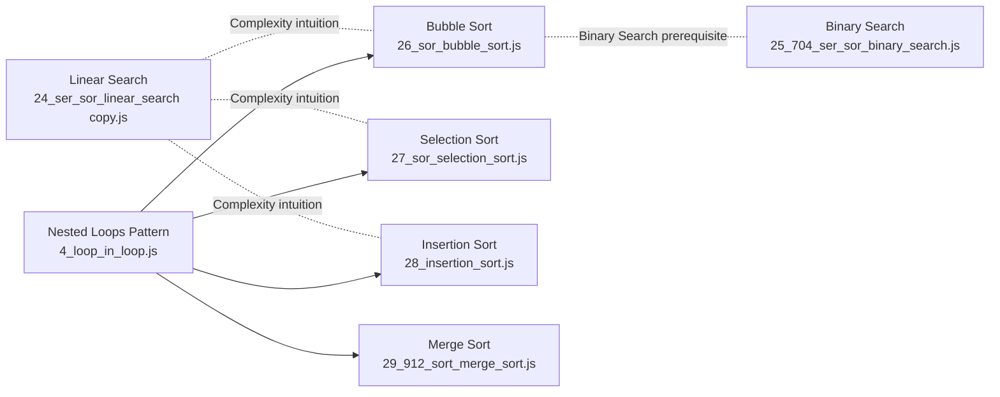

# Sorting Algorithms

<cite>
**Referenced Files in This Document**
- [26_sor_bubble_sort.js](file://26_sor_bubble_sort.js)
- [27_sor_selection_sort.js](file://27_sor_selection_sort.js)
- [28_insertion_sort.js](file://28_insertion_sort.js)
- [29_912_sort_merge_sort.js](file://29_912_sort_merge_sort.js)
- [4_loop_in_loop.js](file://4_loop_in_loop.js)
- [24_ser_sor_linear_search copy.js](file://24_ser_sor_linear_search copy.js)
- [25_704_ser_sor_binary_search.js](file://25_704_ser_sor_binary_search.js)
</cite>

## Table of Contents
1. [Introduction](#introduction)
2. [Project Structure](#project-structure)
3. [Core Components](#core-components)
4. [Architecture Overview](#architecture-overview)
5. [Detailed Component Analysis](#detailed-component-analysis)
6. [Dependency Analysis](#dependency-analysis)
7. [Performance Considerations](#performance-considerations)
8. [Troubleshooting Guide](#troubleshooting-guide)
9. [Conclusion](#conclusion)
10. [Appendices](#appendices)

## Introduction
This document presents a structured, code-backed guide to sorting algorithms implemented in JavaScript within the repository. It progresses from basic comparison sorts (bubble sort and selection sort) to advanced divide-and-conquer techniques (merge sort), with emphasis on implementation details, time/space complexity, stability, and practical performance considerations. The goal is to help learners understand how these algorithms behave under different data distributions and constraints.

## Project Structure
The sorting algorithms are implemented as standalone scripts with explanatory comments. They demonstrate fundamental patterns such as nested loops, in-place swaps, and recursive decomposition.

**Diagram sources**
- [26_sor_bubble_sort.js](file://26_sor_bubble_sort.js#L1-L56)
- [27_sor_selection_sort.js](file://27_sor_selection_sort.js#L1-L38)
- [28_insertion_sort.js](file://28_insertion_sort.js#L1-L37)
- [29_912_sort_merge_sort.js](file://29_912_sort_merge_sort.js#L1-L49)
- [4_loop_in_loop.js](file://4_loop_in_loop.js#L1-L26)
- [24_ser_sor_linear_search copy.js](file://24_ser_sor_linear_search copy.js#L1-L21)
- [25_704_ser_sor_binary_search.js](file://25_704_ser_sor_binary_search.js#L1-L39)

**Section sources**
- [26_sor_bubble_sort.js](file://26_sor_bubble_sort.js#L1-L56)
- [27_sor_selection_sort.js](file://27_sor_selection_sort.js#L1-L38)
- [28_insertion_sort.js](file://28_insertion_sort.js#L1-L37)
- [29_912_sort_merge_sort.js](file://29_912_sort_merge_sort.js#L1-L49)
- [4_loop_in_loop.js](file://4_loop_in_loop.js#L1-L26)
- [24_ser_sor_linear_search copy.js](file://24_ser_sor_linear_search copy.js#L1-L21)
- [25_704_ser_sor_binary_search.js](file://25_704_ser_sor_binary_search.js#L1-L39)

## Core Components
- Bubble Sort: Two-layer nested iteration with adjacent comparisons and optional early exit when no swaps occur in a pass.
- Selection Sort: Repeatedly selects the minimum from the unsorted suffix and places it at the sorted prefix boundary.
- Insertion Sort: Builds a sorted prefix by inserting each element into its correct position among previously processed elements.
- Merge Sort: Recursively splits the array into halves and merges them back in sorted order.

Key implementation references:
- Bubble Sort: [bubbleSort](file://26_sor_bubble_sort.js#L40-L55)
- Selection Sort: [selectionSort](file://27_sor_selection_sort.js#L18-L31)
- Insertion Sort: [insertionSort](file://28_insertion_sort.js#L16-L29)
- Merge Sort: [sortArray](file://29_912_sort_merge_sort.js#L19-L25), [merge](file://29_912_sort_merge_sort.js#L27-L44)

**Section sources**
- [26_sor_bubble_sort.js](file://26_sor_bubble_sort.js#L1-L56)
- [27_sor_selection_sort.js](file://27_sor_selection_sort.js#L1-L38)
- [28_insertion_sort.js](file://28_insertion_sort.js#L1-L37)
- [29_912_sort_merge_sort.js](file://29_912_sort_merge_sort.js#L1-L49)

## Architecture Overview
The sorting implementations are independent functions that operate on arrays. Bubble and selection sorts are in-place, while merge sort constructs auxiliary arrays during merging. The repository also includes foundational patterns (nested loops) and related algorithms (linear and binary search) that inform complexity intuition and algorithmic thinking.

**Diagram sources**
- [26_sor_bubble_sort.js](file://26_sor_bubble_sort.js#L40-L55)
- [27_sor_selection_sort.js](file://27_sor_selection_sort.js#L18-L31)
- [28_insertion_sort.js](file://28_insertion_sort.js#L16-L29)
- [29_912_sort_merge_sort.js](file://29_912_sort_merge_sort.js#L19-L44)

## Detailed Component Analysis

### Bubble Sort
Bubble Sort repeatedly compares adjacent elements and swaps them if out of order. An optimization tracks whether any swap occurred in a pass; if not, the array is already sorted and the algorithm terminates early.

Implementation highlights:
- Outer loop controls passes.
- Inner loop performs adjacent comparisons.
- Early exit flag prevents unnecessary iterations on nearly sorted data.

**Diagram sources**
- [26_sor_bubble_sort.js](file://26_sor_bubble_sort.js#L40-L55)

Practical notes:
- Time complexity: O(n^2) worst/average; O(n) best with early exit on nearly sorted data.
- Space complexity: O(1).
- Stability: Stable due to adjacent swapping preserving equal elements’ relative order.
- Use cases: Educational demonstrations, tiny arrays, or nearly sorted data.

**Section sources**
- [26_sor_bubble_sort.js](file://26_sor_bubble_sort.js#L1-L56)

### Selection Sort
Selection Sort builds the sorted prefix by selecting the minimum element from the unsorted suffix and placing it at the boundary. It minimizes write operations compared to bubble sort.

Implementation highlights:
- For each index, find the minimum in the remainder of the array.
- Swap the minimum into place.
- In-place sorting with minimal data movement.

**Diagram sources**
- [27_sor_selection_sort.js](file://27_sor_selection_sort.js#L18-L31)

Practical notes:
- Time complexity: O(n^2) in all cases.
- Space complexity: O(1).
- Stability: Not stable because swapping may move equal elements past each other.
- Use cases: Educational, small arrays, or environments where write operations must be minimized.

**Section sources**
- [27_sor_selection_sort.js](file://27_sor_selection_sort.js#L1-L38)

### Insertion Sort
Insertion Sort builds a sorted prefix by inserting each element into its correct position among the already sorted elements. It is efficient for small or nearly sorted datasets.

Implementation highlights:
- Iterate from the second element.
- Save current element and shift larger elements right.
- Insert current element into its correct position.

**Diagram sources**
- [28_insertion_sort.js](file://28_insertion_sort.js#L16-L29)

Practical notes:
- Time complexity: O(n^2) worst/average; O(n) best for nearly sorted data.
- Space complexity: O(1).
- Stability: Stable due to shifting elements without crossing equal values.
- Use cases: Small arrays, nearly sorted data, or as a subroutine in hybrid algorithms.

**Section sources**
- [28_insertion_sort.js](file://28_insertion_sort.js#L1-L37)

### Merge Sort
Merge Sort applies a classic divide-and-conquer strategy: split the array into halves until single-element arrays remain, then merge them back in sorted order. The merge operation compares elements from two sorted arrays and appends the smaller one.

Implementation highlights:
- Base case: arrays of length ≤ 1 are trivially sorted.
- Recursive split: compute midpoint and sort left/right halves.
- Merge: iterate through both halves, appending the smaller element to the result.

**Diagram sources**
- [29_912_sort_merge_sort.js](file://29_912_sort_merge_sort.js#L19-L44)

Practical notes:
- Time complexity: O(n log n) in all cases.
- Space complexity: O(n) due to auxiliary arrays during merging.
- Stability: Stable because when equal elements are encountered, the left array’s element is chosen first.
- Use cases: Large datasets, when predictable O(n log n) performance is desired, and when stability matters.

**Section sources**
- [29_912_sort_merge_sort.js](file://29_912_sort_merge_sort.js#L1-L49)

### Comparative Analysis
- Time complexity:
  - Bubble/Selection/Insertion: O(n^2) worst/average; Insertion/Bubble can be O(n) on nearly sorted data.
  - Merge Sort: O(n log n) consistently.
- Space complexity:
  - Bubble/Selection/Insertion: O(1) in-place.
  - Merge Sort: O(n) due to merging buffers.
- Stability:
  - Bubble/Insertion/Merge Sort: Stable.
  - Selection Sort: Not stable.
- Practical considerations:
  - Data size: For large n, prefer Merge Sort; for small n or nearly sorted data, Insertion Sort can be competitive.
  - Memory constraints: Prefer in-place sorts (Bubble/Selection/Insertion) when memory is tight.
  - Real-world performance: Hybrid approaches often switch to Insertion Sort for small partitions within Merge Sort.

[No sources needed since this section synthesizes findings across multiple files]

## Dependency Analysis
The sorting implementations are self-contained. Bubble and selection sorts rely on nested loop patterns, while merge sort relies on recursion and a merge helper. Related patterns (nested loops, linear search, binary search) provide foundational complexity intuition.

**Diagram sources**
- [4_loop_in_loop.js](file://4_loop_in_loop.js#L1-L26)
- [24_ser_sor_linear_search copy.js](file://24_ser_sor_linear_search copy.js#L1-L21)
- [25_704_ser_sor_binary_search.js](file://25_704_ser_sor_binary_search.js#L1-L39)
- [26_sor_bubble_sort.js](file://26_sor_bubble_sort.js#L1-L56)
- [27_sor_selection_sort.js](file://27_sor_selection_sort.js#L1-L38)
- [28_insertion_sort.js](file://28_insertion_sort.js#L1-L37)
- [29_912_sort_merge_sort.js](file://29_912_sort_merge_sort.js#L1-L49)

**Section sources**
- [4_loop_in_loop.js](file://4_loop_in_loop.js#L1-L26)
- [24_ser_sor_linear_search copy.js](file://24_ser_sor_linear_search copy.js#L1-L21)
- [25_704_ser_sor_binary_search.js](file://25_704_ser_sor_binary_search.js#L1-L39)
- [26_sor_bubble_sort.js](file://26_sor_bubble_sort.js#L1-L56)
- [27_sor_selection_sort.js](file://27_sor_selection_sort.js#L1-L38)
- [28_insertion_sort.js](file://28_insertion_sort.js#L1-L37)
- [29_912_sort_merge_sort.js](file://29_912_sort_merge_sort.js#L1-L49)

## Performance Considerations
- Data distribution:
  - Nearly sorted: Insertion Sort excels; Bubble Sort benefits from early exit.
  - Random/unsorted: Merge Sort’s O(n log n) is generally preferred.
- Memory constraints:
  - In-place sorts (Bubble/Selection/Insertion) are suitable when memory is limited.
  - Merge Sort requires additional memory proportional to input size.
- Practical implications:
  - For small arrays (< 50 elements), Insertion Sort often outperforms due to low overhead.
  - For large arrays, Merge Sort’s predictable performance and stability are advantageous.
  - Hybrid algorithms (e.g., quicksort with Insertion Sort for small partitions) balance performance and simplicity.

[No sources needed since this section provides general guidance]

## Troubleshooting Guide
- Incorrect early exit in Bubble Sort:
  - Ensure the swapped flag is reset at the start of each pass and set upon encountering a swap.
  - Reference: [bubbleSort](file://26_sor_bubble_sort.js#L40-L55)
- Selection Sort not stable:
  - Swapping indices can reorder equal elements; if stability is required, prefer Insertion Sort or Merge Sort.
  - Reference: [selectionSort](file://27_sor_selection_sort.js#L18-L31)
- Merge Sort memory usage:
  - The merge helper creates new arrays; ensure sufficient memory or adapt to an in-place variant if stability is not required.
  - Reference: [merge](file://29_912_sort_merge_sort.js#L27-L44)
- Edge cases:
  - Empty or single-element arrays: Verify base-case handling in recursive sorts.
  - Reference: [sortArray](file://29_912_sort_merge_sort.js#L19-L25)

**Section sources**
- [26_sor_bubble_sort.js](file://26_sor_bubble_sort.js#L40-L55)
- [27_sor_selection_sort.js](file://27_sor_selection_sort.js#L18-L31)
- [29_912_sort_merge_sort.js](file://29_912_sort_merge_sort.js#L19-L44)

## Conclusion
The repository demonstrates a clear progression from simple comparison sorts to a divide-and-conquer approach. Bubble Sort illustrates nested-loop behavior and early-exit optimization; Selection Sort emphasizes minimal writes; Insertion Sort showcases incremental building; and Merge Sort exemplifies recursion and merging. Choosing the right algorithm depends on data size, memory constraints, and stability requirements.

[No sources needed since this section summarizes without analyzing specific files]

## Appendices
- Related patterns and algorithms:
  - Nested loops: [4_loop_in_loop.js](file://4_loop_in_loop.js#L1-L26)
  - Linear search: [24_ser_sor_linear_search copy.js](file://24_ser_sor_linear_search copy.js#L1-L21)
  - Binary search: [25_704_ser_sor_binary_search.js](file://25_704_ser_sor_binary_search.js#L1-L39)

[No sources needed since this section lists references without analysis]