# Array Problems

<cite>
**Referenced Files in This Document**
- [1_twoSum.js](file://Blind-75/1_twoSum.js)
- [5_maxSubArray.js](file://Blind-75/5_maxSubArray.js)
- [26_mergeIntervals.js](file://Blind-75/26_mergeIntervals.js)
- [27_insertInterval.js](file://Blind-75/27_insertInterval.js)
- [28_nonOverlappingIntervals.js](file://Blind-75/28_nonOverlappingIntervals.js)
- [4_productExceptSelf.js](file://Blind-75/4_productExceptSelf.js)
- [56_searchRotatedArray.js](file://Blind-75/56_searchRotatedArray.js)
- [58_containerWithMostWater.js](file://Blind-75/58_containerWithMostWater.js)
- [59_trappingRainWater.js](file://Blind-75/59_trappingRainWater.js)
- [65_lisBinarySearch.js](file://Blind-75/65_lisBinarySearch.js)
- [66_searchInRotatedSortedArray.js](file://Blind-75/66_searchInRotatedSortedArray.js)
- [67_findMinInRotatedSortedArray.js](file://Blind-75/67_findMinInRotatedSortedArray.js)
- [68_maximumProductSubarray.js](file://Blind-75/68_maximumProductSubarray.js)
- [48_missingNumber.js](file://Blind-75/48_missingNumber.js)
</cite>

## Table of Contents
1. [Introduction](#introduction)
2. [Project Structure](#project-structure)
3. [Core Components](#core-components)
4. [Architecture Overview](#architecture-overview)
5. [Detailed Component Analysis](#detailed-component-analysis)
6. [Dependency Analysis](#dependency-analysis)
7. [Performance Considerations](#performance-considerations)
8. [Troubleshooting Guide](#troubleshooting-guide)
9. [Conclusion](#conroduction)

## Introduction
This document focuses on array-based algorithm problems from the Blind-75 collection. It covers fundamental techniques such as two-pointer traversal, sliding window patterns, prefix/suffix computations, and binary search on sorted or rotated arrays. Specific problem types include:
- Two Sum variants (complement search with hash maps)
- Maximum subarray (Kadane’s algorithm)
- Maximum product subarray (tracking min/max)
- Interval merging and insertion (sorting + greedy)
- Rotated array search (modified binary search)
- Container with most water (two pointers)
- Trapping rain water (two pointers with max tracking)
- Longest increasing subsequence (O(n log n) with patience sorting)
- Product of array except self (prefix/suffix products)
- Missing number (XOR bit manipulation)

The guide emphasizes time and space complexity trade-offs, edge cases, and practical validation techniques for large datasets.

## Project Structure
The Blind-75 folder contains standalone JavaScript solutions for classic algorithm problems. Each file documents:
- Problem statement
- Approach rationale
- Complexity analysis
- Implementation highlights
- Example test invocation

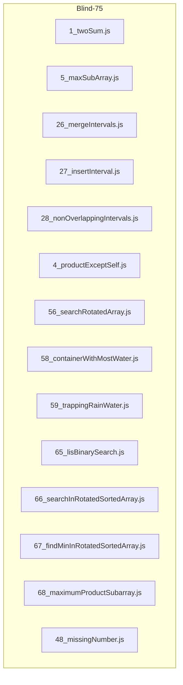

**Diagram sources**
- [1_twoSum.js](file://Blind-75/1_twoSum.js#L1-L54)
- [5_maxSubArray.js](file://Blind-75/5_maxSubArray.js#L1-L59)
- [26_mergeIntervals.js](file://Blind-75/26_mergeIntervals.js#L1-L79)
- [27_insertInterval.js](file://Blind-75/27_insertInterval.js#L1-L73)
- [28_nonOverlappingIntervals.js](file://Blind-75/28_nonOverlappingIntervals.js#L1-L74)
- [4_productExceptSelf.js](file://Blind-75/4_productExceptSelf.js#L1-L63)
- [56_searchRotatedArray.js](file://Blind-75/56_searchRotatedArray.js#L1-L78)
- [58_containerWithMostWater.js](file://Blind-75/58_containerWithMostWater.js#L1-L70)
- [59_trappingRainWater.js](file://Blind-75/59_trappingRainWater.js#L1-L76)
- [65_lisBinarySearch.js](file://Blind-75/65_lisBinarySearch.js#L1-L66)
- [66_searchInRotatedSortedArray.js](file://Blind-75/66_searchInRotatedSortedArray.js#L1-L62)
- [67_findMinInRotatedSortedArray.js](file://Blind-75/67_findMinInRotatedSortedArray.js#L1-L51)
- [68_maximumProductSubarray.js](file://Blind-75/68_maximumProductSubarray.js#L1-L71)
- [48_missingNumber.js](file://Blind-75/48_missingNumber.js#L1-L57)

**Section sources**
- [1_twoSum.js](file://Blind-75/1_twoSum.js#L1-L54)
- [5_maxSubArray.js](file://Blind-75/5_maxSubArray.js#L1-L59)
- [26_mergeIntervals.js](file://Blind-75/26_mergeIntervals.js#L1-L79)
- [27_insertInterval.js](file://Blind-75/27_insertInterval.js#L1-L73)
- [28_nonOverlappingIntervals.js](file://Blind-75/28_nonOverlappingIntervals.js#L1-L74)
- [4_productExceptSelf.js](file://Blind-75/4_productExceptSelf.js#L1-L63)
- [56_searchRotatedArray.js](file://Blind-75/56_searchRotatedArray.js#L1-L78)
- [58_containerWithMostWater.js](file://Blind-75/58_containerWithMostWater.js#L1-L70)
- [59_trappingRainWater.js](file://Blind-75/59_trappingRainWater.js#L1-L76)
- [65_lisBinarySearch.js](file://Blind-75/65_lisBinarySearch.js#L1-L66)
- [66_searchInRotatedSortedArray.js](file://Blind-75/66_searchInRotatedSortedArray.js#L1-L62)
- [67_findMinInRotatedSortedArray.js](file://Blind-75/67_findMinInRotatedSortedArray.js#L1-L51)
- [68_maximumProductSubarray.js](file://Blind-75/68_maximumProductSubarray.js#L1-L71)
- [48_missingNumber.js](file://Blind-75/48_missingNumber.js#L1-L57)

## Core Components
- Two Sum (hash map complement search): O(n) time, O(n) space; single pass with map lookups.
- Maximum Subarray (Kadane’s): O(n) time, O(1) space; dynamic programming rolling sum.
- Maximum Product Subarray: O(n) time, O(1) space; track both max and min to handle negatives.
- Merge Intervals: O(n log n) time, O(n) space; sort by start then linear merge.
- Insert Interval: O(n) time, O(n) space; three-phase scan over existing sorted intervals.
- Non-overlapping Intervals (greedy): O(n log n) time, O(1) space; sort by end and greedily keep earliest-ending.
- Product of Array Except Self: O(n) time, O(1) extra space; prefix then suffix pass.
- Search in Rotated Sorted Array: O(log n) time, O(1) space; modified binary search.
- Container With Most Water: O(n) time, O(1) space; two pointers moving the shorter line.
- Trapping Rain Water: O(n) time, O(1) space; two pointers with left/right max tracking.
- LIS (O(n log n)): O(n log n) time, O(n) space; patience-sorting tails with binary search.
- Missing Number (XOR): O(n) time, O(1) space; XOR indices and values with n.

**Section sources**
- [1_twoSum.js](file://Blind-75/1_twoSum.js#L23-L29)
- [5_maxSubArray.js](file://Blind-75/5_maxSubArray.js#L29-L34)
- [68_maximumProductSubarray.js](file://Blind-75/68_maximumProductSubarray.js#L36-L41)
- [26_mergeIntervals.js](file://Blind-75/26_mergeIntervals.js#L35-L43)
- [27_insertInterval.js](file://Blind-75/27_insertInterval.js#L32-L38)
- [28_nonOverlappingIntervals.js](file://Blind-75/28_nonOverlappingIntervals.js#L37-L44)
- [4_productExceptSelf.js](file://Blind-75/4_productExceptSelf.js#L29-L35)
- [56_searchRotatedArray.js](file://Blind-75/56_searchRotatedArray.js#L32-L37)
- [58_containerWithMostWater.js](file://Blind-75/58_containerWithMostWater.js#L33-L38)
- [59_trappingRainWater.js](file://Blind-75/59_trappingRainWater.js#L37-L42)
- [65_lisBinarySearch.js](file://Blind-75/65_lisBinarySearch.js#L36-L41)
- [48_missingNumber.js](file://Blind-75/48_missingNumber.js#L33-L38)

## Architecture Overview
The solutions are self-contained modules with clear separation of concerns:
- Input validation and edge-case handling
- Algorithm-specific loops and conditionals
- Result construction and return

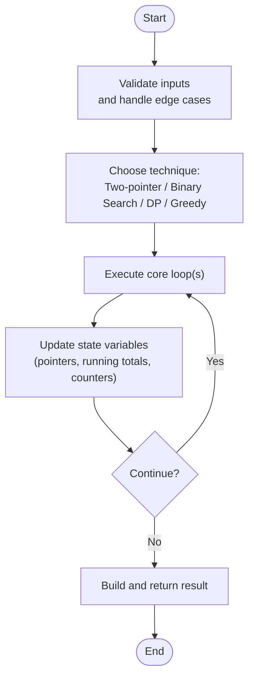

[No sources needed since this diagram shows conceptual workflow, not actual code structure]

## Detailed Component Analysis

### Two Sum (Hash Map Complement Search)
- Technique: One-pass hash map storing value-to-index mapping; for each element, check if complement exists.
- Complexity: O(n) time, O(n) space.
- Edge cases: Unique indices, no duplicate answers, empty array handled implicitly by loop bounds.

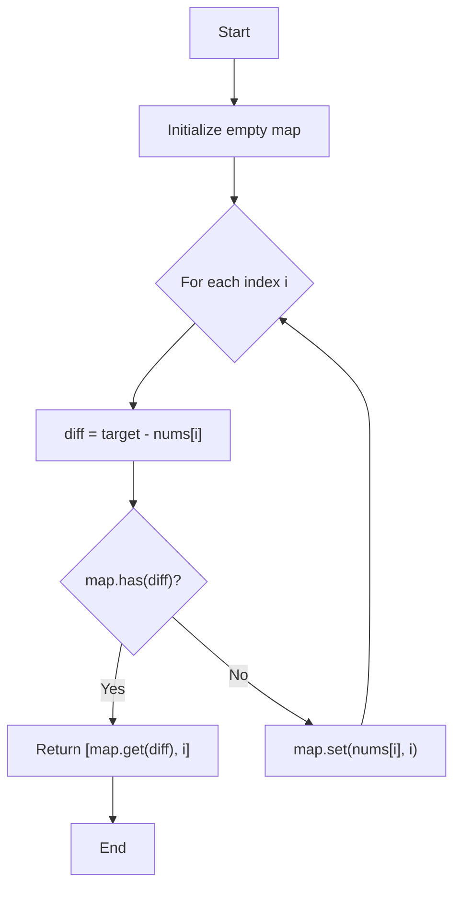

**Diagram sources**
- [1_twoSum.js](file://Blind-75/1_twoSum.js#L32-L49)

**Section sources**
- [1_twoSum.js](file://Blind-75/1_twoSum.js#L1-L54)

### Maximum Subarray (Kadane’s Algorithm)
- Technique: At each index, decide whether to extend the current subarray or start fresh; track global maximum.
- Complexity: O(n) time, O(1) space.
- Edge cases: All-negative arrays, single element.

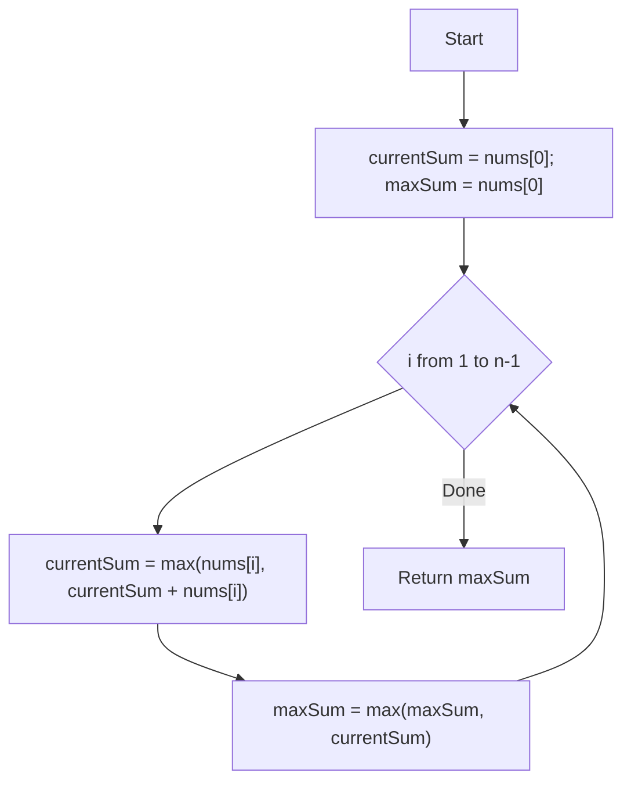

**Diagram sources**
- [5_maxSubArray.js](file://Blind-75/5_maxSubArray.js#L37-L55)

**Section sources**
- [5_maxSubArray.js](file://Blind-75/5_maxSubArray.js#L1-L59)

### Maximum Product Subarray
- Technique: Track both current max and min (to handle negatives); swap roles when encountering negative numbers.
- Complexity: O(n) time, O(1) space.
- Edge cases: Zeros, all positives/negatives.

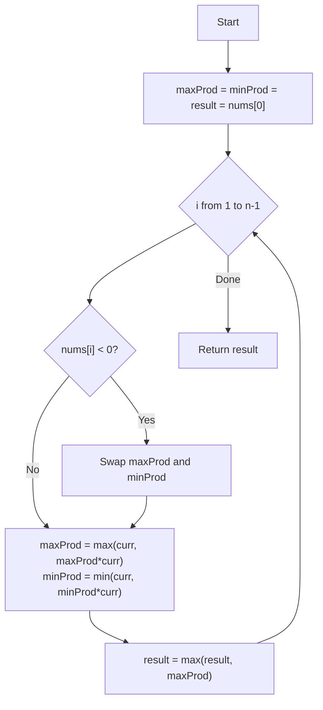

**Diagram sources**
- [68_maximumProductSubarray.js](file://Blind-75/68_maximumProductSubarray.js#L44-L67)

**Section sources**
- [68_maximumProductSubarray.js](file://Blind-75/68_maximumProductSubarray.js#L1-L71)

### Merge Intervals
- Technique: Sort by start time, then linearly merge overlapping intervals.
- Complexity: O(n log n) time, O(n) space.
- Edge cases: Empty input, already sorted, no overlaps.

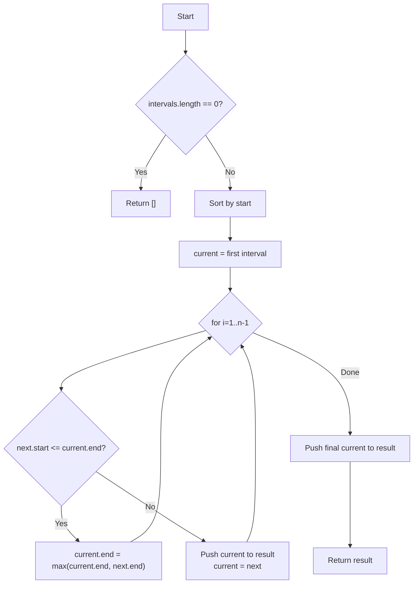

**Diagram sources**
- [26_mergeIntervals.js](file://Blind-75/26_mergeIntervals.js#L46-L74)

**Section sources**
- [26_mergeIntervals.js](file://Blind-75/26_mergeIntervals.js#L1-L79)

### Insert Interval
- Technique: Three-phase scan—add non-overlapping before, merge overlaps, add remainder.
- Complexity: O(n) time, O(n) space.
- Edge cases: New interval before/after all, fully engulfing others.

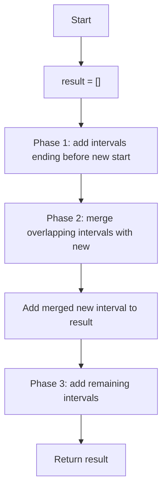

**Diagram sources**
- [27_insertInterval.js](file://Blind-75/27_insertInterval.js#L41-L68)

**Section sources**
- [27_insertInterval.js](file://Blind-75/27_insertInterval.js#L1-L73)

### Non-overlapping Intervals (Greedy by End Time)
- Technique: Sort by end time; keep the interval that ends earliest among overlaps.
- Complexity: O(n log n) time, O(1) space.
- Edge cases: Empty input, single interval.

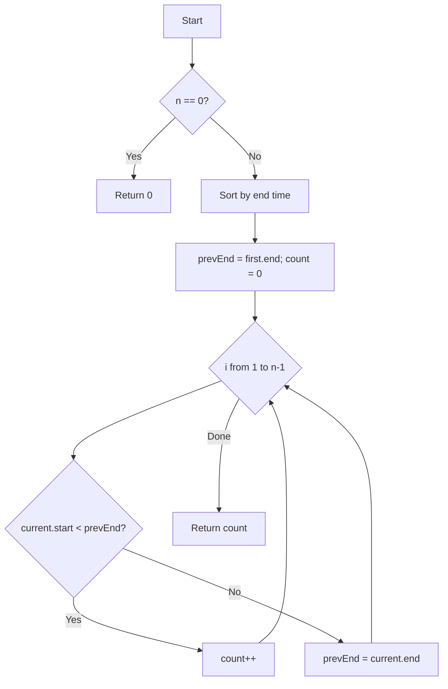

**Diagram sources**
- [28_nonOverlappingIntervals.js](file://Blind-75/28_nonOverlappingIntervals.js#L47-L69)

**Section sources**
- [28_nonOverlappingIntervals.js](file://Blind-75/28_nonOverlappingIntervals.js#L1-L74)

### Product of Array Except Self (Prefix/Suffix)
- Technique: Two passes—prefix products then multiply by suffix products.
- Complexity: O(n) time, O(1) extra space (excluding output).
- Edge cases: Zeros handled naturally by multiplicative identity.

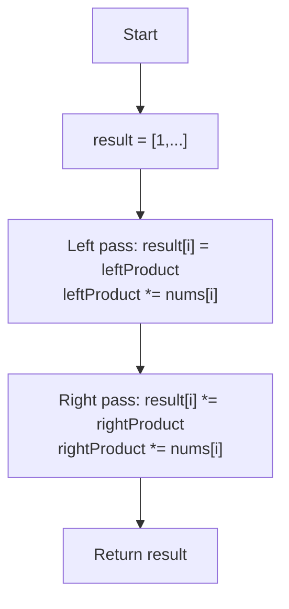

**Diagram sources**
- [4_productExceptSelf.js](file://Blind-75/4_productExceptSelf.js#L38-L59)

**Section sources**
- [4_productExceptSelf.js](file://Blind-75/4_productExceptSelf.js#L1-L63)

### Search in Rotated Sorted Array (Modified Binary Search)
- Technique: Determine which half is sorted, check if target lies in that half.
- Complexity: O(log n) time, O(1) space.
- Edge cases: Duplicates (see note), target not present.

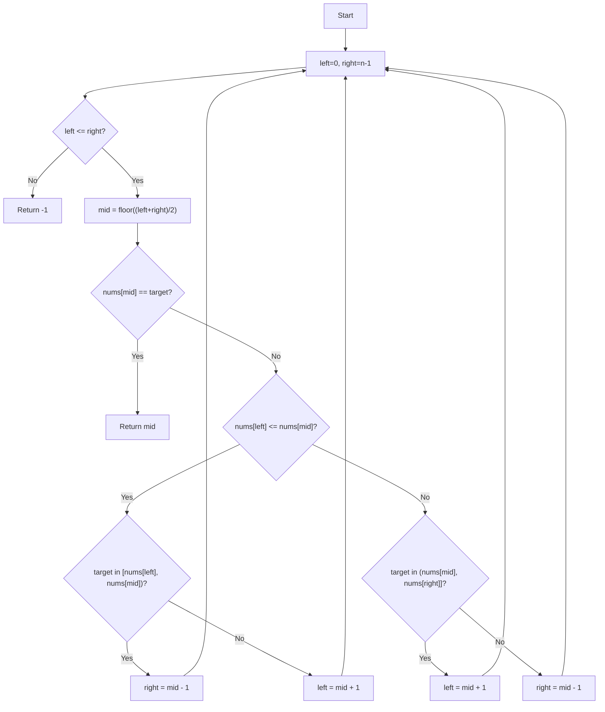

**Diagram sources**
- [56_searchRotatedArray.js](file://Blind-75/56_searchRotatedArray.js#L42-L74)
- [66_searchInRotatedSortedArray.js](file://Blind-75/66_searchInRotatedSortedArray.js#L27-L58)

**Section sources**
- [56_searchRotatedArray.js](file://Blind-75/56_searchRotatedArray.js#L1-L78)
- [66_searchInRotatedSortedArray.js](file://Blind-75/66_searchInRotatedSortedArray.js#L1-L62)

### Container With Most Water (Two Pointers)
- Technique: Start with widest container; move the pointer with smaller height.
- Complexity: O(n) time, O(1) space.
- Edge cases: Multiple equal heights, extreme disparities.

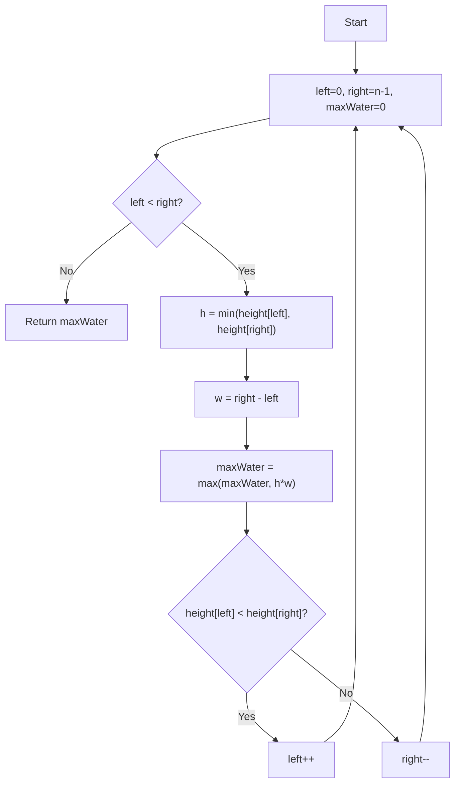

**Diagram sources**
- [58_containerWithMostWater.js](file://Blind-75/58_containerWithMostWater.js#L41-L66)

**Section sources**
- [58_containerWithMostWater.js](file://Blind-75/58_containerWithMostWater.js#L1-L70)

### Trapping Rain Water (Two Pointers with Max Tracking)
- Technique: Use left/right pointers and track leftMax/rightMax; process the side with smaller max.
- Complexity: O(n) time, O(1) space.
- Edge cases: Plateau regions, zeros at boundaries.

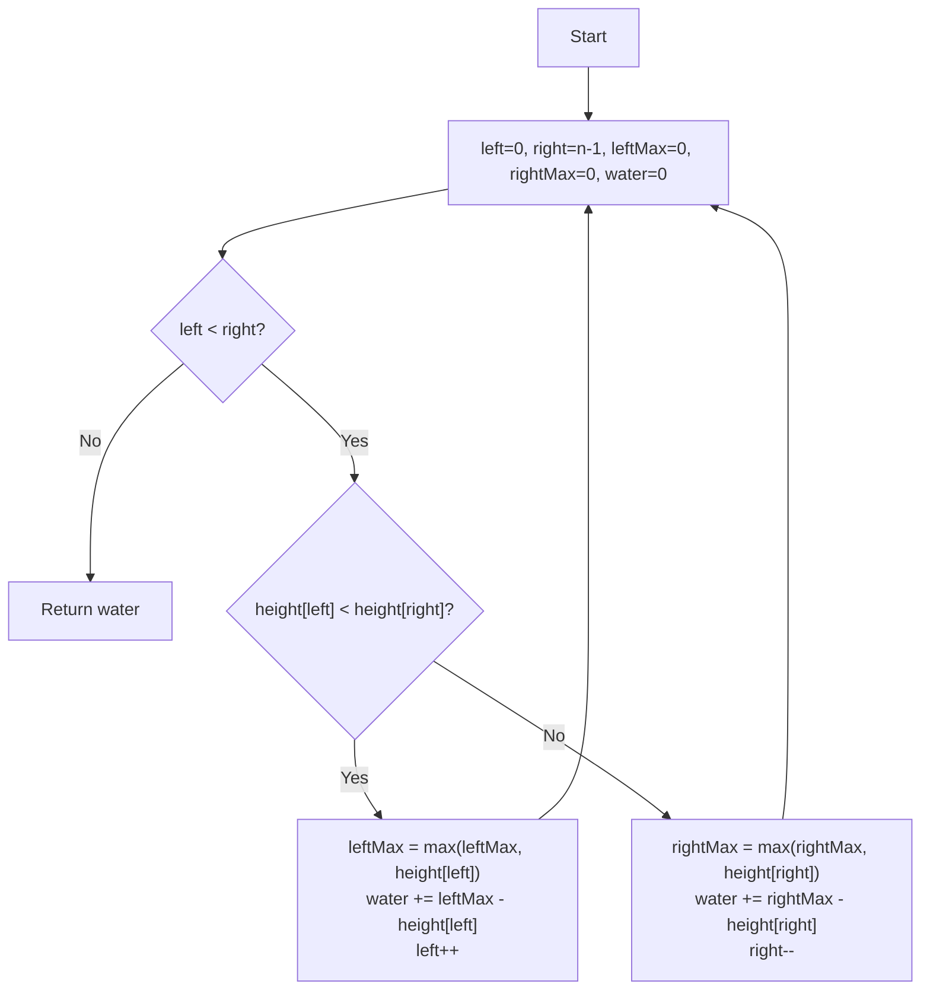

**Diagram sources**
- [59_trappingRainWater.js](file://Blind-75/59_trappingRainWater.js#L45-L72)

**Section sources**
- [59_trappingRainWater.js](file://Blind-75/59_trappingRainWater.js#L1-L76)

### Longest Increasing Subsequence (O(n log n))
- Technique: Maintain tails where tails[i] is the smallest ending element of all increasing subsequences of length i+1; binary search insertion point.
- Complexity: O(n log n) time, O(n) space.
- Edge cases: Duplicates (strictly increasing), empty array.

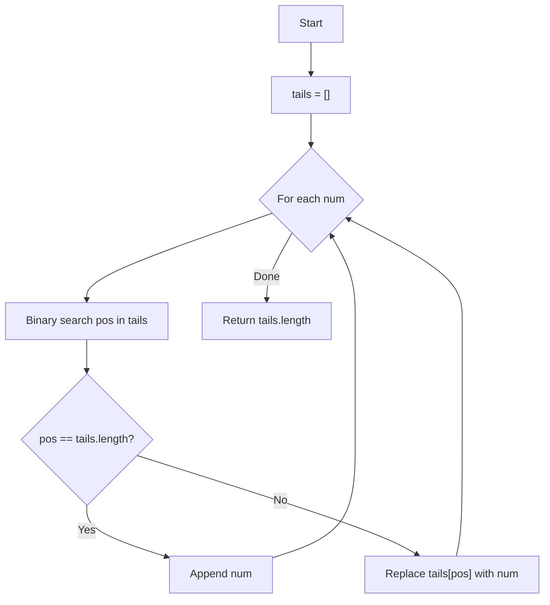

**Diagram sources**
- [65_lisBinarySearch.js](file://Blind-75/65_lisBinarySearch.js#L44-L62)

**Section sources**
- [65_lisBinarySearch.js](file://Blind-75/65_lisBinarySearch.js#L1-L66)

### Find Minimum in Rotated Sorted Array
- Technique: Binary search comparing mid with right; converge to rotation pivot.
- Complexity: O(log n) time, O(1) space.
- Edge cases: No rotation, duplicates.

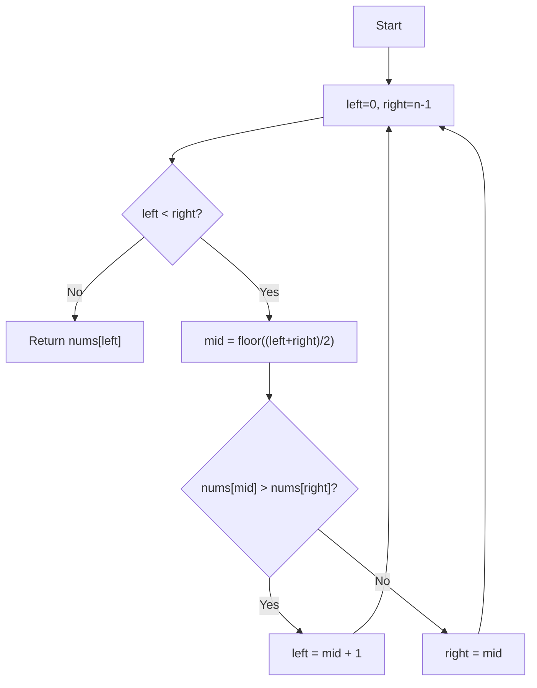

**Diagram sources**
- [67_findMinInRotatedSortedArray.js](file://Blind-75/67_findMinInRotatedSortedArray.js#L27-L47)

**Section sources**
- [67_findMinInRotatedSortedArray.js](file://Blind-75/67_findMinInRotatedSortedArray.js#L1-L51)

### Missing Number (XOR Bit Manipulation)
- Technique: XOR all indices 0..n-1 with all values; XOR with n to isolate missing number.
- Complexity: O(n) time, O(1) space.
- Edge cases: Missing 0 or n.

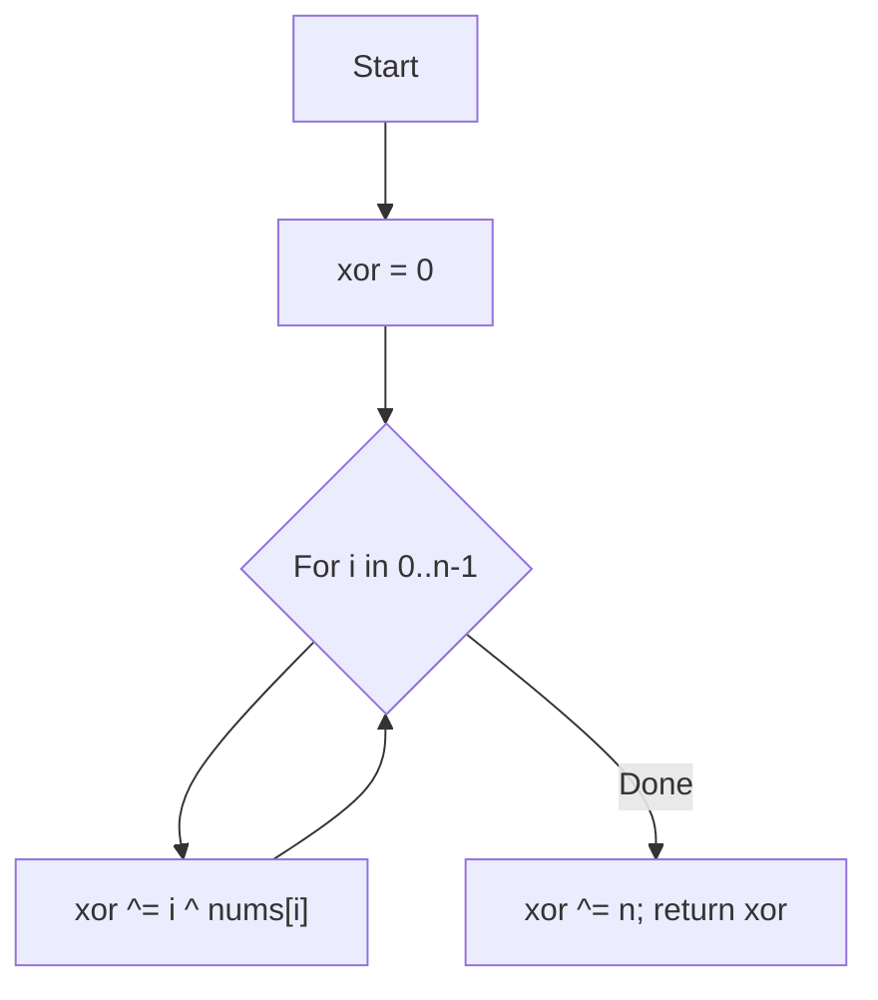

**Diagram sources**
- [48_missingNumber.js](file://Blind-75/48_missingNumber.js#L41-L53)

**Section sources**
- [48_missingNumber.js](file://Blind-75/48_missingNumber.js#L1-L57)

## Dependency Analysis
These array problems are largely independent modules. Some share common patterns:
- Two-pointer techniques appear in container water and trapping rain water.
- Binary search appears in rotated array search and LIS.
- Dynamic programming appears in max subarray and max product subarray.
- Greedy appears in merge and non-overlapping intervals.

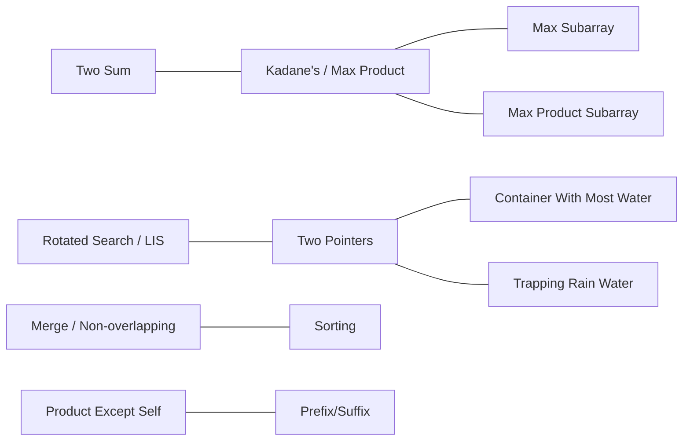

[No sources needed since this diagram shows conceptual relationships, not direct code imports]

## Performance Considerations
- Prefer O(n) or O(n log n) solutions for large datasets; avoid O(n^2) nested loops.
- Use constant extra space when possible (e.g., two pointers, rolling variables).
- For binary search variants, ensure loop invariants and boundary updates prevent infinite loops.
- For prefix/suffix techniques, process arrays in-order and reverse-order to avoid redundant scans.
- Handle duplicates carefully in rotated array searches to maintain O(log n) behavior.

[No sources needed since this section provides general guidance]

## Troubleshooting Guide
Common pitfalls and remedies:
- Off-by-one errors in two-pointer loops; ensure loop conditions like left < right or left <= right match intent.
- Not resetting or updating running variables (e.g., currentSum, leftMax, rightMax) correctly.
- Mis-handling edge cases: empty arrays, single-element arrays, all-negative arrays, duplicates in rotated arrays.
- Incorrect merge conditions for intervals; verify overlap checks and endpoint updates.
- For LIS with binary search, ensure correct insertion point and replacement strategy.

**Section sources**
- [58_containerWithMostWater.js](file://Blind-75/58_containerWithMostWater.js#L47-L63)
- [59_trappingRainWater.js](file://Blind-75/59_trappingRainWater.js#L54-L69)
- [26_mergeIntervals.js](file://Blind-75/26_mergeIntervals.js#L61-L67)
- [28_nonOverlappingIntervals.js](file://Blind-75/28_nonOverlappingIntervals.js#L60-L65)
- [56_searchRotatedArray.js](file://Blind-75/56_searchRotatedArray.js#L47-L70)
- [65_lisBinarySearch.js](file://Blind-75/65_lisBinarySearch.js#L51-L55)

## Conclusion
The Blind-75 array problems demonstrate powerful, reusable patterns:
- Two-pointer techniques for linear-time traversals
- Binary search adaptations for sorted/rotated contexts
- Dynamic programming for optimal substructure (max subarray/product)
- Greedy strategies for interval scheduling
- Prefix/suffix computations for constraint-based products
- Bit manipulation for in-place uniqueness problems

Adopting these patterns systematically improves correctness, readability, and performance across diverse array challenges.