# Blind-75 Interview Collection

<cite>
**Referenced Files in This Document**
- [1_twoSum.js](file://Blind-75/1_twoSum.js)
- [3_containsDuplicate.js](file://Blind-75/3_containsDuplicate.js)
- [5_maxSubArray.js](file://Blind-75/5_maxSubArray.js)
- [6_longestSubstring.js](file://Blind-75/6_longestSubstring.js)
- [8_characterReplacement.js](file://Blind-75/8_characterReplacement.js)
- [11_reverseLinkedList.js](file://Blind-75/11_reverseLinkedList.js)
- [16_maxDepth.js](file://Blind-75/16_maxDepth.js)
- [18_invertBinaryTree.js](file://Blind-75/18_invertBinaryTree.js)
- [21_combinationSum.js](file://Blind-75/21_combinationSum.js)
- [23_permutations.js](file://Blind-75/23_permutations.js)
- [36_numberOfIslands.js](file://Blind-75/36_numberOfIslands.js)
- [41_climbingStairs.js](file://Blind-75/41_climbingStairs.js)
- [45_longestIncreasingSubsequence.js](file://Blind-75/45_longestIncreasingSubsequence.js)
- [51_validParentheses.js](file://Blind-75/51_validParentheses.js)
- [58_containerWithMostWater.js](file://Blind-75/58_containerWithMostWater.js)
</cite>

## Table of Contents
1. [Introduction](#introduction)
2. [Project Structure](#project-structure)
3. [Core Components](#core-components)
4. [Architecture Overview](#architecture-overview)
5. [Detailed Component Analysis](#detailed-component-analysis)
6. [Dependency Analysis](#dependency-analysis)
7. [Performance Considerations](#performance-considerations)
8. [Troubleshooting Guide](#troubleshooting-guide)
9. [Conclusion](#conclusion)
10. [Appendices](#appendices)

## Introduction
The Blind-75 Interview Collection is a focused, interview-driven learning resource featuring 75+ algorithm problems spanning arrays, linked lists, trees, graphs, dynamic programming, backtracking, and strings. Each problem is accompanied by Hinglish-style explanations, multiple solution approaches, and detailed complexity analyses. The collection emphasizes progressive difficulty, pattern recognition (such as two-pointer, sliding window, and divide-and-conquer), and practical interview strategies. Learners can use this repository to build intuition, practice problem-solving under time pressure, and develop optimal solution strategies aligned with real-world coding interviews.

## Project Structure
The repository organizes problems by category and number, with each problem in its own JavaScript file. The Blind-75 directory contains standalone solutions with explanatory comments and tests. The structure supports self-paced learning and quick navigation to specific topics.

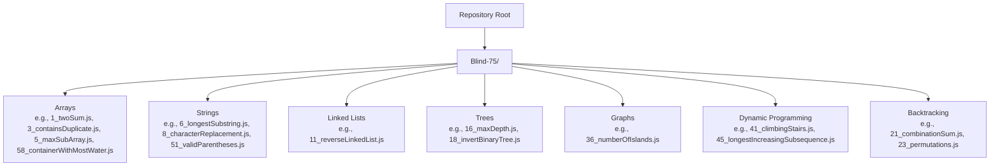

**Section sources**
- [1_twoSum.js](file://Blind-75/1_twoSum.js#L1-L54)
- [3_containsDuplicate.js](file://Blind-75/3_containsDuplicate.js#L1-L53)
- [5_maxSubArray.js](file://Blind-75/5_maxSubArray.js#L1-L59)
- [6_longestSubstring.js](file://Blind-75/6_longestSubstring.js#L1-L74)
- [8_characterReplacement.js](file://Blind-75/8_characterReplacement.js#L1-L71)
- [11_reverseLinkedList.js](file://Blind-75/11_reverseLinkedList.js#L1-L71)
- [16_maxDepth.js](file://Blind-75/16_maxDepth.js#L1-L64)
- [18_invertBinaryTree.js](file://Blind-75/18_invertBinaryTree.js#L1-L56)
- [21_combinationSum.js](file://Blind-75/21_combinationSum.js#L1-L79)
- [23_permutations.js](file://Blind-75/23_permutations.js#L1-L76)
- [36_numberOfIslands.js](file://Blind-75/36_numberOfIslands.js#L1-L97)
- [41_climbingStairs.js](file://Blind-75/41_climbingStairs.js#L1-L67)
- [45_longestIncreasingSubsequence.js](file://Blind-75/45_longestIncreasingSubsequence.js#L1-L66)
- [51_validParentheses.js](file://Blind-75/51_validParentheses.js#L1-L81)
- [58_containerWithMostWater.js](file://Blind-75/58_containerWithMostWater.js#L1-L70)

## Core Components
- Arrays: Two-sum, maximum subarray (Kadane’s), container with most water, product except self variants.
- Strings: Longest substring without repeating characters, character replacement, valid parentheses.
- Linked Lists: Reverse linked list using iterative three-pointer technique.
- Trees: Maximum depth via DFS, invert binary tree via recursive swap.
- Graphs: Number of islands using DFS to sink connected components.
- Dynamic Programming: Climbing stairs (Fibonacci-like recurrence), longest increasing subsequence (O(n^2) DP).
- Backtracking: Combination sum and permutations with pruning and recursion.

Pedagogical approach:
- Each solution includes a problem statement, approach rationale, step-by-step logic, and complexity analysis.
- Explanations use Hinglish terminology for clarity and accessibility.
- Tests demonstrate expected outputs and encourage verification.

**Section sources**
- [1_twoSum.js](file://Blind-75/1_twoSum.js#L1-L54)
- [3_containsDuplicate.js](file://Blind-75/3_containsDuplicate.js#L1-L53)
- [5_maxSubArray.js](file://Blind-75/5_maxSubArray.js#L1-L59)
- [6_longestSubstring.js](file://Blind-75/6_longestSubstring.js#L1-L74)
- [8_characterReplacement.js](file://Blind-75/8_characterReplacement.js#L1-L71)
- [11_reverseLinkedList.js](file://Blind-75/11_reverseLinkedList.js#L1-L71)
- [16_maxDepth.js](file://Blind-75/16_maxDepth.js#L1-L64)
- [18_invertBinaryTree.js](file://Blind-75/18_invertBinaryTree.js#L1-L56)
- [21_combinationSum.js](file://Blind-75/21_combinationSum.js#L1-L79)
- [23_permutations.js](file://Blind-75/23_permutations.js#L1-L76)
- [36_numberOfIslands.js](file://Blind-75/36_numberOfIslands.js#L1-L97)
- [41_climbingStairs.js](file://Blind-75/41_climbingStairs.js#L1-L67)
- [45_longestIncreasingSubsequence.js](file://Blind-75/45_longestIncreasingSubsequence.js#L1-L66)
- [51_validParentheses.js](file://Blind-75/51_validParentheses.js#L1-L81)
- [58_containerWithMostWater.js](file://Blind-75/58_containerWithMostWater.js#L1-L70)

## Architecture Overview
The collection follows a flat, problem-per-file architecture with consistent documentation and testing patterns. Each file encapsulates:
- Problem statement and approach
- Implementation logic
- Complexity analysis
- Example test invocation

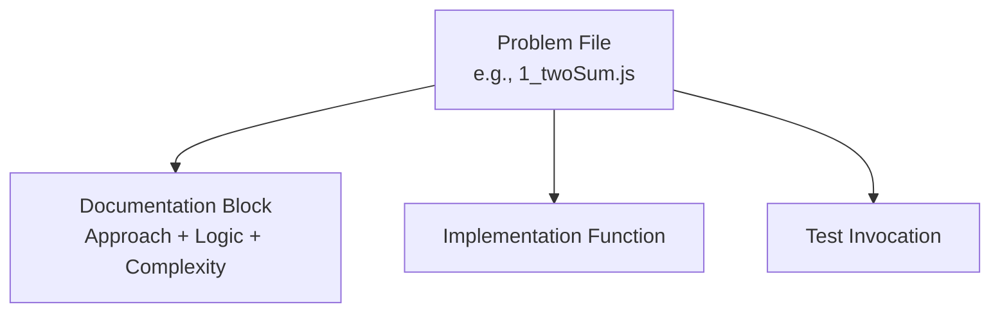

**Diagram sources**
- [1_twoSum.js](file://Blind-75/1_twoSum.js#L1-L54)

**Section sources**
- [1_twoSum.js](file://Blind-75/1_twoSum.js#L1-L54)
- [3_containsDuplicate.js](file://Blind-75/3_containsDuplicate.js#L1-L53)
- [5_maxSubArray.js](file://Blind-75/5_maxSubArray.js#L1-L59)
- [6_longestSubstring.js](file://Blind-75/6_longestSubstring.js#L1-L74)
- [8_characterReplacement.js](file://Blind-75/8_characterReplacement.js#L1-L71)
- [11_reverseLinkedList.js](file://Blind-75/11_reverseLinkedList.js#L1-L71)
- [16_maxDepth.js](file://Blind-75/16_maxDepth.js#L1-L64)
- [18_invertBinaryTree.js](file://Blind-75/18_invertBinaryTree.js#L1-L56)
- [21_combinationSum.js](file://Blind-75/21_combinationSum.js#L1-L79)
- [23_permutations.js](file://Blind-75/23_permutations.js#L1-L76)
- [36_numberOfIslands.js](file://Blind-75/36_numberOfIslands.js#L1-L97)
- [41_climbingStairs.js](file://Blind-75/41_climbingStairs.js#L1-L67)
- [45_longestIncreasingSubsequence.js](file://Blind-75/45_longestIncreasingSubsequence.js#L1-L66)
- [51_validParentheses.js](file://Blind-75/51_validParentheses.js#L1-L81)
- [58_containerWithMostWater.js](file://Blind-75/58_containerWithMostWater.js#L1-L70)

## Detailed Component Analysis

### Arrays: Two Sum
- Approach: Hash map (one-pass) to store complements and indices.
- Logic: Iterate once; for each element, compute complement and check map.
- Complexity: Time O(n), Space O(n).
- Pedagogy: Highlights trade-off between time and space; single-pass optimal solution.

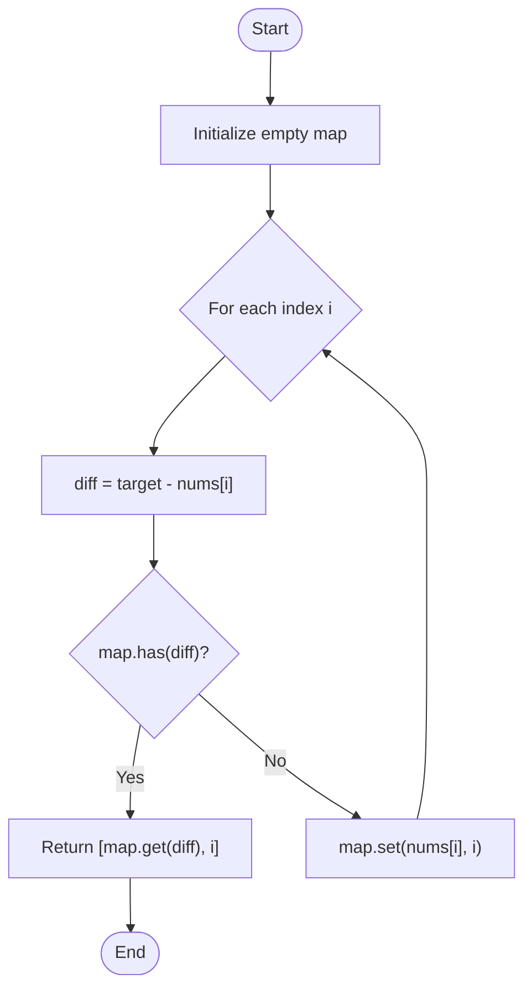

**Diagram sources**
- [1_twoSum.js](file://Blind-75/1_twoSum.js#L32-L50)

**Section sources**
- [1_twoSum.js](file://Blind-75/1_twoSum.js#L1-L54)

### Arrays: Maximum Subarray (Kadane’s Algorithm)
- Approach: Dynamic programming with rolling max.
- Logic: At each index, decide whether to extend or restart the subarray.
- Complexity: Time O(n), Space O(1).
- Pedagogy: Demonstrates local-to-global optimization and negative-prefix pruning.

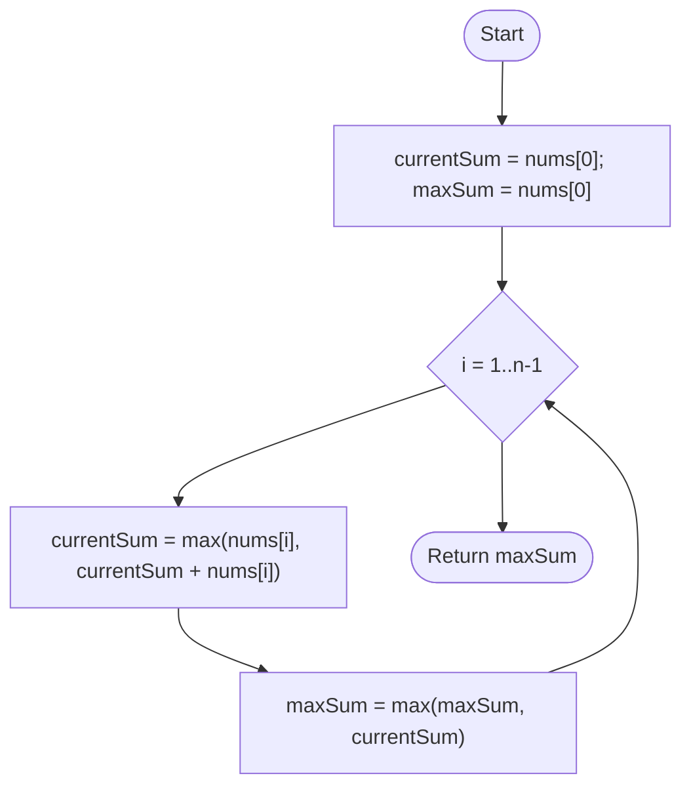

**Diagram sources**
- [5_maxSubArray.js](file://Blind-75/5_maxSubArray.js#L37-L55)

**Section sources**
- [5_maxSubArray.js](file://Blind-75/5_maxSubArray.js#L1-L59)

### Arrays: Container With Most Water (Two Pointers)
- Approach: Two pointers from extremes, move shorter side inward.
- Logic: Area = min(h[left], h[right]) * width; maximize area.
- Complexity: Time O(n), Space O(1).
- Pedagogy: Greedy two-pointer intuition and why moving the shorter pointer is optimal.

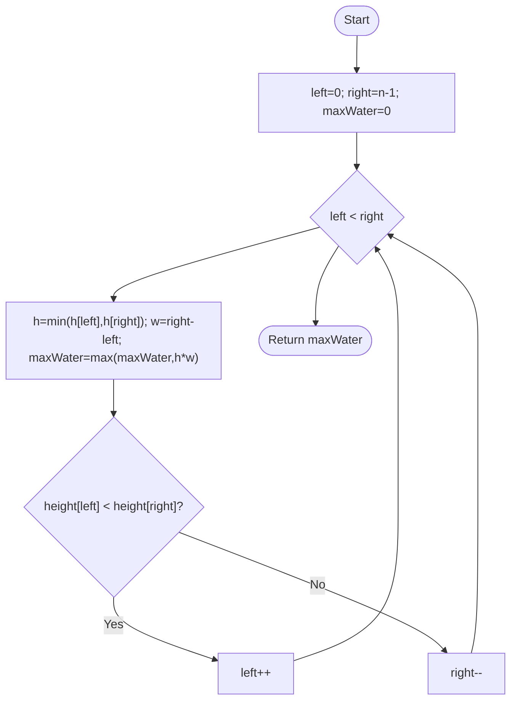

**Diagram sources**
- [58_containerWithMostWater.js](file://Blind-75/58_containerWithMostWater.js#L41-L66)

**Section sources**
- [58_containerWithMostWater.js](file://Blind-75/58_containerWithMostWater.js#L1-L70)

### Strings: Longest Substring Without Repeating Characters (Sliding Window)
- Approach: Sliding window with a set to maintain uniqueness.
- Logic: Expand right; if duplicate, shrink from left until unique.
- Complexity: Time O(n), Space O(min(m,n)) where m is charset size.
- Pedagogy: Window maintenance and duplicate detection strategy.

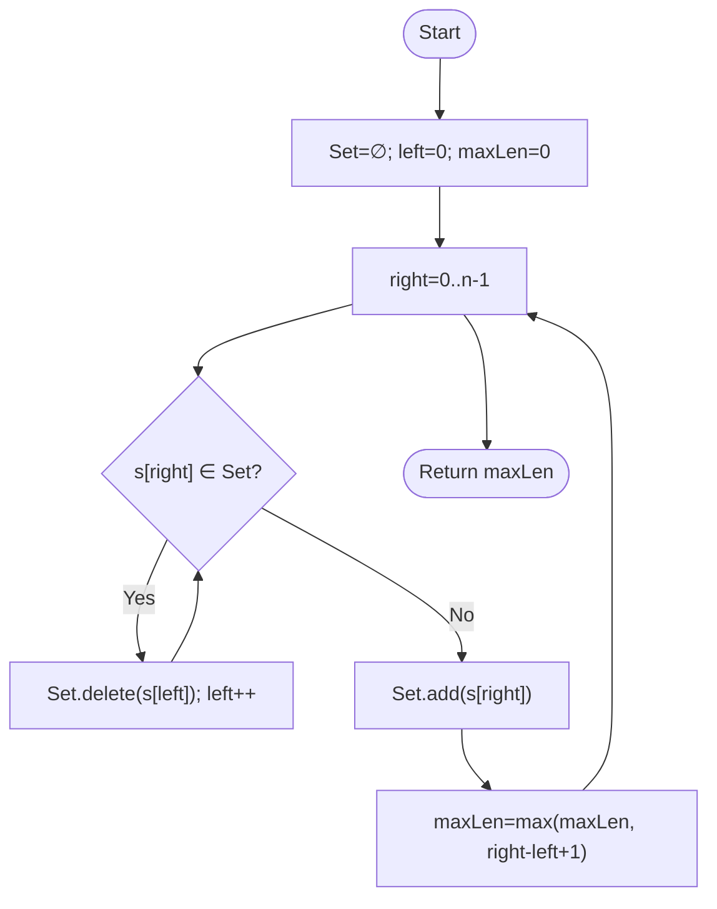

**Diagram sources**
- [6_longestSubstring.js](file://Blind-75/6_longestSubstring.js#L42-L70)

**Section sources**
- [6_longestSubstring.js](file://Blind-75/6_longestSubstring.js#L1-L74)

### Strings: Character Replacement (Sliding Window with Frequency Map)
- Approach: Sliding window maintaining (window - max_freq) ≤ k.
- Logic: Track frequencies; shrink window when replacements exceed k.
- Complexity: Time O(n), Space O(1) (bounded alphabet).
- Pedagogy: Window validity condition and frequency-based pruning.

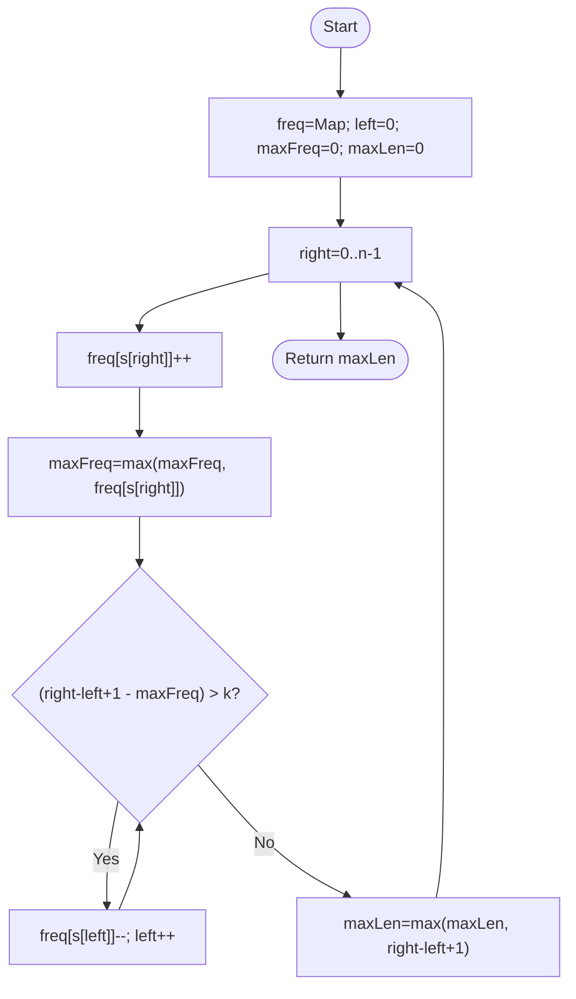

**Diagram sources**
- [8_characterReplacement.js](file://Blind-75/8_characterReplacement.js#L41-L67)

**Section sources**
- [8_characterReplacement.js](file://Blind-75/8_characterReplacement.js#L1-L71)

### Strings: Valid Parentheses (Stack)
- Approach: Stack-based matching with a mapping of closing to opening brackets.
- Logic: Push opening; for closing, pop and compare; final stack must be empty.
- Complexity: Time O(n), Space O(n).
- Pedagogy: LIFO behavior and early termination on mismatch.

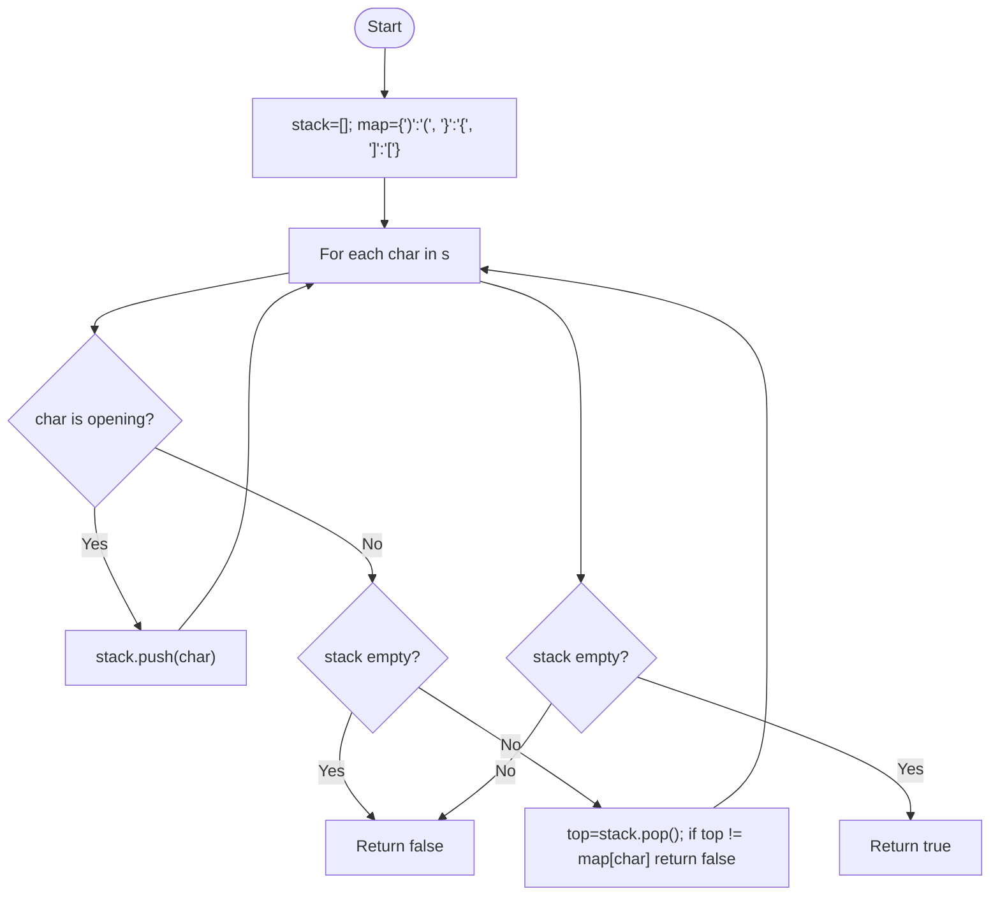

**Diagram sources**
- [51_validParentheses.js](file://Blind-75/51_validParentheses.js#L48-L76)

**Section sources**
- [51_validParentheses.js](file://Blind-75/51_validParentheses.js#L1-L81)

### Linked Lists: Reverse Linked List (Iterative Three-Pointer)
- Approach: Use prev, curr, nextTemp to reverse pointers iteratively.
- Logic: Store next, reverse curr.next, advance pointers.
- Complexity: Time O(n), Space O(1).
- Pedagogy: Pointer manipulation and iterative reversal technique.

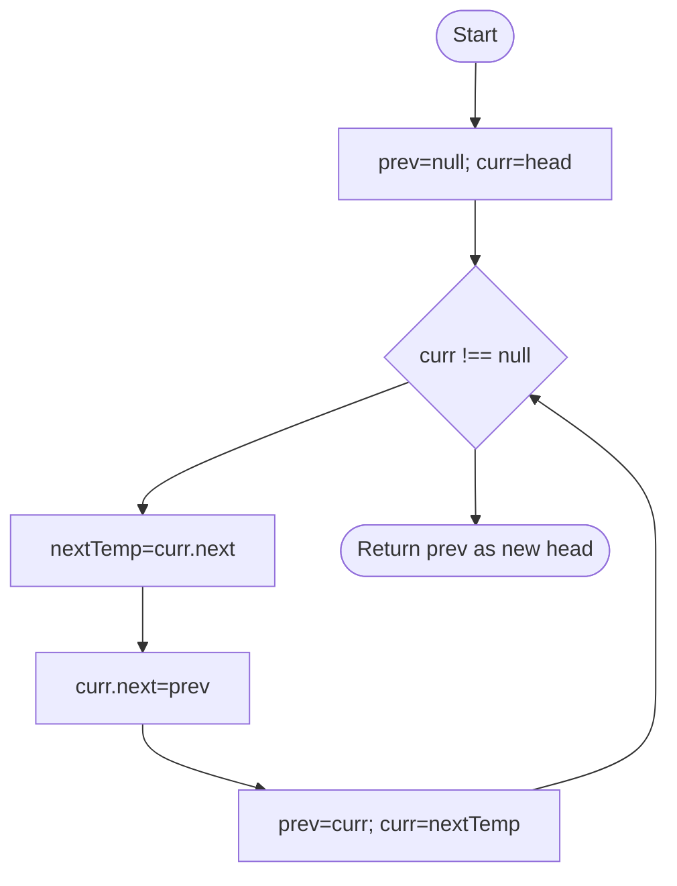

**Diagram sources**
- [11_reverseLinkedList.js](file://Blind-75/11_reverseLinkedList.js#L48-L70)

**Section sources**
- [11_reverseLinkedList.js](file://Blind-75/11_reverseLinkedList.js#L1-L71)

### Trees: Maximum Depth (Recursive DFS)
- Approach: Recursively compute depth as 1 + max(left, right).
- Logic: Base case null returns 0; propagate max depth upward.
- Complexity: Time O(n), Space O(h) recursion stack.
- Pedagogy: Inherent recursion in tree depth calculation.

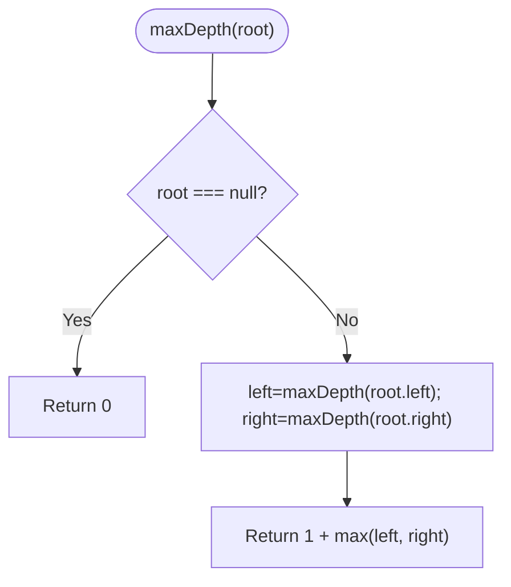

**Diagram sources**
- [16_maxDepth.js](file://Blind-75/16_maxDepth.js#L53-L63)

**Section sources**
- [16_maxDepth.js](file://Blind-75/16_maxDepth.js#L1-L64)

### Trees: Invert Binary Tree (Recursive DFS with Swap)
- Approach: Swap left and right children; recurse.
- Logic: Post-order or pre-order swap; both valid.
- Complexity: Time O(n), Space O(h).
- Pedagogy: Mirror transformation and recursive pattern.

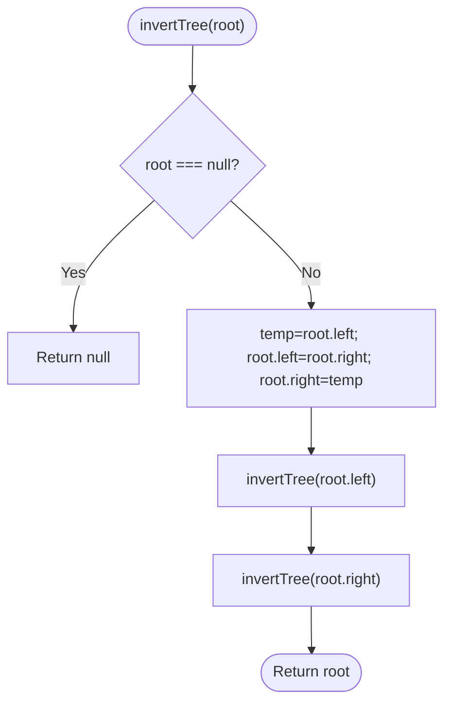

**Diagram sources**
- [18_invertBinaryTree.js](file://Blind-75/18_invertBinaryTree.js#L41-L55)

**Section sources**
- [18_invertBinaryTree.js](file://Blind-75/18_invertBinaryTree.js#L1-L56)

### Graphs: Number of Islands (DFS to Sink)
- Approach: Scan grid; on land, increment count and DFS sink neighbors.
- Logic: In-place modification reduces extra memory; boundary checks.
- Complexity: Time O(mn), Space O(mn) worst-case recursion.
- Pedagogy: Connected-component counting and DFS traversal.

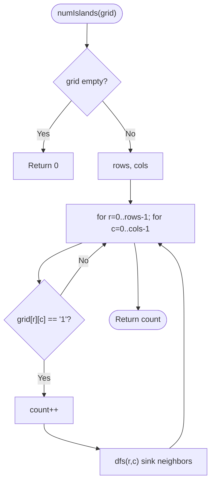

**Diagram sources**
- [36_numberOfIslands.js](file://Blind-75/36_numberOfIslands.js#L48-L86)

**Section sources**
- [36_numberOfIslands.js](file://Blind-75/36_numberOfIslands.js#L1-L97)

### Dynamic Programming: Climbing Stairs (Bottom-Up)
- Approach: Fibonacci-like recurrence; optimize space to O(1).
- Logic: ways(n) = ways(n-1) + ways(n-2).
- Complexity: Time O(n), Space O(1).
- Pedagogy: Recognizing recurrence relations and constant-space DP.

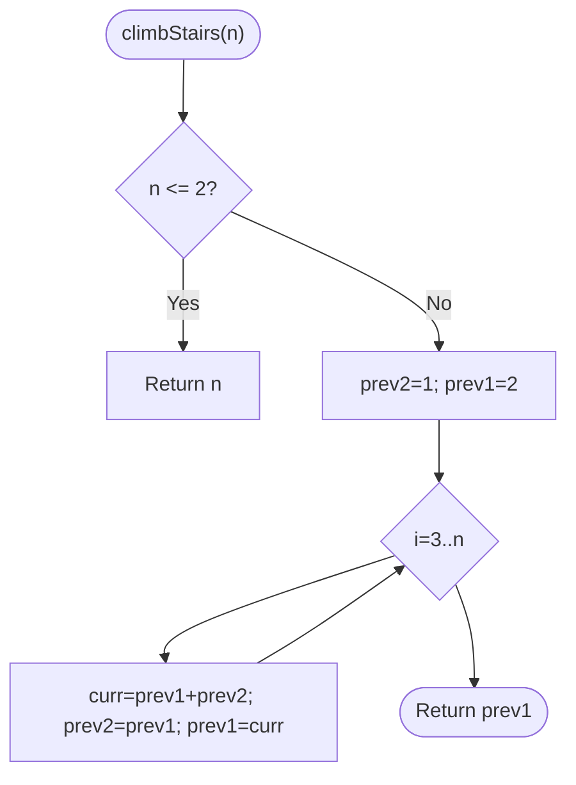

**Diagram sources**
- [41_climbingStairs.js](file://Blind-75/41_climbingStairs.js#L47-L63)

**Section sources**
- [41_climbingStairs.js](file://Blind-75/41_climbingStairs.js#L1-L67)

### Dynamic Programming: Longest Increasing Subsequence (DP O(n^2))
- Approach: dp[i] = max(dp[j] + 1) for j < i where nums[i] > nums[j].
- Logic: Build LIS ending at each index; track global maximum.
- Complexity: Time O(n^2), Space O(n).
- Pedagogy: Classic DP transition and nested-loop enumeration.

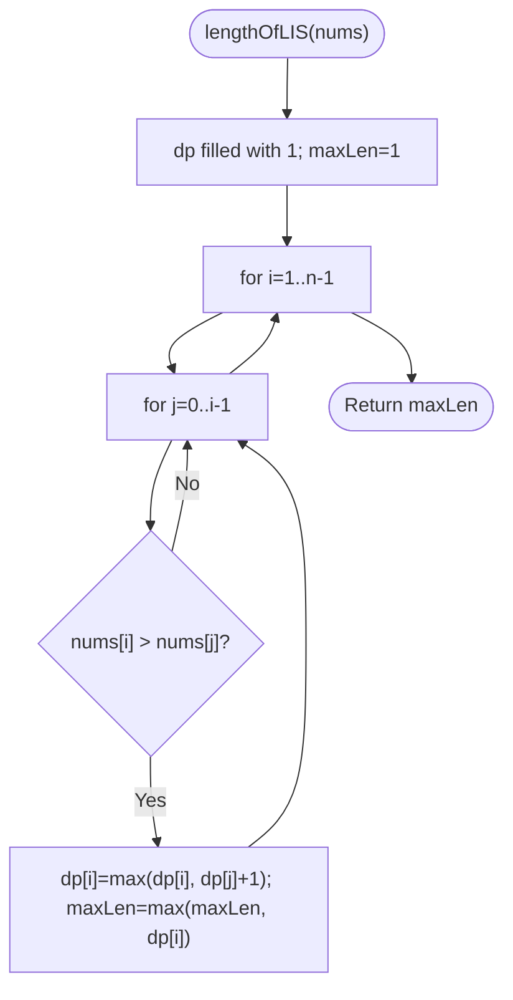

**Diagram sources**
- [45_longestIncreasingSubsequence.js](file://Blind-75/45_longestIncreasingSubsequence.js#L45-L62)

**Section sources**
- [45_longestIncreasingSubsequence.js](file://Blind-75/45_longestIncreasingSubsequence.js#L1-L66)

### Backtracking: Combination Sum
- Approach: Backtrack with start index to allow reuse; prune when sum exceeds target.
- Logic: Explore include/exclude decisions; backtrack by popping.
- Complexity: Time O(N^(T/M)), Space O(T/M).
- Pedagogy: Choice trees, pruning, and recursion depth analysis.

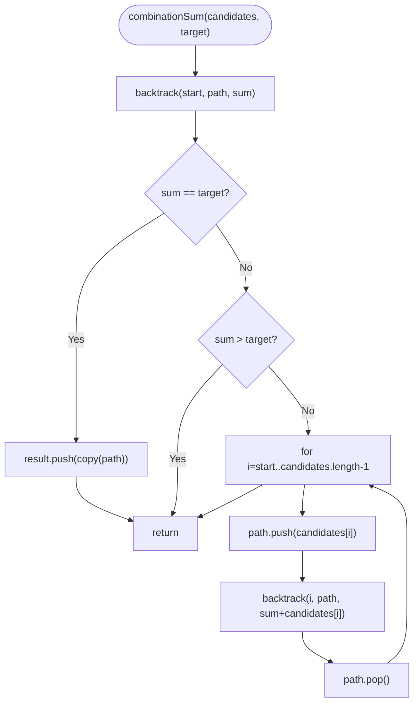

**Diagram sources**
- [21_combinationSum.js](file://Blind-75/21_combinationSum.js#L47-L75)

**Section sources**
- [21_combinationSum.js](file://Blind-75/21_combinationSum.js#L1-L79)

### Backtracking: Permutations
- Approach: Backtrack with used array; generate all arrangements.
- Logic: Try unused elements at each position; backtrack to explore alternatives.
- Complexity: Time O(n·n!), Space O(n).
- Pedagogy: Permutation generation and used-array tracking.

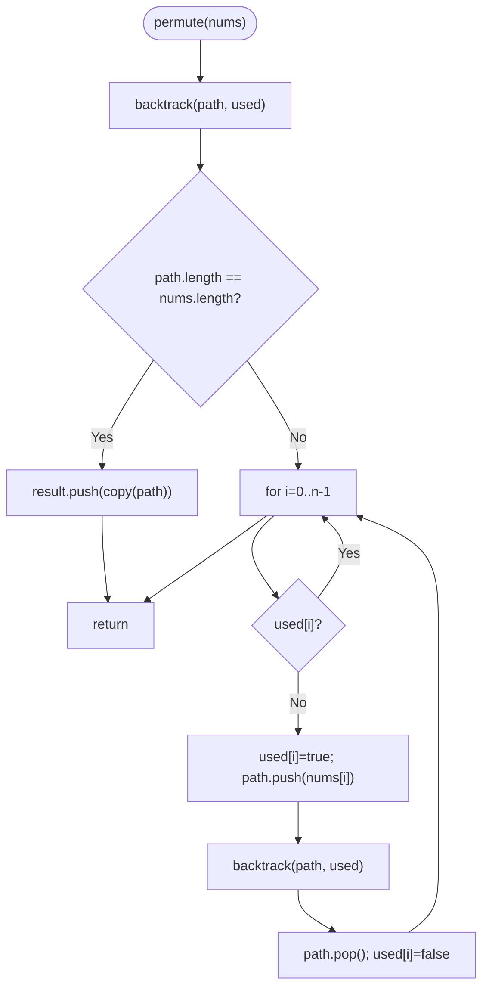

**Diagram sources**
- [23_permutations.js](file://Blind-75/23_permutations.js#L43-L72)

**Section sources**
- [23_permutations.js](file://Blind-75/23_permutations.js#L1-L76)

## Dependency Analysis
- Cohesion: Each file is self-contained with problem, approach, implementation, and test.
- Coupling: Minimal inter-file dependencies; solutions are independent.
- Patterns: Common algorithmic patterns appear across categories (e.g., sliding window in strings, two-pointer in arrays, DFS in trees/graphs, DP in numeric sequences, backtracking in combinatorics).

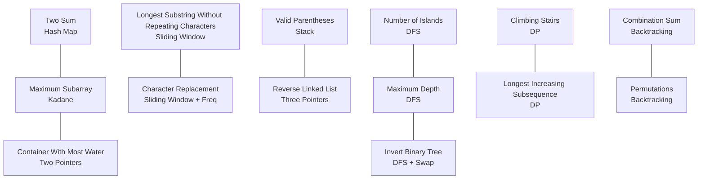

**Diagram sources**
- [1_twoSum.js](file://Blind-75/1_twoSum.js#L1-L54)
- [5_maxSubArray.js](file://Blind-75/5_maxSubArray.js#L1-L59)
- [58_containerWithMostWater.js](file://Blind-75/58_containerWithMostWater.js#L1-L70)
- [6_longestSubstring.js](file://Blind-75/6_longestSubstring.js#L1-L74)
- [8_characterReplacement.js](file://Blind-75/8_characterReplacement.js#L1-L71)
- [51_validParentheses.js](file://Blind-75/51_validParentheses.js#L1-L81)
- [11_reverseLinkedList.js](file://Blind-75/11_reverseLinkedList.js#L1-L71)
- [16_maxDepth.js](file://Blind-75/16_maxDepth.js#L1-L64)
- [18_invertBinaryTree.js](file://Blind-75/18_invertBinaryTree.js#L1-L56)
- [36_numberOfIslands.js](file://Blind-75/36_numberOfIslands.js#L1-L97)
- [41_climbingStairs.js](file://Blind-75/41_climbingStairs.js#L1-L67)
- [45_longestIncreasingSubsequence.js](file://Blind-75/45_longestIncreasingSubsequence.js#L1-L66)
- [21_combinationSum.js](file://Blind-75/21_combinationSum.js#L1-L79)
- [23_permutations.js](file://Blind-75/23_permutations.js#L1-L76)

**Section sources**
- [1_twoSum.js](file://Blind-75/1_twoSum.js#L1-L54)
- [5_maxSubArray.js](file://Blind-75/5_maxSubArray.js#L1-L59)
- [58_containerWithMostWater.js](file://Blind-75/58_containerWithMostWater.js#L1-L70)
- [6_longestSubstring.js](file://Blind-75/6_longestSubstring.js#L1-L74)
- [8_characterReplacement.js](file://Blind-75/8_characterReplacement.js#L1-L71)
- [51_validParentheses.js](file://Blind-75/51_validParentheses.js#L1-L81)
- [11_reverseLinkedList.js](file://Blind-75/11_reverseLinkedList.js#L1-L71)
- [16_maxDepth.js](file://Blind-75/16_maxDepth.js#L1-L64)
- [18_invertBinaryTree.js](file://Blind-75/18_invertBinaryTree.js#L1-L56)
- [36_numberOfIslands.js](file://Blind-75/36_numberOfIslands.js#L1-L97)
- [41_climbingStairs.js](file://Blind-75/41_climbingStairs.js#L1-L67)
- [45_longestIncreasingSubsequence.js](file://Blind-75/45_longestIncreasingSubsequence.js#L1-L66)
- [21_combinationSum.js](file://Blind-75/21_combinationSum.js#L1-L79)
- [23_permutations.js](file://Blind-75/23_permutations.js#L1-L76)

## Performance Considerations
- Trade-offs:
  - Hash map vs. sorting: Prefer hash map for single-pass lookups (e.g., two sum).
  - Sliding window vs. brute force: Use windowing to reduce time from O(n^2) to O(n) (e.g., longest substring).
  - DP space optimization: Replace full arrays with constants when transitions depend on previous states (e.g., climbing stairs).
- Complexity awareness:
  - Understand input constraints and choose appropriate data structures (e.g., fixed-size frequency maps for bounded alphabets).
  - Recognize when greedy strategies apply (e.g., two-pointer movement in container problem).
- Practical tips:
  - Always define base cases and invariant conditions (e.g., sliding window validity).
  - Consider early termination and pruning in backtracking.

[No sources needed since this section provides general guidance]

## Troubleshooting Guide
- Common pitfalls:
  - Off-by-one errors in sliding windows and two pointers.
  - Incorrect base cases in recursion (trees, DP).
  - Not handling duplicates or reusing elements correctly in backtracking.
- Debugging strategies:
  - Print indices and intermediate states during iteration.
  - Validate invariants (e.g., window uniqueness, stack bracket pairs).
  - Use small examples to trace logic (e.g., “abcabcbb” for sliding window).
- Interview tips:
  - Articulate the approach before coding.
  - State time/space complexity and justify choices.
  - Consider edge cases (empty inputs, single elements, duplicates).

**Section sources**
- [6_longestSubstring.js](file://Blind-75/6_longestSubstring.js#L1-L74)
- [51_validParentheses.js](file://Blind-75/51_validParentheses.js#L1-L81)
- [21_combinationSum.js](file://Blind-75/21_combinationSum.js#L1-L79)
- [23_permutations.js](file://Blind-75/23_permutations.js#L1-L76)

## Conclusion
The Blind-75 Interview Collection offers a structured, interview-focused curriculum that builds algorithmic fluency progressively. By emphasizing multiple solution approaches, pattern recognition, and rigorous complexity analysis, learners develop both intuition and precision. The Hinglish explanations and consistent documentation style make the material accessible and actionable for diverse audiences.

[No sources needed since this section summarizes without analyzing specific files]

## Appendices

### Preparation Timeline Recommendations
- Beginner (2–4 weeks):
  - Focus on arrays (two sum, max subarray), strings (valid parentheses, sliding window), and linked lists (reverse).
  - Practice 3–4 problems per day with explanations.
- Intermediate (3–5 weeks):
  - Add trees (max depth, invert), graphs (number of islands), and DP (climbing stairs).
  - Practice 4–5 problems per day; emphasize complexity trade-offs.
- Advanced (2–3 weeks):
  - Tackle backtracking (combinations, permutations), harder DP (LIS), and mixed-pattern problems.
  - Simulate timed sessions; review solutions and alternative approaches.

[No sources needed since this section provides general guidance]