# Dynamic Programming

<cite>
**Referenced Files in This Document**
- [45_longestIncreasingSubsequence.js](file://Blind-75/45_longestIncreasingSubsequence.js)
- [65_lisBinarySearch.js](file://Blind-75/65_lisBinarySearch.js)
- [41_climbingStairs.js](file://Blind-75/41_climbingStairs.js)
- [42_houseRobber.js](file://Blind-75/42_houseRobber.js)
- [43_houseRobberII.js](file://Blind-75/43_houseRobberII.js)
- [44_coinChange.js](file://Blind-75/44_coinChange.js)
- [61_uniquePaths.js](file://Blind-75/61_uniquePaths.js)
- [74_decodeWays.js](file://Blind-75/74_decodeWays.js)
- [59_trappingRainWater.js](file://Blind-75/59_trappingRainWater.js)
- [5_maxSubArray.js](file://Blind-75/5_maxSubArray.js)
- [32_medianFinder.js](file://Blind-75/32_medianFinder.js)
- [31_topKFrequent.js](file://Blind-75/31_topKFrequent.js)
- [24_wordSearch.js](file://Blind-75/24_wordSearch.js)
- [60_jumpGame.js](file://Blind-75/60_jumpGame.js)
- [71_jumpGameII.js](file://Blind-75/71_jumpGameII.js)
</cite>

## Table of Contents
1. [Introduction](#introduction)
2. [Project Structure](#project-structure)
3. [Core Components](#core-components)
4. [Architecture Overview](#architecture-overview)
5. [Detailed Component Analysis](#detailed-component-analysis)
6. [Dependency Analysis](#dependency-analysis)
7. [Performance Considerations](#performance-considerations)
8. [Troubleshooting Guide](#troubleshooting-guide)
9. [Conclusion](#conclusion)
10. [Appendices](#appendices)

## Introduction
This document presents a comprehensive guide to dynamic programming (DP) as demonstrated by selected implementations in the repository. It covers fundamental DP concepts—memoization, bottom-up tabulation, and recurrence relation formulation—and applies them to classic patterns such as Fibonacci variants, optimal substructure problems, and longest increasing subsequence (LIS) computations. Advanced techniques are included, such as binary search optimizations for LIS, heap-based solutions for top-K problems, and priority queue implementations for median tracking. The document also analyzes state definitions, transitions, base cases, and space optimization strategies like rolling arrays and hybrid approaches combining DP with other algorithms. Complexity analyses and memory optimization strategies are provided for each covered problem.

## Project Structure
The repository organizes dynamic programming content primarily under the Blind-75 directory, with each file encapsulating a focused DP problem. Representative files include:
- LIS variants: [45_longestIncreasingSubsequence.js](file://Blind-75/45_longestIncreasingSubsequence.js), [65_lisBinarySearch.js](file://Blind-75/65_lisBinarySearch.js)
- Fibonacci-style DP: [41_climbingStairs.js](file://Blind-75/41_climbingStairs.js)
- Optimal substructure (House Robber family): [42_houseRobber.js](file://Blind-75/42_houseRobber.js), [43_houseRobberII.js](file://Blind-75/43_houseRobberII.js)
- Knapsack-type DP: [44_coinChange.js](file://Blind-75/44_coinChange.js)
- Grid path counting: [61_uniquePaths.js](file://Blind-75/61_uniquePaths.js)
- String decoding: [74_decodeWays.js](file://Blind-75/74_decodeWays.js)
- Linear DP and two-pointer optimizations: [59_trappingRainWater.js](file://Blind-75/59_trappingRainWater.js), [5_maxSubArray.js](file://Blind-75/5_maxSubArray.js)
- Median tracking via heaps: [32_medianFinder.js](file://Blind-75/32_medianFinder.js)
- Top-K frequent elements via min-heap: [31_topKFrequent.js](file://Blind-75/31_topKFrequent.js)
- Greedy jump games: [60_jumpGame.js](file://Blind-75/60_jumpGame.js), [71_jumpGameII.js](file://Blind-75/71_jumpGameII.js)

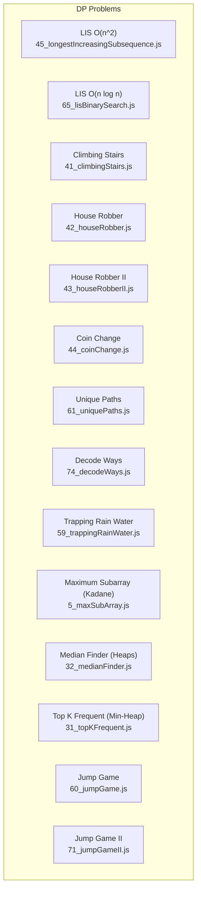
```mermaid
graph TB
subgraph "DP Problems"
LIS1["LIS O(n^2)<br/>45_longestIncreasingSubsequence.js"]
LIS2["LIS O(n log n)<br/>65_lisBinarySearch.js"]
CLIMB["Climbing Stairs<br/>41_climbingStairs.js"]
ROB1["House Robber<br/>42_houseRobber.js"]
ROB2["House Robber II<br/>43_houseRobberII.js"]
COIN["Coin Change<br/>44_coinChange.js"]
PATH["Unique Paths<br/>61_uniquePaths.js"]
DECODE["Decode Ways<br/>74_decodeWays.js"]
TRAP["Trapping Rain Water<br/>59_trappingRainWater.js"]
MAXSUB["Maximum Subarray (Kadane)<br/>5_maxSubArray.js"]
MEDIAN["Median Finder (Heaps)<br/>32_medianFinder.js"]
TOPK["Top K Frequent (Min-Heap)<br/>31_topKFrequent.js"]
JUMP1["Jump Game<br/>60_jumpGame.js"]
JUMP2["Jump Game II<br/>71_jumpGameII.js"]
end
```

**Diagram sources**
- [45_longestIncreasingSubsequence.js](file://Blind-75/45_longestIncreasingSubsequence.js#L1-L66)
- [65_lisBinarySearch.js](file://Blind-75/65_lisBinarySearch.js#L1-L66)
- [41_climbingStairs.js](file://Blind-75/41_climbingStairs.js#L1-L67)
- [42_houseRobber.js](file://Blind-75/42_houseRobber.js#L1-L63)
- [43_houseRobberII.js](file://Blind-75/43_houseRobberII.js#L1-L70)
- [44_coinChange.js](file://Blind-75/44_coinChange.js#L1-L67)
- [61_uniquePaths.js](file://Blind-75/61_uniquePaths.js#L1-L59)
- [74_decodeWays.js](file://Blind-75/74_decodeWays.js#L1-L70)
- [59_trappingRainWater.js](file://Blind-75/59_trappingRainWater.js#L1-L76)
- [5_maxSubArray.js](file://Blind-75/5_maxSubArray.js#L1-L59)
- [32_medianFinder.js](file://Blind-75/32_medianFinder.js#L1-L81)
- [31_topKFrequent.js](file://Blind-75/31_topKFrequent.js#L1-L128)
- [60_jumpGame.js](file://Blind-75/60_jumpGame.js#L1-L65)
- [71_jumpGameII.js](file://Blind-75/71_jumpGameII.js#L1-L69)

**Section sources**
- [45_longestIncreasingSubsequence.js](file://Blind-75/45_longestIncreasingSubsequence.js#L1-L66)
- [65_lisBinarySearch.js](file://Blind-75/65_lisBinarySearch.js#L1-L66)
- [41_climbingStairs.js](file://Blind-75/41_climbingStairs.js#L1-L67)
- [42_houseRobber.js](file://Blind-75/42_houseRobber.js#L1-L63)
- [43_houseRobberII.js](file://Blind-75/43_houseRobberII.js#L1-L70)
- [44_coinChange.js](file://Blind-75/44_coinChange.js#L1-L67)
- [61_uniquePaths.js](file://Blind-75/61_uniquePaths.js#L1-L59)
- [74_decodeWays.js](file://Blind-75/74_decodeWays.js#L1-L70)
- [59_trappingRainWater.js](file://Blind-75/59_trappingRainWater.js#L1-L76)
- [5_maxSubArray.js](file://Blind-75/5_maxSubArray.js#L1-L59)
- [32_medianFinder.js](file://Blind-75/32_medianFinder.js#L1-L81)
- [31_topKFrequent.js](file://Blind-75/31_topKFrequent.js#L1-L128)
- [60_jumpGame.js](file://Blind-75/60_jumpGame.js#L1-L65)
- [71_jumpGameII.js](file://Blind-75/71_jumpGameII.js#L1-L69)

## Core Components
This section distills the essential DP building blocks illustrated by the repository’s implementations:
- Memoization vs. Bottom-up tabulation: Many problems use explicit bottom-up DP arrays (e.g., LIS O(n^2), House Robber, Coin Change), while others demonstrate optimized rolling-state updates (e.g., Climbing Stairs, House Robber II).
- Recurrence relations: Each problem defines a DP relation linking dp[i] to prior states (e.g., dp[i-1], dp[i-2], or dp[i - coin]).
- Base cases: Clear initialization of dp[0] or small indices to bootstrap the computation.
- Space optimization: Rolling variables or 1D arrays reduce memory footprint (e.g., Climbing Stairs, House Robber, Unique Paths).
- Hybrid techniques: Combining DP with two pointers (Trapping Rain Water), greedy strategies (Jump Games), and heaps (Top K Frequent, Median Finder).

Examples of DP formulations:
- LIS O(n^2): dp[i] = max(dp[i], dp[j] + 1) for j < i with nums[i] > nums[j].
- LIS O(n log n): Maintain tails where tails[len-1] is the smallest tail of length len.
- Climbing Stairs: f(n) = f(n-1) + f(n-2) with f(1)=1, f(2)=2.
- House Robber: dp[i] = max(dp[i-1], nums[i] + dp[i-2]).
- Coin Change: dp[a] = min(dp[a], dp[a - coin] + 1) for each coin.
- Unique Paths: dp[j] = dp[j] + dp[j-1] initialized to 1 per row.
- Decode Ways: dp[i] += dp[i-1] (single-digit valid) + dp[i-2] (two-digit valid).
- Kadane’s Algorithm: currentSum = max(nums[i], currentSum + nums[i]); maxSum = max(maxSum, currentSum).

**Section sources**
- [45_longestIncreasingSubsequence.js](file://Blind-75/45_longestIncreasingSubsequence.js#L45-L62)
- [65_lisBinarySearch.js](file://Blind-75/65_lisBinarySearch.js#L44-L62)
- [41_climbingStairs.js](file://Blind-75/41_climbingStairs.js#L47-L63)
- [42_houseRobber.js](file://Blind-75/42_houseRobber.js#L45-L59)
- [44_coinChange.js](file://Blind-75/44_coinChange.js#L45-L63)
- [61_uniquePaths.js](file://Blind-75/61_uniquePaths.js#L41-L55)
- [74_decodeWays.js](file://Blind-75/74_decodeWays.js#L43-L66)
- [5_maxSubArray.js](file://Blind-75/5_maxSubArray.js#L37-L55)

## Architecture Overview
The DP implementations follow a consistent pattern:
- Define state: dp[i] or dp[i][j] representing the optimal value up to index i or cell (i,j).
- Establish recurrence: Express dp[i] in terms of prior dp values or problem-specific constraints.
- Set base cases: Initialize dp[0] or first row/column appropriately.
- Choose strategy: Bottom-up tabulation or optimized rolling state.
- Optional hybrid: Integrate two pointers, heaps, or greedy logic where applicable.

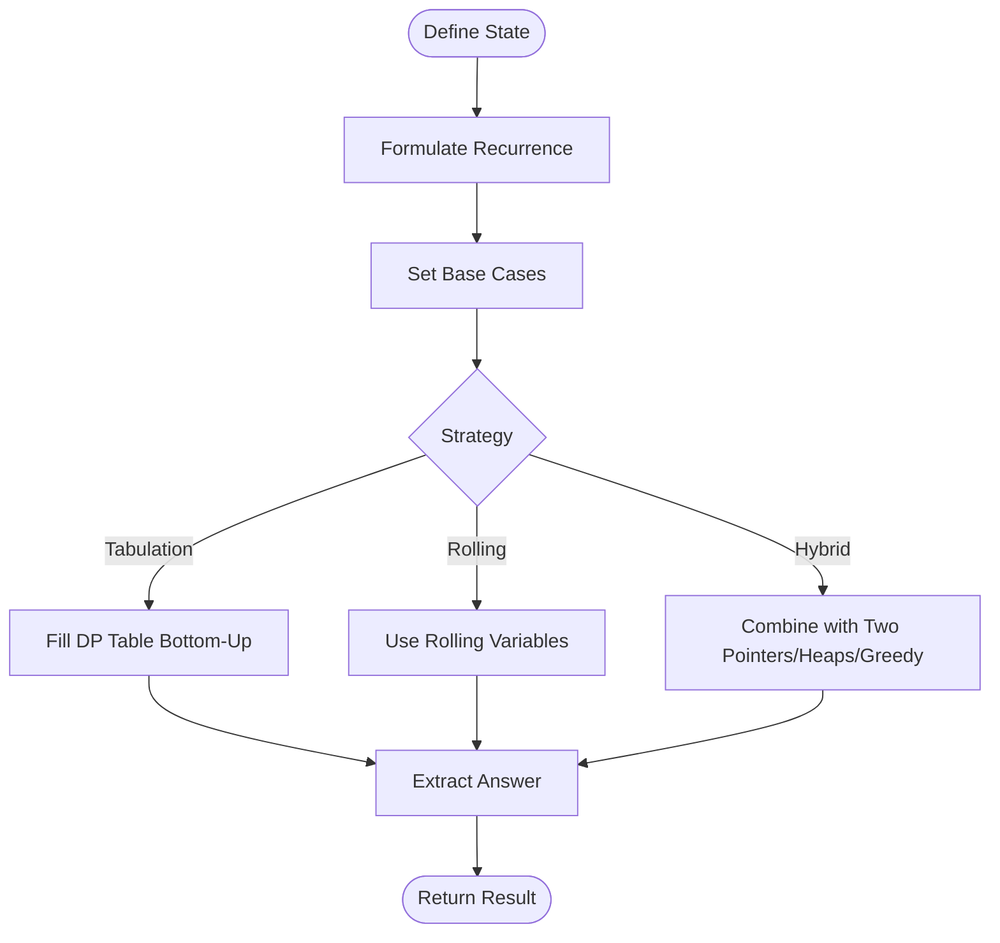
```mermaid
flowchart TD
Start(["Define State"]) --> Recur["Formulate Recurrence"]
Recur --> Base["Set Base Cases"]
Base --> Strategy{"Strategy"}
Strategy --> |Tabulation| Tab["Fill DP Table Bottom-Up"]
Strategy --> |Rolling| Roll["Use Rolling Variables"]
Strategy --> |Hybrid| Hybrid["Combine with Two Pointers/Heaps/Greedy"]
Tab --> Answer["Extract Answer"]
Roll --> Answer
Hybrid --> Answer
Answer --> End(["Return Result"])
```

[No sources needed since this diagram shows conceptual workflow, not actual code structure]

## Detailed Component Analysis

### Longest Increasing Subsequence (O(n^2))
- State: dp[i] is the length of the LIS ending at index i.
- Transition: For each i, check all j < i; if nums[i] > nums[j], update dp[i] = max(dp[i], dp[j] + 1).
- Base case: dp filled with 1 initially.
- Complexity: Time O(n^2), Space O(n).
- Notes: The file includes an O(n log n) variant using binary search on tails.

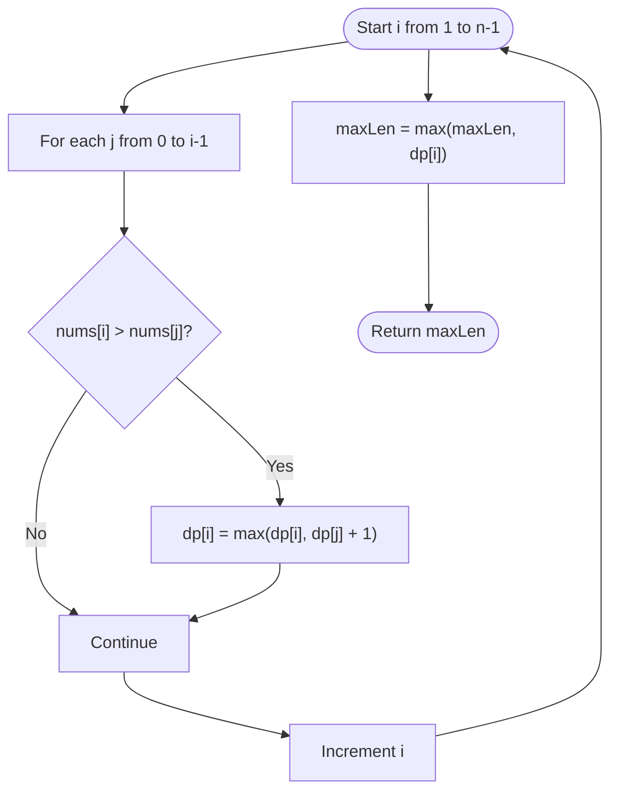
```mermaid
flowchart TD
S(["Start i from 1 to n-1"]) --> LoopJ["For each j from 0 to i-1"]
LoopJ --> Compare{"nums[i] > nums[j]?"}
Compare --> |Yes| Update["dp[i] = max(dp[i], dp[j] + 1)"]
Compare --> |No| NextJ["Continue"]
Update --> NextJ
NextJ --> IncI["Increment i"]
IncI --> S
S --> Max["maxLen = max(maxLen, dp[i])"]
Max --> End(["Return maxLen"])
```

**Diagram sources**
- [45_longestIncreasingSubsequence.js](file://Blind-75/45_longestIncreasingSubsequence.js#L51-L59)

**Section sources**
- [45_longestIncreasingSubsequence.js](file://Blind-75/45_longestIncreasingSubsequence.js#L1-L66)

### Longest Increasing Subsequence (O(n log n) with Binary Search)
- State: tails maintains the smallest tail for each LIS length.
- Transition: For each num, binary search insertion position; replace or append to tails.
- Complexity: Time O(n log n), Space O(n).
- Insight: tails is sorted; length equals LIS length.

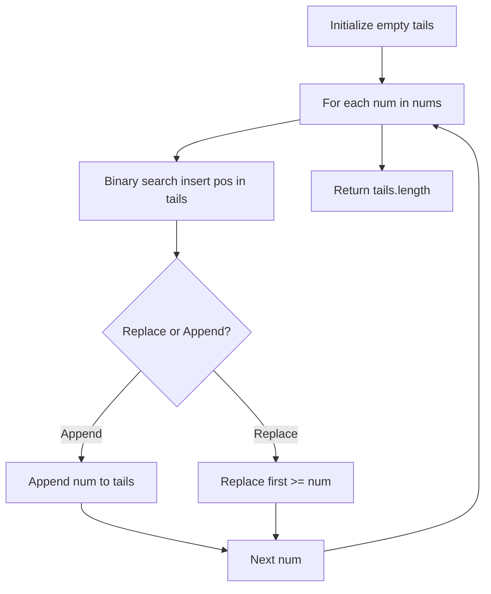
```mermaid
flowchart TD
Init["Initialize empty tails"] --> ForEach["For each num in nums"]
ForEach --> BS["Binary search insert pos in tails"]
BS --> ReplaceOrAppend{"Replace or Append?"}
ReplaceOrAppend --> |Append| Append["Append num to tails"]
ReplaceOrAppend --> |Replace| Replace["Replace first >= num"]
Append --> NextIter["Next num"]
Replace --> NextIter
NextIter --> ForEach
ForEach --> Len["Return tails.length"]
```

**Diagram sources**
- [65_lisBinarySearch.js](file://Blind-75/65_lisBinarySearch.js#L44-L62)

**Section sources**
- [65_lisBinarySearch.js](file://Blind-75/65_lisBinarySearch.js#L1-L66)

### Climbing Stairs (Fibonacci Variant)
- State: ways to reach step i.
- Transition: ways(i) = ways(i-1) + ways(i-2).
- Base cases: ways(1)=1, ways(2)=2.
- Space optimization: Use two rolling variables instead of an array.
- Complexity: Time O(n), Space O(1).

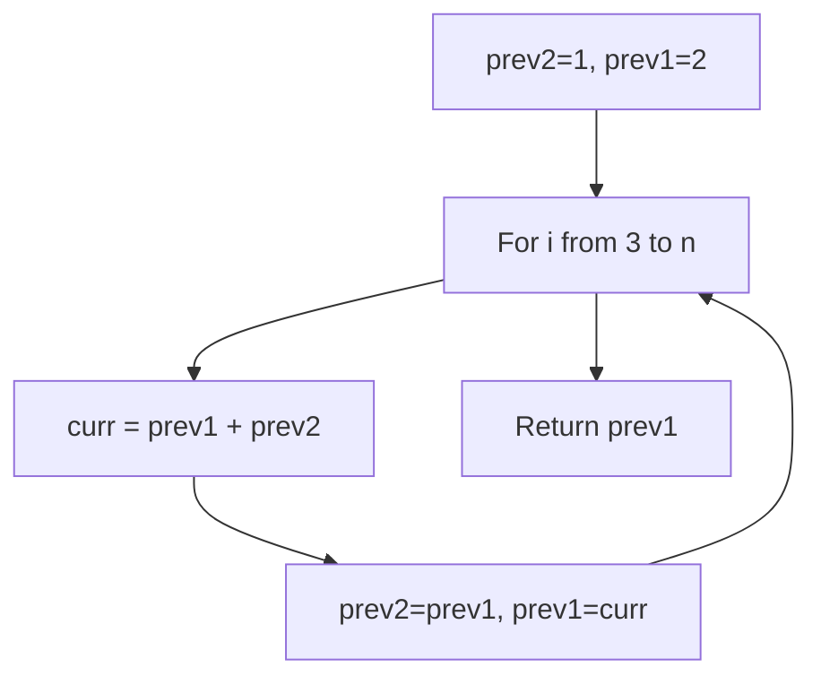
```mermaid
flowchart TD
Init["prev2=1, prev1=2"] --> Loop["For i from 3 to n"]
Loop --> Curr["curr = prev1 + prev2"]
Curr --> Shift["prev2=prev1, prev1=curr"]
Shift --> Loop
Loop --> Return["Return prev1"]
```

**Diagram sources**
- [41_climbingStairs.js](file://Blind-75/41_climbingStairs.js#L52-L60)

**Section sources**
- [41_climbingStairs.js](file://Blind-75/41_climbingStairs.js#L1-L67)

### House Robber (Optimal Substructure)
- State: max money up to house i.
- Transition: dp[i] = max(dp[i-1], nums[i] + dp[i-2]).
- Space optimization: Use rob1 and rob2 rolling variables.
- Complexity: Time O(n), Space O(1).

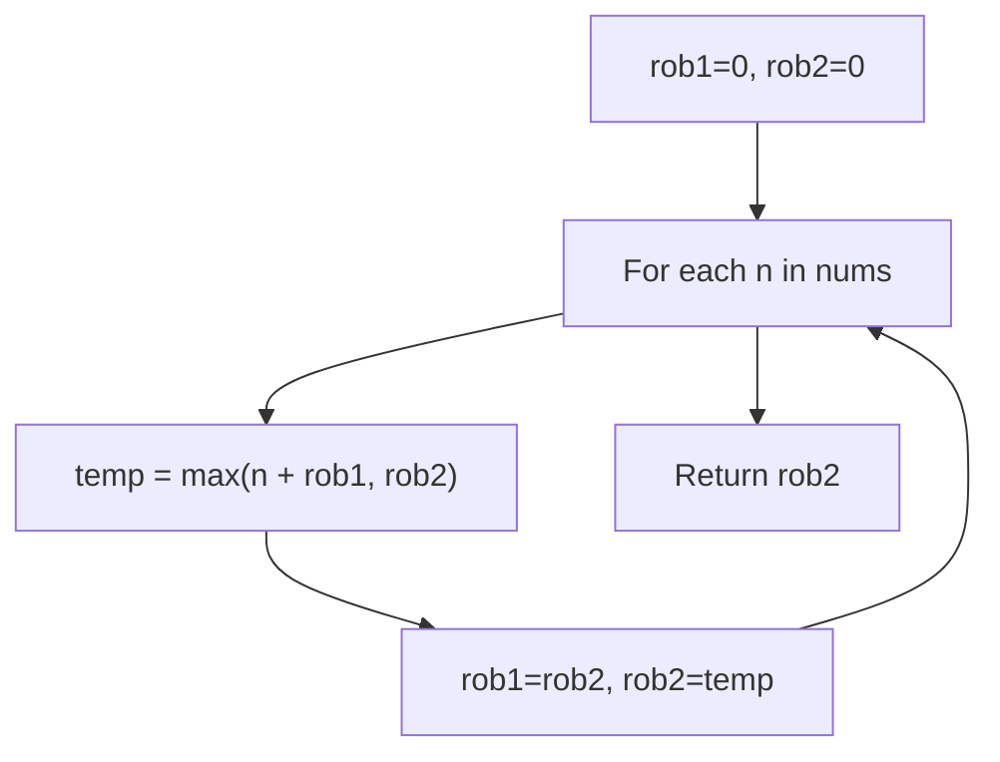
```mermaid
flowchart TD
Init["rob1=0, rob2=0"] --> ForEach["For each n in nums"]
ForEach --> Temp["temp = max(n + rob1, rob2)"]
Temp --> Shift["rob1=rob2, rob2=temp"]
Shift --> ForEach
ForEach --> End["Return rob2"]
```

**Diagram sources**
- [42_houseRobber.js](file://Blind-75/42_houseRobber.js#L45-L59)

**Section sources**
- [42_houseRobber.js](file://Blind-75/42_houseRobber.js#L1-L63)

### House Robber II (Circular Constraint)
- Strategy: Split into two linear runs (House Robber I) and take the maximum.
- Complexity: Time O(n), Space O(1).

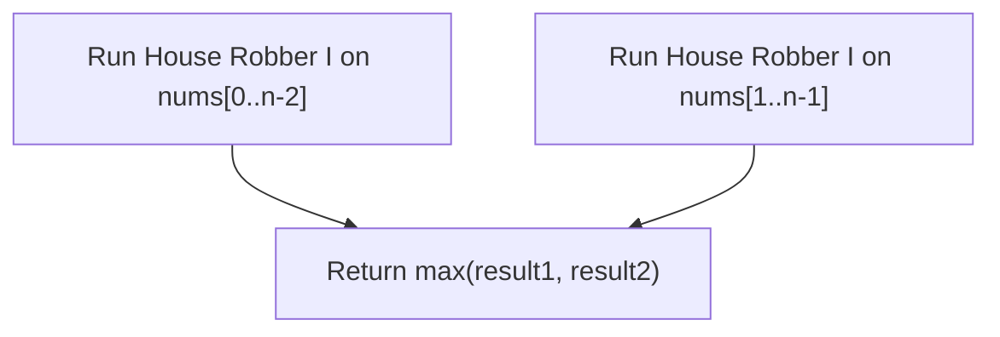
```mermaid
flowchart TD
One["Run House Robber I on nums[0..n-2]"]
Two["Run House Robber I on nums[1..n-1]"]
One --> MaxSel["Return max(result1, result2)"]
Two --> MaxSel
```

**Diagram sources**
- [43_houseRobberII.js](file://Blind-75/43_houseRobberII.js#L45-L66)

**Section sources**
- [43_houseRobberII.js](file://Blind-75/43_houseRobberII.js#L1-L70)

### Coin Change (Unbounded Knapsack-like)
- State: dp[a] = minimum coins to make amount a.
- Transition: dp[a] = min(dp[a], dp[a - coin] + 1) for each coin.
- Base case: dp[0] = 0.
- Complexity: Time O(amount × coins), Space O(amount).

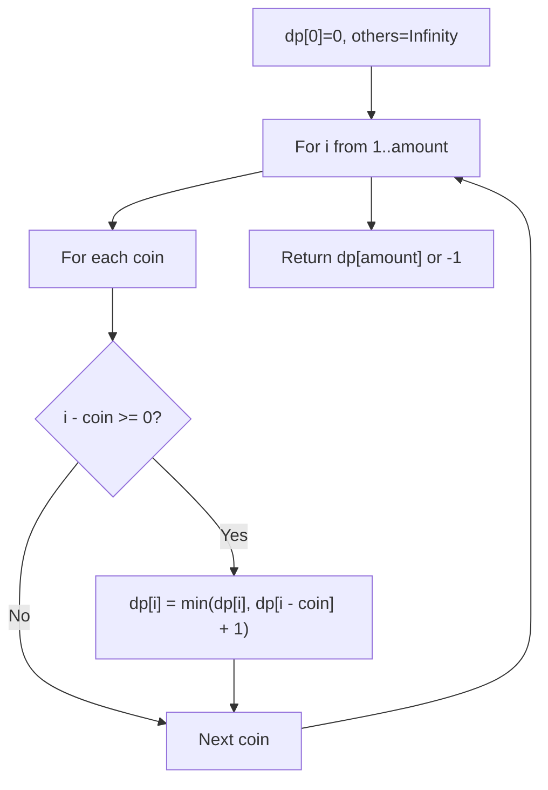
```mermaid
flowchart TD
Init["dp[0]=0, others=Infinity"] --> AmountLoop["For i from 1..amount"]
AmountLoop --> CoinLoop["For each coin"]
CoinLoop --> Valid{"i - coin >= 0?"}
Valid --> |Yes| Update["dp[i] = min(dp[i], dp[i - coin] + 1)"]
Valid --> |No| NextCoin["Next coin"]
Update --> NextCoin
NextCoin --> AmountLoop
AmountLoop --> Answer["Return dp[amount] or -1"]
```

**Diagram sources**
- [44_coinChange.js](file://Blind-75/44_coinChange.js#L45-L63)

**Section sources**
- [44_coinChange.js](file://Blind-75/44_coinChange.js#L1-L67)

### Unique Paths (Grid DP with Rolling Array)
- State: dp[j] = number of paths to column j in current row.
- Transition: dp[j] = dp[j] + dp[j-1].
- Initialization: First row all 1s.
- Complexity: Time O(m×n), Space O(n).

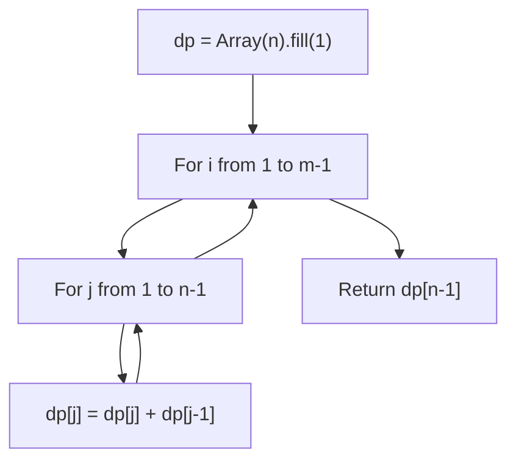
```mermaid
flowchart TD
Init["dp = Array(n).fill(1)"] --> Rows["For i from 1 to m-1"]
Rows --> Cols["For j from 1 to n-1"]
Cols --> Trans["dp[j] = dp[j] + dp[j-1]"]
Trans --> Cols
Cols --> Rows
Rows --> Result["Return dp[n-1]"]
```

**Diagram sources**
- [61_uniquePaths.js](file://Blind-75/61_uniquePaths.js#L41-L55)

**Section sources**
- [61_uniquePaths.js](file://Blind-75/61_uniquePaths.js#L1-L59)

### Decode Ways (String DP)
- State: dp[i] = number of ways to decode s[0..i-1].
- Transitions: Add dp[i-1] if single digit valid; add dp[i-2] if two-digit 10–26.
- Base cases: dp[0]=1, dp[1] handled by leading character.
- Complexity: Time O(n), Space O(n); can be optimized to O(1) rolling.

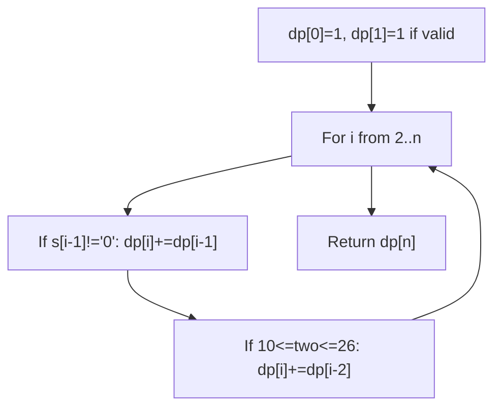
```mermaid
flowchart TD
Init["dp[0]=1, dp[1]=1 if valid"] --> ForEach["For i from 2..n"]
ForEach --> Single["If s[i-1]!='0': dp[i]+=dp[i-1]"]
Single --> Double["If 10<=two<=26: dp[i]+=dp[i-2]"]
Double --> ForEach
ForEach --> End["Return dp[n]"]
```

**Diagram sources**
- [74_decodeWays.js](file://Blind-75/74_decodeWays.js#L43-L66)

**Section sources**
- [74_decodeWays.js](file://Blind-75/74_decodeWays.js#L1-L70)

### Maximum Subarray (Kadane’s Algorithm)
- State: currentSum (best subarray ending at current index), maxSum (global best).
- Transition: currentSum = max(nums[i], currentSum + nums[i]); maxSum = max(maxSum, currentSum).
- Complexity: Time O(n), Space O(1).

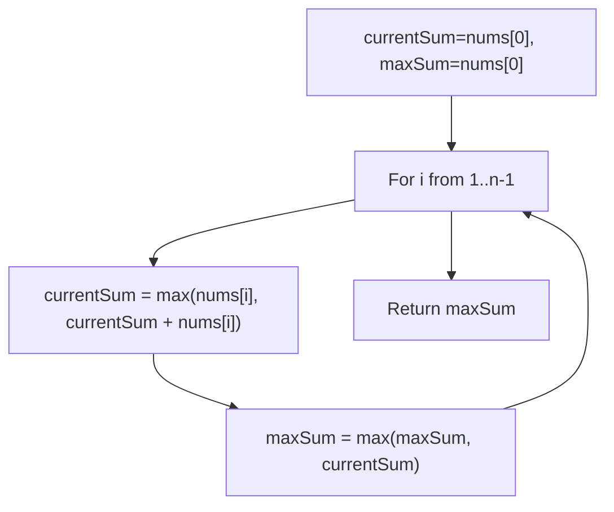
```mermaid
flowchart TD
Init["currentSum=nums[0], maxSum=nums[0]"] --> Loop["For i from 1..n-1"]
Loop --> Decide["currentSum = max(nums[i], currentSum + nums[i])"]
Decide --> Update["maxSum = max(maxSum, currentSum)"]
Update --> Loop
Loop --> End["Return maxSum"]
```

**Diagram sources**
- [5_maxSubArray.js](file://Blind-75/5_maxSubArray.js#L37-L55)

**Section sources**
- [5_maxSubArray.js](file://Blind-75/5_maxSubArray.js#L1-L59)

### Trapping Rain Water (Two Pointers with Rolling Max)
- Strategy: Two pointers from both ends, maintain leftMax and rightMax, move the side with smaller max.
- Insight: Water at each position is bounded by the smaller of leftMax/rightMax.
- Complexity: Time O(n), Space O(1).

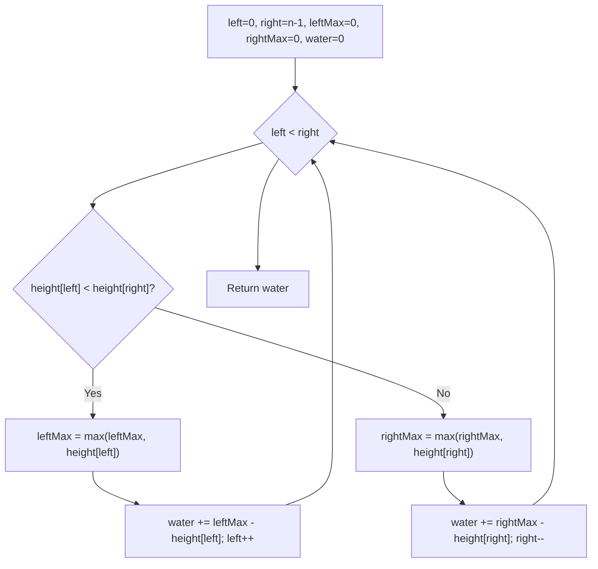
```mermaid
flowchart TD
Init["left=0, right=n-1, leftMax=0, rightMax=0, water=0"] --> Loop{"left < right"}
Loop --> Compare{"height[left] < height[right]?"}
Compare --> |Yes| LUpdate["leftMax = max(leftMax, height[left])"]
LUpdate --> LTrap["water += leftMax - height[left]; left++"]
Compare --> |No| RUpdate["rightMax = max(rightMax, height[right])"]
RUpdate --> RTrap["water += rightMax - height[right]; right--"]
LTrap --> Loop
RTrap --> Loop
Loop --> End["Return water"]
```

**Diagram sources**
- [59_trappingRainWater.js](file://Blind-75/59_trappingRainWater.js#L45-L72)

**Section sources**
- [59_trappingRainWater.js](file://Blind-75/59_trappingRainWater.js#L1-L76)

### Median from Data Stream (Two Heaps)
- Strategy: MaxHeap for lower half, MinHeap for upper half; balance sizes.
- Operations: addNum pushes to maxHeap, rebalance; findMedian checks sizes.
- Complexity: addNum O(log n), findMedian O(1), Space O(n).

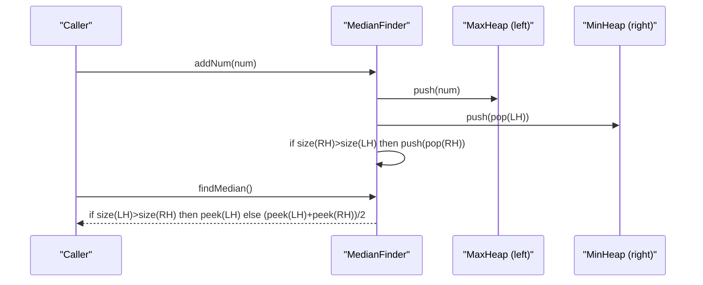
```mermaid
sequenceDiagram
participant Caller as "Caller"
participant MF as "MedianFinder"
participant LH as "MaxHeap (left)"
participant RH as "MinHeap (right)"
Caller->>MF : addNum(num)
MF->>LH : push(num)
MF->>RH : push(pop(LH))
MF->>MF : if size(RH)>size(LH) then push(pop(RH))
Caller->>MF : findMedian()
MF-->>Caller : if size(LH)>size(RH) then peek(LH) else (peek(LH)+peek(RH))/2
```

**Diagram sources**
- [32_medianFinder.js](file://Blind-75/32_medianFinder.js#L43-L72)

**Section sources**
- [32_medianFinder.js](file://Blind-75/32_medianFinder.js#L1-L81)

### Top K Frequent Elements (Min-Heap)
- Strategy: Count frequencies, use MinHeap keyed by frequency to keep top K.
- Complexity: Time O(n log k), Space O(n + k).

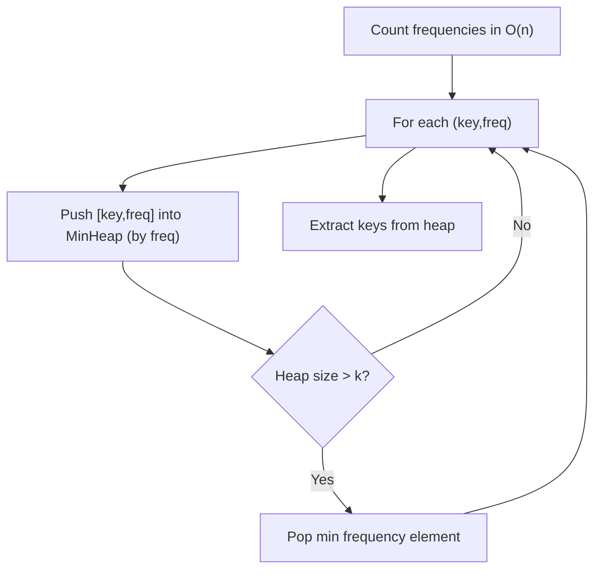
```mermaid
flowchart TD
Count["Count frequencies in O(n)"] --> Loop["For each (key,freq)"]
Loop --> Push["Push [key,freq] into MinHeap (by freq)"]
Push --> Size{"Heap size > k?"}
Size --> |Yes| Pop["Pop min frequency element"]
Size --> |No| Loop
Pop --> Loop
Loop --> Extract["Extract keys from heap"]
```

**Diagram sources**
- [31_topKFrequent.js](file://Blind-75/31_topKFrequent.js#L108-L123)

**Section sources**
- [31_topKFrequent.js](file://Blind-75/31_topKFrequent.js#L1-L128)

### Jump Game (Greedy Reach)
- Strategy: Track maxReach; at each step update and check feasibility.
- Complexity: Time O(n), Space O(1).

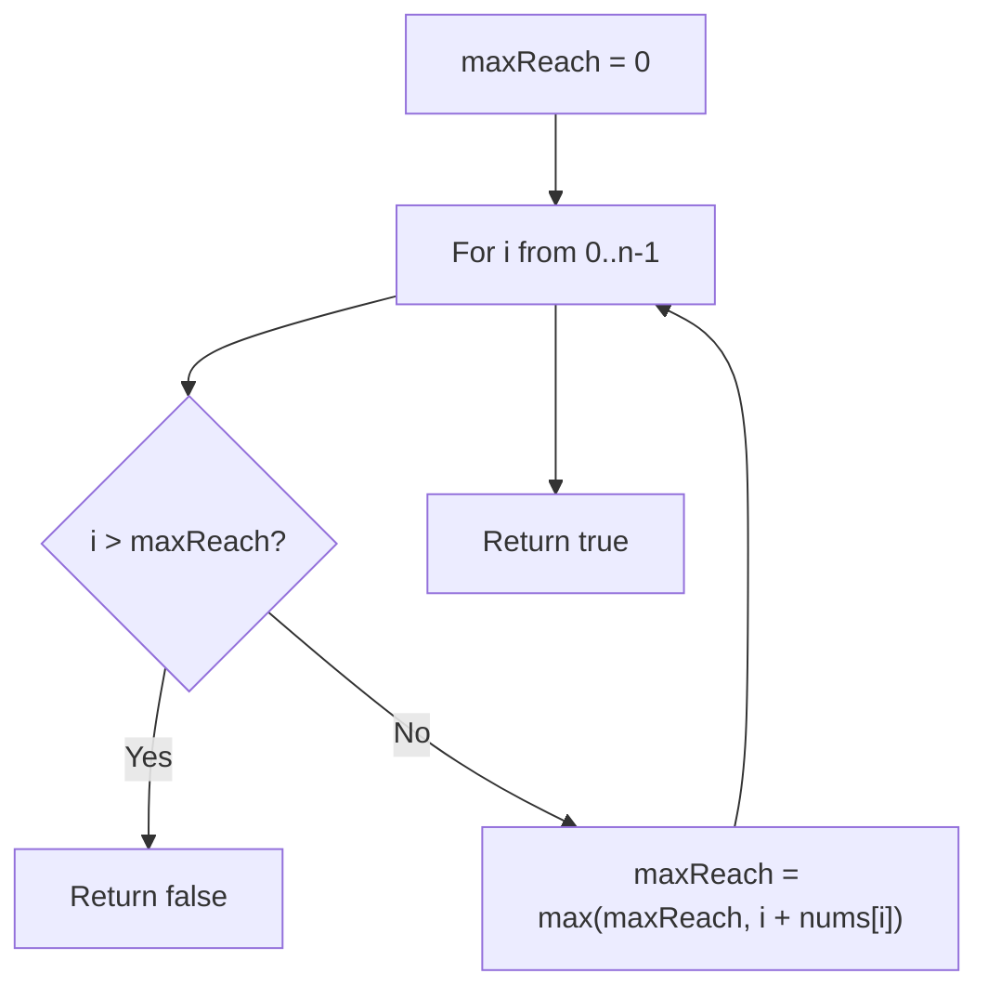
```mermaid
flowchart TD
Init["maxReach = 0"] --> Loop["For i from 0..n-1"]
Loop --> Feasible{"i > maxReach?"}
Feasible --> |Yes| False["Return false"]
Feasible --> |No| Update["maxReach = max(maxReach, i + nums[i])"]
Update --> Loop
Loop --> True["Return true"]
```

**Diagram sources**
- [60_jumpGame.js](file://Blind-75/60_jumpGame.js#L47-L60)

**Section sources**
- [60_jumpGame.js](file://Blind-75/60_jumpGame.js#L1-L65)

### Jump Game II (Greedy BFS with Range)
- Strategy: Use jumps, currentEnd, and farthest to simulate layers of BFS.
- Complexity: Time O(n), Space O(1).

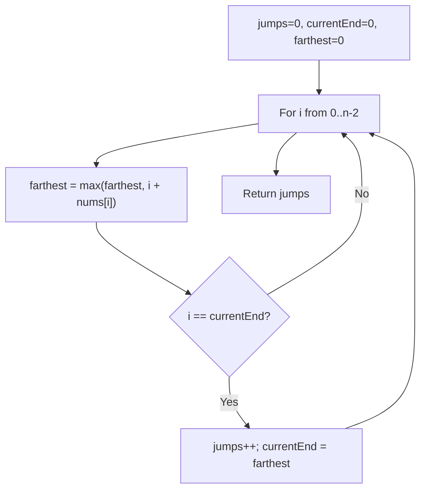
```mermaid
flowchart TD
Init["jumps=0, currentEnd=0, farthest=0"] --> Loop["For i from 0..n-2"]
Loop --> UpdateF["farthest = max(farthest, i + nums[i])"]
UpdateF --> Boundary{"i == currentEnd?"}
Boundary --> |Yes| Jump["jumps++; currentEnd = farthest"]
Boundary --> |No| Loop
Jump --> Loop
Loop --> End["Return jumps"]
```

**Diagram sources**
- [71_jumpGameII.js](file://Blind-75/71_jumpGameII.js#L42-L65)

**Section sources**
- [71_jumpGameII.js](file://Blind-75/71_jumpGameII.js#L1-L69)

## Dependency Analysis
- Cohesion: Each file focuses on a single DP concept or hybrid technique, with clear state definitions and transitions.
- Coupling: Minimal inter-file coupling; most implementations are self-contained.
- External dependencies: Some files rely on a generic Heap class (referenced in comments), but the core logic remains standalone.

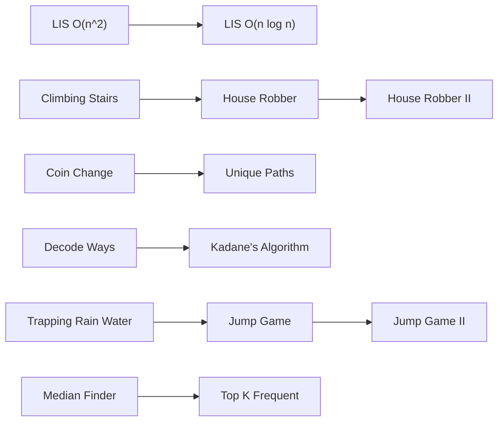
```mermaid
graph LR
LIS_O_n2["LIS O(n^2)"] --> LIS_O_nlogn["LIS O(n log n)"]
CLIMB["Climbing Stairs"] --> ROB1["House Robber"]
ROB1 --> ROB2["House Robber II"]
COIN["Coin Change"] --> PATH["Unique Paths"]
DECODE["Decode Ways"] --> MAXSUB["Kadane's Algorithm"]
TRAP["Trapping Rain Water"] --> JUMP1["Jump Game"]
JUMP1 --> JUMP2["Jump Game II"]
MEDIAN["Median Finder"] --> TOPK["Top K Frequent"]
```

[No sources needed since this diagram shows conceptual relationships, not direct code imports]

## Performance Considerations
- Prefer rolling arrays or variables when only the last few states are needed (Climbing Stairs, House Robber, Unique Paths).
- Use O(n log n) LIS with binary search when n is large (LIS O(n log n)).
- For counting problems, consider frequency maps plus heaps to avoid full sorting (Top K Frequent).
- Two-pointer techniques can reduce time complexity and eliminate extra DP arrays (Trapping Rain Water).
- Greedy strategies (Jump Games) often yield linear-time solutions with minimal memory overhead.

[No sources needed since this section provides general guidance]

## Troubleshooting Guide
- Off-by-one errors in DP indexing: Verify base cases and loop bounds (e.g., dp[0] initialization, 1D vs. (n+1) arrays).
- Incorrect recurrence formulation: Re-check transitions against problem constraints (e.g., adjacency in House Robber, valid ranges in Decode Ways).
- Memory leaks or excessive allocations: Switch from full DP tables to rolling variables or 1D arrays.
- Heap ordering confusion: Ensure the comparator aligns with intended heap type (min-heap for Top K, max-heap for lower half in Median Finder).
- Early termination conditions: For greedy problems, confirm feasibility checks (e.g., Jump Game’s maxReach).

**Section sources**
- [31_topKFrequent.js](file://Blind-75/31_topKFrequent.js#L108-L123)
- [32_medianFinder.js](file://Blind-75/32_medianFinder.js#L43-L72)
- [60_jumpGame.js](file://Blind-75/60_jumpGame.js#L47-L60)
- [71_jumpGameII.js](file://Blind-75/71_jumpGameII.js#L42-L65)
- [74_decodeWays.js](file://Blind-75/74_decodeWays.js#L43-L66)

## Conclusion
The repository demonstrates a broad spectrum of dynamic programming techniques—from foundational bottom-up tabulation and recurrence relations to advanced optimizations like binary search LIS, rolling arrays, and hybrid methods combining DP with heaps and greedy strategies. By studying these implementations, one gains practical insights into state definition, transition equations, base cases, and complexity trade-offs, enabling confident tackling of diverse DP problems.

[No sources needed since this section summarizes without analyzing specific files]

## Appendices
- Common DP patterns covered:
  - Fibonacci-style recurrences (Climbing Stairs)
  - Optimal substructure with adjacency constraints (House Robber family)
  - Unbounded knapsack-like minimization (Coin Change)
  - Grid path counting with space optimization (Unique Paths)
  - String parsing with dual-path transitions (Decode Ways)
  - Linear DP with rolling windows (Maximum Subarray, Trapping Rain Water)
  - Advanced LIS with binary search optimization
  - Top-K selection via min-heap
  - Median maintenance via two heaps
  - Greedy jump strategies with range tracking

[No sources needed since this section provides general guidance]