# Graph Theory Problems

<cite>
**Referenced Files in This Document**
- [36_numberOfIslands.js](file://Blind-75/36_numberOfIslands.js)
- [37_cloneGraph.js](file://Blind-75/37_cloneGraph.js)
- [38_courseSchedule.js](file://Blind-75/38_courseSchedule.js)
- [39_pacificAtlantic.js](file://Blind-75/39_pacificAtlantic.js)
- [40_connectedComponents.js](file://Blind-75/40_connectedComponents.js)
- [73_alienDictionary.js](file://Blind-75/73_alienDictionary.js)
- [24_wordSearch.js](file://Blind-75/24_wordSearch.js)
- [75_levelOrderTraversal.js](file://Blind-75/75_levelOrderTraversal.js)
- [73_994_rotting_oranges.js](file://73_994_rotting_oranges.js)
</cite>

## Table of Contents
1. [Introduction](#introduction)
2. [Project Structure](#project-structure)
3. [Core Components](#core-components)
4. [Architecture Overview](#architecture-overview)
5. [Detailed Component Analysis](#detailed-component-analysis)
6. [Dependency Analysis](#dependency-analysis)
7. [Performance Considerations](#performance-considerations)
8. [Troubleshooting Guide](#troubleshooting-guide)
9. [Conclusion](#conclusion)
10. [Appendices](#appendices)

## Introduction
This document presents a comprehensive guide to graph theory problems with a focus on both directed and undirected graph algorithms. It covers fundamental traversal techniques (depth-first search and breadth-first search), specialized applications such as island counting using flood-fill, graph cloning, and course scheduling with topological sorting. Advanced topics include dependency resolution, path existence problems, and multi-source BFS scenarios. The document also analyzes graph representation methods (adjacency lists vs matrices), time/space complexity trade-offs, and optimization strategies for large graphs, with practical examples drawn from grid-based graph problems, cycle detection, and dependency validation.

## Project Structure
The repository organizes graph-related solutions primarily under the Blind-75 directory, with additional BFS-based problems in the root folder. The selected files demonstrate a variety of graph algorithms and patterns, including:
- Flood-fill and grid connectivity (island counting)
- Graph cloning with cycle handling
- Directed acyclic graph (DAG) validation and topological sorting
- Multi-source BFS for reachability
- Backtracking DFS for path existence in grids
- BFS traversal for level-order processing

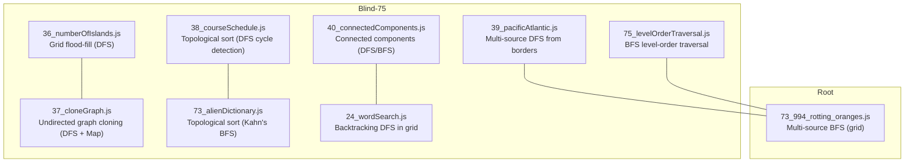

**Diagram sources**
- [36_numberOfIslands.js](file://Blind-75/36_numberOfIslands.js#L1-L97)
- [37_cloneGraph.js](file://Blind-75/37_cloneGraph.js#L1-L80)
- [38_courseSchedule.js](file://Blind-75/38_courseSchedule.js#L1-L90)
- [39_pacificAtlantic.js](file://Blind-75/39_pacificAtlantic.js#L1-L91)
- [40_connectedComponents.js](file://Blind-75/40_connectedComponents.js#L1-L75)
- [73_alienDictionary.js](file://Blind-75/73_alienDictionary.js#L1-L103)
- [24_wordSearch.js](file://Blind-75/24_wordSearch.js#L1-L92)
- [75_levelOrderTraversal.js](file://Blind-75/75_levelOrderTraversal.js#L1-L116)
- [73_994_rotting_oranges.js](file://73_994_rotting_oranges.js#L1-L88)

**Section sources**
- [36_numberOfIslands.js](file://Blind-75/36_numberOfIslands.js#L1-L97)
- [37_cloneGraph.js](file://Blind-75/37_cloneGraph.js#L1-L80)
- [38_courseSchedule.js](file://Blind-75/38_courseSchedule.js#L1-L90)
- [39_pacificAtlantic.js](file://Blind-75/39_pacificAtlantic.js#L1-L91)
- [40_connectedComponents.js](file://Blind-75/40_connectedComponents.js#L1-L75)
- [73_alienDictionary.js](file://Blind-75/73_alienDictionary.js#L1-L103)
- [24_wordSearch.js](file://Blind-75/24_wordSearch.js#L1-L92)
- [75_levelOrderTraversal.js](file://Blind-75/75_levelOrderTraversal.js#L1-L116)
- [73_994_rotting_oranges.js](file://73_994_rotting_oranges.js#L1-L88)

## Core Components
This section highlights the primary graph algorithms implemented in the repository and their core logic.

- Island Counting (Grid flood-fill with DFS):
  - Scans a 2D grid for land cells and uses DFS to sink connected land clusters, counting each new discovery as a distinct island.
  - Uses in-place modification to save space and explores four cardinal directions.

- Graph Cloning (Undirected graph):
  - Performs a recursive DFS with a hash map to clone nodes and handle cycles by mapping original nodes to their clones.

- Course Schedule (Topological Sort via DFS):
  - Builds a directed adjacency list and detects cycles using three-state DFS to determine if all courses can be completed.

- Pacific Atlantic Water Flow (Multi-source DFS):
  - Starts DFS from ocean borders and marks cells reachable by each ocean; intersection yields the answer.

- Connected Components (Undirected graph):
  - Builds an adjacency list and counts components by initiating DFS from each unvisited node.

- Alien Dictionary (Topological Sort via Kahn’s BFS):
  - Compares adjacent words to infer character ordering, constructs a graph, and performs BFS-based topological sort.

- Word Search (Backtracking DFS in grid):
  - Explores all paths from each cell, marking visited cells and backtracking after recursion.

- Level Order Traversal (BFS):
  - Processes nodes level by level using a queue to produce level-wise arrays.

- Rotting Oranges (Multi-source BFS in grid):
  - Initializes a queue with all initially rotten oranges and spreads rot level-by-level, tracking maximum time.

**Section sources**
- [36_numberOfIslands.js](file://Blind-75/36_numberOfIslands.js#L48-L86)
- [37_cloneGraph.js](file://Blind-75/37_cloneGraph.js#L56-L79)
- [38_courseSchedule.js](file://Blind-75/38_courseSchedule.js#L48-L85)
- [39_pacificAtlantic.js](file://Blind-75/39_pacificAtlantic.js#L41-L90)
- [40_connectedComponents.js](file://Blind-75/40_connectedComponents.js#L43-L71)
- [73_alienDictionary.js](file://Blind-75/73_alienDictionary.js#L45-L98)
- [24_wordSearch.js](file://Blind-75/24_wordSearch.js#L42-L83)
- [75_levelOrderTraversal.js](file://Blind-75/75_levelOrderTraversal.js#L55-L97)
- [73_994_rotting_oranges.js](file://73_994_rotting_oranges.js#L25-L86)

## Architecture Overview
The algorithms share common patterns:
- Graph representation: adjacency lists for sparse graphs; matrices for grid-based problems.
- Traversal strategies: DFS for connectivity and cloning; BFS for level-order processing and multi-source scenarios.
- State tracking: visited arrays/maps, three-state DFS for cycle detection, and in-place modifications for space efficiency.

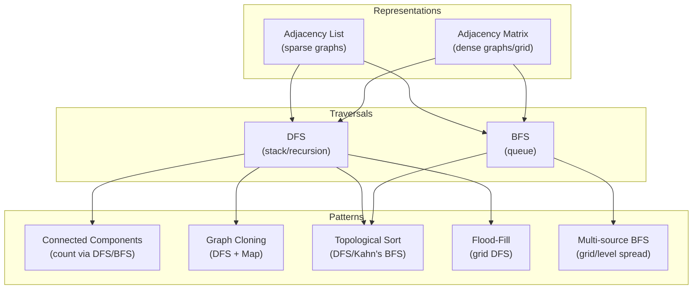

[No sources needed since this diagram shows conceptual workflow, not actual code structure]

## Detailed Component Analysis

### Island Counting (Grid flood-fill with DFS)
- Purpose: Count connected land clusters in a 2D grid.
- Approach: Iterate grid; on encountering land, increment count and sink the entire island via DFS in four directions.
- Complexity: Time O(mn), Space O(mn) worst-case recursion stack.
- Key insight: In-place modification avoids extra visited structures.

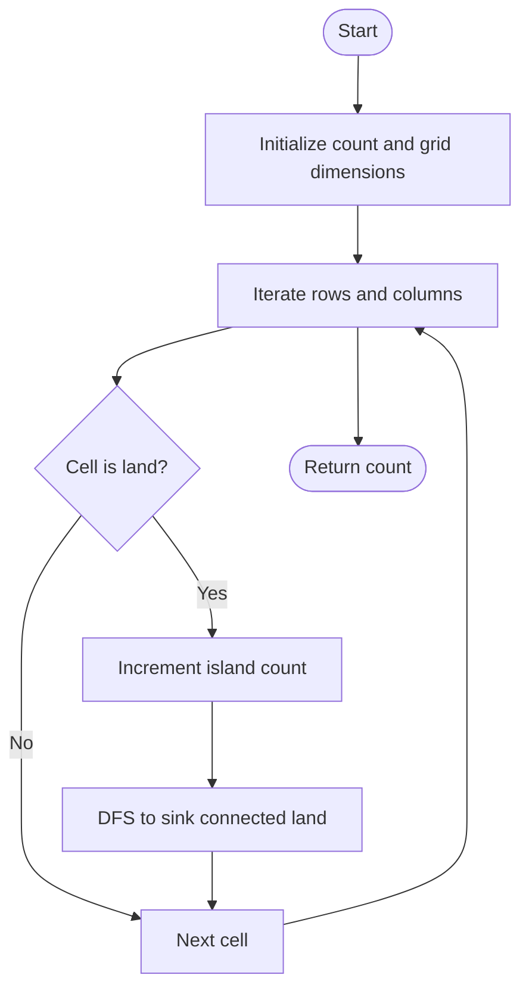

**Diagram sources**
- [36_numberOfIslands.js](file://Blind-75/36_numberOfIslands.js#L48-L86)

**Section sources**
- [36_numberOfIslands.js](file://Blind-75/36_numberOfIslands.js#L1-L97)

### Graph Cloning (Undirected graph)
- Purpose: Return a deep copy of an undirected graph with cycles.
- Approach: DFS with a hash map mapping original nodes to clones; create clone before recursing to handle cycles.
- Complexity: Time O(V + E), Space O(V).

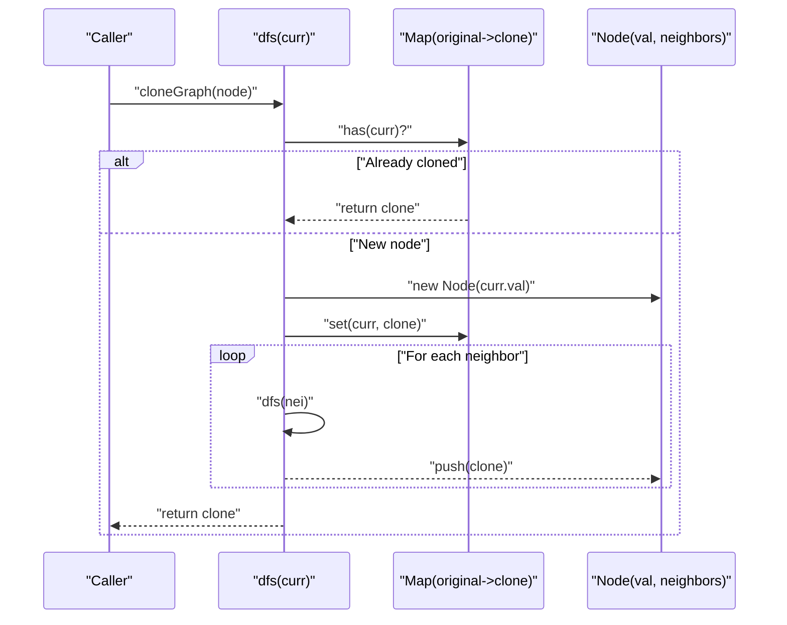

**Diagram sources**
- [37_cloneGraph.js](file://Blind-75/37_cloneGraph.js#L56-L79)

**Section sources**
- [37_cloneGraph.js](file://Blind-75/37_cloneGraph.js#L1-L80)

### Course Schedule (Topological Sort via DFS)
- Purpose: Determine if all courses can be completed given prerequisites.
- Approach: Build adjacency list; use three-state DFS to detect cycles.
- Complexity: Time O(V + E), Space O(V + E).

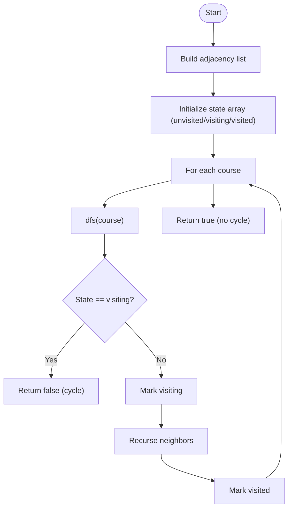

**Diagram sources**
- [38_courseSchedule.js](file://Blind-75/38_courseSchedule.js#L48-L85)

**Section sources**
- [38_courseSchedule.js](file://Blind-75/38_courseSchedule.js#L1-L90)

### Pacific Atlantic Water Flow (Multi-source DFS)
- Purpose: Find cells reachable by both Pacific and Atlantic oceans.
- Approach: Start DFS from all border cells for each ocean; intersection yields the answer.
- Complexity: Time O(mn), Space O(mn).

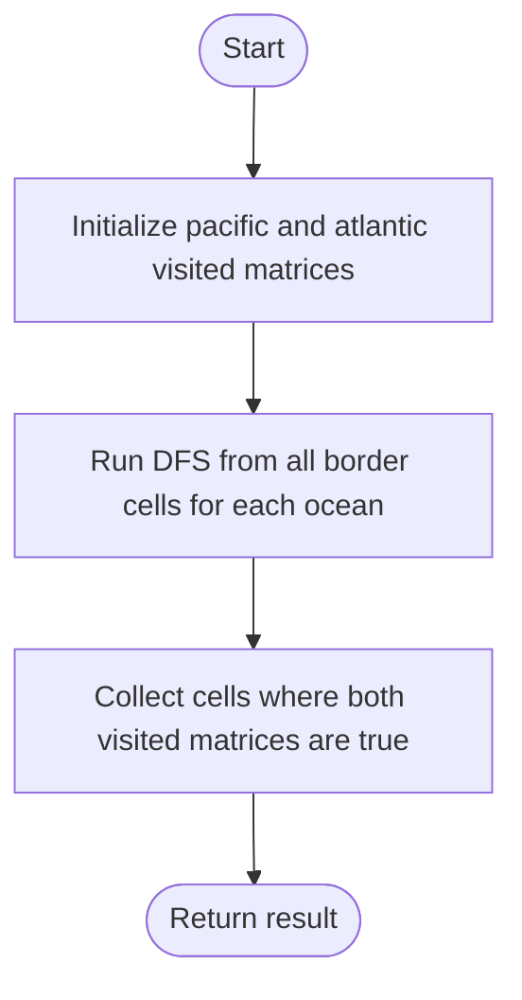

**Diagram sources**
- [39_pacificAtlantic.js](file://Blind-75/39_pacificAtlantic.js#L41-L90)

**Section sources**
- [39_pacificAtlantic.js](file://Blind-75/39_pacificAtlantic.js#L1-L91)

### Connected Components (Undirected graph)
- Purpose: Count connected components in an undirected graph.
- Approach: Build adjacency list; initiate DFS from each unvisited node and increment component count.
- Complexity: Time O(V + E), Space O(V + E).

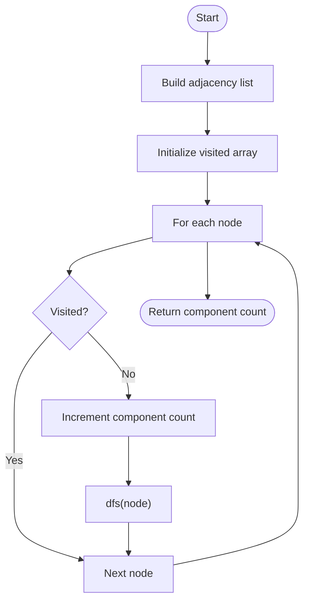

**Diagram sources**
- [40_connectedComponents.js](file://Blind-75/40_connectedComponents.js#L43-L71)

**Section sources**
- [40_connectedComponents.js](file://Blind-75/40_connectedComponents.js#L1-L75)

### Alien Dictionary (Topological Sort via Kahn’s BFS)
- Purpose: Derive character order from a lexicographically sorted dictionary.
- Approach: Compare adjacent words to infer edges, compute indegrees, and perform BFS-based topological sort.
- Complexity: Time O(C), Space O(V + E).

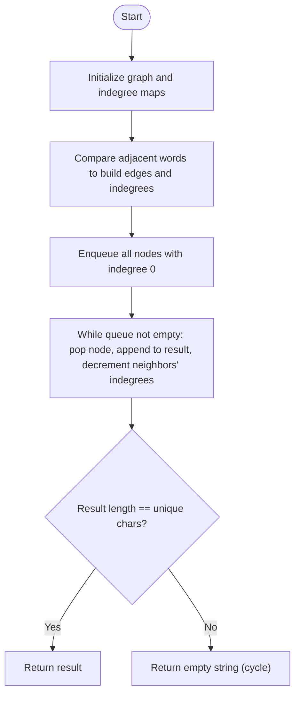

**Diagram sources**
- [73_alienDictionary.js](file://Blind-75/73_alienDictionary.js#L45-L98)

**Section sources**
- [73_alienDictionary.js](file://Blind-75/73_alienDictionary.js#L1-L103)

### Word Search (Backtracking DFS in grid)
- Purpose: Determine if a word exists in a grid by moving to adjacent cells without reusing a cell.
- Approach: DFS from each cell; mark visited temporarily and backtrack after recursion.
- Complexity: Time O(N·4^L), Space O(L).

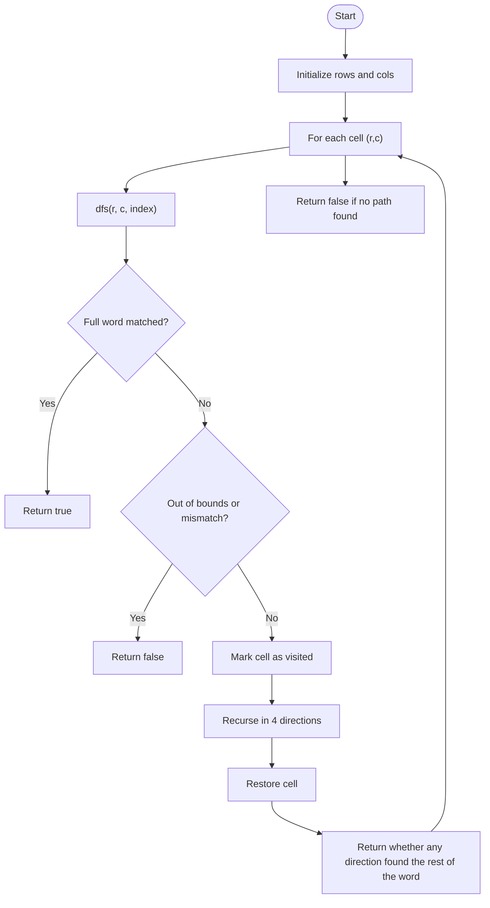

**Diagram sources**
- [24_wordSearch.js](file://Blind-75/24_wordSearch.js#L42-L83)

**Section sources**
- [24_wordSearch.js](file://Blind-75/24_wordSearch.js#L1-L92)

### Level Order Traversal (BFS)
- Purpose: Produce level-wise traversal of a binary tree.
- Approach: BFS with a queue; process nodes level by level by tracking queue size.
- Complexity: Time O(n), Space O(n).

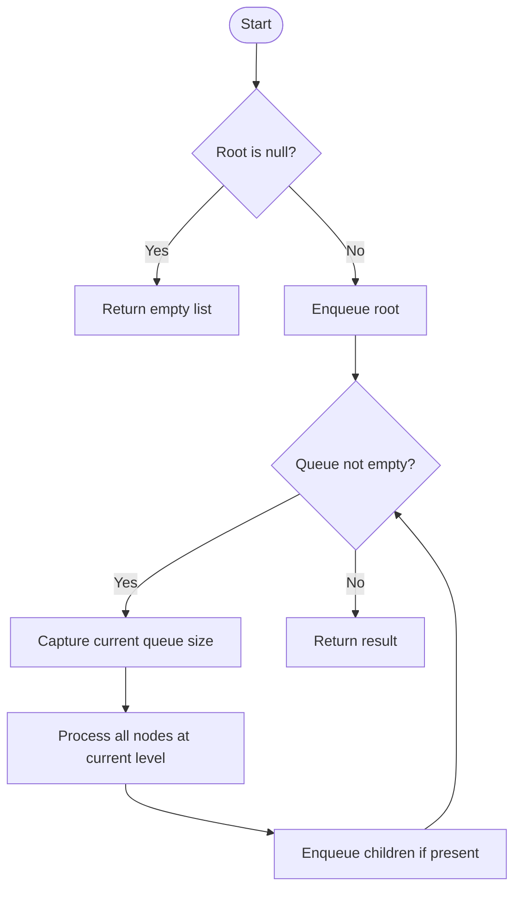

**Diagram sources**
- [75_levelOrderTraversal.js](file://Blind-75/75_levelOrderTraversal.js#L55-L97)

**Section sources**
- [75_levelOrderTraversal.js](file://Blind-75/75_levelOrderTraversal.js#L1-L116)

### Rotting Oranges (Multi-source BFS in grid)
- Purpose: Compute the minimum minutes to rot all fresh oranges or return -1 if impossible.
- Approach: Initialize queue with all initially rotten oranges; spread rot level-by-level and track maximum time.
- Complexity: Time O(mn), Space O(mn).

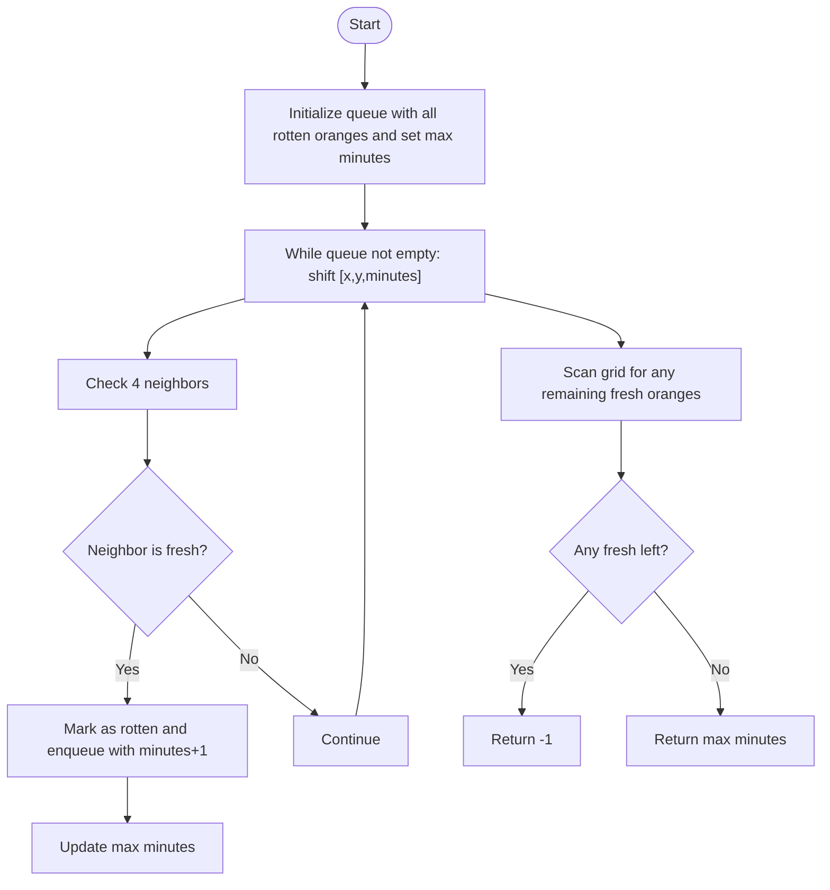

**Diagram sources**
- [73_994_rotting_oranges.js](file://73_994_rotting_oranges.js#L25-L86)

**Section sources**
- [73_994_rotting_oranges.js](file://73_994_rotting_oranges.js#L1-L88)

## Dependency Analysis
- Representation choices:
  - Adjacency lists are used for general graphs (cloning, course schedule, connected components, alien dictionary), enabling efficient traversal and memory usage for sparse graphs.
  - Matrices are used for grid-based problems (island counting, pacific-atlantic, word search, rotting oranges), simplifying boundary checks and directional indexing.
- Coupling and cohesion:
  - Each algorithm encapsulates its own traversal logic and state management, minimizing cross-file dependencies.
  - Shared patterns (DFS/BFS) appear across multiple files with consistent state handling and termination conditions.
- External dependencies:
  - No external libraries are used; all implementations rely on native JavaScript structures (arrays, queues, maps).

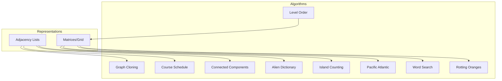

**Diagram sources**
- [36_numberOfIslands.js](file://Blind-75/36_numberOfIslands.js#L48-L86)
- [37_cloneGraph.js](file://Blind-75/37_cloneGraph.js#L56-L79)
- [38_courseSchedule.js](file://Blind-75/38_courseSchedule.js#L48-L85)
- [39_pacificAtlantic.js](file://Blind-75/39_pacificAtlantic.js#L41-L90)
- [40_connectedComponents.js](file://Blind-75/40_connectedComponents.js#L43-L71)
- [73_alienDictionary.js](file://Blind-75/73_alienDictionary.js#L45-L98)
- [24_wordSearch.js](file://Blind-75/24_wordSearch.js#L42-L83)
- [75_levelOrderTraversal.js](file://Blind-75/75_levelOrderTraversal.js#L55-L97)
- [73_994_rotting_oranges.js](file://73_994_rotting_oranges.js#L25-L86)

**Section sources**
- [36_numberOfIslands.js](file://Blind-75/36_numberOfIslands.js#L1-L97)
- [37_cloneGraph.js](file://Blind-75/37_cloneGraph.js#L1-L80)
- [38_courseSchedule.js](file://Blind-75/38_courseSchedule.js#L1-L90)
- [39_pacificAtlantic.js](file://Blind-75/39_pacificAtlantic.js#L1-L91)
- [40_connectedComponents.js](file://Blind-75/40_connectedComponents.js#L1-L75)
- [73_alienDictionary.js](file://Blind-75/73_alienDictionary.js#L1-L103)
- [24_wordSearch.js](file://Blind-75/24_wordSearch.js#L1-L92)
- [75_levelOrderTraversal.js](file://Blind-75/75_levelOrderTraversal.js#L1-L116)
- [73_994_rotting_oranges.js](file://73_994_rotting_oranges.js#L1-L88)

## Performance Considerations
- Adjacency lists vs matrices:
  - Adjacency lists are preferred for sparse graphs to reduce space and improve traversal efficiency.
  - Matrices simplify boundary handling and directional indexing for grid-based problems.
- Traversal strategies:
  - DFS is memory-intensive for deep recursion; consider iterative stacks for extremely deep graphs.
  - BFS uses queues and is ideal for shortest path in unweighted graphs and multi-source scenarios.
- Optimization strategies:
  - In-place modifications (e.g., sink islands) reduce auxiliary space.
  - Precompute indegrees for topological sorts to enable efficient queue-based processing.
  - Early termination checks (e.g., detecting cycles or impossible states) avoid unnecessary computation.
- Large graphs:
  - Use iterative DFS/BFS to avoid recursion limits.
  - Prefer adjacency lists for sparse structures; use matrices for dense or grid-like structures.

[No sources needed since this section provides general guidance]

## Troubleshooting Guide
- Common pitfalls:
  - Off-by-one errors in grid boundaries; ensure strict boundary checks before DFS/BFS.
  - Forgetting to mark/unmark visited cells during backtracking (word search).
  - Not handling cycles in graph cloning; use a map to prevent duplication.
  - Misinterpreting prerequisites direction in course scheduling; ensure edges reflect “before” relationships.
  - Incorrectly computing indegrees in topological sorts; initialize all nodes, including those with zero out-degree.
- Edge cases:
  - Empty graphs or grids: return appropriate base values (0 components, false for existence).
  - Disconnected graphs: ensure traversal starts from all unvisited nodes.
  - Special structures: self-loops, multi-edges, and self-references require careful state tracking.

**Section sources**
- [36_numberOfIslands.js](file://Blind-75/36_numberOfIslands.js#L56-L62)
- [24_wordSearch.js](file://Blind-75/24_wordSearch.js#L58-L70)
- [37_cloneGraph.js](file://Blind-75/37_cloneGraph.js#L62-L76)
- [38_courseSchedule.js](file://Blind-75/38_courseSchedule.js#L56-L76)
- [73_alienDictionary.js](file://Blind-75/73_alienDictionary.js#L58-L76)

## Conclusion
The repository demonstrates robust implementations of core graph algorithms, showcasing DFS and BFS patterns, topological sorting, and multi-source processing. By leveraging adjacency lists for sparse graphs and matrices for grids, the solutions achieve optimal time/space trade-offs. The included patterns—flood-fill, cloning with cycle handling, dependency validation, and level-order traversal—are widely applicable to real-world problems involving connectivity, scheduling, and spatial reasoning.

[No sources needed since this section summarizes without analyzing specific files]

## Appendices
- Additional BFS-based problems:
  - Rotting Oranges: Multi-source BFS for level-spread propagation.
- Related traversal patterns:
  - Level Order Traversal: BFS with level-wise grouping.
- Practical tips:
  - Always validate inputs and handle edge cases early.
  - Choose representation based on sparsity and problem structure.
  - Use maps/queues thoughtfully to manage state and avoid redundant work.

[No sources needed since this section provides general guidance]