# Linked List Problems

<cite>
**Referenced Files in This Document**
- [30_707_linked_list_design_linked_list.js](file://30_707_linked_list_design_linked_list.js)
- [31_876_linked_list_middle_node.js](file://31_876_linked_list_middle_node.js)
- [32_206_linked_list_reverse.js](file://32_206_linked_list_reverse.js)
- [33_141_linked-list-cycle.js](file://33_141_linked-list-cycle.js)
- [34_234_palindrome-linked-list.js](file://34_234_palindrome-linked-list.js)
- [35_160_intersection-of-two-linked-lists.js](file://35_160_intersection-of-two-linked-lists.js)
- [36_203_remove-linked-list-element.js](file://36_203_remove-linked-list-element.js)
- [37_19_removeNthnode.js](file://37_19_removeNthnode.js)
- [38_83_remove_duplicate.js](file://38_83_remove_duplicate.js)
- [39_328_odd_even_linked_list.js](file://39_328_odd_even_linked_list.js)
- [40_2_add_two_numbers.js](file://40_2_add_two_numbers.js)
- [41_21_merge_two_sorted_lists.js](file://41_21_merge_two_sorted_lists.js)
- [41_61_rotate_linked_list.js](file://41_61_rotate_linked_list.js)
- [42_24_swap_nodes_in_pairts.js](file://42_24_swap_nodes_in_pairts.js)
- [43_24_swap_nodes_in_pair_recurcive_approch.js](file://43_24_swap_nodes_in_pair_recurcive_approch.js)
</cite>

## Table of Contents
1. [Introduction](#introduction)
2. [Project Structure](#project-structure)
3. [Core Components](#core-components)
4. [Architecture Overview](#architecture-overview)
5. [Detailed Component Analysis](#detailed-component-analysis)
6. [Dependency Analysis](#dependency-analysis)
7. [Performance Considerations](#performance-considerations)
8. [Troubleshooting Guide](#troubleshooting-guide)
9. [Conclusion](#conclusion)

## Introduction
This document consolidates linked list algorithm patterns and techniques implemented in the repository. It focuses on fundamental operations and advanced manipulations, including:
- Fast-slow pointer methods for cycle detection and midpoint finding
- Dummy node patterns for head modifications
- Iterative vs recursive reversal approaches
- Merging sorted lists, removing nodes, reordering operations, and cycle detection
- Specialized patterns such as swapping adjacent nodes, partitioning odd-even nodes, and adding numbers represented as linked lists
- Complexity trade-offs and edge-case handling for empty lists, single nodes, and circular structures
- Pitfalls and debugging techniques for pointer manipulation and memory management

## Project Structure
The linked list implementations are organized as standalone JavaScript files, each encapsulating a specific problem and its solution. They share a common pattern:
- A ListNode constructor/utility is used to define nodes
- Operations manipulate next pointers to transform or reorder the list
- Edge cases are handled explicitly (empty list, single node, tail connections)

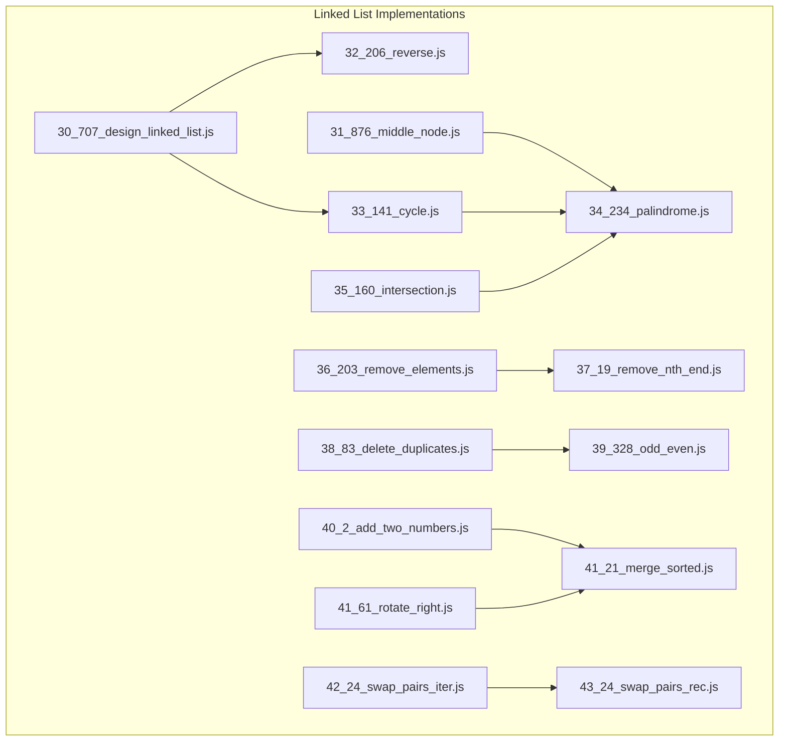
```mermaid
graph TB
subgraph "Linked List Implementations"
A["30_707_design_linked_list.js"]
B["31_876_middle_node.js"]
C["32_206_reverse.js"]
D["33_141_cycle.js"]
E["34_234_palindrome.js"]
F["35_160_intersection.js"]
G["36_203_remove_elements.js"]
H["37_19_remove_nth_end.js"]
I["38_83_delete_duplicates.js"]
J["39_328_odd_even.js"]
K["40_2_add_two_numbers.js"]
L["41_21_merge_sorted.js"]
M["41_61_rotate_right.js"]
N["42_24_swap_pairs_iter.js"]
O["43_24_swap_pairs_rec.js"]
end
A --> C
A --> D
B --> E
D --> E
F --> E
G --> H
I --> J
K --> L
M --> L
N --> O
```

**Diagram sources**
- [30_707_linked_list_design_linked_list.js](file://30_707_linked_list_design_linked_list.js#L20-L28)
- [31_876_linked_list_middle_node.js](file://31_876_linked_list_middle_node.js#L19-L28)
- [32_206_linked_list_reverse.js](file://32_206_linked_list_reverse.js#L19-L28)
- [33_141_linked-list-cycle.js](file://33_141_linked-list-cycle.js#L47-L52)
- [34_234_palindrome-linked-list.js](file://34_234_palindrome-linked-list.js#L16-L22)
- [35_160_intersection-of-two-linked-lists.js](file://35_160_intersection-of-two-linked-lists.js#L17-L22)
- [36_203_remove-linked-list-element.js](file://36_203_remove-linked-list-element.js#L17-L22)
- [37_19_removeNthnode.js](file://37_19_removeNthnode.js#L18-L23)
- [38_83_remove_duplicate.js](file://38_83_remove_duplicate.js#L17-L23)
- [39_328_odd_even_linked_list.js](file://39_328_odd_even_linked_list.js#L17-L23)
- [40_2_add_two_numbers.js](file://40_2_add_two_numbers.js#L18-L24)
- [41_21_merge_two_sorted_lists.js](file://41_21_merge_two_sorted_lists.js#L22-L28)
- [41_61_rotate_linked_list.js](file://41_61_rotate_linked_list.js#L17-L21)
- [42_24_swap_nodes_in_pairts.js](file://42_24_swap_nodes_in_pairts.js#L18-L24)
- [43_24_swap_nodes_in_pair_recurcive_approch.js](file://43_24_swap_nodes_in_pair_recurcive_approch.js#L18-L24)

**Section sources**
- [30_707_linked_list_design_linked_list.js](file://30_707_linked_list_design_linked_list.js#L1-L144)
- [31_876_linked_list_middle_node.js](file://31_876_linked_list_middle_node.js#L1-L43)
- [32_206_linked_list_reverse.js](file://32_206_linked_list_reverse.js#L1-L45)
- [33_141_linked-list-cycle.js](file://33_141_linked-list-cycle.js#L1-L77)
- [34_234_palindrome-linked-list.js](file://34_234_palindrome-linked-list.js#L1-L58)
- [35_160_intersection-of-two-linked-lists.js](file://35_160_intersection-of-two-linked-lists.js#L1-L45)
- [36_203_remove-linked-list-element.js](file://36_203_remove-linked-list-element.js#L1-L44)
- [37_19_removeNthnode.js](file://37_19_removeNthnode.js#L1-L92)
- [38_83_remove_duplicate.js](file://38_83_remove_duplicate.js#L1-L41)
- [39_328_odd_even_linked_list.js](file://39_328_odd_even_linked_list.js#L1-L45)
- [40_2_add_two_numbers.js](file://40_2_add_two_numbers.js#L1-L48)
- [41_21_merge_two_sorted_lists.js](file://41_21_merge_two_sorted_lists.js#L1-L109)
- [41_61_rotate_linked_list.js](file://41_61_rotate_linked_list.js#L1-L53)
- [42_24_swap_nodes_in_pairts.js](file://42_24_swap_nodes_in_pairts.js#L1-L58)
- [43_24_swap_nodes_in_pair_recurcive_approch.js](file://43_24_swap_nodes_in_pair_recurcive_approch.js#L1-L45)

## Core Components
- ListNode abstraction: A minimal node structure with a value and a next pointer is used across most files to represent list elements.
- Sentinel/dummy node pattern: Employed to simplify head modifications and avoid special-case handling for the first node.
- Fast-slow pointer technique: Used for midpoint detection, cycle detection, and removal of nth-from-end nodes.
- Iterative and recursive reversal: Demonstrated via iterative pointer rewiring and recursive pairwise swapping.
- Merge and partition strategies: Dummy heads for merges; odd-even partitioning by splicing separate subsequences.

Key implementation references:
- ListNode definition and prototypes: [30_707_linked_list_design_linked_list.js](file://30_707_linked_list_design_linked_list.js#L20-L28), [31_876_linked_list_middle_node.js](file://31_876_linked_list_middle_node.js#L19-L28), [32_206_linked_list_reverse.js](file://32_206_linked_list_reverse.js#L19-L28), [33_141_linked-list-cycle.js](file://33_141_linked-list-cycle.js#L47-L52), [34_234_palindrome-linked-list.js](file://34_234_palindrome-linked-list.js#L16-L22), [35_160_intersection-of-two-linked-lists.js](file://35_160_intersection-of-two-linked-lists.js#L17-L22), [36_203_remove-linked-list-element.js](file://36_203_remove-linked-list-element.js#L17-L22), [37_19_removeNthnode.js](file://37_19_removeNthnode.js#L18-L23), [38_83_remove_duplicate.js](file://38_83_remove_duplicate.js#L17-L23), [39_328_odd_even_linked_list.js](file://39_328_odd_even_linked_list.js#L17-L23), [40_2_add_two_numbers.js](file://40_2_add_two_numbers.js#L18-L24), [41_21_merge_two_sorted_lists.js](file://41_21_merge_two_sorted_lists.js#L22-L28), [41_61_rotate_linked_list.js](file://41_61_rotate_linked_list.js#L17-L21), [42_24_swap_nodes_in_pairts.js](file://42_24_swap_nodes_in_pairts.js#L18-L24), [43_24_swap_nodes_in_pair_recurcive_approch.js](file://43_24_swap_nodes_in_pair_recurcive_approch.js#L18-L24)

**Section sources**
- [30_707_linked_list_design_linked_list.js](file://30_707_linked_list_design_linked_list.js#L20-L28)
- [31_876_linked_list_middle_node.js](file://31_876_linked_list_middle_node.js#L19-L28)
- [32_206_linked_list_reverse.js](file://32_206_linked_list_reverse.js#L19-L28)
- [33_141_linked-list-cycle.js](file://33_141_linked-list-cycle.js#L47-L52)
- [34_234_palindrome-linked-list.js](file://34_234_palindrome-linked-list.js#L16-L22)
- [35_160_intersection-of-two-linked-lists.js](file://35_160_intersection-of-two-linked-lists.js#L17-L22)
- [36_203_remove-linked-list-element.js](file://36_203_remove-linked-list-element.js#L17-L22)
- [37_19_removeNthnode.js](file://37_19_removeNthnode.js#L18-L23)
- [38_83_remove_duplicate.js](file://38_83_remove_duplicate.js#L17-L23)
- [39_328_odd_even_linked_list.js](file://39_328_odd_even_linked_list.js#L17-L23)
- [40_2_add_two_numbers.js](file://40_2_add_two_numbers.js#L18-L24)
- [41_21_merge_two_sorted_lists.js](file://41_21_merge_two_sorted_lists.js#L22-L28)
- [41_61_rotate_linked_list.js](file://41_61_rotate_linked_list.js#L17-L21)
- [42_24_swap_nodes_in_pairts.js](file://42_24_swap_nodes_in_pairts.js#L18-L24)
- [43_24_swap_nodes_in_pair_recurcive_approch.js](file://43_24_swap_nodes_in_pair_recurcive_approch.js#L18-L24)

## Architecture Overview
The linked list solutions follow a consistent architecture:
- Problem-specific logic encapsulated in functions that operate on ListNode heads
- Shared patterns (dummy nodes, fast-slow pointers) reused across multiple problems
- Clear separation between traversal, pointer rewiring, and edge-case handling

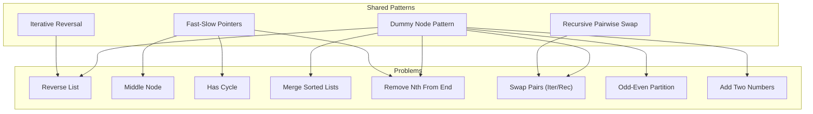
```mermaid
graph TB
subgraph "Shared Patterns"
P1["Dummy Node Pattern"]
P2["Fast-Slow Pointers"]
P3["Iterative Reversal"]
P4["Recursive Pairwise Swap"]
end
subgraph "Problems"
R1["Reverse List"]
R2["Middle Node"]
R3["Has Cycle"]
R4["Merge Sorted Lists"]
R5["Remove Nth From End"]
R6["Swap Pairs (Iter/Rec)"]
R7["Odd-Even Partition"]
R8["Add Two Numbers"]
end
P1 --> R1
P1 --> R5
P1 --> R6
P2 --> R2
P2 --> R3
P2 --> R5
P3 --> R1
P4 --> R6
P1 --> R4
P1 --> R7
P1 --> R8
```

**Diagram sources**
- [32_206_linked_list_reverse.js](file://32_206_linked_list_reverse.js#L30-L45)
- [31_876_linked_list_middle_node.js](file://31_876_linked_list_middle_node.js#L29-L43)
- [33_141_linked-list-cycle.js](file://33_141_linked-list-cycle.js#L60-L74)
- [37_19_removeNthnode.js](file://37_19_removeNthnode.js#L30-L53)
- [42_24_swap_nodes_in_pairts.js](file://42_24_swap_nodes_in_pairts.js#L29-L55)
- [43_24_swap_nodes_in_pair_recurcive_approch.js](file://43_24_swap_nodes_in_pair_recurcive_approch.js#L29-L42)
- [41_21_merge_two_sorted_lists.js](file://41_21_merge_two_sorted_lists.js#L34-L58)
- [39_328_odd_even_linked_list.js](file://39_328_odd_even_linked_list.js#L28-L42)
- [40_2_add_two_numbers.js](file://40_2_add_two_numbers.js#L30-L48)

## Detailed Component Analysis

### Reverse Linked List (Iterative)
- Technique: Three-pointer iterative rewiring (prev, curr, temp)
- Steps:
  - Initialize prev to null and curr to head
  - For each node, save next in temp, point curr.next to prev, advance prev and curr
- Complexity: Time O(n), Space O(1)
- Edge cases: Empty list and single node handled implicitly by loop condition

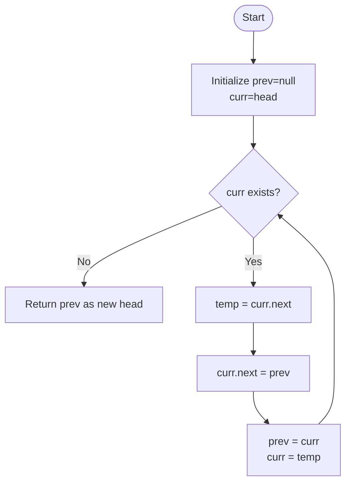
```mermaid
flowchart TD
Start(["Start"]) --> Init["Initialize prev=null<br/>curr=head"]
Init --> Loop{"curr exists?"}
Loop --> |No| ReturnPrev["Return prev as new head"]
Loop --> |Yes| SaveNext["temp = curr.next"]
SaveNext --> Rewire["curr.next = prev"]
Rewire --> Advance["prev = curr<br/>curr = temp"]
Advance --> Loop
```

**Diagram sources**
- [32_206_linked_list_reverse.js](file://32_206_linked_list_reverse.js#L30-L45)

**Section sources**
- [32_206_linked_list_reverse.js](file://32_206_linked_list_reverse.js#L1-L45)

### Middle of the Linked List
- Technique: Fast-slow pointers to find midpoint
- Steps:
  - Move slow by one step and fast by two steps until fast reaches end
  - Return slow as the middle node
- Complexity: Time O(n), Space O(1)

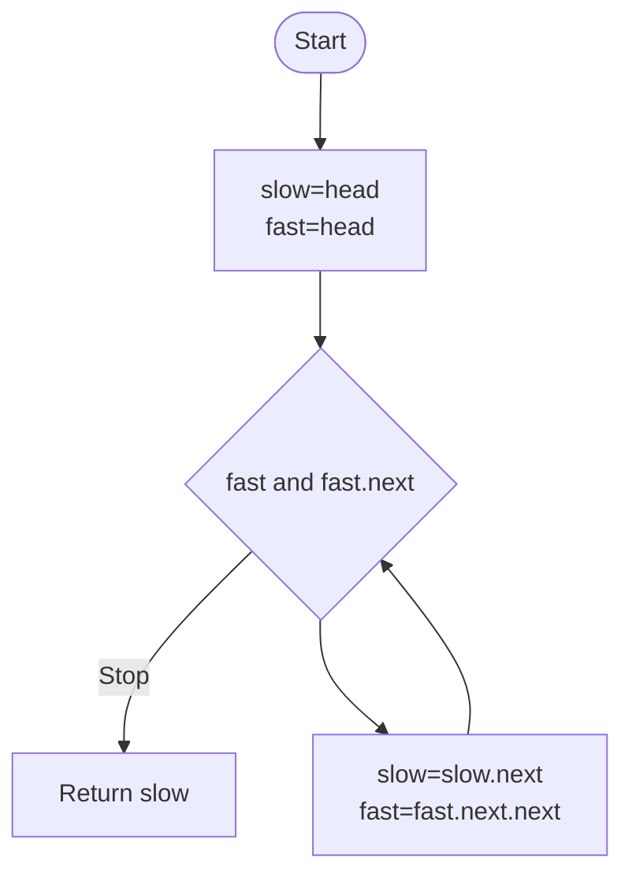
```mermaid
flowchart TD
Start(["Start"]) --> Init["slow=head<br/>fast=head"]
Init --> Loop{"fast and fast.next"}
Loop --> |Stop| ReturnSlow["Return slow"]
Loop --> Step["slow=slow.next<br/>fast=fast.next.next"]
Step --> Loop
```

**Diagram sources**
- [31_876_linked_list_middle_node.js](file://31_876_linked_list_middle_node.js#L29-L43)

**Section sources**
- [31_876_linked_list_middle_node.js](file://31_876_linked_list_middle_node.js#L1-L43)

### Linked List Cycle Detection (Floyd’s Algorithm)
- Technique: Fast-slow pointers to detect cycle
- Steps:
  - Advance slow by one and fast by two
  - If they meet, a cycle exists; if fast reaches end, no cycle
- Complexity: Time O(n), Space O(1)

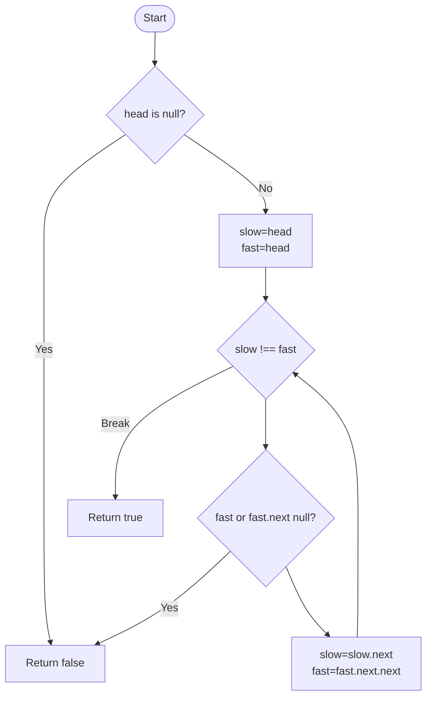
```mermaid
flowchart TD
Start(["Start"]) --> CheckEmpty{"head is null?"}
CheckEmpty --> |Yes| ReturnFalse["Return false"]
CheckEmpty --> |No| Init["slow=head<br/>fast=head"]
Init --> Loop{"slow !== fast"}
Loop --> |Break| ReturnTrue["Return true"]
Loop --> CheckFast{"fast or fast.next null?"}
CheckFast --> |Yes| ReturnFalse
CheckFast --> Step["slow=slow.next<br/>fast=fast.next.next"]
Step --> Loop
```

**Diagram sources**
- [33_141_linked-list-cycle.js](file://33_141_linked-list-cycle.js#L60-L74)

**Section sources**
- [33_141_linked-list-cycle.js](file://33_141_linked-list-cycle.js#L1-L77)

### Palindrome Linked List
- Technique: Find midpoint, reverse second half, compare halves
- Steps:
  - Use fast-slow to locate midpoint
  - Reverse second half iteratively
  - Compare first and reversed second half pointers
- Complexity: Time O(n), Space O(1)

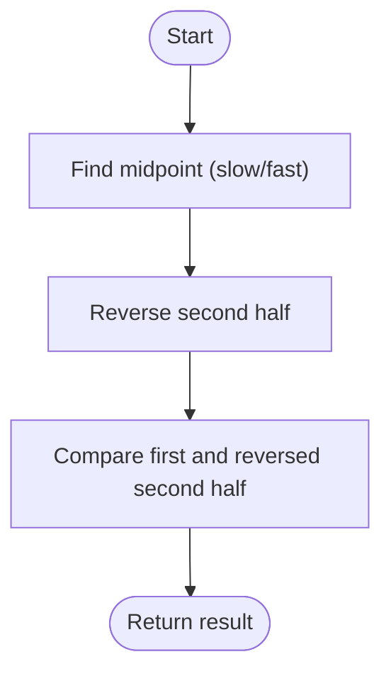
```mermaid
flowchart TD
Start(["Start"]) --> Mid["Find midpoint (slow/fast)"]
Mid --> Reverse["Reverse second half"]
Reverse --> Compare["Compare first and reversed second half"]
Compare --> Done(["Return result"])
```

**Diagram sources**
- [34_234_palindrome-linked-list.js](file://34_234_palindrome-linked-list.js#L25-L55)

**Section sources**
- [34_234_palindrome-linked-list.js](file://34_234_palindrome-linked-list.js#L1-L58)

### Intersection of Two Linked Lists
- Technique: Store one list’s nodes in a set, iterate the other to find first intersecting node
- Steps:
  - Traverse headB and insert nodes into a Set
  - Traverse headA and return first node found in the Set
- Complexity: Time O(m+n), Space O(m)

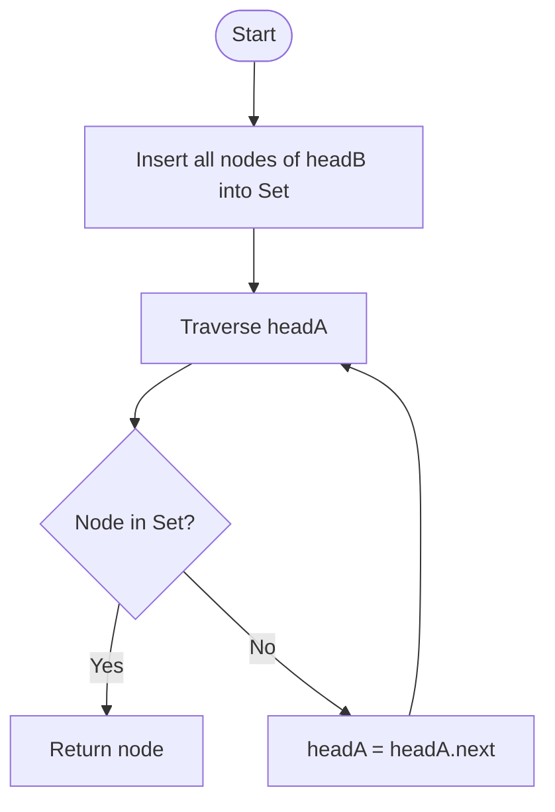
```mermaid
flowchart TD
Start(["Start"]) --> AddB["Insert all nodes of headB into Set"]
AddB --> TraverseA["Traverse headA"]
TraverseA --> Found{"Node in Set?"}
Found --> |Yes| ReturnNode["Return node"]
Found --> |No| NextA["headA = headA.next"]
NextA --> TraverseA
```

**Diagram sources**
- [35_160_intersection-of-two-linked-lists.js](file://35_160_intersection-of-two-linked-lists.js#L29-L45)

**Section sources**
- [35_160_intersection-of-two-linked-lists.js](file://35_160_intersection-of-two-linked-lists.js#L1-L45)

### Remove Linked List Elements (Dummy Node)
- Technique: Sentinel node simplifies head removal
- Steps:
  - Create sentinel.next = head
  - Iterate with prev; if prev.next.val equals target, skip the node
- Complexity: Time O(n), Space O(1)

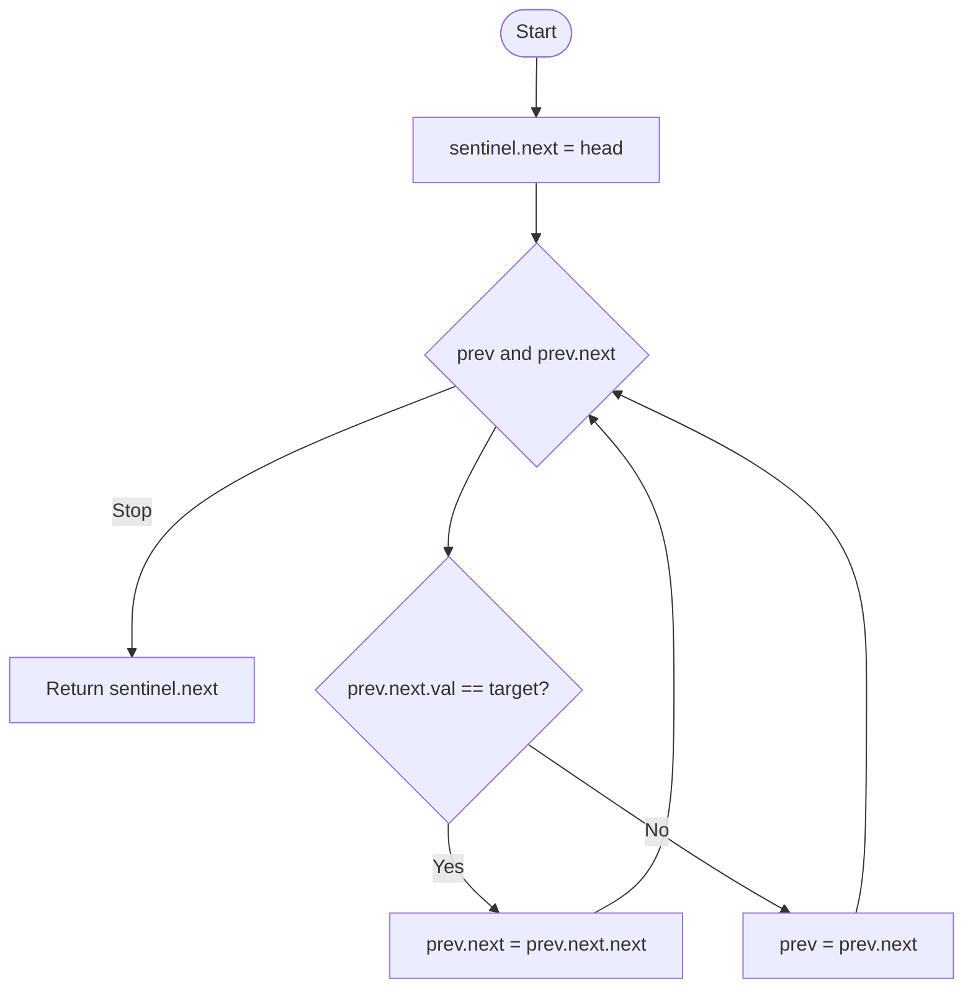
```mermaid
flowchart TD
Start(["Start"]) --> Dummy["sentinel.next = head"]
Dummy --> Loop{"prev and prev.next"}
Loop --> |Stop| ReturnHead["Return sentinel.next"]
Loop --> Check{"prev.next.val == target?"}
Check --> |Yes| Skip["prev.next = prev.next.next"]
Skip --> Loop
Check --> |No| Advance["prev = prev.next"]
Advance --> Loop
```

**Diagram sources**
- [36_203_remove-linked-list-element.js](file://36_203_remove-linked-list-element.js#L28-L44)

**Section sources**
- [36_203_remove-linked-list-element.js](file://36_203_remove-linked-list-element.js#L1-L44)

### Remove Nth Node From End (One-Pass with Fast-Slow)
- Technique: Gap of n between fast and slow; when fast.next is null, slow sits at node before target
- Steps:
  - Place fast n steps ahead
  - Advance both until fast reaches end
  - Remove slow.next
- Complexity: Time O(n), Space O(1)

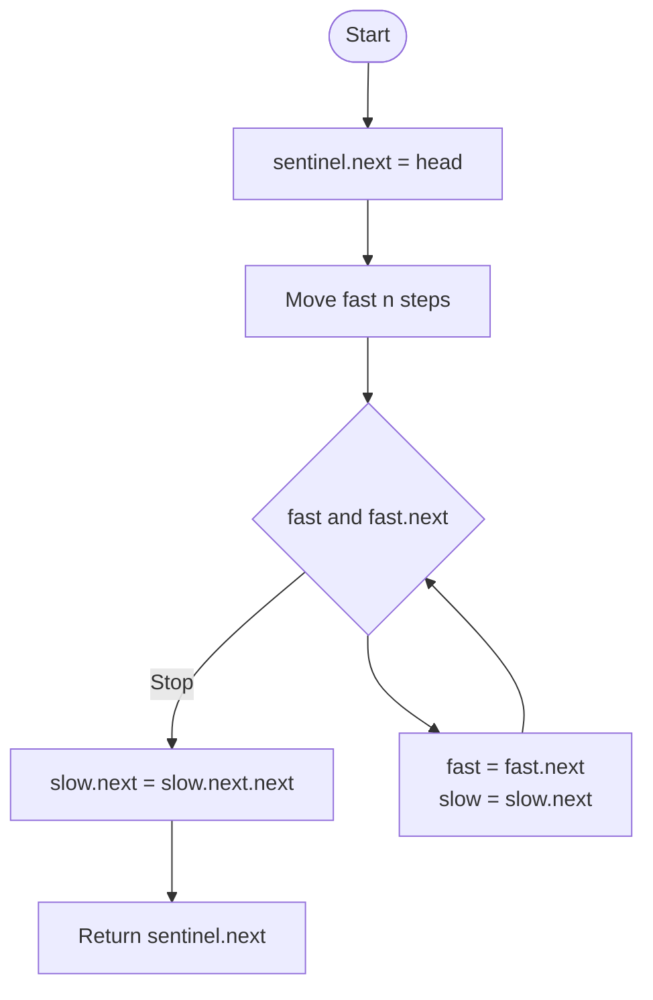
```mermaid
flowchart TD
Start(["Start"]) --> Dummy["sentinel.next = head"]
Dummy --> MoveFast["Move fast n steps"]
MoveFast --> Loop{"fast and fast.next"}
Loop --> |Stop| Delete["slow.next = slow.next.next"]
Loop --> Step["fast = fast.next<br/>slow = slow.next"]
Step --> Loop
Delete --> ReturnHead["Return sentinel.next"]
```

**Diagram sources**
- [37_19_removeNthnode.js](file://37_19_removeNthnode.js#L30-L53)

**Section sources**
- [37_19_removeNthnode.js](file://37_19_removeNthnode.js#L1-L92)

### Remove Duplicates from Sorted List
- Technique: Single-pass comparison and skipping duplicates
- Steps:
  - While curr and curr.next exist, if equal, skip next; else advance
- Complexity: Time O(n), Space O(1)

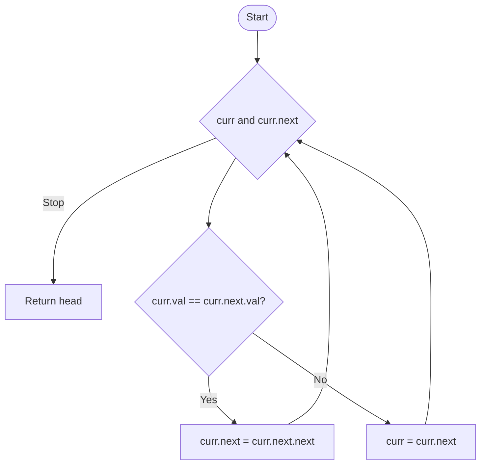
```mermaid
flowchart TD
Start(["Start"]) --> Loop{"curr and curr.next"}
Loop --> |Stop| ReturnHead["Return head"]
Loop --> Equal{"curr.val == curr.next.val?"}
Equal --> |Yes| Skip["curr.next = curr.next.next"]
Skip --> Loop
Equal --> |No| Advance["curr = curr.next"]
Advance --> Loop
```

**Diagram sources**
- [38_83_remove_duplicate.js](file://38_83_remove_duplicate.js#L28-L41)

**Section sources**
- [38_83_remove_duplicate.js](file://38_83_remove_duplicate.js#L1-L41)

### Odd Even Linked List (Partition)
- Technique: Split into odd and even subsequences, reconnect odd.tail to even.head
- Steps:
  - odd=head, even=head.next, save evenStart
  - While odd.next and even.next, link odd.next and even.next to next nodes
  - Connect odd.tail to evenStart
- Complexity: Time O(n), Space O(1)

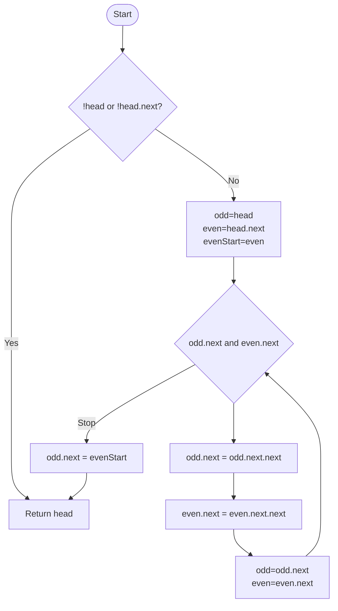
```mermaid
flowchart TD
Start(["Start"]) --> Check{"!head or !head.next?"}
Check --> |Yes| ReturnHead["Return head"]
Check --> |No| Init["odd=head<br/>even=head.next<br/>evenStart=even"]
Init --> Loop{"odd.next and even.next"}
Loop --> |Stop| Attach["odd.next = evenStart"]
Attach --> ReturnHead
Loop --> LinkOdd["odd.next = odd.next.next"]
LinkOdd --> LinkEven["even.next = even.next.next"]
LinkEven --> Advance["odd=odd.next<br/>even=even.next"]
Advance --> Loop
```

**Diagram sources**
- [39_328_odd_even_linked_list.js](file://39_328_odd_even_linked_list.js#L28-L43)

**Section sources**
- [39_328_odd_even_linked_list.js](file://39_328_odd_even_linked_list.js#L1-L45)

### Add Two Numbers (Linked Lists as Numbers)
- Technique: Simultaneous traversal with carry propagation
- Steps:
  - Create dummy ans, carry=0
  - While l1 or l2 or carry, compute sum, create node, update pointers
- Complexity: Time O(max(m,n)), Space O(max(m,n))

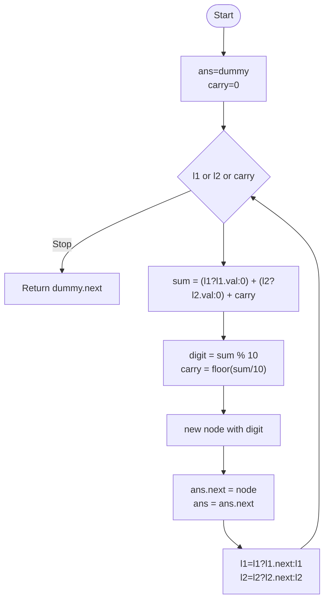
```mermaid
flowchart TD
Start(["Start"]) --> Init["ans=dummy<br/>carry=0"]
Init --> Loop{"l1 or l2 or carry"}
Loop --> |Stop| ReturnNext["Return dummy.next"]
Loop --> Sum["sum = (l1?l1.val:0) + (l2?l2.val:0) + carry"]
Sum --> Digit["digit = sum % 10<br/>carry = floor(sum/10)"]
Digit --> NewNode["new node with digit"]
NewNode --> Link["ans.next = node<br/>ans = ans.next"]
Link --> MovePtrs["l1=l1?l1.next:l1<br/>l2=l2?l2.next:l2"]
MovePtrs --> Loop
```

**Diagram sources**
- [40_2_add_two_numbers.js](file://40_2_add_two_numbers.js#L30-L48)

**Section sources**
- [40_2_add_two_numbers.js](file://40_2_add_two_numbers.js#L1-L48)

### Merge Two Sorted Lists (Dummy Head)
- Technique: Dummy node to build merged list; attach remainder at the end
- Steps:
  - curr=dummy; while l1 and l2, attach smaller to curr.next
  - Attach remaining list to curr.next
- Complexity: Time O(m+n), Space O(1)

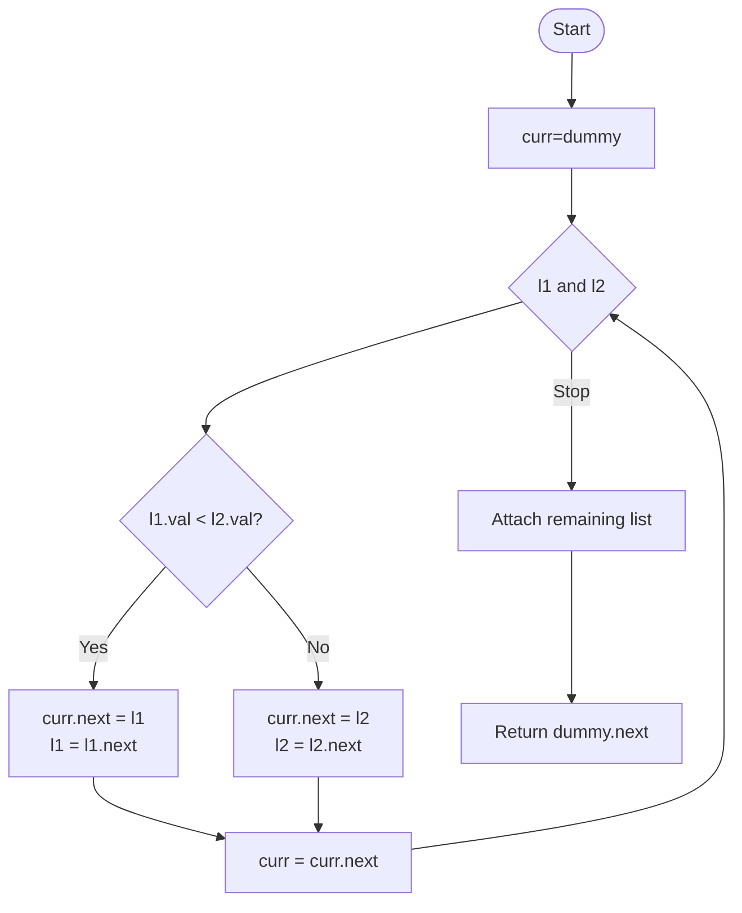
```mermaid
flowchart TD
Start(["Start"]) --> Dummy["curr=dummy"]
Dummy --> Loop{"l1 and l2"}
Loop --> |Stop| AttachRem["Attach remaining list"]
Loop --> Choose{"l1.val < l2.val?"}
Choose --> |Yes| LinkL1["curr.next = l1<br/>l1 = l1.next"]
Choose --> |No| LinkL2["curr.next = l2<br/>l2 = l2.next"]
LinkL1 --> Advance["curr = curr.next"]
LinkL2 --> Advance
Advance --> Loop
AttachRem --> ReturnHead["Return dummy.next"]
```

**Diagram sources**
- [41_21_merge_two_sorted_lists.js](file://41_21_merge_two_sorted_lists.js#L34-L58)

**Section sources**
- [41_21_merge_two_sorted_lists.js](file://41_21_merge_two_sorted_lists.js#L1-L109)

### Rotate List to the Right
- Technique: Two-pointer window to find split point; reconnect tail to head
- Steps:
  - Compute length, normalize k=k%length
  - Move fast k steps, then both until fast reaches tail
  - Reconnect: fast.next=head, newHead=slow.next, slow.next=null
- Complexity: Time O(n), Space O(1)

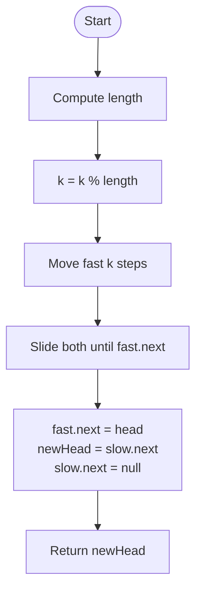
```mermaid
flowchart TD
Start(["Start"]) --> Length["Compute length"]
Length --> Normalize["k = k % length"]
Normalize --> MoveFast["Move fast k steps"]
MoveFast --> Slide["Slide both until fast.next"]
Slide --> Reconnect["fast.next = head<br/>newHead = slow.next<br/>slow.next = null"]
Reconnect --> ReturnNew["Return newHead"]
```

**Diagram sources**
- [41_61_rotate_linked_list.js](file://41_61_rotate_linked_list.js#L22-L50)

**Section sources**
- [41_61_rotate_linked_list.js](file://41_61_rotate_linked_list.js#L1-L53)

### Swap Nodes in Pairs (Iterative)
- Technique: Dummy node plus three-pointer window per pair
- Steps:
  - prev=dummy, curr=head, n=curr.next
  - prev.next=n; curr.next=n.next; n.next=curr
  - Advance prev=curr, curr=prev.next, n=curr?.next
- Complexity: Time O(n), Space O(1)

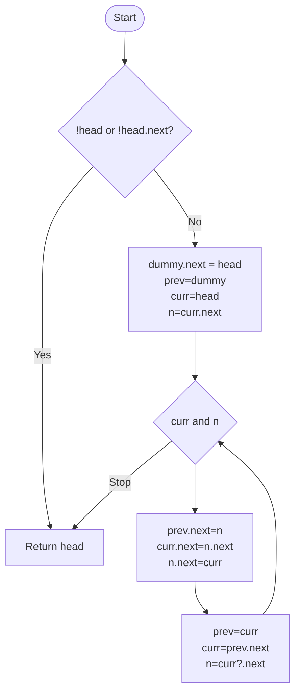
```mermaid
flowchart TD
Start(["Start"]) --> Check{"!head or !head.next?"}
Check --> |Yes| ReturnHead["Return head"]
Check --> |No| Dummy["dummy.next = head<br/>prev=dummy<br/>curr=head<br/>n=curr.next"]
Dummy --> Loop{"curr and n"}
Loop --> |Stop| ReturnHead
Loop --> Swap["prev.next=n<br/>curr.next=n.next<br/>n.next=curr"]
Swap --> Advance["prev=curr<br/>curr=prev.next<br/>n=curr?.next"]
Advance --> Loop
```

**Diagram sources**
- [42_24_swap_nodes_in_pairts.js](file://42_24_swap_nodes_in_pairts.js#L29-L55)

**Section sources**
- [42_24_swap_nodes_in_pairts.js](file://42_24_swap_nodes_in_pairts.js#L1-L58)

### Swap Nodes in Pairs (Recursive)
- Technique: Recursively swap the rest and rewire current pair
- Steps:
  - Base: if !head or !head.next, return head
  - left=head, right=head.next
  - left.next=swapPairs(right.next); right.next=left; return right
- Complexity: Time O(n), Space O(n/recursive calls)

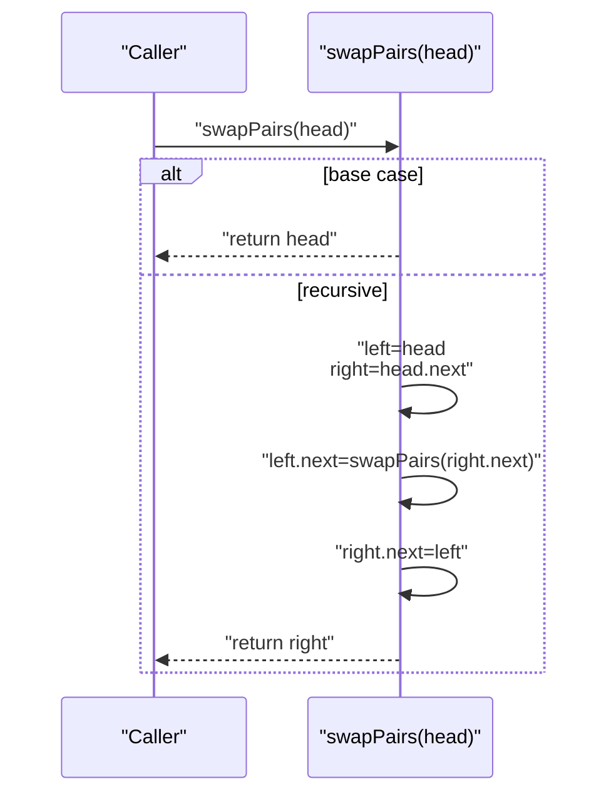
```mermaid
sequenceDiagram
participant Caller as "Caller"
participant Swap as "swapPairs(head)"
Caller->>Swap : "swapPairs(head)"
alt base case
Swap-->>Caller : "return head"
else recursive
Swap->>Swap : "left=head<br/>right=head.next"
Swap->>Swap : "left.next=swapPairs(right.next)"
Swap->>Swap : "right.next=left"
Swap-->>Caller : "return right"
end
```

**Diagram sources**
- [43_24_swap_nodes_in_pair_recurcive_approch.js](file://43_24_swap_nodes_in_pair_recurcive_approch.js#L29-L42)

**Section sources**
- [43_24_swap_nodes_in_pair_recurcive_approch.js](file://43_24_swap_nodes_in_pair_recurcive_approch.js#L1-L45)

## Dependency Analysis
- Shared utilities: All files rely on a ListNode abstraction
- Cross-file dependencies:
  - Reverse and palindrome both depend on iterative pointer rewiring
  - Fast-slow is used in middle node, cycle detection, and remove-nth-from-end
  - Dummy node is used across remove-elements, remove-nth-from-end, merge-sorted, swap-pairs, and add-two-numbers
  - Odd-even partition and merge-sorted both use dummy heads and pointer stitching

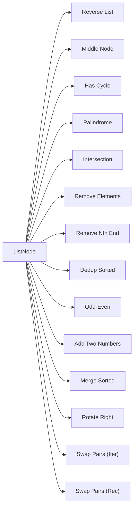
```mermaid
graph LR
ListNode["ListNode"] --> Reverse["Reverse List"]
ListNode --> Middle["Middle Node"]
ListNode --> Cycle["Has Cycle"]
ListNode --> Palindrome["Palindrome"]
ListNode --> Intersect["Intersection"]
ListNode --> RemoveElem["Remove Elements"]
ListNode --> RemoveN["Remove Nth End"]
ListNode --> Dedup["Dedup Sorted"]
ListNode --> OddEven["Odd-Even"]
ListNode --> AddNum["Add Two Numbers"]
ListNode --> Merge["Merge Sorted"]
ListNode --> Rotate["Rotate Right"]
ListNode --> SwapIter["Swap Pairs (Iter)"]
ListNode --> SwapRec["Swap Pairs (Rec)"]
```

**Diagram sources**
- [32_206_linked_list_reverse.js](file://32_206_linked_list_reverse.js#L19-L28)
- [31_876_linked_list_middle_node.js](file://31_876_linked_list_middle_node.js#L19-L28)
- [33_141_linked-list-cycle.js](file://33_141_linked-list-cycle.js#L47-L52)
- [34_234_palindrome-linked-list.js](file://34_234_palindrome-linked-list.js#L16-L22)
- [35_160_intersection-of-two-linked-lists.js](file://35_160_intersection-of-two-linked-lists.js#L17-L22)
- [36_203_remove-linked-list-element.js](file://36_203_remove-linked-list-element.js#L17-L22)
- [37_19_removeNthnode.js](file://37_19_removeNthnode.js#L18-L23)
- [38_83_remove_duplicate.js](file://38_83_remove_duplicate.js#L17-L23)
- [39_328_odd_even_linked_list.js](file://39_328_odd_even_linked_list.js#L17-L23)
- [40_2_add_two_numbers.js](file://40_2_add_two_numbers.js#L18-L24)
- [41_21_merge_two_sorted_lists.js](file://41_21_merge_two_sorted_lists.js#L22-L28)
- [41_61_rotate_linked_list.js](file://41_61_rotate_linked_list.js#L17-L21)
- [42_24_swap_nodes_in_pairts.js](file://42_24_swap_nodes_in_pairts.js#L18-L24)
- [43_24_swap_nodes_in_pair_recurcive_approch.js](file://43_24_swap_nodes_in_pair_recurcive_approch.js#L18-L24)

**Section sources**
- [32_206_linked_list_reverse.js](file://32_206_linked_list_reverse.js#L1-L45)
- [31_876_linked_list_middle_node.js](file://31_876_linked_list_middle_node.js#L1-L43)
- [33_141_linked-list-cycle.js](file://33_141_linked-list-cycle.js#L1-L77)
- [34_234_palindrome-linked-list.js](file://34_234_palindrome-linked-list.js#L1-L58)
- [35_160_intersection-of-two-linked-lists.js](file://35_160_intersection-of-two-linked-lists.js#L1-L45)
- [36_203_remove-linked-list-element.js](file://36_203_remove-linked-list-element.js#L1-L44)
- [37_19_removeNthnode.js](file://37_19_removeNthnode.js#L1-L92)
- [38_83_remove_duplicate.js](file://38_83_remove_duplicate.js#L1-L41)
- [39_328_odd_even_linked_list.js](file://39_328_odd_even_linked_list.js#L1-L45)
- [40_2_add_two_numbers.js](file://40_2_add_two_numbers.js#L1-L48)
- [41_21_merge_two_sorted_lists.js](file://41_21_merge_two_sorted_lists.js#L1-L109)
- [41_61_rotate_linked_list.js](file://41_61_rotate_linked_list.js#L1-L53)
- [42_24_swap_nodes_in_pairts.js](file://42_24_swap_nodes_in_pairts.js#L1-L58)
- [43_24_swap_nodes_in_pair_recurcive_approch.js](file://43_24_swap_nodes_in_pair_recurcive_approch.js#L1-L45)

## Performance Considerations
- Iterative vs recursive:
  - Iterative reversal avoids recursion overhead and stack usage; preferred for very large lists
  - Recursive pairwise swap is concise but uses O(n) call stack space
- Space trade-offs:
  - Set-based intersection uses O(m) extra space; two-pointer methods use O(1)
  - Dummy node eliminates special-case head logic at negligible cost
- Time complexity:
  - Most operations are linear in list length; careful pointer updates prevent O(n^2) mistakes

[No sources needed since this section provides general guidance]

## Troubleshooting Guide
Common pitfalls and debugging tips:
- Off-by-one errors in fast-slow loops:
  - Ensure loop conditions guard against null.next before accessing next fields
  - Verify termination conditions align with intended stopping criteria
- Dummy node misuse:
  - Always return dummy.next after building a list; avoid returning the dummy itself
  - Ensure sentinel.next is initialized before iteration
- Pointer rewiring order:
  - Save next pointer before breaking links to avoid losing the rest of the list
  - Reassign pointers in the correct order to prevent cycles or lost nodes
- Edge cases:
  - Empty list and single-node list must be handled explicitly in some functions
  - For rotate/right shifts, normalize k modulo length to avoid redundant rotations
- Carry propagation in addition:
  - Ensure carry is computed and reset per digit; attach leftover carry if any

**Section sources**
- [32_206_linked_list_reverse.js](file://32_206_linked_list_reverse.js#L30-L45)
- [33_141_linked-list-cycle.js](file://33_141_linked-list-cycle.js#L60-L74)
- [36_203_remove-linked-list-element.js](file://36_203_remove-linked-list-element.js#L28-L44)
- [37_19_removeNthnode.js](file://37_19_removeNthnode.js#L30-L53)
- [40_2_add_two_numbers.js](file://40_2_add_two_numbers.js#L30-L48)
- [41_61_rotate_linked_list.js](file://41_61_rotate_linked_list.js#L22-L50)

## Conclusion
The repository demonstrates robust, reusable patterns for linked list manipulation:
- Fast-slow pointers enable efficient midpoint and cycle detection
- Dummy nodes streamline head modifications and reduce branching
- Iterative and recursive approaches offer complementary trade-offs in readability and space usage
- Careful pointer rewiring and edge-case handling yield reliable solutions across diverse problems

[No sources needed since this section summarizes without analyzing specific files]