# String Processing

<cite>
**Referenced Files in This Document**
- [51_validParentheses.js](file://Blind-75/51_validParentheses.js)
- [53_evalRPN.js](file://Blind-75/53_evalRPN.js)
- [7_validPalindrome.js](file://Blind-75/7_validPalindrome.js)
- [70_longestPalindromicSubstring.js.js](file://Blind-75/70_longestPalindromicSubstring.js.js)
- [10_groupAnagrams.js](file://Blind-75/10_groupAnagrams.js)
- [6_longestSubstring.js](file://Blind-75/6_longestSubstring.js)
- [9_minWindowSubstring.js](file://Blind-75/9_minWindowSubstring.js)
- [8_characterReplacement.js](file://Blind-75/8_characterReplacement.js)
- [54_dailyTemperatures.js](file://Blind-75/54_dailyTemperatures.js)
</cite>

## Table of Contents
1. [Introduction](#introduction)
2. [Project Structure](#project-structure)
3. [Core Components](#core-components)
4. [Architecture Overview](#architecture-overview)
5. [Detailed Component Analysis](#detailed-component-analysis)
6. [Dependency Analysis](#dependency-analysis)
7. [Performance Considerations](#performance-considerations)
8. [Troubleshooting Guide](#troubleshooting-guide)
9. [Conclusion](#conclusion)

## Introduction
This document focuses on string processing and manipulation techniques implemented in the repository. It covers pattern recognition, validation, and algorithmic string operations with emphasis on:
- Stack-based validation (parentheses)
- Sliding window approaches (longest substring without repeating characters, minimum window substring, character replacement)
- Character frequency analysis (grouping anagrams)
- Palindrome verification and expansion techniques
- Expression evaluation using stacks (Reverse Polish Notation)
- Advanced concepts such as monotonic stacks (daily temperatures)

The goal is to provide a structured understanding of each technique, its implementation patterns, complexity characteristics, and practical guidance for edge cases and optimizations.

## Project Structure
The relevant string-processing implementations are primarily located under the Blind-75 directory, each problem solved with clear comments, approach explanations, and complexity analysis. Representative files include:
- Parentheses validation
- Anagram grouping
- Palindrome checks and longest palindromic substring
- Sliding window problems (longest substring without repeats, minimum window substring, character replacement)
- Expression evaluation (RPN)
- Monotonic stack (daily temperatures)

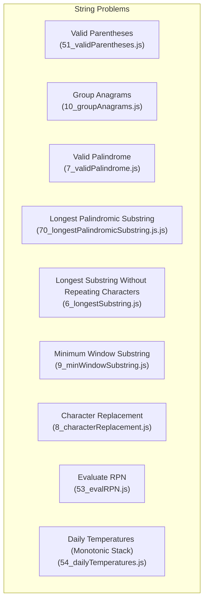

**Section sources**
- [51_validParentheses.js](file://Blind-75/51_validParentheses.js#L1-L81)
- [10_groupAnagrams.js](file://Blind-75/10_groupAnagrams.js#L1-L64)
- [7_validPalindrome.js](file://Blind-75/7_validPalindrome.js#L1-L54)
- [70_longestPalindromicSubstring.js.js](file://Blind-75/70_longestPalindromicSubstring.js.js#L1-L77)
- [6_longestSubstring.js](file://Blind-75/6_longestSubstring.js#L1-L74)
- [9_minWindowSubstring.js](file://Blind-75/9_minWindowSubstring.js#L1-L79)
- [8_characterReplacement.js](file://Blind-75/8_characterReplacement.js#L1-L71)
- [53_evalRPN.js](file://Blind-75/53_evalRPN.js#L1-L72)
- [54_dailyTemperatures.js](file://Blind-75/54_dailyTemperatures.js#L1-L69)

## Core Components
This section highlights the primary string-processing techniques and their representative implementations.

- Stack-based validation (parentheses)
  - Uses a stack to match opening and closing brackets with a mapping of closing to opening brackets. Complexity: time O(n), space O(n).
  - Implementation reference: [isValid](file://Blind-75/51_validParentheses.js#L48-L76)

- Sliding window with hash set (longest substring without repeating characters)
  - Maintains a set of characters in the current window and shrinks from the left upon encountering duplicates. Complexity: time O(n), space O(min(m,n)).
  - Implementation reference: [lengthOfLongestSubstring](file://Blind-75/6_longestSubstring.js#L42-L70)

- Sliding window with frequency map (minimum window substring)
  - Tracks required characters via a frequency map and minimizes the window when all required characters are present. Complexity: time O(n+m), space O(k).
  - Implementation reference: [minWindow](file://Blind-75/9_minWindowSubstring.js#L40-L75)

- Sliding window with frequency map (character replacement)
  - Ensures (window length - max frequency) ≤ k by adjusting the window dynamically. Complexity: time O(n), space O(1).
  - Implementation reference: [characterReplacement](file://Blind-75/8_characterReplacement.js#L41-L67)

- Character frequency analysis (group anagrams)
  - Groups anagrams by sorting characters to form keys in a hash map. Complexity: time O(n·k log k), space O(n·k).
  - Implementation reference: [groupAnagrams](file://Blind-75/10_groupAnagrams.js#L41-L60)

- Palindrome validation and expansion
  - Two-pointer approach for cleaned alphanumeric strings and expand-around-center for longest palindromic substring. Complexity: validation O(n), longest palindrome O(n²), space O(1) for expansion.
  - Implementation references:
    - [isPalindrome](file://Blind-75/7_validPalindrome.js#L35-L50)
    - [longestPalindrome](file://Blind-75/70_longestPalindromicSubstring.js.js#L43-L72)

- Expression evaluation (RPN)
  - Uses a stack to evaluate postfix expressions with truncation towards zero for division. Complexity: time O(n), space O(n).
  - Implementation reference: [evalRPN](file://Blind-75/53_evalRPN.js#L43-L68)

- Monotonic stack (daily temperatures)
  - Maintains a decreasing stack of indices to compute the next warmer day efficiently. Complexity: time O(n), space O(n).
  - Implementation reference: [dailyTemperatures](file://Blind-75/54_dailyTemperatures.js#L45-L64)

**Section sources**
- [51_validParentheses.js](file://Blind-75/51_validParentheses.js#L37-L43)
- [6_longestSubstring.js](file://Blind-75/6_longestSubstring.js#L31-L39)
- [9_minWindowSubstring.js](file://Blind-75/9_minWindowSubstring.js#L29-L37)
- [8_characterReplacement.js](file://Blind-75/8_characterReplacement.js#L32-L38)
- [10_groupAnagrams.js](file://Blind-75/10_groupAnagrams.js#L29-L38)
- [7_validPalindrome.js](file://Blind-75/7_validPalindrome.js#L24-L32)
- [70_longestPalindromicSubstring.js.js](file://Blind-75/70_longestPalindromicSubstring.js.js#L34-L40)
- [53_evalRPN.js](file://Blind-75/53_evalRPN.js#L34-L41)
- [54_dailyTemperatures.js](file://Blind-75/54_dailyTemperatures.js#L37-L42)

## Architecture Overview
The solutions are self-contained functions with minimal coupling. Each file encapsulates:
- Problem statement and approach
- Implementation logic
- Complexity analysis
- Example usage

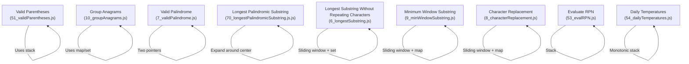

**Diagram sources**
- [51_validParentheses.js](file://Blind-75/51_validParentheses.js#L48-L76)
- [10_groupAnagrams.js](file://Blind-75/10_groupAnagrams.js#L41-L60)
- [7_validPalindrome.js](file://Blind-75/7_validPalindrome.js#L35-L50)
- [70_longestPalindromicSubstring.js.js](file://Blind-75/70_longestPalindromicSubstring.js.js#L43-L72)
- [6_longestSubstring.js](file://Blind-75/6_longestSubstring.js#L42-L70)
- [9_minWindowSubstring.js](file://Blind-75/9_minWindowSubstring.js#L40-L75)
- [8_characterReplacement.js](file://Blind-75/8_characterReplacement.js#L41-L67)
- [53_evalRPN.js](file://Blind-75/53_evalRPN.js#L43-L68)
- [54_dailyTemperatures.js](file://Blind-75/54_dailyTemperatures.js#L45-L64)

## Detailed Component Analysis

### Parentheses Validation (Stack-based)
- Approach: Use a stack to store opening brackets and a mapping for closing-to-opening bracket matching. At the end, the stack must be empty.
- Key steps:
  - Push opening brackets onto the stack.
  - For each closing bracket, verify the stack is not empty and the top matches the expected opening bracket.
  - Return whether the stack is empty after processing the entire string.
- Complexity:
  - Time: O(n)
  - Space: O(n)

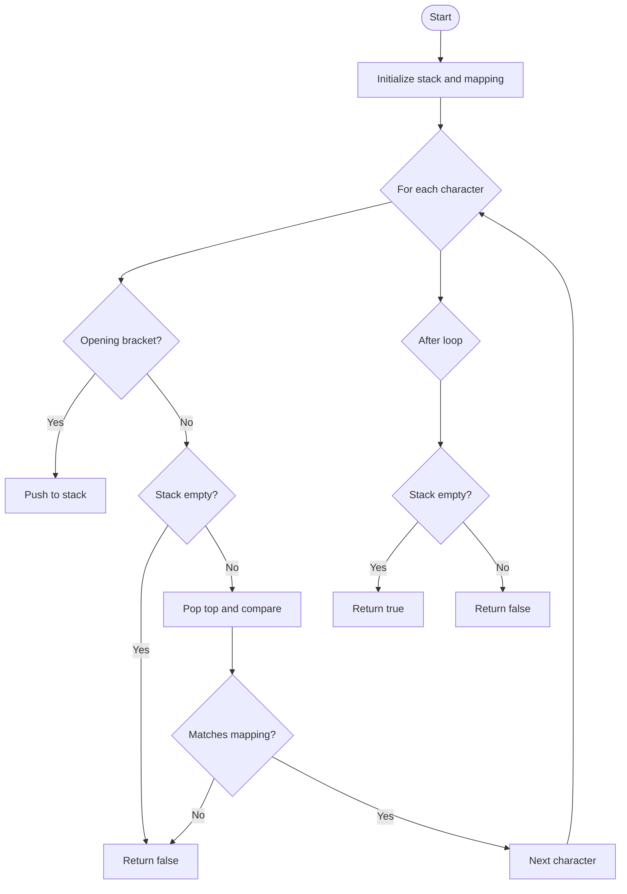

**Diagram sources**
- [51_validParentheses.js](file://Blind-75/51_validParentheses.js#L48-L76)

**Section sources**
- [51_validParentheses.js](file://Blind-75/51_validParentheses.js#L1-L81)

### Group Anagrams (Character Frequency Analysis)
- Approach: Normalize each string by sorting its characters to form a canonical key. Group all strings sharing the same key.
- Key steps:
  - Iterate through the input array.
  - Compute the sorted key for each string.
  - Append the original string to the corresponding group in a map.
  - Return grouped arrays.
- Complexity:
  - Time: O(n·k log k)
  - Space: O(n·k)

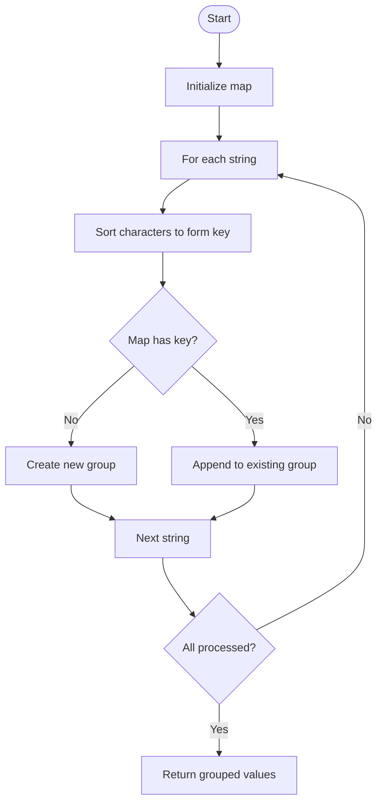

**Diagram sources**
- [10_groupAnagrams.js](file://Blind-75/10_groupAnagrams.js#L41-L60)

**Section sources**
- [10_groupAnagrams.js](file://Blind-75/10_groupAnagrams.js#L1-L64)

### Valid Palindrome (Two Pointers)
- Approach: Clean the string to alphanumeric lowercase, then use two pointers from both ends moving inward.
- Key steps:
  - Clean the input string.
  - Initialize left and right pointers.
  - Move pointers inward while comparing characters.
  - Return true if all comparisons match.
- Complexity:
  - Time: O(n)
  - Space: O(n) for the cleaned string; can be O(1) with in-place checks.

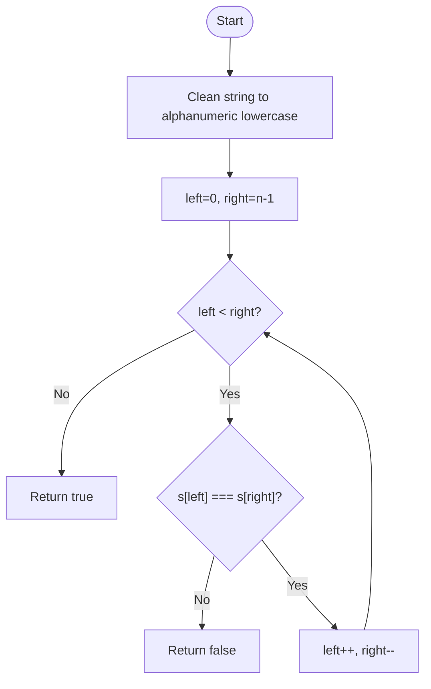

**Diagram sources**
- [7_validPalindrome.js](file://Blind-75/7_validPalindrome.js#L35-L50)

**Section sources**
- [7_validPalindrome.js](file://Blind-75/7_validPalindrome.js#L1-L54)

### Longest Palindromic Substring (Expand Around Center)
- Approach: For each center (odd and even), expand outward while characters match and track the maximum length.
- Key steps:
  - Handle edge case for empty string.
  - Define expand helper to update global max length and start index.
  - Try centers at each index and between indices.
- Complexity:
  - Time: O(n²)
  - Space: O(1)

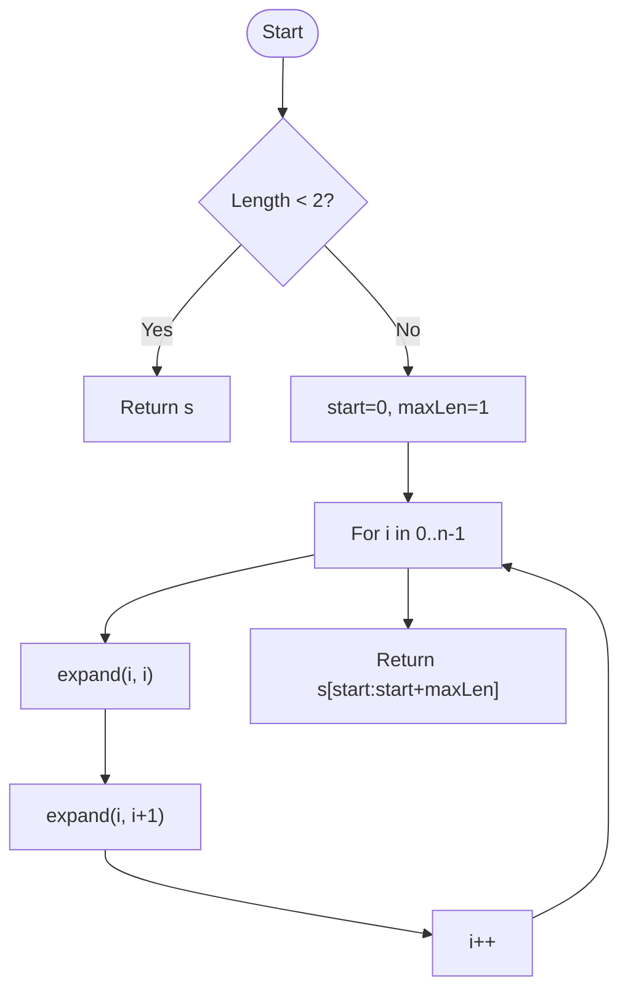

**Diagram sources**
- [70_longestPalindromicSubstring.js.js](file://Blind-75/70_longestPalindromicSubstring.js.js#L43-L72)

**Section sources**
- [70_longestPalindromicSubstring.js.js](file://Blind-75/70_longestPalindromicSubstring.js.js#L1-L77)

### Longest Substring Without Repeating Characters (Sliding Window + Hash Set)
- Approach: Maintain a set of characters in the current window; expand right, and shrink left when duplicates are encountered.
- Key steps:
  - Use a set to track characters in the window.
  - While duplicate exists, remove from left and increment left.
  - Add current character and update max length.
- Complexity:
  - Time: O(n)
  - Space: O(min(m,n))

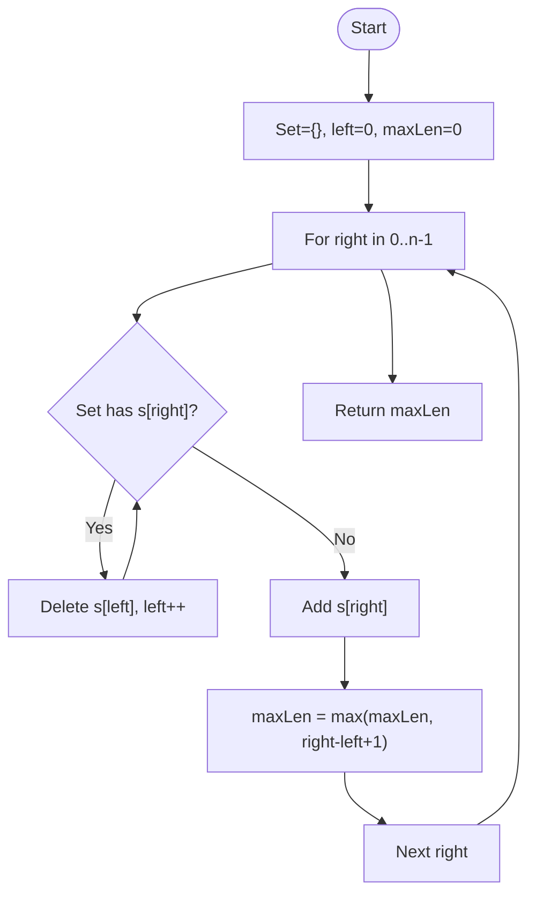

**Diagram sources**
- [6_longestSubstring.js](file://Blind-75/6_longestSubstring.js#L42-L70)

**Section sources**
- [6_longestSubstring.js](file://Blind-75/6_longestSubstring.js#L1-L74)

### Minimum Window Substring (Sliding Window + Frequency Map)
- Approach: Use a frequency map to track required characters and minimize the window when all are present.
- Key steps:
  - Build frequency map for t.
  - Expand right; when a needed character is added, decrement count.
  - While count equals zero, update result and shrink from left.
- Complexity:
  - Time: O(n+m)
  - Space: O(k)

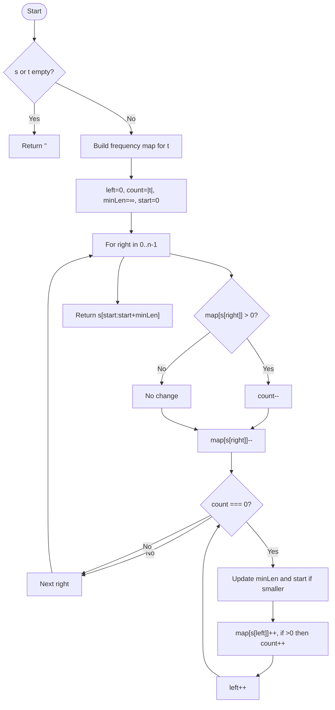

**Diagram sources**
- [9_minWindowSubstring.js](file://Blind-75/9_minWindowSubstring.js#L40-L75)

**Section sources**
- [9_minWindowSubstring.js](file://Blind-75/9_minWindowSubstring.js#L1-L79)

### Character Replacement (Sliding Window + Frequency Map)
- Approach: Maintain a window where (window length - max frequency) ≤ k by adjusting left pointer.
- Key steps:
  - Track frequency map and max frequency in the window.
  - If invalid, shrink from left.
  - Update max length throughout.
- Complexity:
  - Time: O(n)
  - Space: O(1) due to bounded character set.

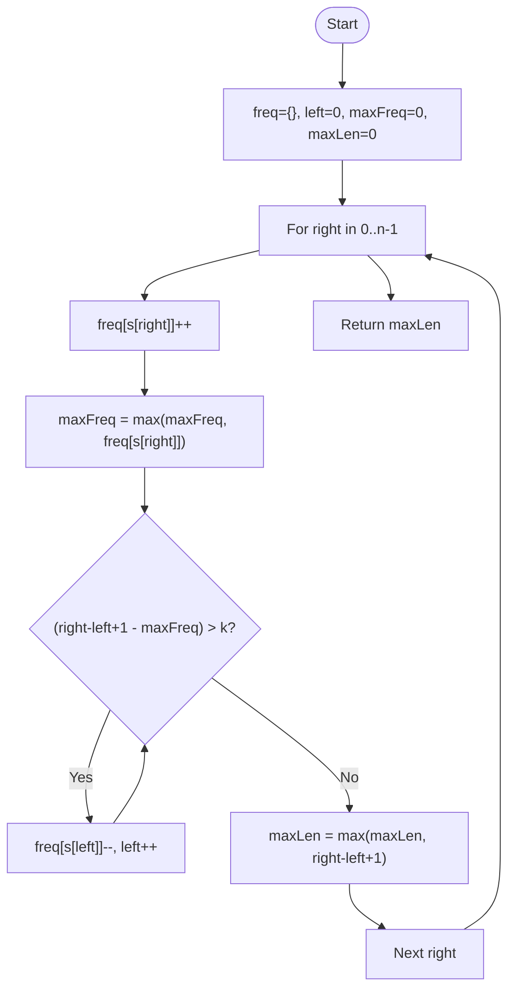

**Diagram sources**
- [8_characterReplacement.js](file://Blind-75/8_characterReplacement.js#L41-L67)

**Section sources**
- [8_characterReplacement.js](file://Blind-75/8_characterReplacement.js#L1-L71)

### Evaluate Reverse Polish Notation (Stack-based Parsing)
- Approach: Use a stack to evaluate postfix expressions; for operators pop two operands, compute, and push result. Division truncates towards zero.
- Key steps:
  - Iterate tokens; push numbers.
  - On operator, pop two operands, compute, push result.
  - Return final value.
- Complexity:
  - Time: O(n)
  - Space: O(n)

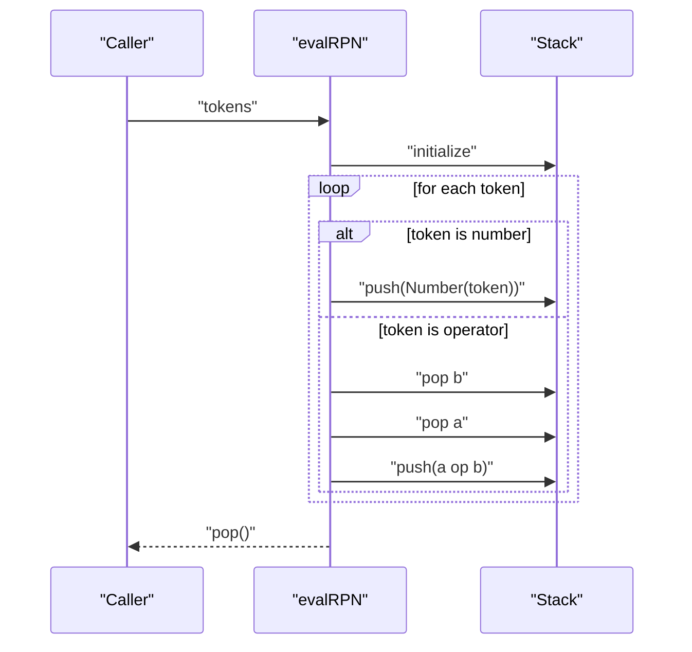

**Diagram sources**
- [53_evalRPN.js](file://Blind-75/53_evalRPN.js#L43-L68)

**Section sources**
- [53_evalRPN.js](file://Blind-75/53_evalRPN.js#L1-L72)

### Daily Temperatures (Monotonic Decreasing Stack)
- Approach: Maintain a stack of indices with decreasing temperatures; when a warmer day is found, pop and compute wait days.
- Key steps:
  - Initialize result array and stack.
  - For each index, pop indices while current temperature is warmer and compute differences.
  - Push current index.
- Complexity:
  - Time: O(n)
  - Space: O(n)

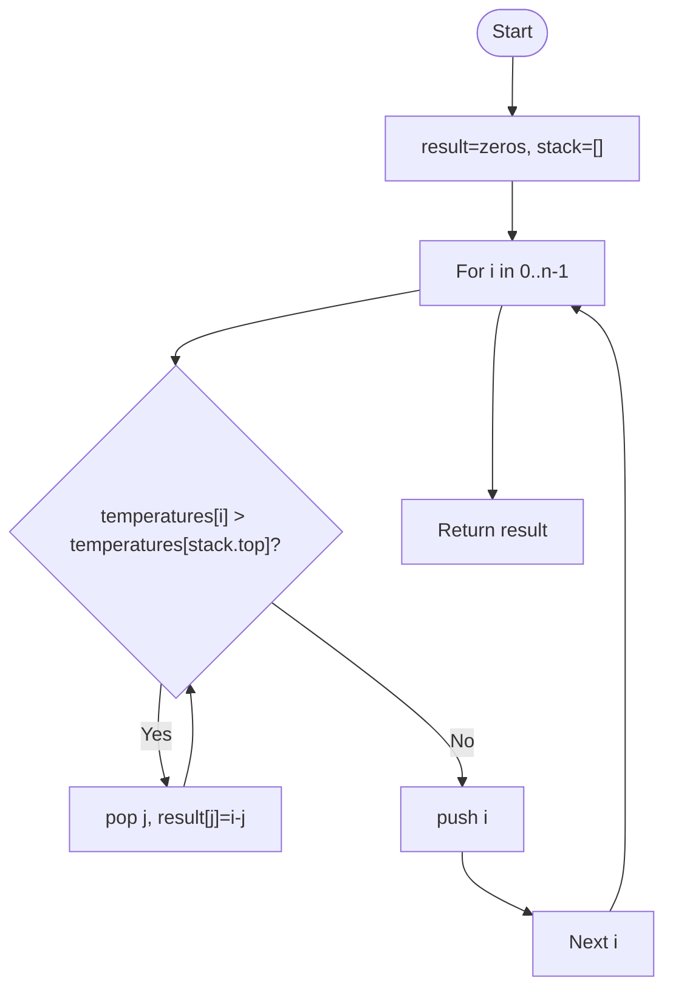

**Diagram sources**
- [54_dailyTemperatures.js](file://Blind-75/54_dailyTemperatures.js#L45-L64)

**Section sources**
- [54_dailyTemperatures.js](file://Blind-75/54_dailyTemperatures.js#L1-L69)

## Dependency Analysis
- Cohesion: Each file is focused on a single problem with clear boundaries.
- Coupling: Minimal inter-file dependencies; each solution is self-contained.
- External dependencies: Standard JavaScript primitives and built-in structures (arrays, objects, sets, math functions).
- Potential circular dependencies: None observed; functions are independent.

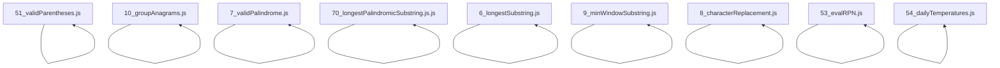

**Diagram sources**
- [51_validParentheses.js](file://Blind-75/51_validParentheses.js#L48-L76)
- [10_groupAnagrams.js](file://Blind-75/10_groupAnagrams.js#L41-L60)
- [7_validPalindrome.js](file://Blind-75/7_validPalindrome.js#L35-L50)
- [70_longestPalindromicSubstring.js.js](file://Blind-75/70_longestPalindromicSubstring.js.js#L43-L72)
- [6_longestSubstring.js](file://Blind-75/6_longestSubstring.js#L42-L70)
- [9_minWindowSubstring.js](file://Blind-75/9_minWindowSubstring.js#L40-L75)
- [8_characterReplacement.js](file://Blind-75/8_characterReplacement.js#L41-L67)
- [53_evalRPN.js](file://Blind-75/53_evalRPN.js#L43-L68)
- [54_dailyTemperatures.js](file://Blind-75/54_dailyTemperatures.js#L45-L64)

## Performance Considerations
- Choose appropriate data structures:
  - Use hash maps for frequency counting and grouping.
  - Use sets for sliding window uniqueness checks.
  - Use stacks for validation and parsing tasks.
- Optimize space:
  - Prefer in-place checks for palindromes to avoid extra string copies.
  - Limit map sizes by character set bounds (e.g., 26 uppercase letters).
- Time complexity trade-offs:
  - Sorting-based grouping costs O(k log k) per string; consider frequency vectors for very large alphabets.
  - Sliding window techniques often achieve linear time by ensuring each element is touched a constant number of times.
- Large inputs:
  - For very long strings, consider streaming or chunked processing where applicable.
  - Monitor stack depth for recursive helpers and iterative alternatives where needed.

## Troubleshooting Guide
- Edge cases:
  - Empty strings: Ensure early returns and boundary checks (e.g., minimum window substring).
  - Special characters and mixed case: Normalize input (lowercase, alphanumeric) for palindrome checks.
  - Unbalanced brackets: Verify stack emptiness at the end.
- Common pitfalls:
  - Incorrect operator order in RPN evaluation (second operand popped first).
  - Division truncation: Use truncation towards zero semantics.
  - Sliding window invalidity: Ensure proper updates to counts and maps when shrinking windows.
- Validation tips:
  - For parentheses, confirm the mapping aligns with expected opening brackets.
  - For anagrams, ensure canonicalization uses a deterministic method (sorting or frequency vector).
  - For palindromes, test both two-pointer and expand-around-center approaches depending on constraints.

**Section sources**
- [51_validParentheses.js](file://Blind-75/51_validParentheses.js#L65-L75)
- [53_evalRPN.js](file://Blind-75/53_evalRPN.js#L59-L62)
- [9_minWindowSubstring.js](file://Blind-75/9_minWindowSubstring.js#L59-L71)
- [7_validPalindrome.js](file://Blind-75/7_validPalindrome.js#L35-L50)

## Conclusion
The repository demonstrates robust, well-documented solutions for core string-processing challenges. Techniques span stack-based validation, sliding window paradigms, frequency analysis, palindrome expansion, and monotonic stacks. Each solution includes complexity analysis and clear implementation references, enabling both learning and practical application. Adhering to the outlined strategies and troubleshooting tips ensures reliable performance and correctness across diverse inputs and edge cases.