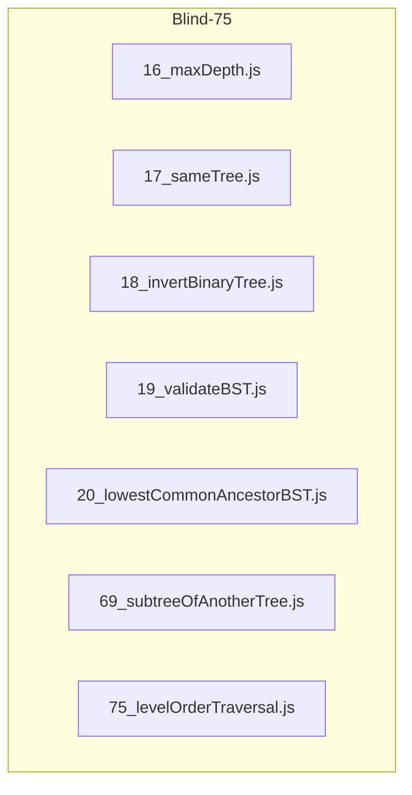
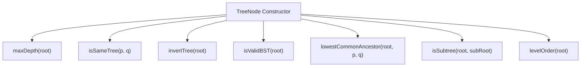
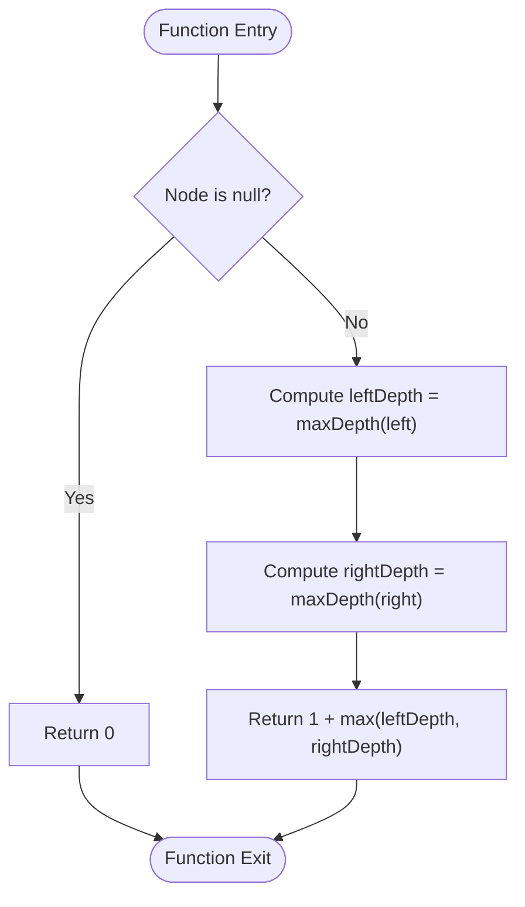
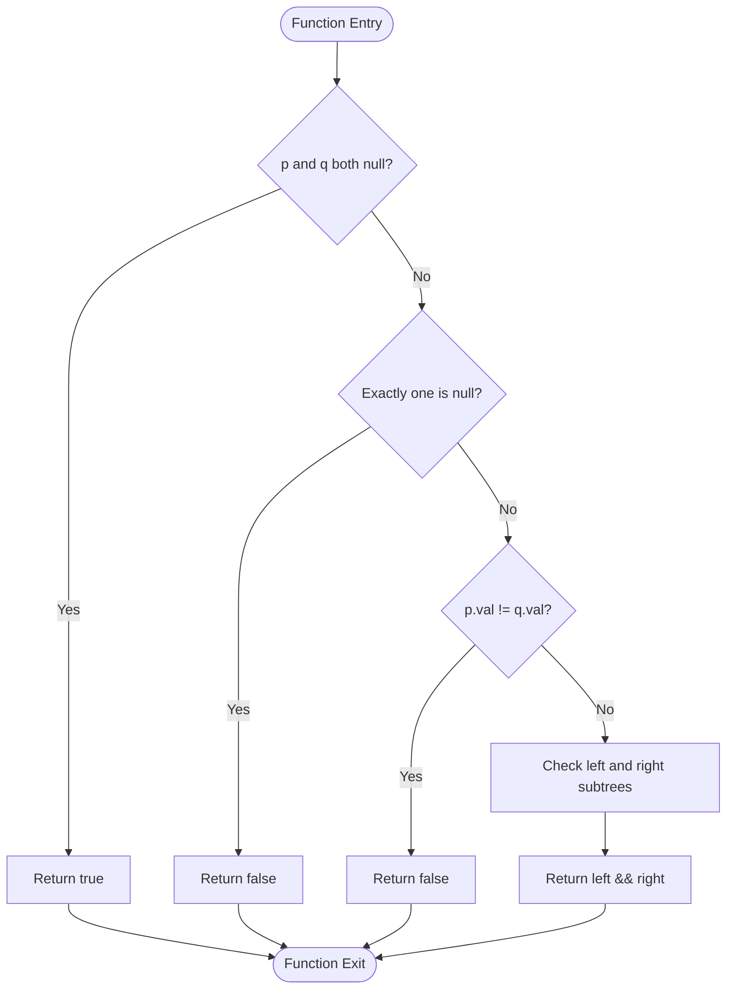
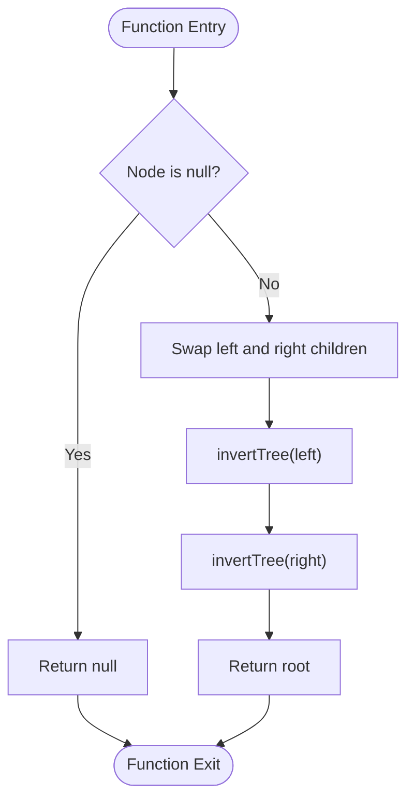
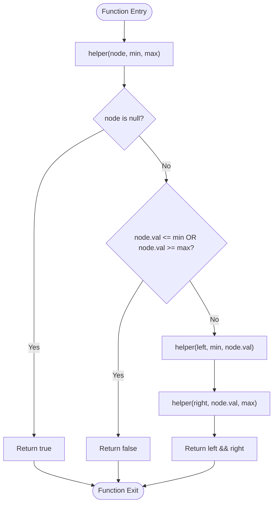
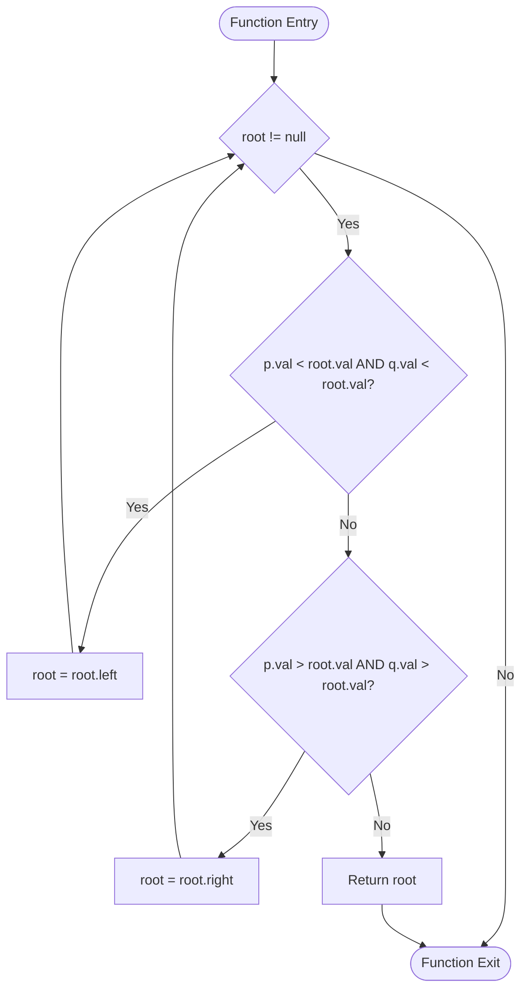
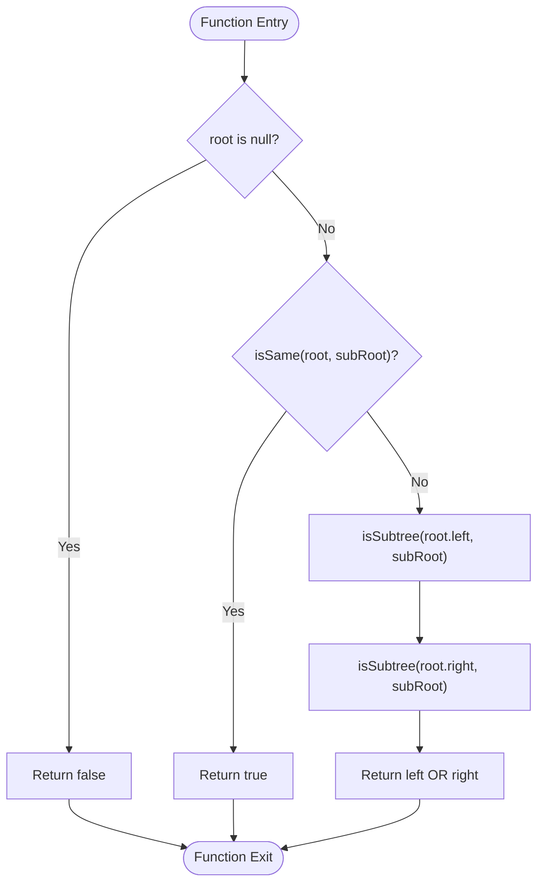
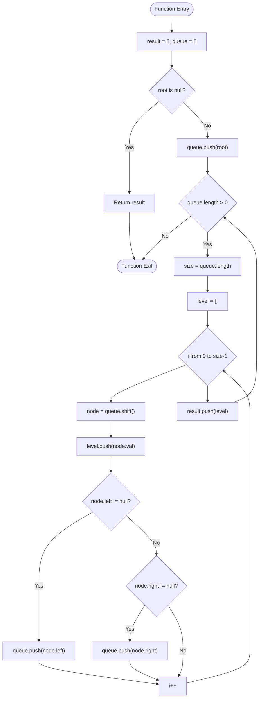
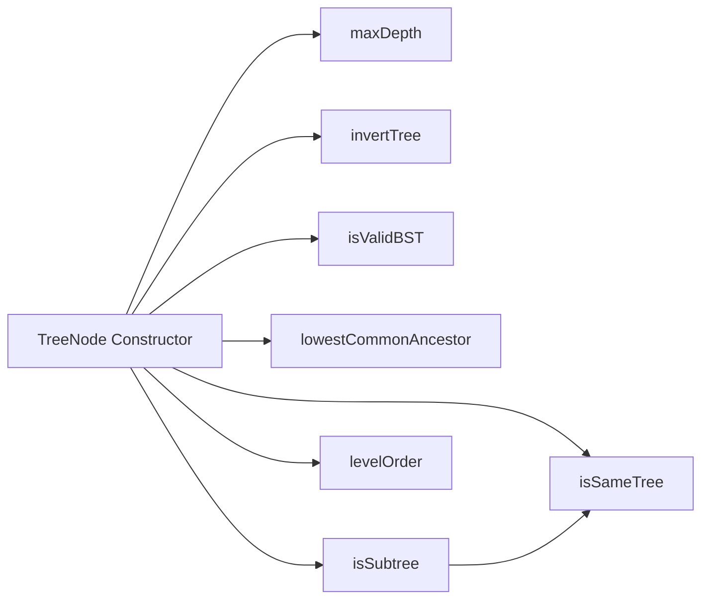

# Tree Algorithms

<cite>
**Referenced Files in This Document**
- [16_maxDepth.js](file://Blind-75/16_maxDepth.js)
- [17_sameTree.js](file://Blind-75/17_sameTree.js)
- [18_invertBinaryTree.js](file://Blind-75/18_invertBinaryTree.js)
- [19_validateBST.js](file://Blind-75/19_validateBST.js)
- [20_lowestCommonAncestorBST.js](file://Blind-75/20_lowestCommonAncestorBST.js)
- [69_subtreeOfAnotherTree.js](file://Blind-75/69_subtreeOfAnotherTree.js)
- [75_levelOrderTraversal.js](file://Blind-75/75_levelOrderTraversal.js)
</cite>

## Table of Contents
1. [Introduction](#introduction)
2. [Project Structure](#project-structure)
3. [Core Components](#core-components)
4. [Architecture Overview](#architecture-overview)
5. [Detailed Component Analysis](#detailed-component-analysis)
6. [Dependency Analysis](#dependency-analysis)
7. [Performance Considerations](#performance-considerations)
8. [Troubleshooting Guide](#troubleshooting-guide)
9. [Conclusion](#conclusion)

## Introduction
This document provides a comprehensive guide to tree algorithm problems with a focus on binary tree operations and traversals. It covers essential traversal techniques (depth-first search and breadth-first search), validates BST properties, compares tree structures, performs tree inversions, computes lowest common ancestors in BSTs, detects subtrees, and outlines recursive versus iterative approaches. Practical examples and complexity analyses are included to help you understand performance characteristics across balanced and skewed tree structures.

## Project Structure
The repository organizes tree-related solutions under the Blind-75 directory. Each file encapsulates a specific problem with detailed comments explaining the approach, logic, and complexity.

**Diagram sources**
- [16_maxDepth.js](file://Blind-75/16_maxDepth.js#L1-L64)
- [17_sameTree.js](file://Blind-75/17_sameTree.js#L1-L57)
- [18_invertBinaryTree.js](file://Blind-75/18_invertBinaryTree.js#L1-L56)
- [19_validateBST.js](file://Blind-75/19_validateBST.js#L1-L65)
- [20_lowestCommonAncestorBST.js](file://Blind-75/20_lowestCommonAncestorBST.js#L1-L62)
- [69_subtreeOfAnotherTree.js](file://Blind-75/69_subtreeOfAnotherTree.js#L1-L62)
- [75_levelOrderTraversal.js](file://Blind-75/75_levelOrderTraversal.js#L1-L116)

**Section sources**
- [16_maxDepth.js](file://Blind-75/16_maxDepth.js#L1-L64)
- [17_sameTree.js](file://Blind-75/17_sameTree.js#L1-L57)
- [18_invertBinaryTree.js](file://Blind-75/18_invertBinaryTree.js#L1-L56)
- [19_validateBST.js](file://Blind-75/19_validateBST.js#L1-L65)
- [20_lowestCommonAncestorBST.js](file://Blind-75/20_lowestCommonAncestorBST.js#L1-L62)
- [69_subtreeOfAnotherTree.js](file://Blind-75/69_subtreeOfAnotherTree.js#L1-L62)
- [75_levelOrderTraversal.js](file://Blind-75/75_levelOrderTraversal.js#L1-L116)

## Core Components
- Maximum Depth of Binary Tree: Computes the longest path from root to leaf using recursive DFS.
- Same Tree: Compares two trees for identical structure and values using recursive DFS.
- Invert Binary Tree: Mirrors a binary tree by swapping left and right children recursively.
- Validate Binary Search Tree: Checks BST validity using range constraints propagated during recursion.
- Lowest Common Ancestor in BST: Uses BST ordering to iteratively navigate toward the LCA.
- Subtree of Another Tree: Recursively checks if any subtree matches the given subRoot.
- Level Order Traversal: Performs breadth-first search using a queue to produce level-by-level results.

**Section sources**
- [16_maxDepth.js](file://Blind-75/16_maxDepth.js#L33-L42)
- [17_sameTree.js](file://Blind-75/17_sameTree.js#L32-L41)
- [18_invertBinaryTree.js](file://Blind-75/18_invertBinaryTree.js#L29-L38)
- [19_validateBST.js](file://Blind-75/19_validateBST.js#L34-L42)
- [20_lowestCommonAncestorBST.js](file://Blind-75/20_lowestCommonAncestorBST.js#L32-L42)
- [69_subtreeOfAnotherTree.js](file://Blind-75/69_subtreeOfAnotherTree.js#L31-L38)
- [75_levelOrderTraversal.js](file://Blind-75/75_levelOrderTraversal.js#L39-L45)

## Architecture Overview
The solutions share a consistent pattern:
- Each file defines a TreeNode constructor for building trees.
- Functions implement specific algorithms with clear base cases and recursive/iterative logic.
- Complexity is documented in terms of time and space, considering balanced and skewed tree scenarios.

**Diagram sources**
- [75_levelOrderTraversal.js](file://Blind-75/75_levelOrderTraversal.js#L48-L53)
- [16_maxDepth.js](file://Blind-75/16_maxDepth.js#L53-L63)
- [17_sameTree.js](file://Blind-75/17_sameTree.js#L44-L56)
- [18_invertBinaryTree.js](file://Blind-75/18_invertBinaryTree.js#L41-L55)
- [19_validateBST.js](file://Blind-75/19_validateBST.js#L45-L64)
- [20_lowestCommonAncestorBST.js](file://Blind-75/20_lowestCommonAncestorBST.js#L45-L61)
- [69_subtreeOfAnotherTree.js](file://Blind-75/69_subtreeOfAnotherTree.js#L41-L61)
- [75_levelOrderTraversal.js](file://Blind-75/75_levelOrderTraversal.js#L55-L97)

## Detailed Component Analysis

### Maximum Depth of Binary Tree
- Approach: Recursive DFS.
- Logic: Base case returns 0 for null nodes; otherwise compute 1 plus the max depth of left and right subtrees.
- Complexity:
  - Time: O(n) visiting each node once.
  - Space: O(h) recursion stack; O(log n) for balanced, O(n) for skewed.

**Diagram sources**
- [16_maxDepth.js](file://Blind-75/16_maxDepth.js#L53-L63)

**Section sources**
- [16_maxDepth.js](file://Blind-75/16_maxDepth.js#L10-L21)
- [16_maxDepth.js](file://Blind-75/16_maxDepth.js#L33-L42)

### Same Tree
- Approach: Recursive DFS comparing structure and values.
- Logic: Both null nodes are equal; if only one is null or values differ, return false; otherwise check left and right subtrees.
- Complexity:
  - Time: O(n) where n is the number of nodes in the smaller tree.
  - Space: O(h) recursion stack.

**Diagram sources**
- [17_sameTree.js](file://Blind-75/17_sameTree.js#L44-L56)

**Section sources**
- [17_sameTree.js](file://Blind-75/17_sameTree.js#L8-L22)
- [17_sameTree.js](file://Blind-75/17_sameTree.js#L32-L41)

### Invert Binary Tree
- Approach: Recursive DFS with pre-order swap.
- Logic: Swap left and right children, then invert subtrees recursively.
- Complexity:
  - Time: O(n) visiting each node once.
  - Space: O(h) recursion stack.

**Diagram sources**
- [18_invertBinaryTree.js](file://Blind-75/18_invertBinaryTree.js#L41-L55)

**Section sources**
- [18_invertBinaryTree.js](file://Blind-75/18_invertBinaryTree.js#L8-L21)
- [18_invertBinaryTree.js](file://Blind-75/18_invertBinaryTree.js#L29-L38)

### Validate Binary Search Tree
- Approach: Recursive with range constraints.
- Logic: Each node must satisfy a min/max boundary; boundaries tighten when moving left/right.
- Complexity:
  - Time: O(n) visiting each node once.
  - Space: O(h) recursion stack.

**Diagram sources**
- [19_validateBST.js](file://Blind-75/19_validateBST.js#L45-L64)

**Section sources**
- [19_validateBST.js](file://Blind-75/19_validateBST.js#L10-L26)
- [19_validateBST.js](file://Blind-75/19_validateBST.js#L34-L42)

### Lowest Common Ancestor in BST
- Approach: Iterative BST property.
- Logic: Navigate left if both p and q are smaller than root; navigate right if both are greater; otherwise root is LCA.
- Complexity:
  - Time: O(h); O(log n) for balanced, O(n) for skewed.
  - Space: O(1).

**Diagram sources**
- [20_lowestCommonAncestorBST.js](file://Blind-75/20_lowestCommonAncestorBST.js#L45-L61)

**Section sources**
- [20_lowestCommonAncestorBST.js](file://Blind-75/20_lowestCommonAncestorBST.js#L9-L22)
- [20_lowestCommonAncestorBST.js](file://Blind-75/20_lowestCommonAncestorBST.js#L32-L42)

### Subtree of Another Tree
- Approach: Recursive check with a helper to compare identical trees.
- Logic: If the current root matches subRoot, return true; otherwise check left and right subtrees.
- Complexity:
  - Time: O(m * n) worst-case; O(n) average for balanced trees.
  - Space: O(h) recursion stack.

**Diagram sources**
- [69_subtreeOfAnotherTree.js](file://Blind-75/69_subtreeOfAnotherTree.js#L41-L61)

**Section sources**
- [69_subtreeOfAnotherTree.js](file://Blind-75/69_subtreeOfAnotherTree.js#L8-L20)
- [69_subtreeOfAnotherTree.js](file://Blind-75/69_subtreeOfAnotherTree.js#L31-L38)
- [69_subtreeOfAnotherTree.js](file://Blind-75/69_subtreeOfAnotherTree.js#L32-L38)

### Level Order Traversal (BFS)
- Approach: Breadth-first search using a queue.
- Logic: Track the current level size, process all nodes at the current level, enqueue children for the next level.
- Complexity:
  - Time: O(n) visiting each node once.
  - Space: O(n) for the queue (up to n/2 nodes in the last level).

**Diagram sources**
- [75_levelOrderTraversal.js](file://Blind-75/75_levelOrderTraversal.js#L55-L97)

**Section sources**
- [75_levelOrderTraversal.js](file://Blind-75/75_levelOrderTraversal.js#L8-L27)
- [75_levelOrderTraversal.js](file://Blind-75/75_levelOrderTraversal.js#L39-L45)

## Dependency Analysis
- Shared data model: All solutions rely on a TreeNode constructor defined in the level-order traversal file and reused implicitly across other files.
- Helper dependencies:
  - isSubtree depends on isSame for structural comparison.
  - isValidBST uses a nested helper with min/max bounds.
- Coupling:
  - Low coupling between functions; each focuses on a single algorithm.
  - Minimal cross-file dependencies; functions are self-contained.

**Diagram sources**
- [75_levelOrderTraversal.js](file://Blind-75/75_levelOrderTraversal.js#L48-L53)
- [69_subtreeOfAnotherTree.js](file://Blind-75/69_subtreeOfAnotherTree.js#L52-L61)

**Section sources**
- [75_levelOrderTraversal.js](file://Blind-75/75_levelOrderTraversal.js#L48-L53)
- [69_subtreeOfAnotherTree.js](file://Blind-75/69_subtreeOfAnotherTree.js#L52-L61)

## Performance Considerations
- Recursive vs Iterative:
  - Recursive approaches are intuitive and mirror the natural structure of trees; they use implicit call stacks with O(h) space.
  - Iterative approaches (e.g., LCA) can reduce space overhead and avoid recursion limits for deep trees.
- Traversal Methods:
  - DFS (preorder/inorder/postorder) visits nodes depth-first; suitable for structural comparisons and transformations.
  - BFS (level-order) uses a queue and is ideal for level-wise processing and shortest-path-like problems on unweighted trees.
- Balanced vs Skewed Trees:
  - Balanced trees yield O(log n) recursion depth and efficient operations.
  - Skewed trees degrade to O(n) recursion depth and increased memory usage.
- Memory Optimization:
  - Prefer iterative solutions when recursion depth is a concern.
  - Use queues judiciously; for level-order, the queue size peaks at roughly half the total nodes in a complete tree.

[No sources needed since this section provides general guidance]

## Troubleshooting Guide
- Common pitfalls:
  - Off-by-one errors in loop counters for level-order traversal; ensure the queue size is captured before processing.
  - Incorrect base cases in recursive functions; always handle null nodes explicitly.
  - Misinterpreting BST constraints; remember that all nodes in a subtree must satisfy strict bounds.
- Edge cases:
  - Empty trees: Ensure null checks are performed at the start of functions.
  - Single-node trees: Verify that base cases return correct values.
  - Degenerate trees: Expect O(n) time and space; consider iterative alternatives for deep recursion.
- Validation tips:
  - For BST validation, pass explicit bounds to the helper to avoid local min/max confusion.
  - For subtree detection, confirm that isSame handles null nodes consistently.

**Section sources**
- [75_levelOrderTraversal.js](file://Blind-75/75_levelOrderTraversal.js#L67-L90)
- [19_validateBST.js](file://Blind-75/19_validateBST.js#L45-L64)
- [69_subtreeOfAnotherTree.js](file://Blind-75/69_subtreeOfAnotherTree.js#L52-L61)

## Conclusion
This repository demonstrates robust implementations of fundamental tree algorithms. By combining recursive and iterative strategies, leveraging BFS for level-order processing, and carefully managing constraints for BST validation, you can efficiently solve a wide range of tree problems. Understanding the complexities and edge cases ensures reliable performance across diverse tree structures.