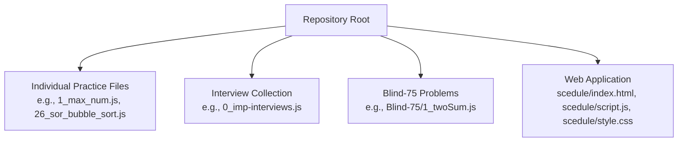
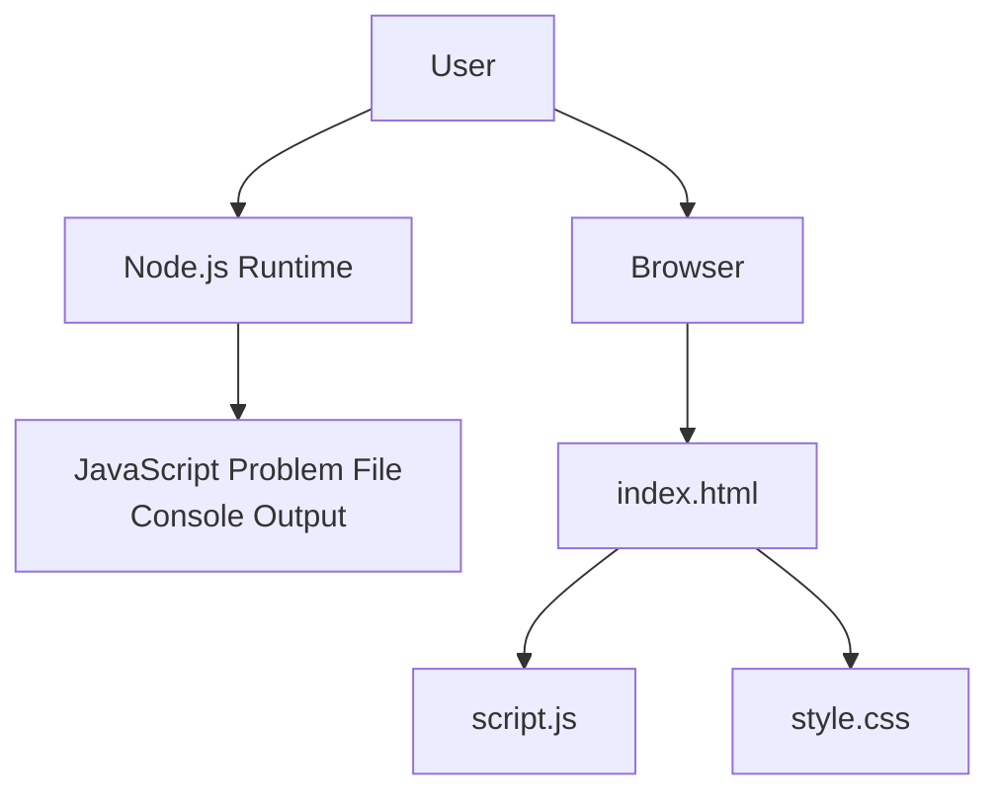
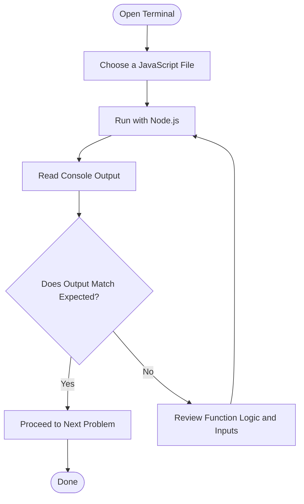
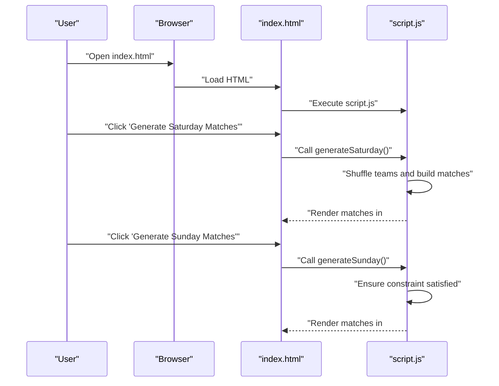
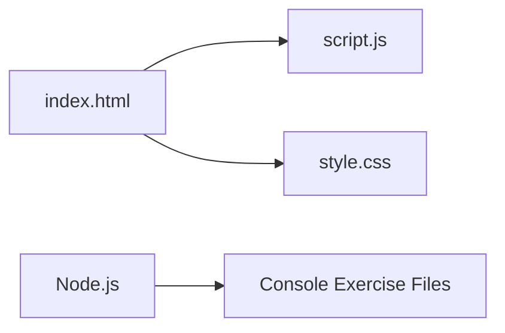

# Getting Started

<cite>
**Referenced Files in This Document**
- [index.html](file://scedule/index.html)
- [script.js](file://scedule/script.js)
- [style.css](file://scedule/style.css)
- [1_max_num.js](file://1_max_num.js)
- [2_smallest_num.js](file://2_smallest_num.js)
- [0_imp-interviews.js](file://0_imp-interviews.js)
- [26_sor_bubble_sort.js](file://26_sor_bubble_sort.js)
- [31_876_linked_list_middle_node.js](file://31_876_linked_list_middle_node.js)
- [32_206_linked_list_reverse.js](file://32_206_linked_list_reverse.js)
- [1_twoSum.js](file://Blind-75/1_twoSum.js)
- [3_containsDuplicate.js](file://Blind-75/3_containsDuplicate.js)
</cite>

## Table of Contents
1. [Introduction](#introduction)
2. [Project Structure](#project-structure)
3. [Core Components](#core-components)
4. [Architecture Overview](#architecture-overview)
5. [Detailed Component Analysis](#detailed-component-analysis)
6. [Dependency Analysis](#dependency-analysis)
7. [Performance Considerations](#performance-considerations)
8. [Troubleshooting Guide](#troubleshooting-guide)
9. [Conclusion](#conclusion)
10. [Appendices](#appendices)

## Introduction
Welcome to the Namaste DSA repository. This guide helps you quickly get started, run problems locally, and navigate the repository effectively. You will learn how to execute JavaScript files in Node.js, understand problem structure, and run the included web application. It also outlines prerequisites, recommended learning paths, and common setup tips.

## Project Structure
The repository is organized by topic and problem categories:
- Individual practice files (e.g., 1_max_num.js, 26_sor_bubble_sort.js)
- Interview-focused collection (e.g., 0_imp-interviews.js)
- Blind-75 curated list (e.g., Blind-75/1_twoSum.js)
- A small web app for scheduling matches (scedule/index.html, scedule/script.js, scedule/style.css)

**Section sources**
- [index.html](file://scedule/index.html#L1-L22)
- [script.js](file://scedule/script.js#L1-L84)
- [style.css](file://scedule/style.css#L1-L53)
- [1_max_num.js](file://1_max_num.js#L1-L34)
- [26_sor_bubble_sort.js](file://26_sor_bubble_sort.js#L1-L56)
- [0_imp-interviews.js](file://0_imp-interviews.js#L1-L428)
- [1_twoSum.js](file://Blind-75/1_twoSum.js#L1-L54)
- [31_876_linked_list_middle_node.js](file://31_876_linked_list_middle_node.js#L1-L43)
- [32_206_linked_list_reverse.js](file://32_206_linked_list_reverse.js#L1-L45)

## Core Components
- Console-driven exercises: Many files export functions and immediately call them with sample inputs, printing results to the console. Examples:
  - [1_max_num.js](file://1_max_num.js#L1-L34)
  - [2_smallest_num.js](file://2_smallest_num.js#L1-L33)
  - [0_imp-interviews.js](file://0_imp-interviews.js#L1-L428)
- Data structure and algorithm demos:
  - Sorting: [26_sor_bubble_sort.js](file://26_sor_bubble_sort.js#L1-L56)
  - Linked lists: [31_876_linked_list_middle_node.js](file://31_876_linked_list_middle_node.js#L1-L43), [32_206_linked_list_reverse.js](file://32_206_linked_list_reverse.js#L1-L45)
- Curated problem set (Blind-75):
  - [1_twoSum.js](file://Blind-75/1_twoSum.js#L1-L54)
  - [3_containsDuplicate.js](file://Blind-75/3_containsDuplicate.js#L1-L53)
- Web application:
  - [index.html](file://scedule/index.html#L1-L22)
  - [script.js](file://scedule/script.js#L1-L84)
  - [style.css](file://scedule/style.css#L1-L53)

What to expect:
- Each file typically defines a function implementing a solution, followed by a test invocation that prints the result to the console.
- The web app demonstrates DOM manipulation and event handling to generate match schedules.

**Section sources**
- [1_max_num.js](file://1_max_num.js#L1-L34)
- [2_smallest_num.js](file://2_smallest_num.js#L1-L33)
- [0_imp-interviews.js](file://0_imp-interviews.js#L1-L428)
- [26_sor_bubble_sort.js](file://26_sor_bubble_sort.js#L1-L56)
- [31_876_linked_list_middle_node.js](file://31_876_linked_list_middle_node.js#L1-L43)
- [32_206_linked_list_reverse.js](file://32_206_linked_list_reverse.js#L1-L45)
- [1_twoSum.js](file://Blind-75/1_twoSum.js#L1-L54)
- [3_containsDuplicate.js](file://Blind-75/3_containsDuplicate.js#L1-L53)
- [index.html](file://scedule/index.html#L1-L22)
- [script.js](file://scedule/script.js#L1-L84)
- [style.css](file://scedule/style.css#L1-L53)

## Architecture Overview
This repository is a learning sandbox with two primary modes:
- Node.js console mode: Run any JavaScript file to see console output.
- Browser web app: Open the HTML file in a browser to interact with the DOM-based scheduler.

**Diagram sources**
- [index.html](file://scedule/index.html#L1-L22)
- [script.js](file://scedule/script.js#L1-L84)
- [style.css](file://scedule/style.css#L1-L53)
- [1_max_num.js](file://1_max_num.js#L1-L34)

## Detailed Component Analysis

### Running Console Exercises
- Purpose: Practice algorithms and data structures by running functions and observing console output.
- Typical pattern:
  - Define a function implementing the solution.
  - Call the function with sample inputs.
  - Print the result to the console.
- Examples:
  - Largest/smallest number: [1_max_num.js](file://1_max_num.js#L1-L34), [2_smallest_num.js](file://2_smallest_num.js#L1-L33)
  - Interview collection: [0_imp-interviews.js](file://0_imp-interviews.js#L1-L428)
  - Sorting: [26_sor_bubble_sort.js](file://26_sor_bubble_sort.js#L1-L56)
  - Linked list utilities: [31_876_linked_list_middle_node.js](file://31_876_linked_list_middle_node.js#L1-L43), [32_206_linked_list_reverse.js](file://32_206_linked_list_reverse.js#L1-L45)
  - Blind-75: [1_twoSum.js](file://Blind-75/1_twoSum.js#L1-L54), [3_containsDuplicate.js](file://Blind-75/3_containsDuplicate.js#L1-L53)

**Section sources**
- [1_max_num.js](file://1_max_num.js#L1-L34)
- [2_smallest_num.js](file://2_smallest_num.js#L1-L33)
- [0_imp-interviews.js](file://0_imp-interviews.js#L1-L428)
- [26_sor_bubble_sort.js](file://26_sor_bubble_sort.js#L1-L56)
- [31_876_linked_list_middle_node.js](file://31_876_linked_list_middle_node.js#L1-L43)
- [32_206_linked_list_reverse.js](file://32_206_linked_list_reverse.js#L1-L45)
- [1_twoSum.js](file://Blind-75/1_twoSum.js#L1-L54)
- [3_containsDuplicate.js](file://Blind-75/3_containsDuplicate.js#L1-L53)

### Web Application: Match Scheduler
- Purpose: Learn DOM manipulation and event handling in a browser.
- Files:
  - [index.html](file://scedule/index.html#L1-L22): Basic page with buttons and a container to render matches.
  - [script.js](file://scedule/script.js#L1-L84): Implements team shuffling and match generation for Saturday and Sunday.
  - [style.css](file://scedule/style.css#L1-L53): Applies dark theme and layout styles.

**Diagram sources**
- [index.html](file://scedule/index.html#L1-L22)
- [script.js](file://scedule/script.js#L1-L84)
- [style.css](file://scedule/style.css#L1-L53)

**Section sources**
- [index.html](file://scedule/index.html#L1-L22)
- [script.js](file://scedule/script.js#L1-L84)
- [style.css](file://scedule/style.css#L1-L53)

## Dependency Analysis
- Internal dependencies:
  - Web app depends on HTML loading the script and applying styles.
  - Console exercises depend on Node.js runtime to execute and print output.
- External dependencies:
  - None declared in the repository; the web app uses vanilla JavaScript and standard DOM APIs.
  - Console exercises use built-in JavaScript features (e.g., arrays, objects, maps, sets).

**Diagram sources**
- [index.html](file://scedule/index.html#L1-L22)
- [script.js](file://scedule/script.js#L1-L84)
- [style.css](file://scedule/style.css#L1-L53)
- [1_max_num.js](file://1_max_num.js#L1-L34)

**Section sources**
- [index.html](file://scedule/index.html#L1-L22)
- [script.js](file://scedule/script.js#L1-L84)
- [style.css](file://scedule/style.css#L1-L53)
- [1_max_num.js](file://1_max_num.js#L1-L34)

## Performance Considerations
- Prefer built-in data structures for clarity and performance:
  - Use Map/Set for hashing-based lookups (as seen in [1_twoSum.js](file://Blind-75/1_twoSum.js#L32-L50), [3_containsDuplicate.js](file://Blind-75/3_containsDuplicate.js#L33-L49)).
- Understand complexity trade-offs:
  - Sorting algorithms like bubble sort are educational but not ideal for large datasets (see [26_sor_bubble_sort.js](file://26_sor_bubble_sort.js#L1-L56)).
- Keep console runs minimal and focused:
  - Limit repeated work and avoid unnecessary allocations when experimenting.

[No sources needed since this section provides general guidance]

## Troubleshooting Guide
- Node.js not installed or not in PATH:
  - Install Node.js LTS from the official site and verify installation by running node --version in your terminal.
- Permission errors on Windows:
  - Run your terminal as Administrator if you encounter permission issues when writing or reading files.
- Unexpected output in console:
  - Ensure you are running the intended file (e.g., 1_max_num.js versus 0_imp-interviews.js).
  - Confirm that the file contains a function call that prints to the console.
- Web app not rendering:
  - Open index.html directly in a modern browser (Chrome/Firefox/Edge).
  - Check browser console for errors (e.g., missing script references).
- Styling not applied:
  - Verify that style.css is in the same directory as index.html and that the <link> tag references the correct filename.

**Section sources**
- [index.html](file://scedule/index.html#L1-L22)
- [script.js](file://scedule/script.js#L1-L84)
- [style.css](file://scedule/style.css#L1-L53)
- [1_max_num.js](file://1_max_num.js#L1-L34)
- [0_imp-interviews.js](file://0_imp-interviews.js#L1-L428)

## Conclusion
You now have the essentials to run console exercises, explore the web app, and navigate the repository. Start with simple console files, progress to data structure demos, and then tackle curated problems. Use the web app to practice DOM skills. As you grow, combine multiple approaches to deepen understanding.

[No sources needed since this section summarizes without analyzing specific files]

## Appendices

### Prerequisites
- Basic JavaScript:
  - Variables, functions, conditionals, loops, arrays, objects.
- ES6+ features:
  - const/let, arrow functions, destructuring, template literals, spread/rest operators.
- Computer science fundamentals:
  - Arrays, linked lists, stacks, queues, hash maps/sets, recursion, big-O notation.
- Tools:
  - Node.js installed and accessible from your terminal.
  - A modern browser for the web app.

[No sources needed since this section provides general guidance]

### Recommended Learning Paths
- Beginners:
  - Start with console exercises that print results (e.g., [1_max_num.js](file://1_max_num.js#L1-L34), [2_smallest_num.js](file://2_smallest_num.js#L1-L33)).
  - Progress to string/array manipulations ([0_imp-interviews.js](file://0_imp-interviews.js#L1-L428)).
- Intermediate:
  - Practice sorting and linked list basics ([26_sor_bubble_sort.js](file://26_sor_bubble_sort.js#L1-L56), [31_876_linked_list_middle_node.js](file://31_876_linked_list_middle_node.js#L1-L43), [32_206_linked_list_reverse.js](file://32_206_linked_list_reverse.js#L1-L45)).
- Advanced:
  - Tackle curated problems ([1_twoSum.js](file://Blind-75/1_twoSum.js#L1-L54), [3_containsDuplicate.js](file://Blind-75/3_containsDuplicate.js#L1-L53)).

[No sources needed since this section provides general guidance]

### How to Run a Problem
- Console mode:
  - Save or open the desired file (e.g., 1_max_num.js).
  - In your terminal, run node path/to/the-file.js.
  - Observe printed results in the console.
- Web app:
  - Open scedule/index.html in a browser.
  - Click the buttons to generate match schedules and inspect the rendered HTML.

**Section sources**
- [1_max_num.js](file://1_max_num.js#L1-L34)
- [2_smallest_num.js](file://2_smallest_num.js#L1-L33)
- [index.html](file://scedule/index.html#L1-L22)

### Understanding Problem Structure
- Look for:
  - A function definition implementing the solution.
  - A test call that prints the result to the console.
  - Comments explaining the approach and complexity.
- Examples:
  - [1_max_num.js](file://1_max_num.js#L1-L34)
  - [1_twoSum.js](file://Blind-75/1_twoSum.js#L1-L54)
  - [3_containsDuplicate.js](file://Blind-75/3_containsDuplicate.js#L1-L53)

**Section sources**
- [1_max_num.js](file://1_max_num.js#L1-L34)
- [1_twoSum.js](file://Blind-75/1_twoSum.js#L1-L54)
- [3_containsDuplicate.js](file://Blind-75/3_containsDuplicate.js#L1-L53)

### Interpreting Console Outputs
- Expected vs actual:
  - Compare printed results against comments or inline expectations.
  - Adjust inputs or logic if outputs differ.
- Validation tips:
  - Try multiple inputs to verify correctness.
  - For algorithmic problems, test edge cases (empty arrays, duplicates, negative numbers).

**Section sources**
- [1_max_num.js](file://1_max_num.js#L31-L34)
- [2_smallest_num.js](file://2_smallest_num.js#L30-L33)
- [1_twoSum.js](file://Blind-75/1_twoSum.js#L52-L54)
- [3_containsDuplicate.js](file://Blind-75/3_containsDuplicate.js#L51-L53)

### Environment Configuration
- Node.js:
  - Ensure node --version returns a valid version.
- Browser:
  - Use a modern desktop browser (Chrome/Firefox/Edge).
  - The web app relies on vanilla JavaScript and standard DOM APIs; no bundler is required.

**Section sources**
- [index.html](file://scedule/index.html#L1-L22)
- [script.js](file://scedule/script.js#L1-L84)
- [style.css](file://scedule/style.css#L1-L53)