# Learning Progression Guide

<cite>
**Referenced Files in This Document**
- [1_twoSum.js](file://Blind-75/1_twoSum.js)
- [2_bestTimeToBuySell.js](file://Blind-75/2_bestTimeToBuySell.js)
- [3_containsDuplicate.js](file://Blind-75/3_containsDuplicate.js)
- [4_productExceptSelf.js](file://Blind-75/4_productExceptSelf.js)
- [5_maxSubArray.js](file://Blind-75/5_maxSubArray.js)
- [6_longestSubstring.js](file://Blind-75/6_longestSubstring.js)
- [7_validPalindrome.js](file://Blind-75/7_validPalindrome.js)
- [8_characterReplacement.js](file://Blind-75/8_characterReplacement.js)
- [25_704_ser_sor_binary_search.js](file://25_704_ser_sor_binary_search.js)
- [29_912_sort_merge_sort.js](file://29_912_sort_merge_sort.js)
- [26_sor_bubble_sort.js](file://26_sor_bubble_sort.js)
- [27_sor_selection_sort.js](file://27_sor_selection_sort.js)
- [28_insertion_sort.js](file://28_insertion_sort.js)
- [30_707_linked_list_design_linked_list.js](file://30_707_linked_list_design_linked_list.js)
- [32_206_linked_list_reverse.js](file://32_206_linked_list_reverse.js)
- [33_141_linked-list-cycle.js](file://33_141_linked-list-cycle.js)
</cite>

## Table of Contents
1. [Introduction](#introduction)
2. [Project Structure](#project-structure)
3. [Core Components](#core-components)
4. [Architecture Overview](#architecture-overview)
5. [Detailed Component Analysis](#detailed-component-analysis)
6. [Dependency Analysis](#dependency-analysis)
7. [Performance Considerations](#performance-considerations)
8. [Troubleshooting Guide](#troubleshooting-guide)
9. [Conclusion](#conclusion)
10. [Appendices](#appendices)

## Introduction
This repository provides a structured learning pathway for data structures and algorithms using JavaScript. It progresses from foundational topics (arrays, strings, searching) to linked lists, and culminates in advanced algorithmic patterns such as sliding windows, dynamic programming, and graph-related problems. The materials are organized into:
- Beginner: Basic arrays, strings, and linear-time operations
- Intermediate: Sorting algorithms, searching, and linked list fundamentals
- Advanced: Dynamic programming, sliding window, and complex list manipulation

Each topic includes explanatory comments, approach outlines, and complexity analysis to support self-paced learning and interview preparation.

## Project Structure
The repository is organized by topic and skill level:
- Blind-75: Classic algorithmic problems emphasizing time/space trade-offs and pattern recognition
- Sorting and searching: Fundamental algorithm families (bubble, selection, insertion, merge sort) and binary search
- Linked lists: Core list operations (design, traversal, reversal, cycle detection)

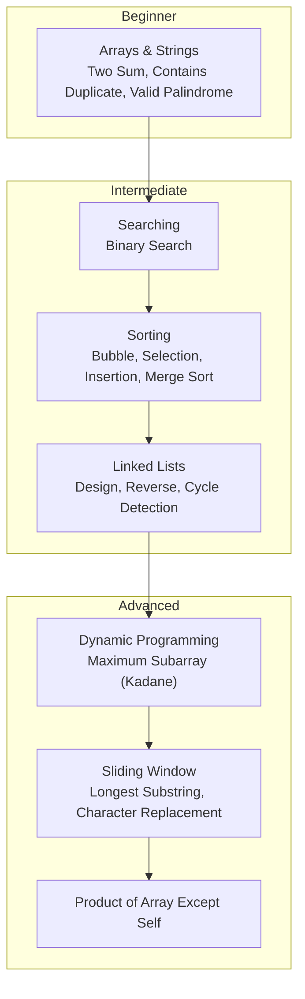

**Section sources**
- [1_twoSum.js](file://Blind-75/1_twoSum.js#L1-L54)
- [25_704_ser_sor_binary_search.js](file://25_704_ser_sor_binary_search.js#L1-L39)
- [26_sor_bubble_sort.js](file://26_sor_bubble_sort.js#L1-L56)
- [29_912_sort_merge_sort.js](file://29_912_sort_merge_sort.js#L1-L49)
- [30_707_linked_list_design_linked_list.js](file://30_707_linked_list_design_linked_list.js#L1-L144)

## Core Components
This section maps the learning modules to their canonical problems and the skills they develop.

- Arrays and Hashing
  - Two Sum: Hash map for complement lookup; teaches O(n) time vs nested loops
  - Contains Duplicate: Hash set for uniqueness checks; early exit optimization
  - Product of Array Except Self: Prefix/Suffix decomposition; avoids division
- Strings and Sliding Window
  - Valid Palindrome: Two-pointer preprocessing and comparison
  - Longest Substring Without Repeating Characters: Hash set sliding window
  - Character Replacement: Frequency map with sliding window constraint
- Searching
  - Binary Search: Divide-and-conquer on sorted arrays; logarithmic time
- Sorting
  - Bubble Sort, Selection Sort, Insertion Sort: Quadratic algorithms for intuition
  - Merge Sort: Divide-and-conquer baseline for O(n log n)
- Linked Lists
  - Design Linked List: Node abstraction and pointer manipulation
  - Reverse Linked List: Pointer rewiring technique
  - Linked List Cycle: Floyd’s tortoise and hare algorithm
- Dynamic Programming
  - Maximum Subarray (Kadane’s Algorithm): Local-to-global optimization

**Section sources**
- [1_twoSum.js](file://Blind-75/1_twoSum.js#L1-L54)
- [3_containsDuplicate.js](file://Blind-75/3_containsDuplicate.js#L1-L53)
- [4_productExceptSelf.js](file://Blind-75/4_productExceptSelf.js#L1-L63)
- [7_validPalindrome.js](file://Blind-75/7_validPalindrome.js#L1-L54)
- [6_longestSubstring.js](file://Blind-75/6_longestSubstring.js#L1-L74)
- [8_characterReplacement.js](file://Blind-75/8_characterReplacement.js#L1-L71)
- [25_704_ser_sor_binary_search.js](file://25_704_ser_sor_binary_search.js#L1-L39)
- [26_sor_bubble_sort.js](file://26_sor_bubble_sort.js#L1-L56)
- [27_sor_selection_sort.js](file://27_sor_selection_sort.js#L1-L38)
- [28_insertion_sort.js](file://28_insertion_sort.js#L1-L37)
- [29_912_sort_merge_sort.js](file://29_912_sort_merge_sort.js#L1-L49)
- [30_707_linked_list_design_linked_list.js](file://30_707_linked_list_design_linked_list.js#L1-L144)
- [32_206_linked_list_reverse.js](file://32_206_linked_list_reverse.js#L1-L45)
- [33_141_linked-list-cycle.js](file://33_141_linked-list-cycle.js#L1-L77)
- [5_maxSubArray.js](file://Blind-75/5_maxSubArray.js#L1-L59)

## Architecture Overview
The learning architecture follows a progressive pipeline:
- Foundational concepts (arrays, strings) feed into efficient searching and sorting
- Efficient searching and sorting enable advanced list manipulations
- Dynamic programming and sliding window patterns build on prior algorithmic intuition

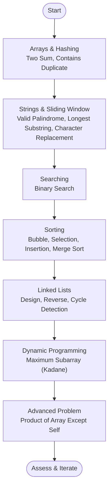

[No sources needed since this diagram shows conceptual workflow, not actual code structure]

## Detailed Component Analysis

### Arrays and Hashing
- Two Sum
  - Approach: Hash map to store value-to-index mapping; iterate once to find complement
  - Complexity: O(n) time, O(n) space
  - Learning focus: Complement strategy, hash table lookups
- Contains Duplicate
  - Approach: Hash set for uniqueness; early return upon duplicate discovery
  - Complexity: O(n) time, O(n) space
  - Learning focus: Uniqueness checks, set operations
- Product of Array Except Self
  - Approach: Prefix and suffix products computed in two passes
  - Complexity: O(n) time, O(1) extra space (excluding output)
  - Learning focus: Decomposition, prefix/suffix reasoning

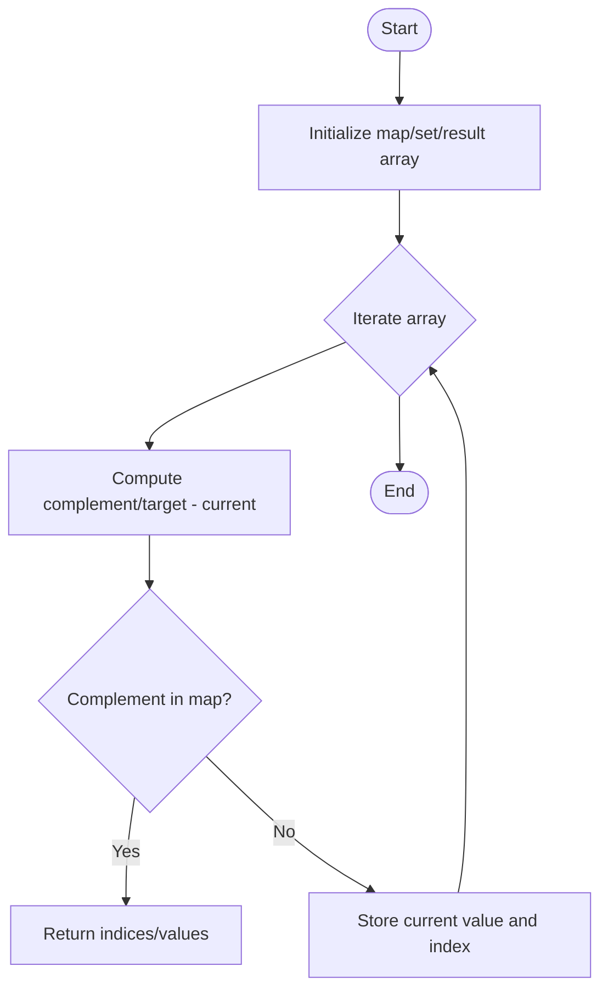

**Diagram sources**
- [1_twoSum.js](file://Blind-75/1_twoSum.js#L32-L50)
- [3_containsDuplicate.js](file://Blind-75/3_containsDuplicate.js#L33-L49)
- [4_productExceptSelf.js](file://Blind-75/4_productExceptSelf.js#L38-L59)

**Section sources**
- [1_twoSum.js](file://Blind-75/1_twoSum.js#L1-L54)
- [3_containsDuplicate.js](file://Blind-75/3_containsDuplicate.js#L1-L53)
- [4_productExceptSelf.js](file://Blind-75/4_productExceptSelf.js#L1-L63)

### Strings and Sliding Window
- Valid Palindrome
  - Approach: Normalize string, two-pointer comparison
  - Complexity: O(n) time, O(n) space (cleaned string)
  - Learning focus: Preprocessing, two-pointer symmetry checks
- Longest Substring Without Repeating Characters
  - Approach: Sliding window with hash set; expand until duplicate, shrink until valid
  - Complexity: O(n) time, O(min(m,n)) space
  - Learning focus: Window maintenance, duplicate handling
- Character Replacement
  - Approach: Sliding window with frequency map; maintain (window - max_freq) ≤ k
  - Complexity: O(n) time, O(1) space (bounded alphabet)
  - Learning focus: Frequency tracking, window constraint management

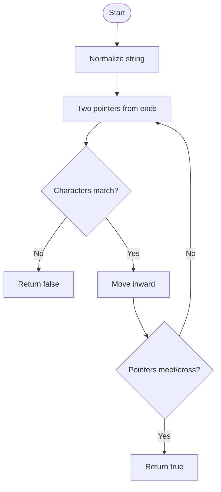

**Diagram sources**
- [7_validPalindrome.js](file://Blind-75/7_validPalindrome.js#L35-L50)

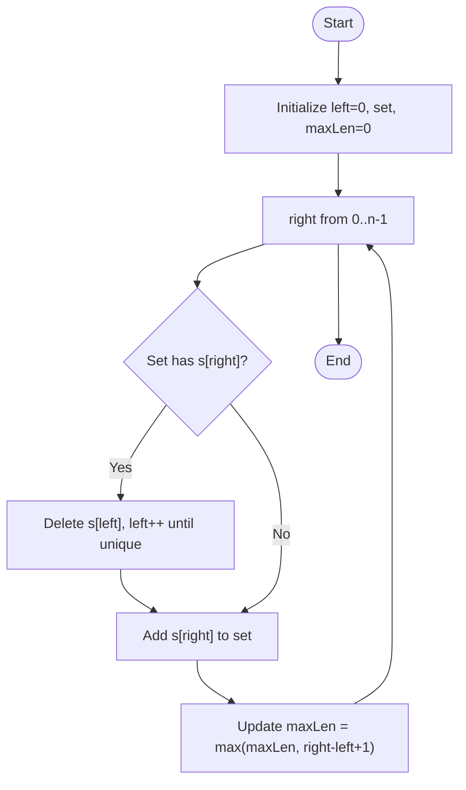

**Diagram sources**
- [6_longestSubstring.js](file://Blind-75/6_longestSubstring.js#L42-L70)
- [8_characterReplacement.js](file://Blind-75/8_characterReplacement.js#L41-L67)

**Section sources**
- [7_validPalindrome.js](file://Blind-75/7_validPalindrome.js#L1-L54)
- [6_longestSubstring.js](file://Blind-75/6_longestSubstring.js#L1-L74)
- [8_characterReplacement.js](file://Blind-75/8_characterReplacement.js#L1-L71)

### Searching
- Binary Search
  - Approach: Iterative two-pointer method on sorted arrays
  - Complexity: O(log n) time, O(1) space
  - Learning focus: Divide-and-conquer, boundary updates

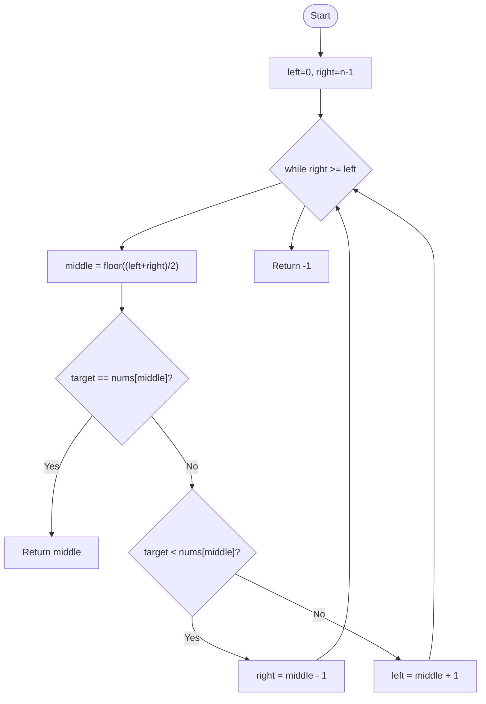

**Diagram sources**
- [25_704_ser_sor_binary_search.js](file://25_704_ser_sor_binary_search.js#L18-L33)

**Section sources**
- [25_704_ser_sor_binary_search.js](file://25_704_ser_sor_binary_search.js#L1-L39)

### Sorting
- Bubble Sort
  - Approach: Repeated adjacent swaps; optional early termination
  - Complexity: O(n^2) time, O(1) space
  - Learning focus: Stability, worst-case behavior
- Selection Sort
  - Approach: Select minimum and place at front
  - Complexity: O(n^2) time, O(1) space
  - Learning focus: In-place selection, minimal writes
- Insertion Sort
  - Approach: Build sorted prefix by inserting current element
  - Complexity: O(n^2) time, O(1) space
  - Learning focus: Adaptive behavior, shifting mechanics
- Merge Sort
  - Approach: Recursively split and merge sorted halves
  - Complexity: O(n log n) time, O(n) space
  - Learning focus: Divide-and-conquer recursion, merging

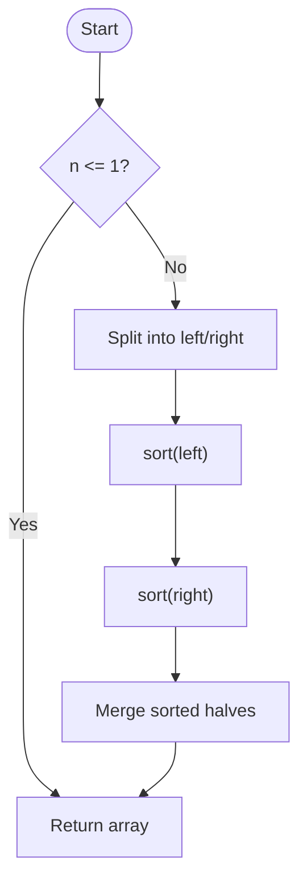

**Diagram sources**
- [29_912_sort_merge_sort.js](file://29_912_sort_merge_sort.js#L19-L44)

**Section sources**
- [26_sor_bubble_sort.js](file://26_sor_bubble_sort.js#L1-L56)
- [27_sor_selection_sort.js](file://27_sor_selection_sort.js#L1-L38)
- [28_insertion_sort.js](file://28_insertion_sort.js#L1-L37)
- [29_912_sort_merge_sort.js](file://29_912_sort_merge_sort.js#L1-L49)

### Linked Lists
- Design Linked List
  - Approach: Node class with value and next pointer; operations on head/tail/index
  - Complexity: O(1) to O(n) depending on operation
  - Learning focus: Pointer arithmetic, sentinel/head/tail handling
- Reverse Linked List
  - Approach: Three-pointer technique (prev, curr, next)
  - Complexity: O(n) time, O(1) space
  - Learning focus: Pointer rewiring, iterative reversal
- Linked List Cycle
  - Approach: Floyd’s tortoise and hare (slow/fast pointers)
  - Complexity: O(n) time, O(1) space
  - Learning focus: Cycle detection, pointer advancement

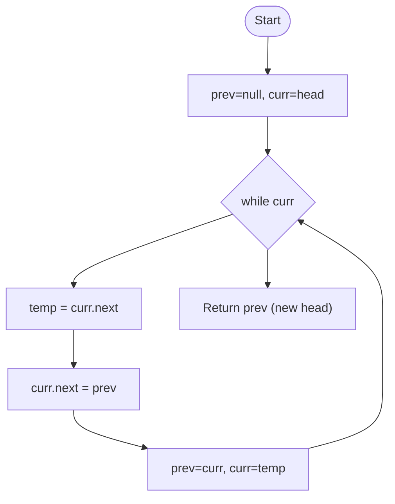

**Diagram sources**
- [32_206_linked_list_reverse.js](file://32_206_linked_list_reverse.js#L30-L44)

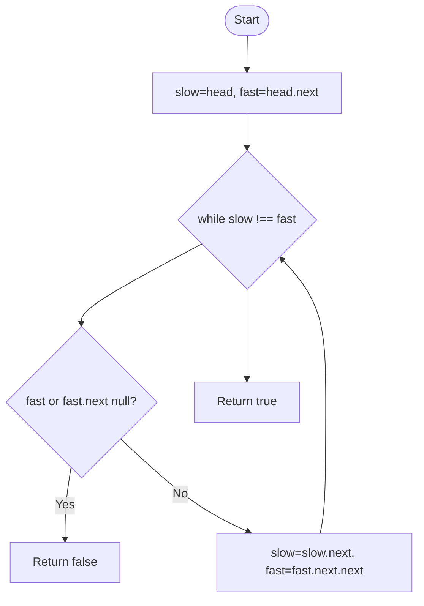

**Diagram sources**
- [33_141_linked-list-cycle.js](file://33_141_linked-list-cycle.js#L60-L74)

**Section sources**
- [30_707_linked_list_design_linked_list.js](file://30_707_linked_list_design_linked_list.js#L1-L144)
- [32_206_linked_list_reverse.js](file://32_206_linked_list_reverse.js#L1-L45)
- [33_141_linked-list-cycle.js](file://33_141_linked-list-cycle.js#L1-L77)

### Dynamic Programming
- Maximum Subarray (Kadane’s Algorithm)
  - Approach: At each position, decide to extend previous subarray or start fresh
  - Complexity: O(n) time, O(1) space
  - Learning focus: Local-to-global optimization, state transitions

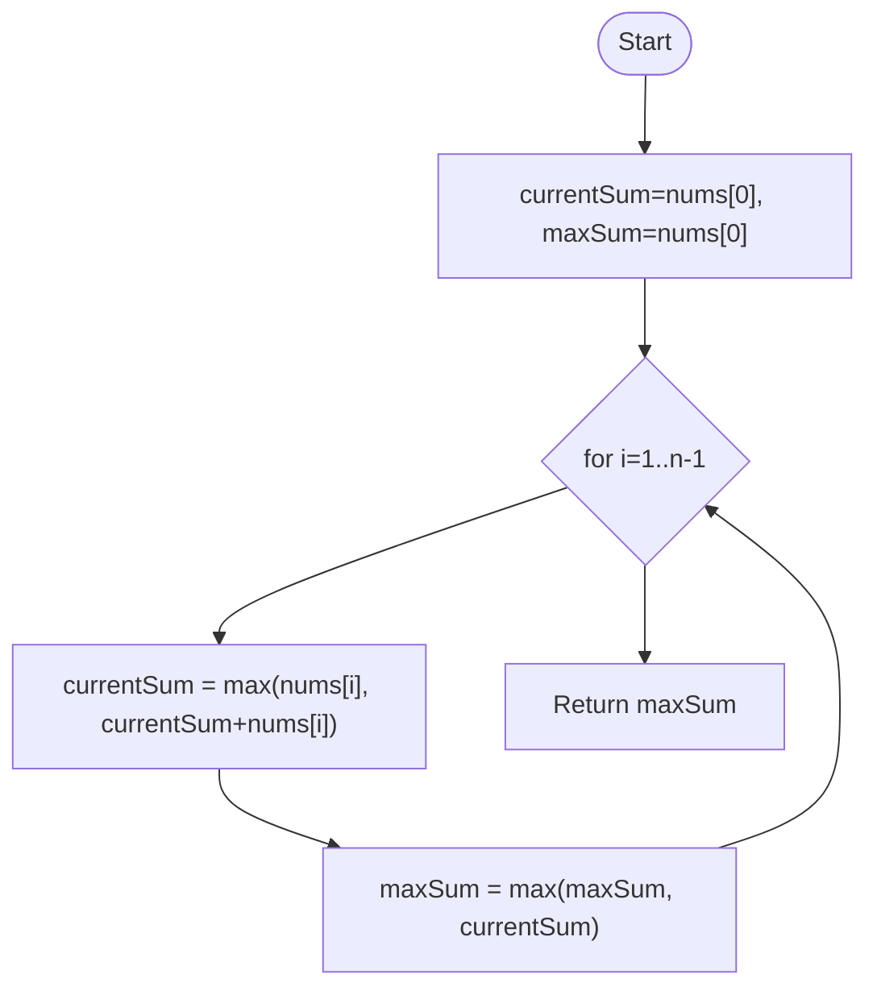

**Diagram sources**
- [5_maxSubArray.js](file://Blind-75/5_maxSubArray.js#L37-L55)

**Section sources**
- [5_maxSubArray.js](file://Blind-75/5_maxSubArray.js#L1-L59)

## Dependency Analysis
The topics build incrementally:
- Arrays and strings underpin hashing and sliding window techniques
- Searching and sorting establish algorithmic efficiency expectations
- Linked lists require pointer manipulation skills developed via earlier list designs
- Dynamic programming relies on understanding state transitions and optimal substructure

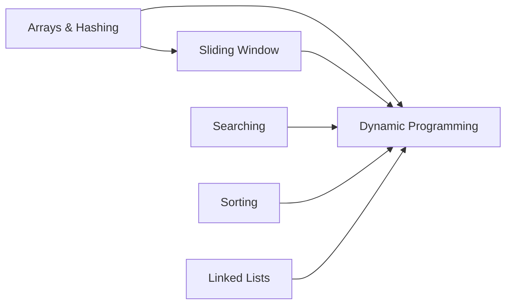

[No sources needed since this diagram shows conceptual relationships, not specific code structure]

## Performance Considerations
- Prefer O(n) or O(n log n) solutions when possible; avoid O(n^2) brute force unless constraints are small
- Use appropriate data structures:
  - Hash maps/sets for O(1) average lookups
  - Sliding window for contiguous subarray/string problems
  - Pointer rewiring for in-place linked list transformations
- Space vs time trade-offs:
  - Prefix/suffix arrays vs constant-space passes
  - In-place sorting vs auxiliary memory

[No sources needed since this section provides general guidance]

## Troubleshooting Guide
- Off-by-one errors in sliding windows:
  - Validate bounds and ensure window validity before expanding/shrinking
- Linked list pitfalls:
  - Always save the next node before rewiring pointers
  - Handle edge cases: empty list, single node, tail insertion
- Binary search:
  - Confirm sorted input and correct boundary updates
- Sorting stability:
  - Understand when stability matters and choose appropriate algorithms

**Section sources**
- [6_longestSubstring.js](file://Blind-75/6_longestSubstring.js#L56-L60)
- [32_206_linked_list_reverse.js](file://32_206_linked_list_reverse.js#L36-L39)
- [25_704_ser_sor_binary_search.js](file://25_704_ser_sor_binary_search.js#L21-L31)

## Conclusion
This repository offers a structured path from fundamentals to advanced algorithms. By mastering the canonical problems and their patterns—hashing, sliding windows, divide-and-conquer, and pointer manipulation—you will be well-prepared for technical interviews and competitive programming challenges. Regular practice, spaced repetition, and targeted assessments will accelerate progress.

[No sources needed since this section summarizes without analyzing specific files]

## Appendices

### Learning Path and Milestones
- Beginner
  - Arrays and Hashing: Two Sum, Contains Duplicate
  - Strings: Valid Palindrome
  - Assessment: Solve 2–3 easy problems daily; explain approach and complexity
- Intermediate
  - Searching: Binary Search
  - Sorting: Bubble, Selection, Insertion, Merge Sort
  - Linked Lists: Design, Reverse, Cycle Detection
  - Assessment: Implement 1 sorting algorithm from scratch; debug linked list edge cases
- Advanced
  - Dynamic Programming: Maximum Subarray (Kadane)
  - Sliding Window: Longest Substring, Character Replacement
  - Product of Array Except Self
  - Assessment: Optimize a solution; justify time/space improvements

[No sources needed since this section provides general guidance]

### Prerequisites and Competency Matrix
- Mathematical Foundations
  - Big-O notation, recurrence relations, logarithms
- JavaScript Proficiency
  - Arrays, objects/maps, sets, loops, conditionals, functions
- Computer Science Concepts
  - Time/space complexity, recursion, divide-and-conquer, greedy choice, optimal substructure

[No sources needed since this section provides general guidance]

### Practice Scheduling Recommendations
- Daily: 1–2 problems; alternate between categories (arrays, strings, linked lists)
- Weekly: 1–2 advanced problems (sliding window, DP)
- Bi-weekly: Timed mock session (30–45 minutes) with 2–3 problems
- Monthly: Review and refactor a previously solved problem

[No sources needed since this section provides general guidance]

### Interview-Focused Study Plan
- Week 1–2: Arrays and strings (hashing, sliding window)
- Week 3: Searching and sorting (binary search, merge sort)
- Week 4: Linked lists (design, reversal, cycle)
- Week 5+: Dynamic programming and advanced patterns

[No sources needed since this section provides general guidance]

### Assessment Criteria and Gap Identification
- Correctness: Does the solution handle edge cases?
- Efficiency: Are time/space complexities acceptable?
- Clarity: Can you explain the approach and invariants?
- Optimization: Can you improve the solution?

[No sources needed since this section provides general guidance]