# Problem-Solving Methodology

<cite>
**Referenced Files in This Document**
- [1_twoSum.js](file://Blind-75/1_twoSum.js)
- [5_maxSubArray.js](file://Blind-75/5_maxSubArray.js)
- [9_minWindowSubstring.js](file://Blind-75/9_minWindowSubstring.js)
- [10_groupAnagrams.js](file://Blind-75/10_groupAnagrams.js)
- [11_reverseLinkedList.js](file://Blind-75/11_reverseLinkedList.js)
- [21_combinationSum.js](file://Blind-75/21_combinationSum.js)
- [23_permutations.js](file://Blind-75/23_permutations.js)
- [36_numberOfIslands.js](file://Blind-75/36_numberOfIslands.js)
- [44_coinChange.js](file://Blind-75/44_coinChange.js)
- [45_longestIncreasingSubsequence.js](file://Blind-75/45_longestIncreasingSubsequence.js)
- [59_trappingRainWater.js](file://Blind-75/59_trappingRainWater.js)
- [60_jumpGame.js](file://Blind-75/60_jumpGame.js)
- [61_uniquePaths.js](file://Blind-75/61_uniquePaths.js)
- [65_lisBinarySearch.js](file://Blind-75/65_lisBinarySearch.js)
- [74_decodeWays.js](file://Blind-75/74_decodeWays.js)
</cite>

## Table of Contents
1. [Introduction](#introduction)
2. [Project Structure](#project-structure)
3. [Core Components](#core-components)
4. [Architecture Overview](#architecture-overview)
5. [Detailed Component Analysis](#detailed-component-analysis)
6. [Dependency Analysis](#dependency-analysis)
7. [Performance Considerations](#performance-considerations)
8. [Troubleshooting Guide](#troubleshooting-guide)
9. [Conclusion](#conclusion)
10. [Appendices](#appendices)

## Introduction
This document presents a comprehensive problem-solving methodology grounded in the repository’s algorithmic solutions. It explains how to systematically analyze problems, specify inputs and outputs, identify constraints, select appropriate solution strategies, and rigorously analyze time and space complexity. It also catalogs common algorithmic patterns (hash tables, two-pointer technique, sliding window, DFS/BFS, backtracking, greedy, and dynamic programming) and provides decision trees, debugging strategies, and practical examples drawn from real problems in the repository.

## Project Structure
The repository organizes problems by category and difficulty, with each solution clearly annotated with:
- Problem statement
- Approach rationale
- Implementation logic
- Complexity analysis
- Tests

This structure supports a repeatable methodology: define the problem, enumerate constraints, choose an approach, implement, and analyze complexity.

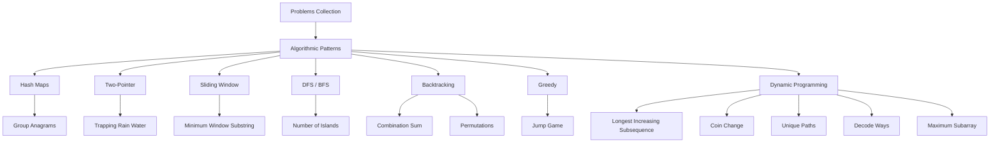

[No sources needed since this diagram shows conceptual workflow, not actual code structure]

## Core Components
This section outlines the methodology and how it is applied across the repository’s solutions.

- Input/Output Specification
  - Clearly define the problem domain, input types, and expected output format.
  - Identify special cases (empty inputs, single elements, invalid states).
  - Example reference: [1_twoSum.js](file://Blind-75/1_twoSum.js#L1-L54), [10_groupAnagrams.js](file://Blind-75/10_groupAnagrams.js#L1-L64)

- Constraint Identification
  - Enumerate constraints such as array sizes, value ranges, ordering, uniqueness, and memory limits.
  - Example reference: [44_coinChange.js](file://Blind-75/44_coinChange.js#L1-L67), [60_jumpGame.js](file://Blind-75/60_jumpGame.js#L1-L65)

- Solution Strategy Selection
  - Match constraints to suitable paradigms (hash map for complement searches, sliding window for substring constraints, DP for optimal substructure, etc.).
  - Example reference: [9_minWindowSubstring.js](file://Blind-75/9_minWindowSubstring.js#L1-L79), [45_longestIncreasingSubsequence.js](file://Blind-75/45_longestIncreasingSubsequence.js#L1-L66)

- Complexity Analysis
  - Derive time and space complexity from loop bounds, recursion depth, and data structure operations.
  - Example reference: [5_maxSubArray.js](file://Blind-75/5_maxSubArray.js#L1-L59), [61_uniquePaths.js](file://Blind-75/61_uniquePaths.js#L1-L59)

- Debugging Strategies
  - Validate base cases, boundary conditions, and invariant maintenance.
  - Example reference: [36_numberOfIslands.js](file://Blind-75/36_numberOfIslands.js#L1-L97), [21_combinationSum.js](file://Blind-75/21_combinationSum.js#L1-L79)

**Section sources**
- [1_twoSum.js](file://Blind-75/1_twoSum.js#L1-L54)
- [5_maxSubArray.js](file://Blind-75/5_maxSubArray.js#L1-L59)
- [9_minWindowSubstring.js](file://Blind-75/9_minWindowSubstring.js#L1-L79)
- [10_groupAnagrams.js](file://Blind-75/10_groupAnagrams.js#L1-L64)
- [36_numberOfIslands.js](file://Blind-75/36_numberOfIslands.js#L1-L97)
- [44_coinChange.js](file://Blind-75/44_coinChange.js#L1-L67)
- [45_longestIncreasingSubsequence.js](file://Blind-75/45_longestIncreasingSubsequence.js#L1-L66)
- [59_trappingRainWater.js](file://Blind-75/59_trappingRainWater.js#L1-L76)
- [60_jumpGame.js](file://Blind-75/60_jumpGame.js#L1-L65)
- [61_uniquePaths.js](file://Blind-75/61_uniquePaths.js#L1-L59)
- [65_lisBinarySearch.js](file://Blind-75/65_lisBinarySearch.js#L1-L66)
- [74_decodeWays.js](file://Blind-75/74_decodeWays.js#L1-L70)

## Architecture Overview
The repository follows a consistent architecture:
- Each problem file encapsulates:
  - Problem statement
  - Approach explanation
  - Implementation
  - Complexity analysis
  - Example test call
- This modular design enables:
  - Reproducible methodology application
  - Easy comparison across approaches
  - Clear debugging and verification

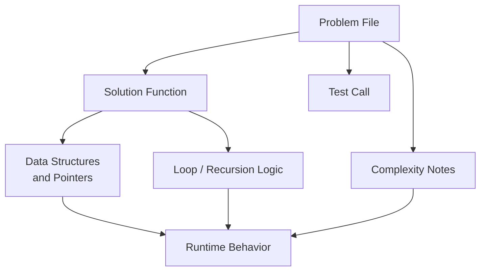

[No sources needed since this diagram shows conceptual workflow, not actual code structure]

## Detailed Component Analysis

### Hash Map Approaches
- Pattern: Use a hash map/dictionary to store previously seen values or counts for O(1) lookups.
- Representative examples:
  - Two Sum: Complement lookup during a single pass.
    - Reference: [1_twoSum.js](file://Blind-75/1_twoSum.js#L1-L54)
  - Group Anagrams: Sort characters to form keys and group by key.
    - Reference: [10_groupAnagrams.js](file://Blind-75/10_groupAnagrams.js#L1-L64)

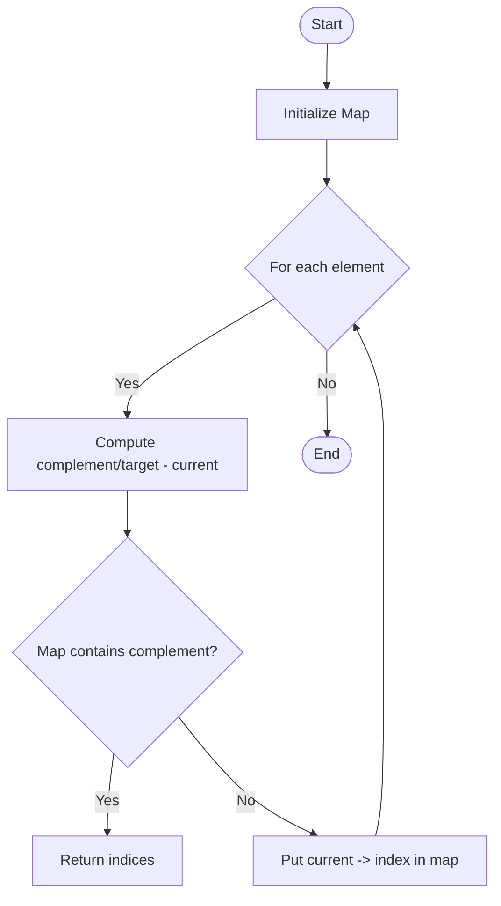

**Diagram sources**
- [1_twoSum.js](file://Blind-75/1_twoSum.js#L32-L50)

**Section sources**
- [1_twoSum.js](file://Blind-75/1_twoSum.js#L1-L54)
- [10_groupAnagrams.js](file://Blind-75/10_groupAnagrams.js#L1-L64)

### Two-Pointer Technique
- Pattern: Maintain pointers at both ends or use fast/slow pointers to traverse linear structures with constant extra space.
- Representative examples:
  - Trapping Rain Water: Compute trapped water by moving the side with smaller max.
    - Reference: [59_trappingRainWater.js](file://Blind-75/59_trappingRainWater.js#L1-L76)

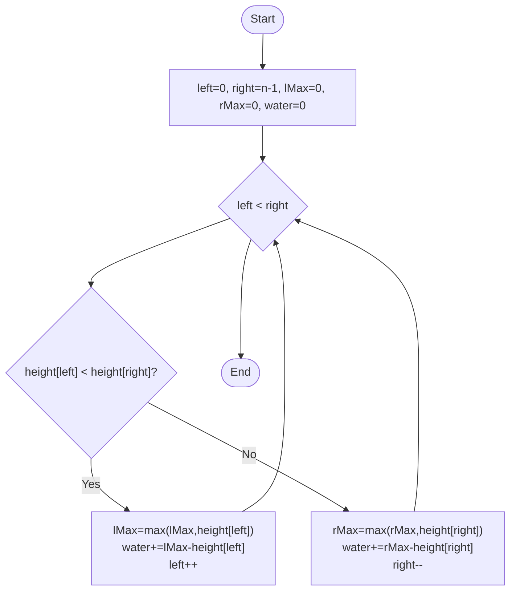

**Diagram sources**
- [59_trappingRainWater.js](file://Blind-75/59_trappingRainWater.js#L45-L72)

**Section sources**
- [59_trappingRainWater.js](file://Blind-75/59_trappingRainWater.js#L1-L76)

### Sliding Window
- Pattern: Expand a window until constraints are satisfied, then shrink from the left to minimize while maintaining validity.
- Representative examples:
  - Minimum Window Substring: Maintain required character counts and minimize window.
    - Reference: [9_minWindowSubstring.js](file://Blind-75/9_minWindowSubstring.js#L1-L79)

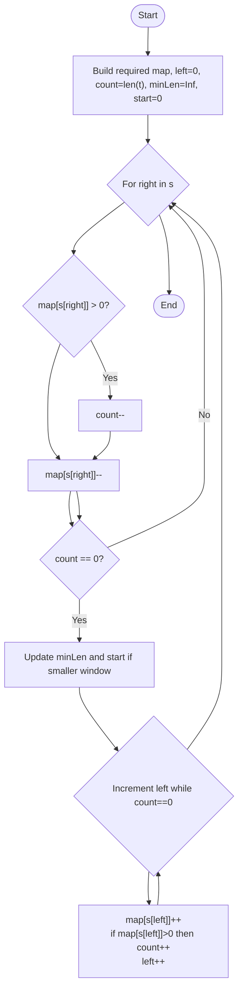

**Diagram sources**
- [9_minWindowSubstring.js](file://Blind-75/9_minWindowSubstring.js#L40-L75)

**Section sources**
- [9_minWindowSubstring.js](file://Blind-75/9_minWindowSubstring.js#L1-L79)

### Depth-First Search (DFS) and Breadth-First Search (BFS)
- Pattern: Explore graph/grid states systematically; often combined with in-place marking to save space.
- Representative examples:
  - Number of Islands: Sink connected land via DFS to avoid revisits.
    - Reference: [36_numberOfIslands.js](file://Blind-75/36_numberOfIslands.js#L1-L97)

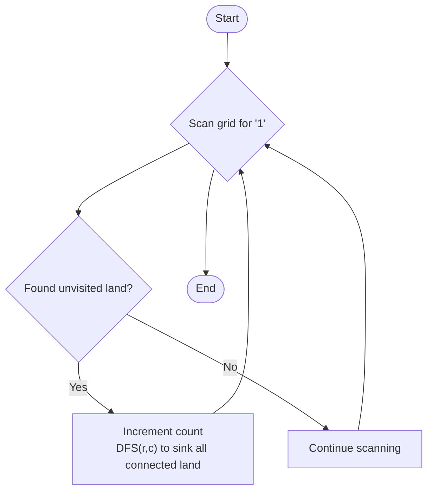

**Diagram sources**
- [36_numberOfIslands.js](file://Blind-75/36_numberOfIslands.js#L48-L86)

**Section sources**
- [36_numberOfIslands.js](file://Blind-75/36_numberOfIslands.js#L1-L97)

### Backtracking
- Pattern: Recursively explore choices, prune invalid branches early, and backtrack to explore alternatives.
- Representative examples:
  - Combination Sum: Allow reuse of candidates; backtrack after recursive exploration.
    - Reference: [21_combinationSum.js](file://Blind-75/21_combinationSum.js#L1-L79)
  - Permutations: Track used elements and backtrack to build all arrangements.
    - Reference: [23_permutations.js](file://Blind-75/23_permutations.js#L1-L76)

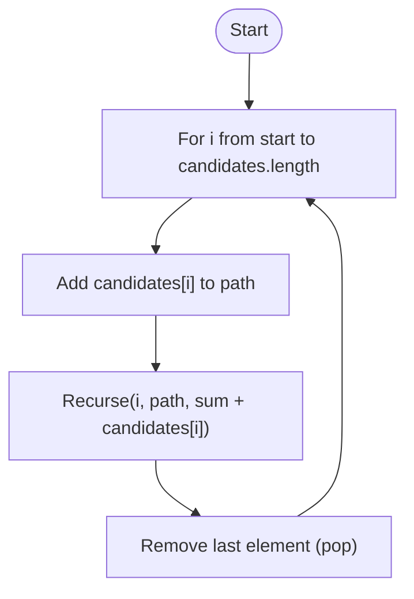

**Diagram sources**
- [21_combinationSum.js](file://Blind-75/21_combinationSum.js#L47-L75)

**Section sources**
- [21_combinationSum.js](file://Blind-75/21_combinationSum.js#L1-L79)
- [23_permutations.js](file://Blind-75/23_permutations.js#L1-L76)

### Greedy
- Pattern: Make locally optimal choices at each step with global benefit.
- Representative examples:
  - Jump Game: Track maximum reachable index and terminate early if unreachable.
    - Reference: [60_jumpGame.js](file://Blind-75/60_jumpGame.js#L1-L65)

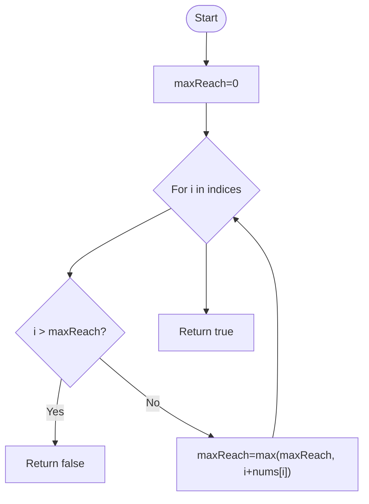

**Diagram sources**
- [60_jumpGame.js](file://Blind-75/60_jumpGame.js#L47-L60)

**Section sources**
- [60_jumpGame.js](file://Blind-75/60_jumpGame.js#L1-L65)

### Dynamic Programming (DP)
- Pattern: Break problem into overlapping subproblems, define recurrence relation, and compute bottom-up or top-down with memoization.
- Representative examples:
  - Maximum Subarray (Kadane’s): Local maxima lead to global optimum.
    - Reference: [5_maxSubArray.js](file://Blind-75/5_maxSubArray.js#L1-L59)
  - Longest Increasing Subsequence (O(n^2)): dp[i] builds on previous valid sequences.
    - Reference: [45_longestIncreasingSubsequence.js](file://Blind-75/45_longestIncreasingSubsequence.js#L1-L66)
  - Longest Increasing Subsequence (O(n log n)): Maintain tails with binary search.
    - Reference: [65_lisBinarySearch.js](file://Blind-75/65_lisBinarySearch.js#L1-L66)
  - Coin Change: Minimum coins per amount.
    - Reference: [44_coinChange.js](file://Blind-75/44_coinChange.js#L1-L67)
  - Unique Paths: Space-optimized 1D DP.
    - Reference: [61_uniquePaths.js](file://Blind-75/61_uniquePaths.js#L1-L59)
  - Decode Ways: Count decodings by single/two-digit checks.
    - Reference: [74_decodeWays.js](file://Blind-75/74_decodeWays.js#L1-L70)

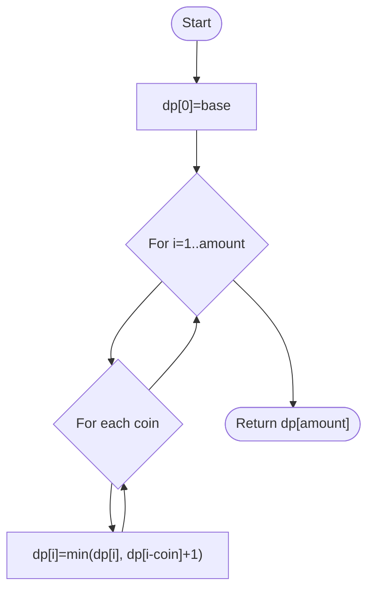

**Diagram sources**
- [44_coinChange.js](file://Blind-75/44_coinChange.js#L45-L63)

**Section sources**
- [5_maxSubArray.js](file://Blind-75/5_maxSubArray.js#L1-L59)
- [45_longestIncreasingSubsequence.js](file://Blind-75/45_longestIncreasingSubsequence.js#L1-L66)
- [65_lisBinarySearch.js](file://Blind-75/65_lisBinarySearch.js#L1-L66)
- [44_coinChange.js](file://Blind-75/44_coinChange.js#L1-L67)
- [61_uniquePaths.js](file://Blind-75/61_uniquePaths.js#L1-L59)
- [74_decodeWays.js](file://Blind-75/74_decodeWays.js#L1-L70)

### Linked List Reversal (Iterative)
- Pattern: Use three pointers to reverse links iteratively in O(1) space.
- Representative example:
  - Reverse Linked List: Classic iterative reversal.
    - Reference: [11_reverseLinkedList.js](file://Blind-75/11_reverseLinkedList.js#L1-L71)

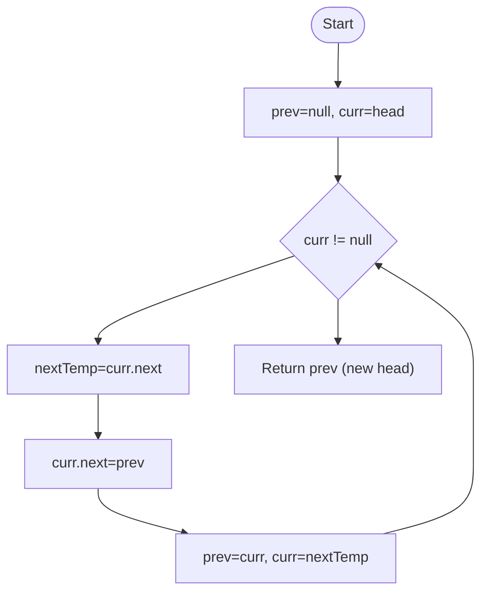

**Diagram sources**
- [11_reverseLinkedList.js](file://Blind-75/11_reverseLinkedList.js#L48-L70)

**Section sources**
- [11_reverseLinkedList.js](file://Blind-75/11_reverseLinkedList.js#L1-L71)

## Dependency Analysis
Across the repository, solutions depend on:
- Built-in data structures (Maps, arrays)
- Primitive operations (comparisons, arithmetic)
- Control flow (loops, conditionals, recursion)
- No external libraries; all logic is self-contained

```mermaid
graph TB
TwoSum["Two Sum"] --> Map["Map"]
GroupAna["Group Anagrams"] --> Map
MinWin["Min Window Substring"] --> Map
Trap["Trapping Rain Water"] --> Arrays["Arrays"]
Kadane["Maximum Subarray"] --> Arrays
LIS_O1["LIS O(n^2)"] --> Arrays
LIS_Olog["LIS O(n log n)"] --> Arrays
Coin["Coin Change"] --> Arrays
Paths["Unique Paths"] --> Arrays
Decode["Decode Ways"] --> Arrays
Jump["Jump Game"] --> Arrays
Islands["Number of Islands"] --> Arrays
Comb["Combination Sum"] --> Arrays
Perm["Permutations"] --> Arrays
RevLL["Reverse Linked List"] --> Arrays
```

[No sources needed since this diagram shows conceptual relationships, not specific code structure]

## Performance Considerations
- Trade-offs between time and space:
  - LIS O(n log n) vs O(n^2) DP variants
  - Sliding window vs precomputing auxiliary arrays
  - In-place modifications (e.g., sinking islands) to reduce memory
- When to apply optimizations:
  - Prefer hash maps for complement searches
  - Use two pointers for monotonic or bounded windows
  - Apply DP when subproblems overlap and optimal substructure exists
  - Use greedy when local choices maintain global feasibility

[No sources needed since this section provides general guidance]

## Troubleshooting Guide
- Common pitfalls and how to catch them:
  - Off-by-one errors in sliding window boundaries
    - Reference: [9_minWindowSubstring.js](file://Blind-75/9_minWindowSubstring.js#L54-L72)
  - Incorrect base cases in DP (e.g., empty string or zero amount)
    - Reference: [74_decodeWays.js](file://Blind-75/74_decodeWays.js#L43-L66)
  - Not pruning backtracking early enough (excessive branching)
    - Reference: [21_combinationSum.js](file://Blind-75/21_combinationSum.js#L57-L58)
  - DFS not marking visited properly leading to infinite recursion
    - Reference: [36_numberOfIslands.js](file://Blind-75/36_numberOfIslands.js#L56-L72)
  - Greedy assumption failing without proof
    - Reference: [60_jumpGame.js](file://Blind-75/60_jumpGame.js#L47-L60)

**Section sources**
- [9_minWindowSubstring.js](file://Blind-75/9_minWindowSubstring.js#L1-L79)
- [74_decodeWays.js](file://Blind-75/74_decodeWays.js#L1-L70)
- [21_combinationSum.js](file://Blind-75/21_combinationSum.js#L1-L79)
- [36_numberOfIslands.js](file://Blind-75/36_numberOfIslands.js#L1-L97)
- [60_jumpGame.js](file://Blind-75/60_jumpGame.js#L1-L65)

## Conclusion
The repository demonstrates a consistent, methodical approach to algorithm design:
- Define the problem precisely and enumerate constraints
- Select an appropriate paradigm (hash map, two-pointer, sliding window, DFS/BFS, backtracking, greedy, DP)
- Implement with clear invariants and edge-case handling
- Analyze time and space complexity rigorously
- Validate with targeted tests and debug potential pitfalls

Adopting this framework yields reproducible, efficient, and maintainable solutions.

[No sources needed since this section summarizes without analyzing specific files]

## Appendices

### Step-by-Step Problem Breakdown Methodology
- Understand the problem and inputs/outputs
- Identify constraints and special cases
- Choose a paradigm based on structure and constraints
- Design invariants and data structures
- Implement and test with small examples
- Analyze complexity and optimize if needed

[No sources needed since this section provides general guidance]

### Decision Tree for Approach Selection
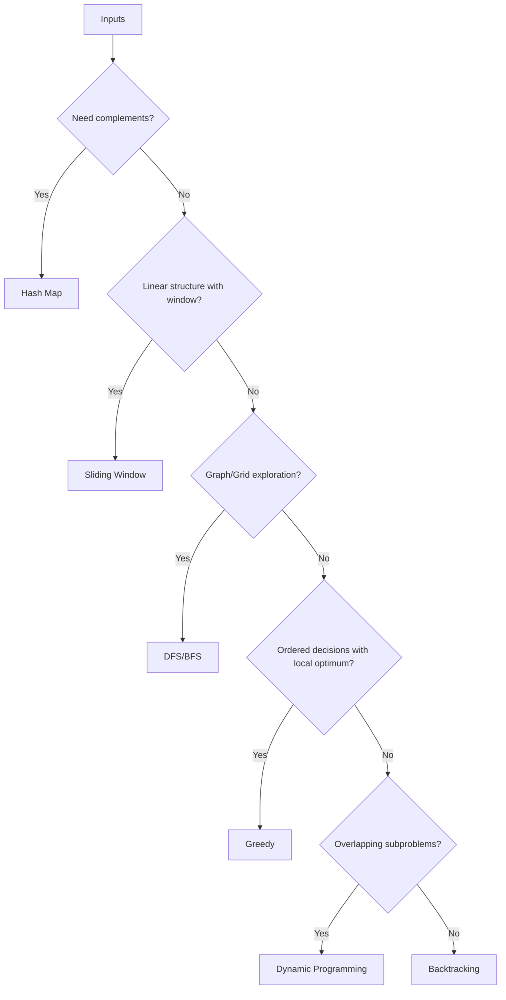

[No sources needed since this diagram shows conceptual workflow, not actual code structure]