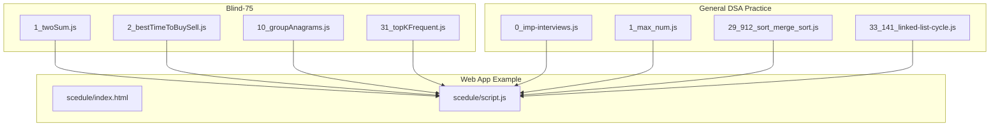
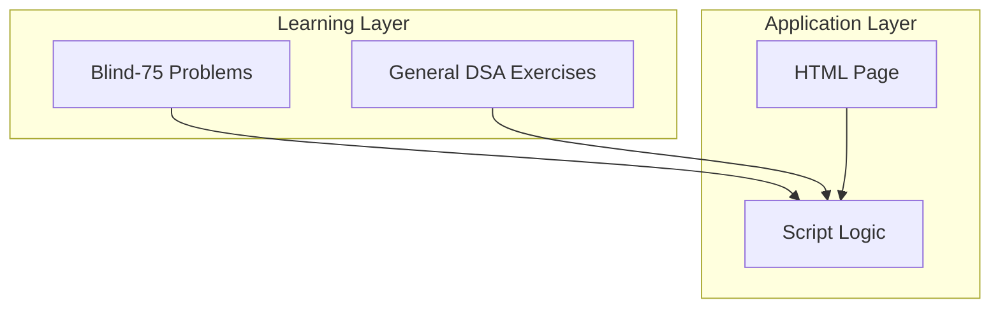
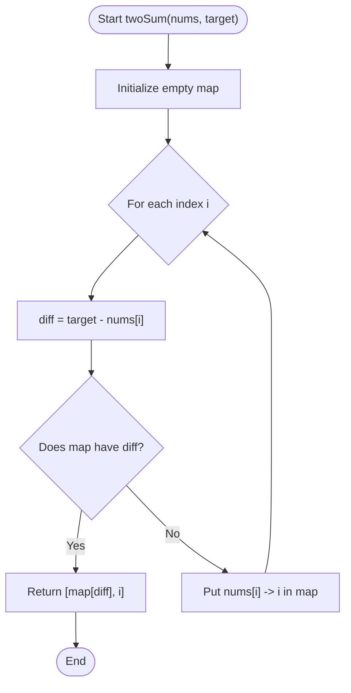
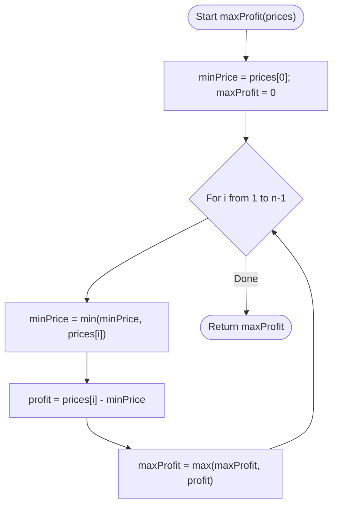
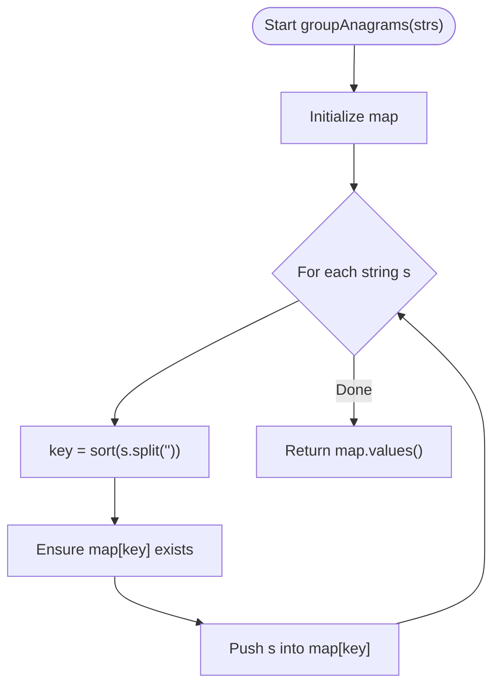
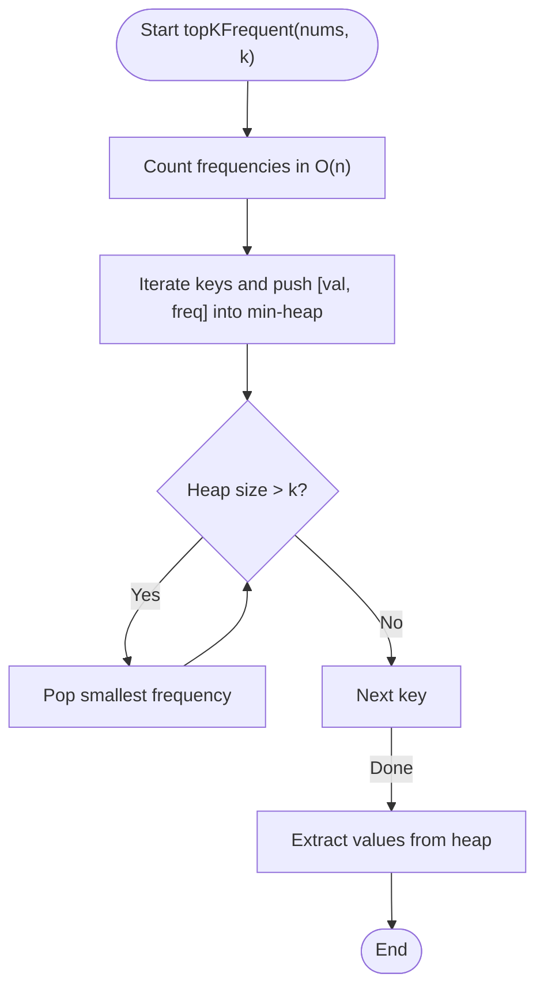
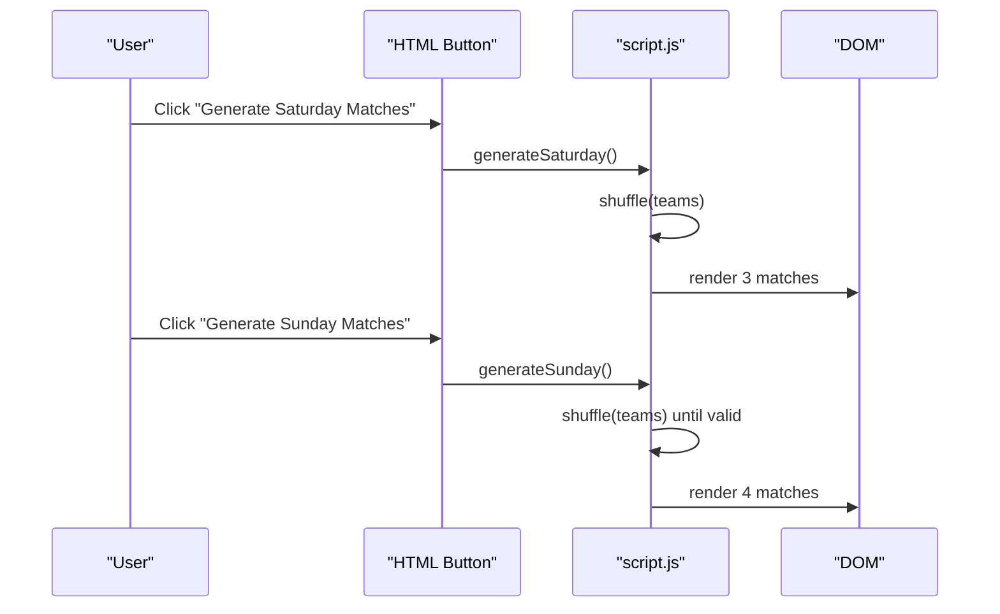
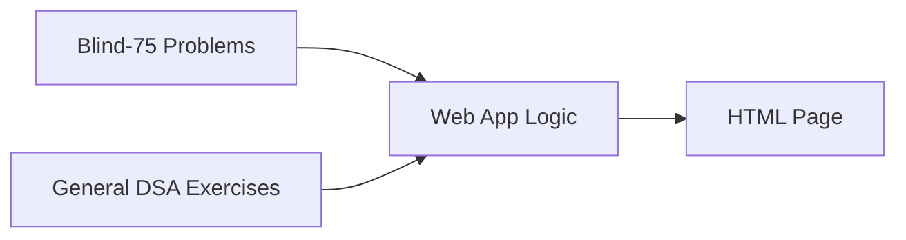

# Project Overview

<cite>
**Referenced Files in This Document**
- [1_twoSum.js](file://Blind-75/1_twoSum.js)
- [2_bestTimeToBuySell.js](file://Blind-75/2_bestTimeToBuySell.js)
- [10_groupAnagrams.js](file://Blind-75/10_groupAnagrams.js)
- [31_topKFrequent.js](file://Blind-75/31_topKFrequent.js)
- [0_imp-interviews.js](file://0_imp-interviews.js)
- [1_max_num.js](file://1_max_num.js)
- [29_912_sort_merge_sort.js](file://29_912_sort_merge_sort.js)
- [33_141_linked-list-cycle.js](file://33_141_linked-list-cycle.js)
- [index.html](file://scedule/index.html)
- [script.js](file://scedule/script.js)
</cite>

## Table of Contents
1. [Introduction](#introduction)
2. [Project Structure](#project-structure)
3. [Core Components](#core-components)
4. [Architecture Overview](#architecture-overview)
5. [Detailed Component Analysis](#detailed-component-analysis)
6. [Dependency Analysis](#dependency-analysis)
7. [Performance Considerations](#performance-considerations)
8. [Troubleshooting Guide](#troubleshooting-guide)
9. [Conclusion](#conclusion)
10. [Appendices](#appendices)

## Introduction
Namaste DSA is an educational repository designed to help learners master Data Structures and Algorithms (DSA) with a strong emphasis on interview readiness. It combines:
- A curated set of 75+ algorithm problems aligned with industry interview patterns
- Practical, self-contained JavaScript implementations that emphasize clarity and pedagogy
- A small, real-world web application to demonstrate algorithmic thinking applied to frontend scenarios

The project’s philosophy blends academic rigor with professional preparation. It uses pure JavaScript without external dependencies, enabling learners to focus on logic, patterns, and problem-solving methodologies. The modular file structure allows independent execution of each problem, making it easy to study, test, and iterate.

## Project Structure
The repository is organized into distinct areas:
- Blind-75: A focused set of classic algorithm problems with detailed explanations and optimized solutions
- General DSA practice: A wide variety of foundational and advanced topics including arrays, strings, linked lists, sorting, and more
- Web app example: A small frontend application showcasing scheduling logic built with vanilla HTML, CSS, and JavaScript

**Diagram sources**
- [1_twoSum.js](file://Blind-75/1_twoSum.js#L1-L54)
- [2_bestTimeToBuySell.js](file://Blind-75/2_bestTimeToBuySell.js#L1-L57)
- [10_groupAnagrams.js](file://Blind-75/10_groupAnagrams.js#L1-L64)
- [31_topKFrequent.js](file://Blind-75/31_topKFrequent.js#L1-L128)
- [0_imp-interviews.js](file://0_imp-interviews.js#L1-L428)
- [1_max_num.js](file://1_max_num.js#L1-L34)
- [29_912_sort_merge_sort.js](file://29_912_sort_merge_sort.js#L1-L49)
- [33_141_linked-list-cycle.js](file://33_141_linked-list-cycle.js#L1-L77)
- [index.html](file://scedule/index.html#L1-L22)
- [script.js](file://scedule/script.js#L1-L84)

**Section sources**
- [1_twoSum.js](file://Blind-75/1_twoSum.js#L1-L54)
- [2_bestTimeToBuySell.js](file://Blind-75/2_bestTimeToBuySell.js#L1-L57)
- [10_groupAnagrams.js](file://Blind-75/10_groupAnagrams.js#L1-L64)
- [31_topKFrequent.js](file://Blind-75/31_topKFrequent.js#L1-L128)
- [0_imp-interviews.js](file://0_imp-interviews.js#L1-L428)
- [1_max_num.js](file://1_max_num.js#L1-L34)
- [29_912_sort_merge_sort.js](file://29_912_sort_merge_sort.js#L1-L49)
- [33_141_linked-list-cycle.js](file://33_141_linked-list-cycle.js#L1-L77)
- [index.html](file://scedule/index.html#L1-L22)
- [script.js](file://scedule/script.js#L1-L84)

## Core Components
- Interview-focused algorithms: Problems like Two Sum, Best Time to Buy and Sell Stock, Group Anagrams, and Top K Frequent Elements are implemented with clear explanations, complexity analysis, and test cases
- Foundational DSA practice: Arrays, strings, linked lists, sorting, and pattern-based exercises support building core competencies
- Web application example: A weekend cricket match scheduler demonstrates practical use of randomization and constraint satisfaction in a browser environment

Key characteristics:
- Pure JavaScript implementations with no external libraries
- Modular files enabling independent execution and testing
- Hinglish explanations and standardized problem-solving methodologies for accessibility

**Section sources**
- [1_twoSum.js](file://Blind-75/1_twoSum.js#L1-L54)
- [2_bestTimeToBuySell.js](file://Blind-75/2_bestTimeToBuySell.js#L1-L57)
- [10_groupAnagrams.js](file://Blind-75/10_groupAnagrams.js#L1-L64)
- [31_topKFrequent.js](file://Blind-75/31_topKFrequent.js#L1-L128)
- [0_imp-interviews.js](file://0_imp-interviews.js#L1-L428)
- [1_max_num.js](file://1_max_num.js#L1-L34)
- [29_912_sort_merge_sort.js](file://29_912_sort_merge_sort.js#L1-L49)
- [33_141_linked-list-cycle.js](file://33_141_linked-list-cycle.js#L1-L77)
- [index.html](file://scedule/index.html#L1-L22)
- [script.js](file://scedule/script.js#L1-L84)

## Architecture Overview
At a high level, the repository separates algorithmic learning from a minimal web application:
- Algorithm learning layer: Each problem is a standalone module with a function, explanatory comments, and a test invocation
- Application layer: A small HTML page with inline scripts orchestrates scheduling logic using vanilla JavaScript

**Diagram sources**
- [1_twoSum.js](file://Blind-75/1_twoSum.js#L1-L54)
- [2_bestTimeToBuySell.js](file://Blind-75/2_bestTimeToBuySell.js#L1-L57)
- [10_groupAnagrams.js](file://Blind-75/10_groupAnagrams.js#L1-L64)
- [31_topKFrequent.js](file://Blind-75/31_topKFrequent.js#L1-L128)
- [0_imp-interviews.js](file://0_imp-interviews.js#L1-L428)
- [1_max_num.js](file://1_max_num.js#L1-L34)
- [29_912_sort_merge_sort.js](file://29_912_sort_merge_sort.js#L1-L49)
- [33_141_linked-list-cycle.js](file://33_141_linked-list-cycle.js#L1-L77)
- [index.html](file://scedule/index.html#L1-L22)
- [script.js](file://scedule/script.js#L1-L84)

## Detailed Component Analysis

### Blind-75: Two Sum
- Purpose: Find indices of two numbers that sum to a target
- Approach: Hash map (one-pass) for O(n) lookup
- Highlights: Clear explanation, complexity analysis, and a console-based test

**Diagram sources**
- [1_twoSum.js](file://Blind-75/1_twoSum.js#L32-L50)

**Section sources**
- [1_twoSum.js](file://Blind-75/1_twoSum.js#L1-L54)

### Blind-75: Best Time to Buy and Sell Stock
- Purpose: Maximize profit by buying low and selling high (single transaction)
- Approach: Track minimum price and compute profit on each day
- Highlights: Constant space, linear time, and a console-based test

**Diagram sources**
- [2_bestTimeToBuySell.js](file://Blind-75/2_bestTimeToBuySell.js#L32-L53)

**Section sources**
- [2_bestTimeToBuySell.js](file://Blind-75/2_bestTimeToBuySell.js#L1-L57)

### Blind-75: Group Anagrams
- Purpose: Group strings that are anagrams of each other
- Approach: Normalize by sorting characters; use map keyed by normalized string
- Highlights: O(n·k log k) time, O(n·k) space, and a console-based test

**Diagram sources**
- [10_groupAnagrams.js](file://Blind-75/10_groupAnagrams.js#L41-L60)

**Section sources**
- [10_groupAnagrams.js](file://Blind-75/10_groupAnagrams.js#L1-L64)

### Blind-75: Top K Frequent Elements
- Purpose: Return the k most frequent elements
- Approach: Hash map for frequency counting; min-heap to maintain top k
- Highlights: O(n log k) time, O(n) space; includes commented generic Heap class

**Diagram sources**
- [31_topKFrequent.js](file://Blind-75/31_topKFrequent.js#L108-L123)

**Section sources**
- [31_topKFrequent.js](file://Blind-75/31_topKFrequent.js#L1-L128)

### General DSA Practice: Largest Number in Array
- Purpose: Find the maximum element in an array
- Approach: Linear scan with a running maximum
- Highlights: O(n) time, O(1) space, and a console-based test

**Section sources**
- [1_max_num.js](file://1_max_num.js#L1-L34)

### General DSA Practice: Merge Sort
- Purpose: Sort an array using divide-and-conquer
- Approach: Recursively split and merge sorted halves
- Highlights: O(n log n) time, O(n) space

**Section sources**
- [29_912_sort_merge_sort.js](file://29_912_sort_merge_sort.js#L1-L49)

### General DSA Practice: Linked List Cycle Detection
- Purpose: Determine if a linked list has a cycle
- Approach: Floyd’s tortoise and hare (slow/fast pointers)
- Highlights: O(n) time, O(1) space

**Section sources**
- [33_141_linked-list-cycle.js](file://33_141_linked-list-cycle.js#L1-L77)

### Web App Example: Weekend Cricket Match Scheduler
- Purpose: Generate balanced matches for Saturday and constrained pairings for Sunday
- Features: Randomized team shuffling, constraint checking, and dynamic DOM updates
- Highlights: Demonstrates practical algorithmic thinking in a browser environment

**Diagram sources**
- [index.html](file://scedule/index.html#L10-L17)
- [script.js](file://scedule/script.js#L33-L83)

**Section sources**
- [index.html](file://scedule/index.html#L1-L22)
- [script.js](file://scedule/script.js#L1-L84)

## Dependency Analysis
- Internal coupling: Problems in the Blind-75 and general practice folders are self-contained and do not depend on each other
- Application integration: The web app depends on vanilla JavaScript utilities (Math, DOM APIs) and does not rely on external frameworks
- Cohesion: Each file encapsulates a single concept or problem, promoting high cohesion and low coupling

**Diagram sources**
- [1_twoSum.js](file://Blind-75/1_twoSum.js#L1-L54)
- [2_bestTimeToBuySell.js](file://Blind-75/2_bestTimeToBuySell.js#L1-L57)
- [10_groupAnagrams.js](file://Blind-75/10_groupAnagrams.js#L1-L64)
- [31_topKFrequent.js](file://Blind-75/31_topKFrequent.js#L1-L128)
- [0_imp-interviews.js](file://0_imp-interviews.js#L1-L428)
- [1_max_num.js](file://1_max_num.js#L1-L34)
- [29_912_sort_merge_sort.js](file://29_912_sort_merge_sort.js#L1-L49)
- [33_141_linked-list-cycle.js](file://33_141_linked-list-cycle.js#L1-L77)
- [index.html](file://scedule/index.html#L1-L22)
- [script.js](file://scedule/script.js#L1-L84)

## Performance Considerations
- Prefer optimal approaches: Use hash maps for O(1) lookups, sliding windows for substrings, and heaps for top-k selections
- Mind space-time trade-offs: For example, sorting-based grouping is straightforward but less efficient than hash-based grouping for large inputs
- Leverage constraints: In the web app, randomized generation with retry ensures valid pairings under constraints

[No sources needed since this section provides general guidance]

## Troubleshooting Guide
- Verify inputs: Ensure arrays and strings passed to functions match expected types and lengths
- Validate edge cases: Empty arrays, single-element arrays, and boundary conditions (e.g., min/max values)
- Console tests: Use provided console logs to confirm correctness quickly
- Browser app checks: Confirm DOM elements exist and event handlers are attached

**Section sources**
- [1_twoSum.js](file://Blind-75/1_twoSum.js#L52-L54)
- [2_bestTimeToBuySell.js](file://Blind-75/2_bestTimeToBuySell.js#L55-L57)
- [10_groupAnagrams.js](file://Blind-75/10_groupAnagrams.js#L62-L64)
- [31_topKFrequent.js](file://Blind-75/31_topKFrequent.js#L125-L128)
- [index.html](file://scedule/index.html#L1-L22)
- [script.js](file://scedule/script.js#L1-L84)

## Conclusion
Namaste DSA offers a practical, dependency-free pathway to algorithm mastery and interview readiness. Its modular design supports independent study, while the web app example illustrates how algorithmic thinking translates into real-world applications. Learners can progress from foundational exercises to advanced patterns, all while building confidence in problem-solving methodologies and code clarity.

[No sources needed since this section summarizes without analyzing specific files]

## Appendices
- Beginner usage: Start with simple array and string exercises, then move to linked lists and sorting
- Interview candidate usage: Focus on Blind-75 problems and replicate the explained approaches under timed conditions
- Web developer usage: Explore the scheduler app to see how vanilla JavaScript and DOM APIs can solve practical tasks

[No sources needed since this section provides general guidance]