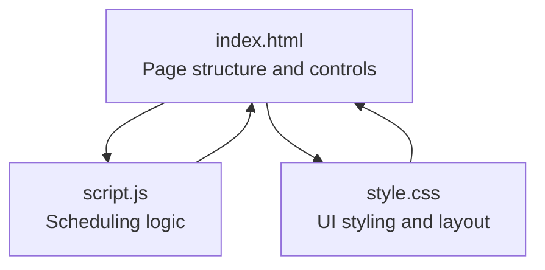
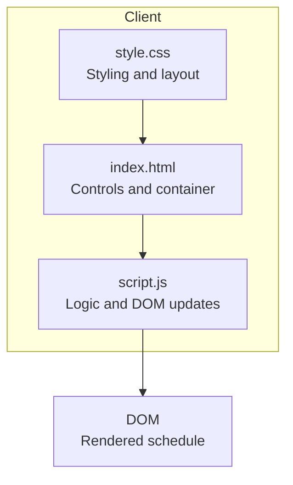
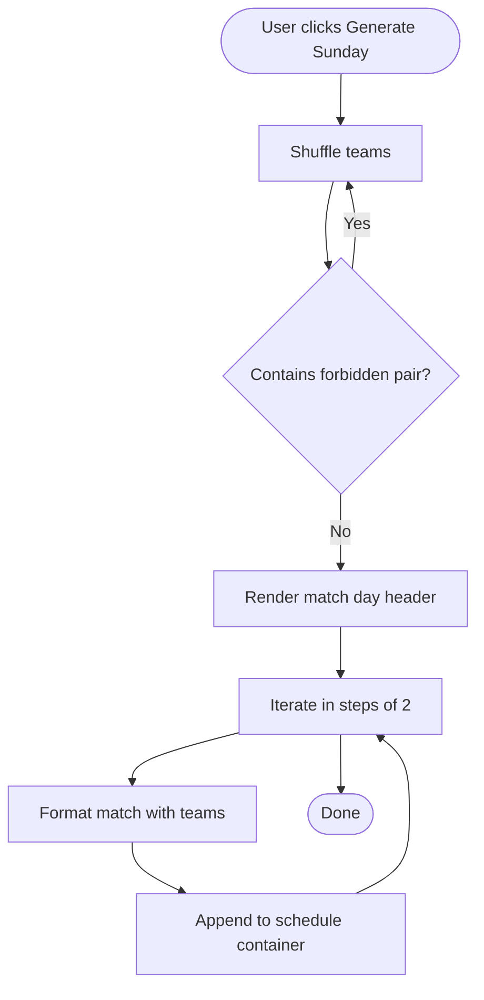
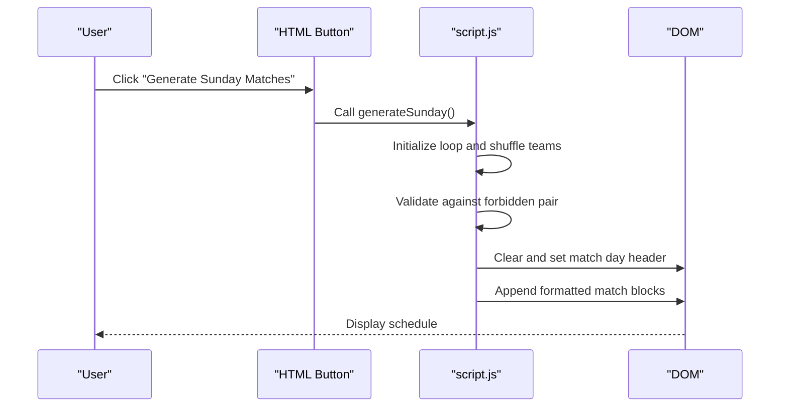
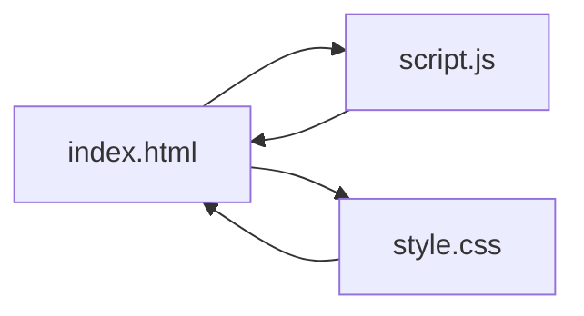

# Web Application (scedule)

<cite>
**Referenced Files in This Document**
- [index.html](file://scedule/index.html)
- [script.js](file://scedule/script.js)
- [style.css](file://scedule/style.css)
</cite>

## Table of Contents
1. [Introduction](#introduction)
2. [Project Structure](#project-structure)
3. [Core Components](#core-components)
4. [Architecture Overview](#architecture-overview)
5. [Detailed Component Analysis](#detailed-component-analysis)
6. [Dependency Analysis](#dependency-analysis)
7. [Performance Considerations](#performance-considerations)
8. [Troubleshooting Guide](#troubleshooting-guide)
9. [Conclusion](#conclusion)
10. [Appendices](#appendices)

## Introduction
This document explains the scedule web application, a practical demonstration of JavaScript application development focused on a cricket weekend match scheduler. The application allows users to generate randomized schedules for Saturday and Sunday matches using vanilla JavaScript, HTML5, and CSS3 without external frameworks. It showcases team input handling, random match generation logic, and schedule display formatting, along with responsive UI design and interactive behaviors.

## Project Structure
The application consists of three core files:
- index.html: Defines the page structure, user controls, and container for displaying schedules.
- script.js: Implements the scheduling logic, including team lists, shuffling algorithm, and two generation functions for Saturday and Sunday.
- style.css: Provides the visual theme and responsive layout for the application.

**Diagram sources**
- [index.html](file://scedule/index.html#L1-L22)
- [script.js](file://scedule/script.js#L1-L84)
- [style.css](file://scedule/style.css#L1-L53)

**Section sources**
- [index.html](file://scedule/index.html#L1-L22)
- [script.js](file://scedule/script.js#L1-L84)
- [style.css](file://scedule/style.css#L1-L53)

## Core Components
- Team data arrays:
  - Saturday teams: An array of eight teams, with comments indicating availability constraints.
  - Sunday teams: A smaller array of seven teams reflecting availability constraints.
- Shuffling algorithm:
  - A Fisher-Yates shuffle implementation that randomizes arrays in-place.
- Schedule generation functions:
  - generateSaturday(): Randomly pairs six teams out of eight for Saturday matches.
  - generateSunday(): Randomly pairs all seven teams for Sunday matches with a constraint that prevents a specific pair from appearing together.

Key behaviors:
- Interactive buttons trigger schedule generation and update the DOM dynamically.
- Output formatting displays match day headers and match entries with team names and a “vs” indicator.

**Section sources**
- [script.js](file://scedule/script.js#L2-L23)
- [script.js](file://scedule/script.js#L25-L31)
- [script.js](file://scedule/script.js#L33-L47)
- [script.js](file://scedule/script.js#L49-L83)

## Architecture Overview
The application follows a simple client-side architecture:
- HTML defines the UI and binds event handlers to buttons.
- JavaScript handles data and logic, updating the DOM to render schedules.
- CSS styles the UI and ensures responsiveness.

**Diagram sources**
- [index.html](file://scedule/index.html#L10-L19)
- [script.js](file://scedule/script.js#L33-L83)
- [style.css](file://scedule/style.css#L1-L53)

## Detailed Component Analysis

### HTML Structure and Controls
- Page title and viewport meta tags ensure accessibility and responsiveness.
- Two buttons trigger schedule generation for Saturday and Sunday.
- A container div with id “schedule” receives the generated match listings.

Interactive behaviors:
- Buttons use inline onclick handlers to call JavaScript functions.
- The container is cleared and repopulated with new content on each generation.

**Section sources**
- [index.html](file://scedule/index.html#L1-L22)

### JavaScript Scheduling Logic
- Team arrays:
  - Saturday teams include eight teams.
  - Sunday teams include seven teams.
- Shuffling algorithm:
  - Fisher-Yates shuffle iterates backward through the array, swapping each element with a randomly selected earlier element.
- Saturday generation:
  - Creates a shuffled copy of the Saturday team list.
  - Iterates in steps of two to form match pairs and appends formatted match blocks to the schedule container.
- Sunday generation:
  - Repeatedly shuffles the Sunday team list until no forbidden pair appears.
  - Iterates in steps of two to form match pairs and appends formatted match blocks to the schedule container.

**Diagram sources**
- [script.js](file://scedule/script.js#L49-L83)

**Section sources**
- [script.js](file://scedule/script.js#L25-L31)
- [script.js](file://scedule/script.js#L33-L47)
- [script.js](file://scedule/script.js#L49-L83)

### CSS Styling and Responsive Layout
- Body styling sets a dark theme with a blue accent and centered content.
- Container centers content with a max width and horizontal spacing.
- Buttons use hover effects and rounded corners for interactivity.
- Match day headers and match blocks use consistent spacing, shadows, and typography.
- The “vs” label is styled distinctly for readability.

Responsive considerations:
- The container uses a max width and centered margins for optimal readability on various screen sizes.
- Buttons and text scales with viewport units and font sizing.

**Section sources**
- [style.css](file://scedule/style.css#L1-L53)

### Sequence of Operations: Generate Sunday Matches

**Diagram sources**
- [index.html](file://scedule/index.html#L13-L14)
- [script.js](file://scedule/script.js#L49-L83)

## Dependency Analysis
- index.html depends on script.js for logic and style.css for presentation.
- script.js is self-contained and does not import external libraries.
- style.css is independent and only affects visual rendering.

**Diagram sources**
- [index.html](file://scedule/index.html#L7-L19)
- [script.js](file://scedule/script.js#L1-L84)
- [style.css](file://scedule/style.css#L1-L53)

**Section sources**
- [index.html](file://scedule/index.html#L1-L22)
- [script.js](file://scedule/script.js#L1-L84)
- [style.css](file://scedule/style.css#L1-L53)

## Performance Considerations
- Shuffling complexity:
  - The Fisher-Yates shuffle runs in O(n) time and O(1) extra space.
- Generation loops:
  - Saturday and Sunday loops iterate once over the team list, forming pairs in O(n) time.
- Constraint checking:
  - The Sunday generator may repeat shuffling until a valid arrangement is found. On average, this reduces the number of attempts due to randomization, but worst-case attempts are unbounded.
- DOM updates:
  - InnerHTML concatenation is straightforward but can be inefficient for very large datasets. For larger tournaments, consider fragment batching or templating.

[No sources needed since this section provides general guidance]

## Troubleshooting Guide
- Forbidden pair appears on Sunday:
  - The generator keeps regenerating until no forbidden pair is present. If the constraint seems impossible, verify the team list and the constraint logic.
- Saturday schedule missing a team:
  - The Saturday generator pairs six teams out of eight. Confirm the team list length and that the loop increments by two.
- Styling issues:
  - Ensure the stylesheet link is present and the container id matches the JavaScript selector.
- Button click not working:
  - Verify inline onclick handlers and that the functions are defined globally.

**Section sources**
- [script.js](file://scedule/script.js#L49-L83)
- [script.js](file://scedule/script.js#L33-L47)
- [index.html](file://scedule/index.html#L13-L14)
- [style.css](file://scedule/style.css#L1-L53)

## Conclusion
The scedule application demonstrates a clean, client-side implementation of a scheduling utility using vanilla JavaScript, HTML5, and CSS3. It illustrates core concepts such as randomization, constraint enforcement, and dynamic UI updates. The modular structure makes it easy to extend for different sports or tournament formats.

## Appendices

### Browser Compatibility
- The application uses widely supported APIs:
  - DOM manipulation via getElementById and innerHTML.
  - Array methods and Math.random().
  - CSS properties commonly supported across modern browsers.
- No polyfills are required for the current implementation.

[No sources needed since this section provides general guidance]

### Extending the Application
- Add more days or venues:
  - Extend team arrays and add new generation functions with appropriate constraints.
- Support different tournament formats:
  - Modify pairing logic to handle group stages, knockout rounds, or round-robin brackets.
- Persist schedules:
  - Integrate localStorage or IndexedDB to save generated schedules locally.
- Enhance UI:
  - Replace inline onclick handlers with event listeners for better separation of concerns.
  - Add input forms for custom team lists and constraints.
- Internationalization:
  - Localize strings and date/time formatting for global audiences.

[No sources needed since this section provides general guidance]